# CS336 Lecture 03 정리: LM Architecture and Hyperparameters

> 기준 자료: `lecture_03.pdf` (CS336 Lecture 3). 각 페이지를 하나의 제목으로 두고, 원문 흐름을 유지하면서 한국어로 상세 해설을 붙인 정리본입니다.

> 수식은 Markdown의 LaTeX 수식 표기(`$...$`, `$$...$$`)로 정리했습니다. GitHub/Obsidian/Typora/VS Code Markdown Preview 등 LaTeX 렌더링을 지원하는 뷰어에서 수식 형태로 확인할 수 있습니다.

---

## 전체 흐름 요약

- 원래 Transformer와 현대 LLM 구현의 차이를 비교한다.
- normalization 위치, RMSNorm, bias 제거, activation, GLU, RoPE, GQA/MQA, sliding-window attention을 다룬다.
- hyperparameter는 `d_ff / d_model`, head dimension, aspect ratio, vocabulary size, dropout/weight decay를 중심으로 본다.
- 마지막으로 z-loss, QK norm, logit soft-capping 같은 stability trick을 정리한다.

---

## Page 1. Lecture 3 - LM Architecture and Hyperparameters

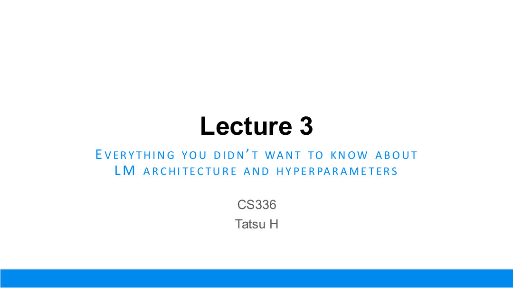

이 강의는 LLM 아키텍처와 하이퍼파라미터를 다룬다. 제목의 뉘앙스처럼, 단순히 Transformer를 한 번 구현하는 수준을 넘어 실제 대형 언어모델들이 어떤 선택을 해왔는지, 그 선택들이 왜 생겼는지, 무엇이 거의 표준이 되었는지를 살펴보는 강의다.

핵심 관점은 "정답 아키텍처 하나"를 찾는 것이 아니다. 최근 LLM들은 세부 구조가 조금씩 다르지만, 큰 틀에서는 놀랄 만큼 비슷한 패턴을 공유한다. 따라서 이 강의에서는 원래 Transformer에서 출발해 현대 LLM이 채택한 norm 위치, RMSNorm, SwiGLU, RoPE, GQA/MQA, sliding-window attention, 안정화 기법 등을 하나씩 비교한다.

실무적으로는 모델을 새로 구현하거나 튜닝할 때 "왜 LLaMA류 구조를 기본값으로 쓰는가?", "왜 FFN 차원을 4배 또는 8/3배로 잡는가?", "왜 QK norm 같은 안정화 기법이 최근 모델에서 보이는가?" 같은 질문에 답하기 위한 배경지식이 된다.

---

## Page 2. Outline and goals

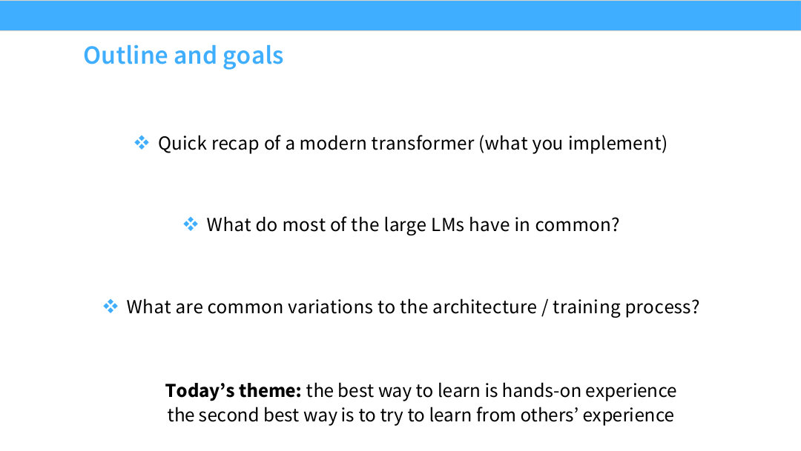

이 페이지는 강의의 전체 목적을 잡아준다. 먼저 현대적인 Transformer 구조를 빠르게 복습하고, 대형 LM들이 공통적으로 갖는 구조적 특징을 본다. 그 다음에는 모델마다 달라지는 architecture variation과 training process variation을 살펴본다.

여기서 중요한 메시지는 두 가지다. 첫째, 가장 좋은 학습 방법은 직접 구현하고 실험해보는 것이다. CS336의 과제에서 Transformer를 구현하는 이유가 여기에 있다. 둘째, 모든 실험을 직접 반복할 수 없기 때문에, 이미 공개된 대형 모델의 technical report와 논문에서 경험칙을 배워야 한다.

즉 이 강의는 "Transformer 이론"이라기보다 "현대 LLM을 실제로 만들 때 사람들이 어떤 선택을 했고, 그 선택이 어떤 의미를 갖는가"에 대한 경험적 정리다. 앞으로 나오는 내용도 대부분 이 관점에서 읽는 것이 좋다.

---

## Page 3. Starting point: the 'original' transformer

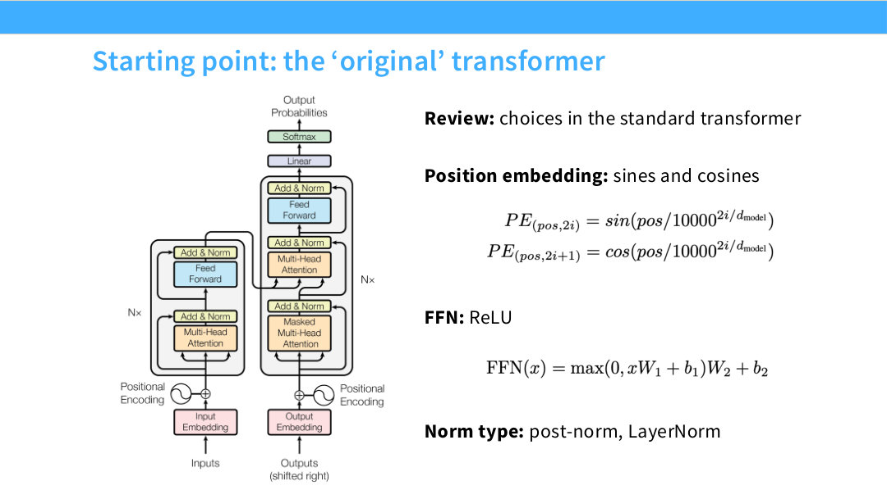

출발점은 Vaswani et al.의 원래 Transformer다. 원래 Transformer는 encoder-decoder 구조였고, position embedding으로 sine/cosine 기반의 fixed positional encoding을 사용했다. FFN에서는 ReLU를 사용했고, normalization은 sublayer 뒤쪽에 붙는 post-norm LayerNorm 구조였다.

여기서 post-norm은 attention 또는 FFN 결과를 residual에 더한 뒤 LayerNorm을 적용하는 방식이다. 즉, residual stream 자체가 매 block마다 정규화된다. 원래 Transformer에서는 이 구조가 자연스럽게 쓰였지만, 모델이 깊어지고 커질수록 gradient propagation과 학습 안정성 측면에서 문제가 나타났다.

이 페이지의 역할은 "현대 LLM 구조가 원래 Transformer와 무엇이 다른가"를 비교하기 위한 기준점을 제공하는 것이다. 뒤에서 다루는 pre-norm, RMSNorm, RoPE, SwiGLU, bias 제거 등은 모두 이 원래 구조에서 바뀐 부분들이다.

---

## Page 4. What you implemented - simple, modern variant

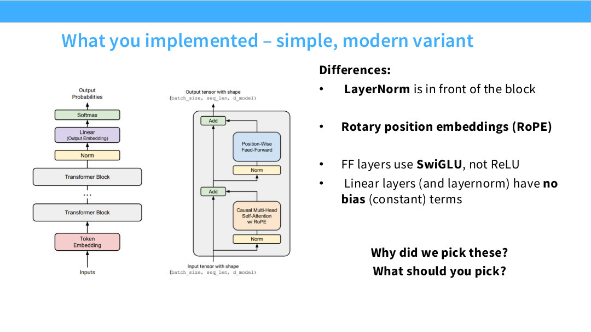

이 페이지는 CS336 과제에서 구현한 모델이 원래 Transformer와 어떻게 다른지 보여준다. 구현 대상은 완전히 복잡한 frontier model이 아니라, 현대 decoder-only LLM의 핵심 선택을 반영한 단순화 버전이다.

첫 번째 차이는 LayerNorm의 위치다. 현대 LLM은 대부분 **pre-norm**을 쓴다. 즉 attention이나 FFN에 입력을 넣기 전에 normalization을 적용하고, main residual path는 되도록 건드리지 않는다. 이렇게 하면 residual connection이 정보를 안정적으로 전달하는 경로로 남기 때문에 깊은 네트워크 학습에 유리하다.

두 번째 차이는 position encoding이다. 원래 Transformer의 sine/cosine additive encoding 대신 RoPE를 사용한다. RoPE는 query와 key에 회전 변환을 적용해 **상대적 위치 정보**를 attention dot product 안에 자연스럽게 반영한다.

세 번째 차이는 FFN activation이다. 원래 ReLU 대신 SwiGLU를 사용한다. SwiGLU는 gate 구조를 갖는 FFN으로, 최근 LLaMA 계열을 비롯한 많은 LLM의 표준 선택에 가깝다. 마지막으로 linear layer와 norm에서 bias를 제거한다. bias는 parameter와 memory movement를 늘리지만 대형 LM에서는 성능 이득이 작다고 보는 경우가 많다.

---

## Page 5. How should we think about architectures?

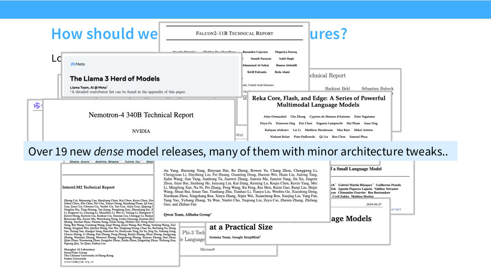

이 페이지는 2024-2025년에 dense LLM 아키텍처가 매우 많이 공개되었음을 보여준다. LLaMA, Nemotron, Falcon, Reka, InternLM 등 많은 모델 보고서가 있고, 각 모델은 조금씩 다른 architectural tweak을 제안한다.

하지만 이 많은 변형을 모두 독립적인 새로운 구조로 받아들이면 혼란스러워진다. 강의의 목적은 개별 모델을 암기하는 것이 아니라, 공개된 모델들의 선택을 표처럼 놓고 어떤 축에서 공통점과 차이점이 생기는지 보는 것이다.

예를 들어 어떤 모델은 RMSNorm을 쓰고, 어떤 모델은 LayerNorm을 쓴다. 어떤 모델은 SwiGLU를 쓰고, 어떤 모델은 GeLU를 쓴다. 어떤 모델은 full attention만 쓰고, 어떤 모델은 sliding-window attention을 섞는다. 그러나 전체적으로는 LLaMA-like decoder-only architecture가 강한 중심축을 형성한다.

---

## Page 6. How should we think about architectures? - Many releases

이 페이지는 "올해만 그렇게 많은 LLM이 나왔을 리가 있나?"라는 질문에 대한 답처럼 보인다. 실제로 최근에는 GPT-OSS, DeepSeek, MiniMax, Kimi, GLM, Step, Intern 계열 등 수많은 모델이 공개되고 있다.

이 흐름에서 중요한 것은 LLM 아키텍처 연구가 완전히 폐쇄된 영역이 아니라는 점이다. closed model이 여전히 최고 성능을 주도하는 경우가 많지만, open-weight 또는 technical report가 공개된 모델들이 많아지면서 연구자들은 실제 대형 모델의 설계 선택을 비교할 수 있게 되었다.

다만 모델이 많이 나온다고 해서 모든 선택이 검증된 것은 아니다. 많은 경우에는 특정 규모, 특정 데이터, 특정 학습 시스템에서 잘 작동한 경험적 선택이다. 따라서 architecture choice는 논문 한 편의 claim만 믿기보다, 여러 모델에서 반복적으로 등장하는지를 보는 것이 중요하다.

---

## Page 7. Let's look at the data - dense architectures

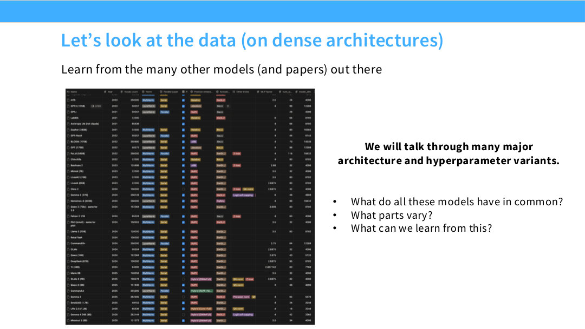

이 페이지는 다양한 dense model의 architecture와 hyperparameter를 표로 비교하겠다는 전환점이다. 여기서 dense architecture는 MoE처럼 token마다 일부 expert만 활성화하는 구조가 아니라, 모든 token이 동일한 dense parameter path를 통과하는 모델을 의미한다.

강의는 앞으로 세 질문을 중심으로 진행된다. 첫째, 대형 모델들이 공통적으로 공유하는 것은 무엇인가? 둘째, 어떤 부분이 모델마다 달라지는가? 셋째, 이 차이에서 우리가 배울 수 있는 실용적인 교훈은 무엇인가?

특히 이 강의는 "LLaMA-like architecture가 왜 표준처럼 되었는가"를 데이터 기반으로 이해하게 만든다. 단순히 LLaMA가 유명해서가 아니라, pre-norm, RMSNorm, RoPE, SwiGLU, bias 제거 같은 선택들이 여러 모델에서 반복적으로 등장하기 때문이다.

---

## Page 8. What are we going to cover?

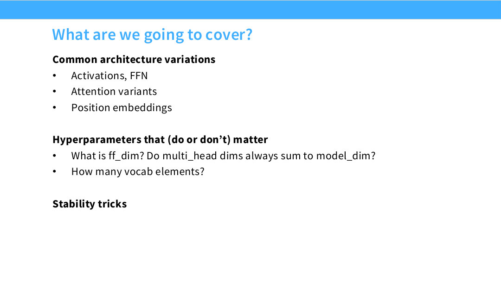

이 페이지는 앞으로 다룰 항목을 세 그룹으로 나눈다. 첫 번째는 **architecture variation**이다. activation, FFN 구조, attention variant, position embedding 방식이 여기에 들어간다.

두 번째는 **hyperparameter**다. feedforward dimension을 hidden size보다 얼마나 크게 잡을지, attention head dimension과 model dimension의 관계를 어떻게 둘지, vocabulary size는 어느 정도가 적절한지 같은 질문이다. 이런 값들은 이론적으로 정해진 것이 아니라 모델 계보와 시스템 제약 속에서 형성된 경험적 규칙에 가깝다.

세 번째는 **stability trick**이다. 모델이 커질수록 softmax, attention logits, output logits, learning rate schedule, normalization 위치가 학습 안정성에 큰 영향을 준다. 최근 모델들은 단순한 Transformer 블록 외에도 z-loss, QK norm, logit soft-capping 같은 안정화 장치를 추가하는 경우가 많다.

---

## Page 9. Architecture variations

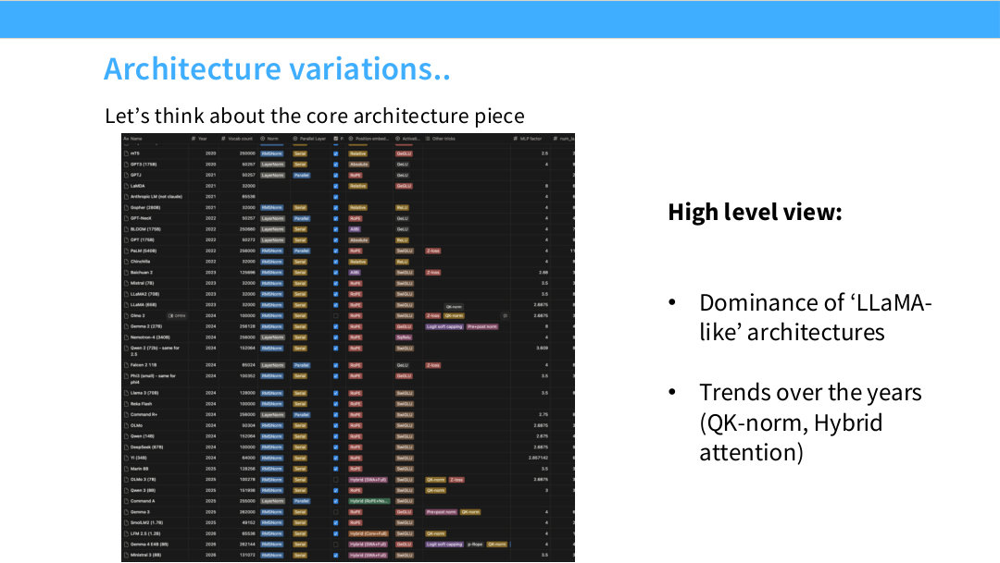

이 페이지부터는 core architecture variation을 본격적으로 살펴본다. 큰 흐름은 두 가지다. 첫째, 현재 dense LLM은 LLaMA-like architecture가 지배적이다. 둘째, 시간이 지나며 QK norm, hybrid attention, sliding-window attention 같은 새로운 트렌드가 추가되고 있다.

LLaMA-like라는 말은 단순히 LLaMA 모델을 복제했다는 뜻이 아니다. decoder-only Transformer, pre-norm, RMSNorm, RoPE, SwiGLU, bias 제거, AdamW 기반 학습 같은 선택들이 하나의 패키지처럼 널리 쓰인다는 뜻이다.

다만 최근 모델은 완전히 동일하지 않다. 예를 들어 Gemma, OLMo, Qwen, DeepSeek 계열은 normalization 추가 위치, attention variant, context length extension, local/global attention 조합 등에서 차이를 보인다. 따라서 기본값은 LLaMA-like로 시작하되, 어떤 부분이 새롭게 변하고 있는지를 추적해야 한다.

---

## Page 10. Pre-vs-post norm

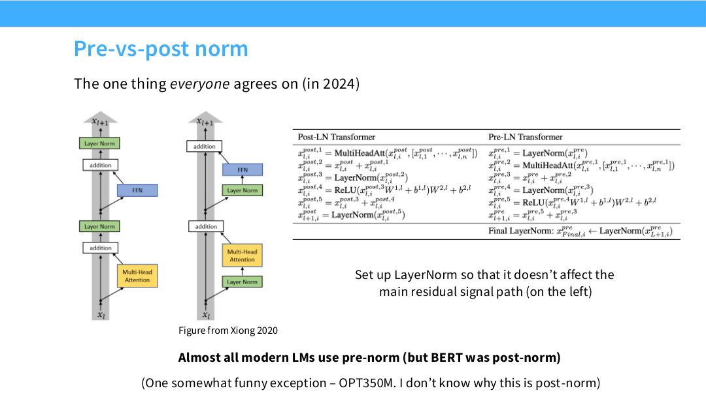

이 페이지는 현대 LLM에서 거의 합의가 된 선택 중 하나인 pre-norm을 설명한다. post-norm은 sublayer 출력과 residual을 더한 뒤 정규화하는 방식이고, pre-norm은 sublayer에 들어가기 전에 정규화하는 방식이다.

강의의 핵심 문장은 LayerNorm이 main residual signal path를 방해하지 않도록 배치하라는 것이다. residual path는 깊은 네트워크에서 정보를 직접 전달하는 고속도로 같은 역할을 한다. post-norm은 이 경로를 매번 정규화해버리기 때문에 gradient 흐름이나 신호 전달이 불안정해질 수 있다.

현대 LLM은 거의 모두 pre-norm 또는 residual stream 밖의 normalization을 사용한다. 예외적으로 BERT는 post-norm 계열이었고, 슬라이드에서는 OPT350M 같은 특이한 예외도 언급한다. 하지만 대규모 causal LM에서는 pre-norm이 사실상 기본 선택이다.

---

## Page 11. Pre-vs-post-norm, the data

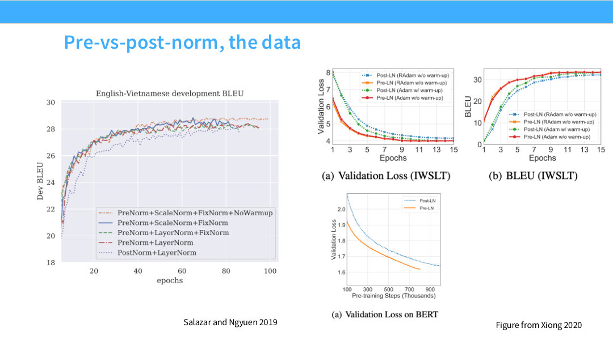

이 페이지는 pre-norm이 단순한 취향이 아니라 실험적으로도 유리한 경향이 있음을 보여준다. Xiong 2020과 Salazar and Nguyen 2019의 그림은 validation loss, BLEU, pretraining loss 등에서 pre-norm이 더 안정적으로 동작하는 사례를 보여준다.

중요한 점은 pre-norm이 항상 모든 metric에서 압도적이라는 단순 결론이 아니라, 학습 안정성과 초기 학습 dynamics에서 유리한 경향이 있다는 것이다. 특히 모델이 깊어질수록 normalization 위치가 gradient propagation에 큰 영향을 준다.

이 페이지는 "왜 원래 Transformer의 post-norm을 그대로 쓰지 않는가"에 대한 데이터 기반 근거다. 현대 LLM이 pre-norm으로 이동한 것은 구현 유행이 아니라 대형 모델 학습에서 안정성이 중요해진 결과로 볼 수 있다.

---

## Page 12. Pre-vs-post norm, explanations

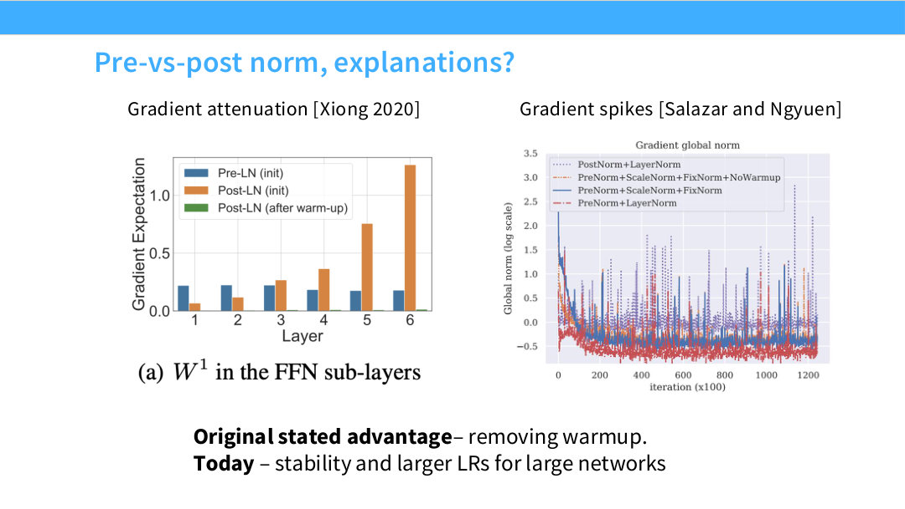

이 페이지는 pre-norm이 왜 좋은지에 대한 설명을 제시한다. Xiong 2020은 post-norm에서 gradient attenuation 문제가 생길 수 있음을 지적한다. 즉 깊은 layer로 갈수록 gradient가 약해지거나 비정상적으로 전달될 수 있다.

Salazar and Nguyen의 관점에서는 gradient spike 문제가 중요하다. 학습 중 gradient global norm이 갑자기 커지는 spike가 나타나면 optimizer update가 불안정해지고 loss curve가 흔들릴 수 있다. pre-norm은 이런 spike를 줄이는 데 도움이 되는 것으로 관찰된다.

원래 pre-norm의 장점 중 하나는 warmup을 줄이거나 제거할 수 있다는 점이었다. 하지만 현대 대형 네트워크에서는 그보다 더 중요한 이유가 안정성이다. 더 큰 learning rate를 쓰거나 더 깊은 네트워크를 학습할 때 pre-norm이 안정적인 선택이 된다.

---

## Page 13. New things - 'double' norm or non-residual postnorm

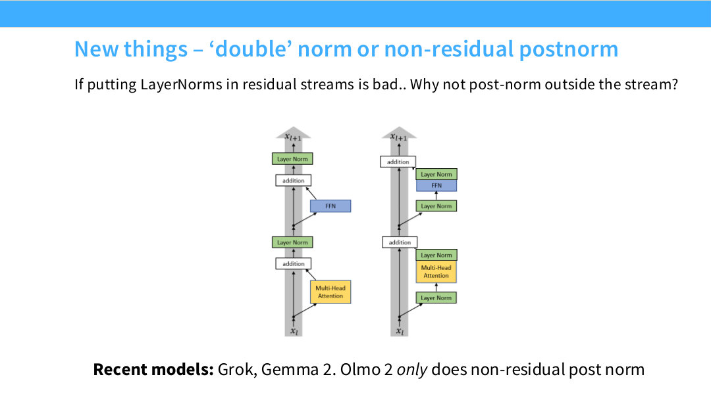

이 페이지는 최근 모델에서 보이는 새로운 normalization 패턴을 설명한다. 만약 residual stream 안에 LayerNorm을 넣는 것이 좋지 않다면, residual stream 밖에서 한 번 더 norm을 적용하는 것은 어떨까? 이것이 double norm 또는 non-residual postnorm 아이디어다.

핵심은 residual 경로를 직접 정규화하지 않으면서도 sublayer output이나 block output 쪽에 추가적인 안정화 효과를 주는 것이다. 즉 pre-norm의 장점, namely residual path 보존을 유지하면서도, post-processing에 가까운 normalization을 추가한다.

Grok, Gemma 2, OLMo 2 같은 최근 모델들이 이런 형태의 norm 변형을 사용한다. 여기서 배울 점은 "pre-norm이 표준"이라는 결론에서 끝나는 것이 아니라, 현대 모델들이 residual stream을 안정적으로 유지하기 위해 norm 위치를 매우 세심하게 조정하고 있다는 것이다.

---

## Page 14. LayerNorm vs RMSNorm

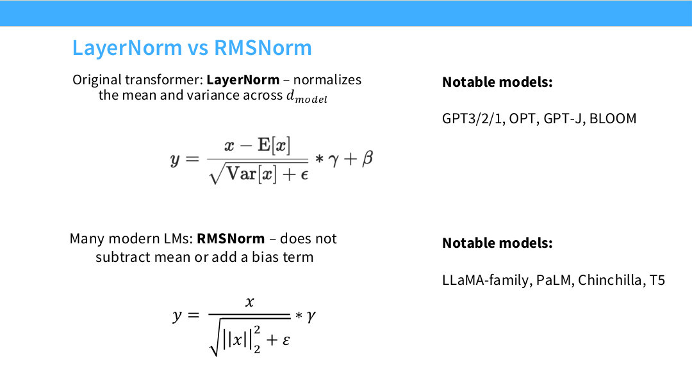

이 페이지는 현대 LLM에서 매우 자주 보이는 선택인 **LayerNorm에서 RMSNorm으로의 이동**을 설명한다. 슬라이드 왼쪽에는 LayerNorm 계열을 사용한 모델들이, 오른쪽에는 RMSNorm 계열을 사용한 모델들이 나열되어 있다. GPT-1/2/3, OPT, GPT-J, BLOOM 같은 비교적 초기 decoder-only 모델은 LayerNorm을 많이 사용했고, LLaMA-family, PaLM, Chinchilla, T5 같은 이후 모델은 RMSNorm을 많이 사용한다.

LayerNorm은 입력 벡터 $x \in \mathbb{R}^{d}$에 대해 평균과 분산을 모두 계산한다. 즉 feature dimension 전체에서 평균을 빼고 표준편차로 나누어 정규화한다.

$$
\mu = \frac{1}{d}\sum_{i=1}^{d}x_i
$$

$$
\sigma^2 = \frac{1}{d}\sum_{i=1}^{d}(x_i-\mu)^2
$$

$$
\mathrm{LayerNorm}(x)_i = \gamma_i\frac{x_i-\mu}{\sqrt{\sigma^2+\epsilon}}+\beta_i
$$

반면 RMSNorm은 평균을 빼지 않는다. 이름 그대로 root mean square, 즉 제곱 평균의 제곱근만 사용해 벡터의 크기를 조절한다.

$$
\mathrm{RMS}(x)=\sqrt{\frac{1}{d}\sum_{i=1}^{d}x_i^2}
$$

$$
\mathrm{RMSNorm}(x)_i = \gamma_i\frac{x_i}{\sqrt{\frac{1}{d}\sum_{j=1}^{d}x_j^2+\epsilon}}
$$

여기서 핵심 차이는 LayerNorm이 **centering**과 **scaling**을 모두 하는 반면, RMSNorm은 **scaling만 한다**는 점이다. 즉 LayerNorm은 벡터의 평균 방향까지 제거하지만, RMSNorm은 벡터의 전체 크기만 맞춘다. LLM에서는 residual stream의 방향 정보가 중요할 수 있고, 평균 제거가 반드시 필요한 것은 아니기 때문에 RMSNorm이 충분히 잘 작동한다.

예를 들어 $x=[1,2,3]$이면 LayerNorm은 먼저 평균 $2$를 빼서 $[-1,0,1]$처럼 중심을 맞춘다. 반면 RMSNorm은 평균을 빼지 않고 $\sqrt{(1^2+2^2+3^2)/3}$로 나누어 전체 크기만 줄인다. 따라서 RMSNorm은 더 단순하고, 계산해야 할 통계량도 적다.

이 페이지의 중요한 메시지는 RMSNorm이 단순히 “LayerNorm의 근사 버전”이 아니라, 현대 LLM에서 널리 채택된 실용적 기본값이라는 점이다. 특히 pre-norm decoder-only Transformer에서는 각 block마다 normalization이 반복되기 때문에, normalization 연산의 단순화가 전체 runtime과 memory movement에 영향을 줄 수 있다.

---

## Page 15. Why RMSNorm?

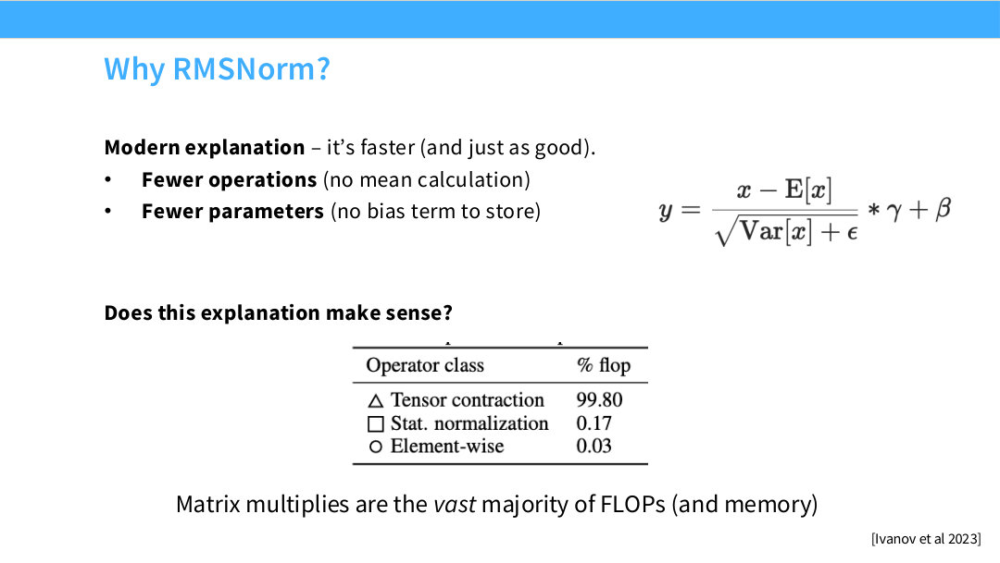

RMSNorm을 쓰는 현대적 설명은 간단하다. 더 빠르고, 성능은 거의 비슷하다는 것이다. RMSNorm은 mean을 계산하지 않기 때문에 operation 수가 줄고, bias term이 없으므로 parameter와 memory movement도 줄어든다.

하지만 슬라이드는 여기서 한 가지 중요한 질문을 던진다. Transformer의 FLOPs 대부분은 matrix multiplication인데, normalization 연산을 조금 줄이는 것이 정말 큰 의미가 있을까? Ivanov et al. 2023의 표는 tensor contraction이 FLOPs의 압도적 비중을 차지하고, normalization FLOPs는 매우 작다는 점을 보여준다.

---
여기서 Tensor Contraction이란?
> 공통 차원(shared dimension)을 따라 곱하고 더해서 차원을 줄이는 연산

예를 들어:

- dot product
- matrix multiplication
- attention score 계산
- einsum
- batched matmul

전부 tensor contraction의 예시다.

---
따라서 RMSNorm의 장점은 단순 FLOPs 절감만으로 설명하기 어렵다. 실제 runtime은 FLOPs뿐 아니라 memory access, kernel launch, data movement에 의해 결정된다. 이 점은 다음 페이지에서 더 분명해진다.

---

## Page 16. Why RMSNorm (2)

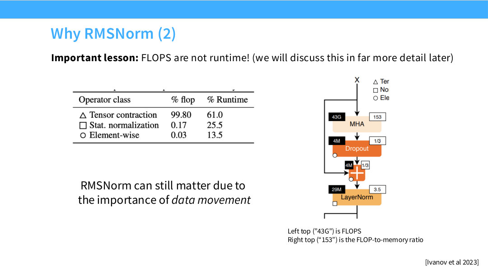

이 페이지의 핵심 문장은 "FLOPs are not runtime"이다. FLOPs 기준으로는 normalization이 매우 작아 보이지만, runtime 비중은 그보다 훨씬 클 수 있다. 작은 연산이라도 메모리에서 데이터를 읽고 쓰는 비용이 크면 실제 wall-clock time에 영향을 준다.

왼쪽 표는 operator class별 FLOP 비중과 runtime 비중을 비교한다. tensor contraction은 FLOPs의 거의 전부를 차지하지만 runtime은 그보다 낮고, stat normalization과 element-wise operation은 FLOPs는 작지만 runtime 비중은 생각보다 크다.

이것이 RMSNorm이 중요한 이유다. RMSNorm은 mean 계산과 bias를 제거해 normalization의 data movement와 연산을 줄인다. 거대한 LLM에서는 작은 모듈도 layer마다 반복되므로, 전체 wall-clock time과 memory traffic에 영향을 줄 수 있다.

---

## Page 17. RMSNorm - validation

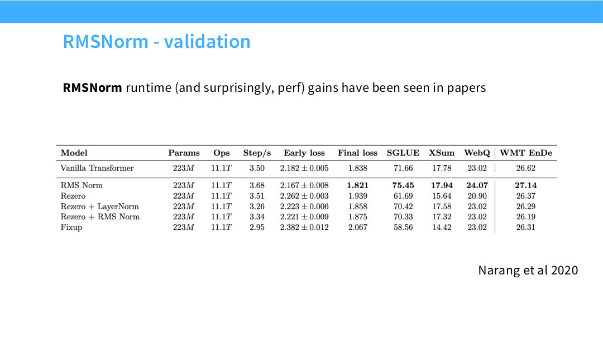

이 페이지는 RMSNorm이 실제 실험에서도 runtime 또는 성능 개선을 보인 사례를 제시한다. Narang et al. 2020의 결과는 RMSNorm, ReZero, Fixup 등 여러 normalization 또는 residual 안정화 기법을 비교한다.

흥미로운 점은 RMSNorm이 단순히 빠르기만 한 것이 아니라, 일부 downstream metric에서도 좋은 결과를 보인다는 것이다. 물론 이 결과만으로 모든 모델에서 RMSNorm이 항상 우월하다고 말할 수는 없지만, "RMSNorm은 싸고 성능 손실이 거의 없다"는 현대적 인식을 뒷받침한다.

LLM 설계 관점에서는 이런 결과가 중요하다. 대형 모델에서는 아주 작은 runtime 이득도 전체 학습 비용에서 큰 차이를 만들 수 있다. 성능 손실 없이 단순하고 빠른 연산으로 바꿀 수 있다면 채택할 이유가 충분하다.

---

## Page 18. More generally: dropping bias terms

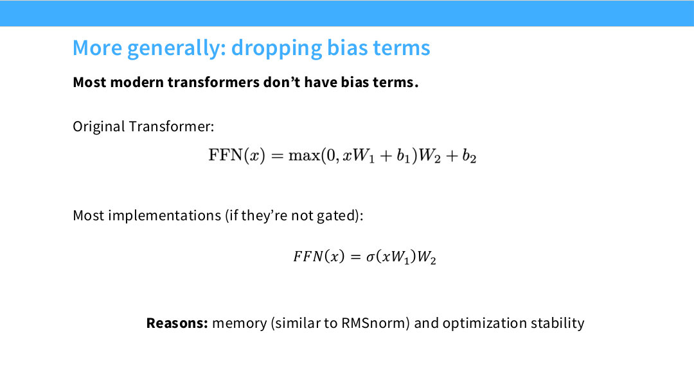

이 페이지는 RMSNorm에서 bias를 제거하는 흐름을 더 일반화한다. 현대 Transformer는 linear layer에서도 bias term을 제거하는 경우가 많다. 원래 FFN은 보통 xW1 + b1, activation, W2 + b2 형태였지만, 현대 LLM에서는 bias 없이 xW1, activation, W2만 쓰는 경우가 흔하다.

이유는 크게 두 가지다. 첫째, bias는 parameter와 memory movement를 늘린다. bias 자체의 parameter 수는 weight matrix에 비하면 작지만, layer마다 반복되고 별도의 memory access와 연산을 유발할 수 있다. 둘째, 최적화 안정성 측면에서 bias 제거가 나쁜 영향을 주지 않는 경우가 많다.

중요한 실용적 교훈은 "parameter를 추가한다고 항상 성능이 좋아지는 것은 아니다"이다. 특히 LLM에서는 **대부분의 표현력이 거대한 matrix multiplication weight**에 있으며, bias term의 비용 대비 효용은 낮게 평가되는 경우가 많다.

---

## Page 19. LayerNorm: recap

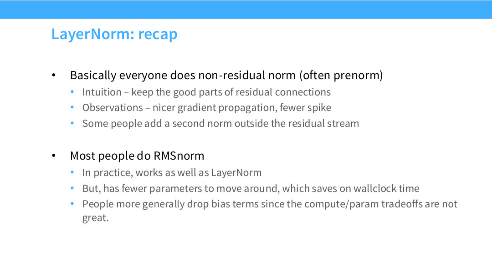

이 페이지는 normalization 관련 논의를 정리한다. 현대 LLM의 거의 모든 모델은 residual stream을 직접 방해하지 않는 형태의 norm을 사용한다. 가장 일반적인 형태는 pre-norm이고, 최근에는 non-residual postnorm이나 double norm도 등장한다.

직관은 residual connection의 장점을 보존하는 것이다. residual path는 깊은 네트워크에서 정보와 gradient가 안정적으로 흐르는 통로다. normalization을 이 경로에 과하게 끼워 넣으면 신호 흐름이 약해지거나 gradient spike가 생길 수 있다.

또한 많은 모델은 LayerNorm보다 RMSNorm을 사용한다. RMSNorm은 LayerNorm만큼 잘 작동하면서도 parameter와 memory movement를 줄일 수 있다. 더 일반적으로 bias term 제거도 비슷한 맥락이다. 대형 모델에서는 작은 parameter라도 매번 이동해야 하면 runtime과 memory traffic에 영향을 준다.

---

## Page 20. Activations

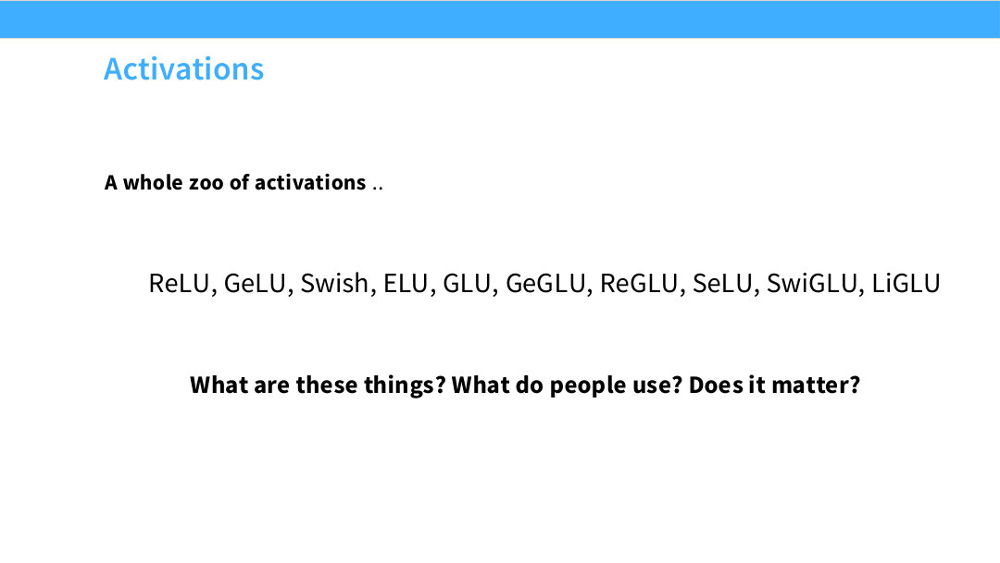

이제 activation function과 FFN 변형으로 넘어간다. 슬라이드에는 ReLU, GeLU, Swish, ELU, GLU, GeGLU, ReGLU, SeLU, SwiGLU, LiGLU 등 많은 이름이 나온다. 이들은 모두 FFN 내부의 비선형 변환을 어떻게 구성할지에 대한 선택이다.

Transformer block에서 FFN은 attention 다음으로 큰 parameter와 compute를 차지하는 핵심 모듈이다. 따라서 activation 선택은 단순한 세부사항처럼 보이지만 모델 성능과 학습 안정성, parameter efficiency에 영향을 줄 수 있다.

강의의 질문은 세 가지다. 각각이 무엇인지, 실제 모델들이 무엇을 쓰는지, 그리고 그 차이가 성능에 의미 있게 반영되는지다. 결론적으로 최근 LLM은 SwiGLU 또는 GeGLU 같은 gated activation을 많이 사용한다.

---

## Page 21. A few of the common activations

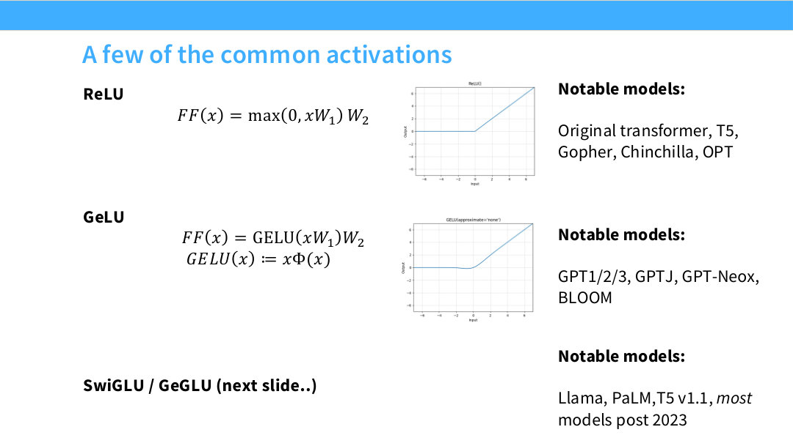

이 페이지는 FFN에서 자주 쓰이는 activation function을 실제 모델 사례와 함께 정리한다. 슬라이드의 흐름은 “ReLU처럼 단순한 activation에서 시작해, GeLU/Swish처럼 부드러운 activation을 거쳐, 최근에는 GLU 계열로 이동했다”는 것이다.

가장 기본적인 ReLU는 음수 입력을 0으로 만들고 양수는 그대로 통과시킨다.

$$
\mathrm{ReLU}(x)=\max(0,x)
$$

ReLU는 계산이 매우 단순하고 sparse activation을 만들 수 있다는 장점이 있다. 원래 Transformer, T5, Gopher, Chinchilla, OPT 등에서 사용되었다. 하지만 $x<0$인 구간의 gradient가 0이므로 일부 neuron이 거의 학습되지 않는 문제가 생길 수 있다.

GeLU는 GPT 계열에서 많이 사용된 activation이다. ReLU가 hard threshold를 쓰는 반면, GeLU는 입력값이 클수록 더 많이 통과시키고 작을수록 덜 통과시키는 부드러운 gate처럼 동작한다.

$$
\mathrm{GeLU}(x)=x\Phi(x)
$$

여기서 $\Phi(x)$는 표준 정규분포의 누적분포함수다. 직관적으로는 “입력 $x$를 확률적으로 얼마나 통과시킬지”를 부드럽게 결정하는 activation이라고 볼 수 있다. GPT-1/2/3, GPT-J, GPT-NeoX, BLOOM이 대표적인 사용 사례다.

Swish는 다음과 같이 정의된다.

$$
\mathrm{Swish}(x)=x\sigma(x)
$$

여기서 $\sigma(x)$는 sigmoid 함수다. GeLU와 마찬가지로 부드러운 gating 효과를 제공하며, 뒤에서 나오는 SwiGLU의 기반 activation이 된다. Swish는 음수 영역에서도 완전히 0으로 자르지 않고 작은 값을 남기므로, ReLU보다 gradient 흐름이 부드럽다.

슬라이드에 여러 activation 이름이 나열된 이유는 activation 선택이 단순한 취향이 아니라 모델 계보와 연결되기 때문이다. 초기 LLM에서는 ReLU나 GeLU가 흔했고, 최근 LLM에서는 SwiGLU 또는 GeGLU처럼 **activation 자체에 gating 구조를 결합한 방식**이 주류가 되었다.

---

## Page 22. Gated activations (*GLU)

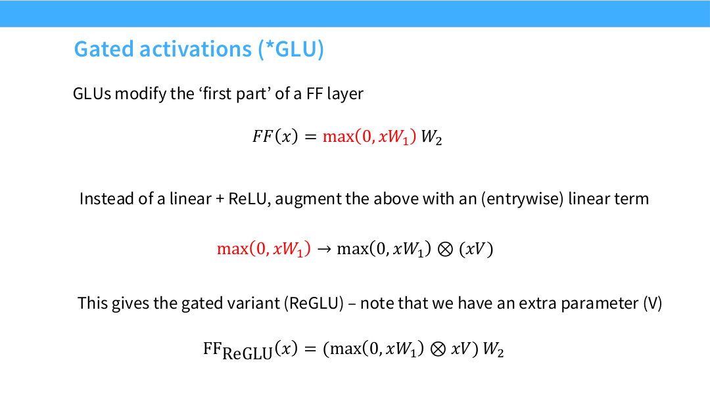

이 페이지는 GLU 계열이 단순히 activation function 하나를 교체하는 것이 아니라, **FFN 내부를 두 개의 branch로 나누고 두 branch를 원소별 곱으로 결합하는 구조 변화**임을 보여준다. 슬라이드는 먼저 일반적인 ReLU FFN을 출발점으로 둔다.

$$
\mathrm{FFN}(x)=\max(0,xW_1)W_2
$$

여기서 $xW_1$은 입력을 $d_{\mathrm{ff}}$ 차원으로 확장하는 첫 번째 linear projection이고, $\max(0,\cdot)$은 각 feature에 ReLU를 적용하는 element-wise activation이다. 마지막의 $W_2$는 확장된 hidden feature를 다시 $d_{\mathrm{model}}$ 차원으로 줄이는 projection이다.

슬라이드의 핵심 전환은 다음 부분이다.

$$
\max(0,xW_1)
\quad \longrightarrow \quad
\max(0,xW_1)\otimes (xV)
$$

즉 기존 FFN에서는 $xW_1$ 하나만 만든 뒤 activation을 적용했지만, GLU 계열에서는 추가 projection $xV$를 하나 더 만든다. 두 결과는 같은 shape를 가져야 한다.

$$
xW_1 \in \mathbb{R}^{\cdots \times d_{\mathrm{ff}}},
\qquad
xV \in \mathbb{R}^{\cdots \times d_{\mathrm{ff}}}
$$

그리고 두 branch를 원소별 곱으로 결합한다.

$$
\otimes \equiv \odot
$$

즉 같은 위치의 feature끼리 곱한다는 의미다.

$$
\left[\max(0,xW_1)\odot xV\right]_i
=
\max(0,(xW_1)_i)(xV)_i
$$

따라서 슬라이드의 ReGLU 형태는 다음과 같이 쓸 수 있다.

$$
\mathrm{FFN}_{\mathrm{ReGLU}}(x)
=
\left(\max(0,xW_1)\odot xV\right)W_2
$$

여기서 주의할 점은 **어느 branch를 main branch, 어느 branch를 gate branch라고 부를지는 notation에 따라 달라질 수 있다**는 것이다. 곱셈 자체는 교환법칙이 성립하므로 수식만 보면 다음 두 표현은 같은 값을 만든다.

$$
\phi(xW)\odot xV
=
xV\odot \phi(xW)
$$

하지만 현대 LLM 구현 관례에서는 보통 다음처럼 해석하는 경우가 많다.

$$
\mathrm{FFN}_{\mathrm{GLU}}(x)
=
\left(xW_{\mathrm{up}}\odot \phi(xW_{\mathrm{gate}})\right)W_{\mathrm{down}}
$$

이 관례에서는 $xW_{\mathrm{up}}$ 또는 슬라이드 표기에서의 $xV$가 **main/value/up branch**, 즉 후보 feature를 만드는 branch에 가깝고, $\phi(xW_{\mathrm{gate}})$가 각 feature를 조절하는 **gate/modulator branch**에 가깝다. 따라서 이전 설명처럼 “$\phi(xW)$가 후보 feature를 만들고 $xV$가 통과량을 조절한다”라고 쓰면, 현대 LLM 관례와는 약간 어긋날 수 있다. 더 자연스럽게는 다음처럼 이해하는 것이 좋다.

$$
\text{candidate feature}=xV
$$

$$
\text{feature-wise gate}=\phi(xW_1)
$$

$$
\text{gated feature}=xV\odot \phi(xW_1)
$$

예를 들어 어떤 token의 FFN 내부 feature가 다음처럼 계산되었다고 하자.

$$
xV=[10,5,8]
$$

$$
\phi(xW_1)=[1,0,0.5]
$$

그러면 GLU 결합 결과는 다음과 같다.

$$
xV\odot \phi(xW_1)
=
[10,5,8]\odot[1,0,0.5]
=
[10,0,4]
$$

이 예시에서 gate branch는 첫 번째 feature는 그대로 통과시키고, 두 번째 feature는 거의 차단하며, 세 번째 feature는 절반 정도만 통과시킨다. 다만 ReGLU, GeGLU, SwiGLU에서 쓰이는 ReLU, GeLU, Swish는 sigmoid처럼 항상 $0$과 $1$ 사이에만 있는 gate가 아니다. 값이 $1$보다 커질 수도 있고, 일부 activation은 작은 음수 값을 만들 수도 있다. 그래서 GLU 계열의 “gate”는 엄밀히 말해 binary gate라기보다는 **feature-wise modulation**, 즉 feature별 증폭·감쇠·차단을 가능하게 하는 곱셈 구조라고 보는 것이 더 정확하다.

활성화 함수 $\phi$에 무엇을 쓰느냐에 따라 GLU 계열의 이름이 달라진다.

$$
\mathrm{ReGLU}(x)
=
\left(xV\odot \mathrm{ReLU}(xW_1)\right)W_2
$$

$$
\mathrm{GeGLU}(x)
=
\left(xV\odot \mathrm{GeLU}(xW_1)\right)W_2
$$

$$
\mathrm{SwiGLU}(x)
=
\left(xV\odot \mathrm{Swish}(xW_1)\right)W_2
$$

이 구조가 일반 GeLU FFN과 다른 점도 중요하다. GeLU 기반 FFN은 single branch 구조다.

$$
\mathrm{FFN}_{\mathrm{GeLU}}(x)=\mathrm{GeLU}(xW_1)W_2
$$

반면 GeGLU는 two-branch 구조다.

$$
\mathrm{FFN}_{\mathrm{GeGLU}}(x)
=
\left(xV\odot \mathrm{GeLU}(xW_1)\right)W_2
$$

따라서 GeGLU는 “GeLU activation을 쓰는 일반 FFN”이 아니라, **GeLU를 gate/modulator branch에 사용하는 GLU 계열 FFN**이다. 이 원소별 곱 때문에 FFN 내부에 multiplicative interaction이 생기며, 단순히 하나의 activation을 통과시키는 FFN보다 feature 조합을 더 유연하게 표현할 수 있다.

다만 projection이 하나 더 생기므로 parameter와 FLOPs가 증가한다. 표준 FFN은 대략 두 개의 matrix를 사용한다.

$$
W_1: d_{\mathrm{model}}\times d_{\mathrm{ff}},
\qquad
W_2: d_{\mathrm{ff}}\times d_{\mathrm{model}}
$$

반면 GLU 계열은 첫 projection이 두 개가 된다.

$$
W_1: d_{\mathrm{model}}\times d_{\mathrm{ff}},
\qquad
V: d_{\mathrm{model}}\times d_{\mathrm{ff}},
\qquad
W_2: d_{\mathrm{ff}}\times d_{\mathrm{model}}
$$

그래서 다음 페이지에서 설명하듯이, GLU 계열을 사용할 때는 $d_{\mathrm{ff}}$를 기존 FFN보다 줄여 전체 parameter budget을 맞추는 경우가 많다. 현대 LLM에서 자주 보이는 $d_{\mathrm{ff}}\approx \frac{8}{3}d_{\mathrm{model}}$ 규칙은 이 맥락에서 이해할 수 있다.

---

## Page 23. Gated variants of standard FF layers

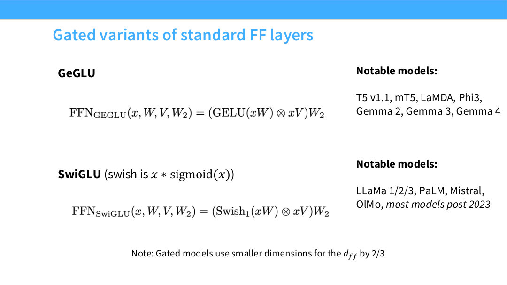

이 페이지는 GeGLU와 SwiGLU가 실제 모델에서 어떻게 쓰이는지 정리한다. 슬라이드의 중요한 포인트는 GLU 계열을 쓸 때 단순히 activation만 바꾸는 것이 아니라, **FFN width를 함께 조정해야 한다**는 점이다.

표준 FFN의 parameter 수를 단순화해서 보면, bias를 무시할 때 두 개의 matrix가 있다.

$$
W_1 \in \mathbb{R}^{d_{\mathrm{model}}\times d_{\mathrm{ff}}},\quad
W_2 \in \mathbb{R}^{d_{\mathrm{ff}}\times d_{\mathrm{model}}}
$$

따라서 parameter 수는 대략 다음이다.

$$
2d_{\mathrm{model}}d_{\mathrm{ff}}
$$

전통적인 설정 $d_{\mathrm{ff}}=4d_{\mathrm{model}}$을 넣으면 FFN parameter는 대략 다음이 된다.

$$
2d_{\mathrm{model}}(4d_{\mathrm{model}})=8d_{\mathrm{model}}^2
$$

반면 GLU 계열은 input projection이 두 개다. gate branch와 activation branch가 있기 때문이다.

$$
W,V \in \mathbb{R}^{d_{\mathrm{model}}\times d_{\mathrm{ff}}},\quad
W_2 \in \mathbb{R}^{d_{\mathrm{ff}}\times d_{\mathrm{model}}}
$$

따라서 parameter 수는 대략 다음이다.

$$
3d_{\mathrm{model}}d_{\mathrm{ff}}
$$

기존 FFN과 parameter 수를 비슷하게 맞추고 싶다면 다음을 만족해야 한다.

$$
3d_{\mathrm{model}}d_{\mathrm{ff}}^{\mathrm{GLU}}
\approx
8d_{\mathrm{model}}^2
$$

따라서

$$
d_{\mathrm{ff}}^{\mathrm{GLU}}\approx \frac{8}{3}d_{\mathrm{model}}
$$

이것이 LLaMA류 모델에서 자주 보이는 $d_{\mathrm{ff}}/d_{\mathrm{model}}\approx 2.67$의 이유다. GLU는 branch가 하나 더 있으므로 같은 width를 그대로 쓰면 너무 비싸지고, 그래서 내부 차원을 줄여 비슷한 compute budget 안에서 gated FFN의 표현력을 얻는다.

모델 사례도 이 흐름과 잘 맞는다. GeGLU는 T5 v1.1, mT5, LaMDA, Phi3, Gemma 계열에서 볼 수 있고, SwiGLU는 LLaMA 1/2/3, PaLM, Mistral, OLMo 등에서 널리 사용된다. 최근 LLM의 기본값은 사실상 “단순 GeLU FFN”에서 “SwiGLU 또는 유사 GLU 계열”로 이동했다고 봐도 된다.

---

## Page 24. Do gated linear units work?

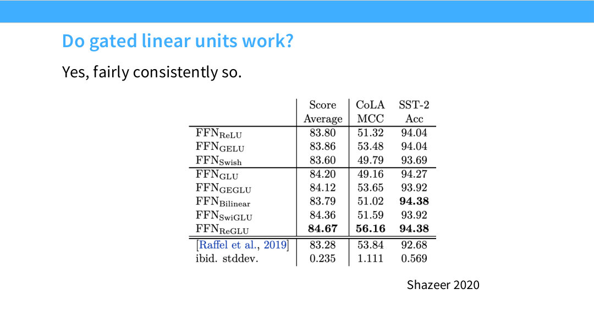

이 페이지는 Shazeer 2020의 실험을 통해 GLU 계열이 실제로 성능 개선을 주는지 보여준다. 표는 ReLU, GeLU, Swish, GLU, GeGLU, ReGLU, SwiGLU 등 다양한 FFN 변형을 비교한다.

결과의 큰 메시지는 gated variant가 꽤 일관되게 좋은 성능을 낸다는 것이다. 특정 task 하나에서만 우연히 좋은 것이 아니라 여러 metric에서 평균적으로 우수한 경향을 보인다.

이 결과가 현대 LLM에 미친 영향은 크다. GPT-3 같은 모델은 GeLU 기반 FFN으로도 충분히 강력했지만, 이후 LLaMA류 모델들은 SwiGLU를 기본 선택으로 삼았다. 즉 GLU는 필수 조건은 아니지만, 현재는 매우 강한 경험적 기본값이다.

---

## Page 25. Do gated linear units work (2)?

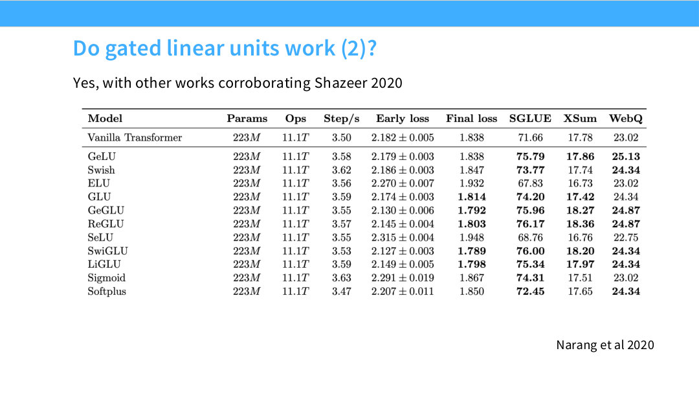

이 페이지는 Narang et al. 2020의 결과로 Shazeer 2020의 결론을 보강한다. 여러 activation과 gated variant를 비교했을 때 GeGLU, SwiGLU, ReGLU 등이 좋은 final loss와 downstream 성능을 보이는 경우가 확인된다.

여기서 중요한 것은 activation 선택도 scale과 context에 따라 달라질 수 있다는 점이다. 작은 모델, 특정 task, 특정 training setup에서는 차이가 작거나 뒤집힐 수 있다. 그러나 여러 연구에서 gated FFN이 반복적으로 좋은 선택으로 나타나면서 현대 LLM 설계의 consensus가 형성되었다.

따라서 새 decoder-only LLM을 구현한다면, 특별한 이유가 없는 한 ReLU나 GeLU보다 SwiGLU 또는 GeGLU를 기본값으로 고려하는 것이 자연스럽다.

---

## Page 26. Gating, activations

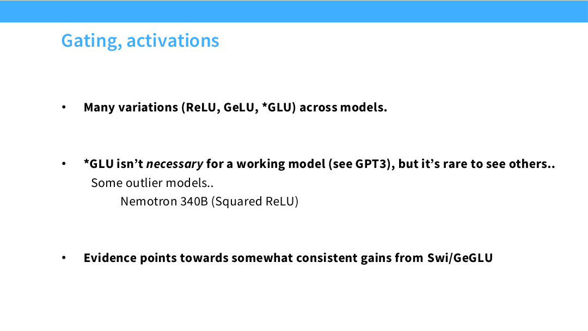

이 페이지는 activation 논의를 정리한다. 모델마다 ReLU, GeLU, *GLU 등 다양한 activation이 쓰였지만, 최근에는 GLU 계열이 강한 합의에 가깝다.

중요한 균형도 있다. GLU가 없다고 모델이 작동하지 않는 것은 아니다. GPT-3는 GeLU 기반 FFN으로도 매우 강력했다. 그러나 2023년 이후 공개된 많은 모델에서는 SwiGLU나 GeGLU가 기본값처럼 쓰인다.

예외도 있다. Nemotron 340B처럼 Squared ReLU를 사용하는 모델도 있다. 이런 outlier는 activation choice가 완전히 고정된 규칙이 아님을 보여준다. 하지만 공개된 evidence를 보면 SwiGLU/GeGLU는 consistent gain을 주는 편이고, 그래서 현대 LLM 구현에서는 매우 합리적인 default다.

---

## Page 27. Serial vs Parallel layers

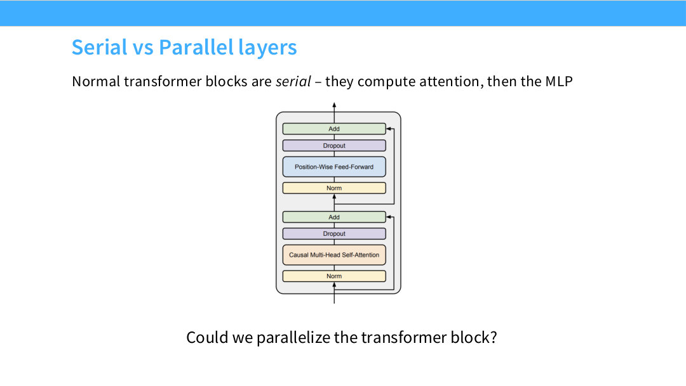

일반적인 Transformer block은 serial 구조다. 먼저 attention을 계산하고 residual에 더한 뒤, 그 결과를 FFN에 넣고 다시 residual에 더한다. 즉 attention output이 FFN input에 영향을 준다.

이 구조는 표현력 관점에서 자연스럽다. attention이 token 간 정보를 섞고, FFN이 각 token 위치에서 feature를 변환한다. 그러나 계산 관점에서는 attention과 MLP를 순차적으로 실행해야 하므로 latency가 늘어날 수 있다.

이 페이지의 질문은 attention과 MLP를 병렬로 계산할 수 없을까다. 만약 같은 input에 대해 attention branch와 MLP branch를 동시에 계산해 더할 수 있다면, 일부 matrix multiplication을 fuse하거나 병렬화할 수 있어 속도상 이점이 생길 수 있다.

---

## Page 28. Parallel layers

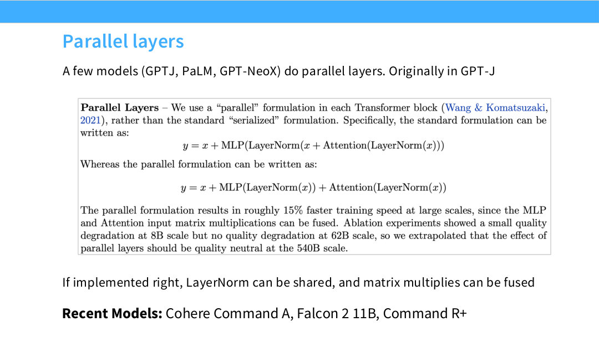

이 페이지는 앞 페이지의 질문, 즉 “attention과 MLP를 꼭 순차적으로 계산해야 하는가?”에 대한 하나의 대안으로 **parallel layer**를 소개한다. 일반적인 Transformer block은 attention branch를 먼저 계산하고, 그 결과가 residual stream에 더해진 뒤, 그 업데이트된 표현을 다시 MLP가 처리한다. 즉 한 block 내부에서 attention과 MLP 사이에 명확한 순서 의존성이 있다.

Pre-norm serial block을 식으로 쓰면 대략 다음과 같다.

$$
h = x + \mathrm{Attention}(\mathrm{LayerNorm}(x))
$$

$$
y = h + \mathrm{MLP}(\mathrm{LayerNorm}(h))
$$

이를 한 줄로 합치면 다음처럼 볼 수 있다.

$$
y = x + \mathrm{Attention}(\mathrm{LayerNorm}(x)) + \mathrm{MLP}\left(\mathrm{LayerNorm}\left(x + \mathrm{Attention}(\mathrm{LayerNorm}(x))\right)\right)
$$

여기서 중요한 점은 MLP가 원래 입력 $x$를 보는 것이 아니라, attention이 한 번 적용된 $h$를 본다는 것이다. 따라서 serial 구조에서는 같은 layer 안에서 “token 간 정보 혼합 attention”이 먼저 일어나고, 그 결과를 바탕으로 “각 token별 feature 변환 MLP”가 이어진다.

Parallel layer는 이 순서를 바꾼다. attention과 MLP가 둘 다 같은 입력 $x$ 또는 같은 normalized input을 보고, 두 branch의 출력을 마지막에 residual stream에 함께 더한다.

$$
y = x + \mathrm{Attention}(\mathrm{LayerNorm}(x)) + \mathrm{MLP}(\mathrm{LayerNorm}(x))
$$

슬라이드에 인용된 formulation도 이 차이를 강조한다. serialized formulation은 다음과 같이 쓸 수 있다.

$$
y = x + \mathrm{MLP}(\mathrm{LayerNorm}(x + \mathrm{Attention}(\mathrm{LayerNorm}(x))))
$$

반면 parallel formulation은 다음과 같다.

$$
y = x + \mathrm{MLP}(\mathrm{LayerNorm}(x)) + \mathrm{Attention}(\mathrm{LayerNorm}(x))
$$

즉 parallel layer의 핵심은 **attention branch와 MLP branch가 같은 normalized representation에서 동시에 출발한다**는 것이다. 그래서 한 block 내부에서는 MLP가 attention이 반영된 표현을 직접 보지 않는다. 대신 여러 layer를 쌓으면 다음 layer에서 이전 layer의 attention 결과와 MLP 결과가 섞인 residual stream을 다시 처리하므로, 전체 네트워크 수준에서는 상호작용이 가능하다.

이 구조의 장점은 주로 **systems efficiency**에서 나온다. attention과 MLP가 같은 $\mathrm{LayerNorm}(x)$를 입력으로 쓰기 때문에, 잘 구현하면 LayerNorm을 한 번만 계산해서 두 branch가 공유할 수 있다. 또한 두 branch의 입력 projection들이 모두 같은 input에서 출발하므로, 여러 linear projection을 하나의 큰 matrix multiplication으로 묶는 fusion이 가능하다. 예를 들어 attention 쪽의 $Q, K, V$ projection과 MLP 쪽의 up/gate projection을 입력 차원 기준으로 합쳐 한 번의 GEMM으로 계산한 뒤, 결과 tensor를 다시 나누는 식이다.

$$
\mathrm{concat}(Q, K, V, U, G) = \mathrm{LayerNorm}(x) W_{\mathrm{fused}}
$$

여기서 $Q,K,V$는 attention에 사용되고, $U,G$는 SwiGLU 같은 gated MLP에 사용될 수 있다. 이런 fusion은 모델의 수학적 FLOPs를 크게 줄이는 것은 아니지만, 실제 runtime에서는 효과가 있을 수 있다. 이유는 GPU에서 작은 kernel을 여러 번 호출하거나 같은 activation을 여러 번 메모리에서 읽는 비용이 줄어들기 때문이다. 즉 이 페이지는 이전 강의의 resource accounting 관점과도 연결된다. FLOPs가 같아도 kernel launch overhead, memory movement, fusion 가능성에 따라 wall-clock time은 달라질 수 있다.

다만 parallel layer에는 표현력 관점의 trade-off도 있다. serial block에서는 같은 layer 안에서 attention output을 MLP가 바로 가공한다. 반면 parallel block에서는 attention과 MLP가 독립적인 branch처럼 계산된 뒤 더해진다. 따라서 한 layer 안에서의 compositional interaction은 약해질 수 있다. 이 때문에 parallel layer가 항상 품질상 유리하다고 보기는 어렵고, 실제로 슬라이드도 “잘 구현하면 빠를 수 있다”는 쪽에 초점을 둔다.

슬라이드에서는 GPT-J, PaLM, GPT-NeoX가 parallel layer를 사용한 대표 사례로 언급된다. 원래 GPT-J에서 사용된 방식이고, PaLM 논문 계열에서는 대규모에서 약 15% 정도의 학습 속도 이점이 있었다는 식의 설명이 나온다. 또한 작은 8B scale에서는 약간의 품질 저하가 보였지만, 62B scale에서는 품질 저하가 관찰되지 않았다는 식으로 보고되어, 더 큰 scale에서는 speed optimization으로 쓸 만하다고 해석할 여지가 있다.

하지만 최근 LLM 전체 흐름을 보면 parallel layer가 압도적 consensus가 된 것은 아니다. 슬라이드 하단에서는 Cohere Command A, Falcon 2 11B, Command R+ 같은 최근 모델도 예시로 들지만, 다음 summary에서 보듯이 많은 현대 모델은 여전히 serial layer를 사용한다. 즉 parallel layer는 “현대 Transformer의 기본값”이라기보다는, throughput이나 kernel fusion을 중시할 때 고려할 수 있는 architecture variation에 가깝다.

정리하면, parallel layer는 attention과 MLP를 다음처럼 바꾸는 아이디어다.

$$
\text{serial: } x \rightarrow \mathrm{Attention} \rightarrow \mathrm{MLP}
$$

$$
\text{parallel: } x \rightarrow \{\mathrm{Attention}, \mathrm{MLP}\} \rightarrow \text{sum}
$$

이 선택은 “성능이 더 좋다/나쁘다”의 단순 문제가 아니라, **표현력, 안정성, LayerNorm 공유, GEMM fusion, kernel 효율, wall-clock time** 사이의 trade-off다. 그래서 이 페이지의 핵심 메시지는 Transformer architecture choice를 볼 때 단순히 수식 구조만 볼 것이 아니라, 실제 구현과 하드웨어 효율까지 함께 봐야 한다는 점이다.

---

## Page 29. Summary: architectures

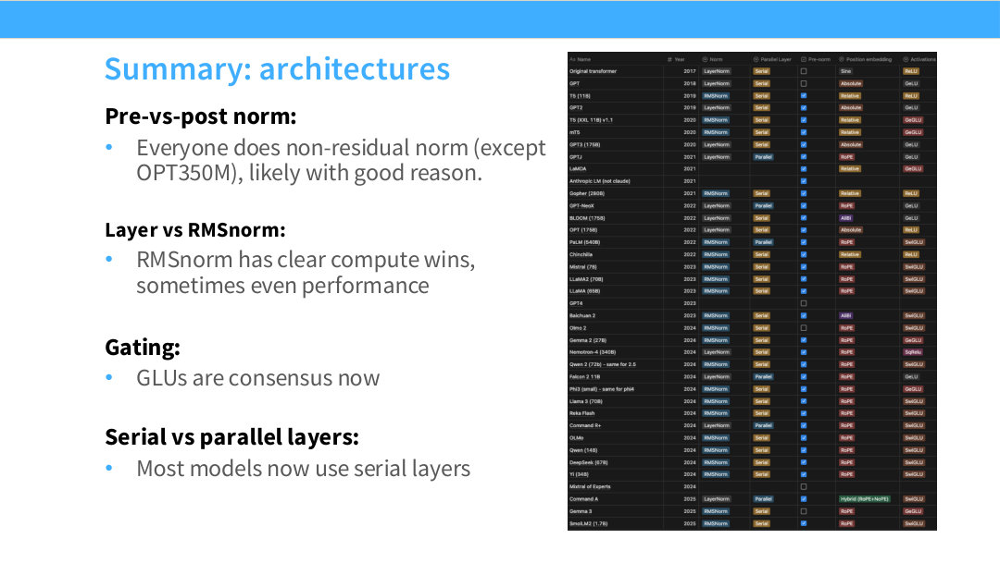

이 페이지는 architecture variation의 중간 요약이다. 첫째, pre-vs-post norm에서는 거의 모두 non-residual norm, 특히 pre-norm을 사용한다. OPT350M 같은 예외는 있지만 현대 대형 LM에서 post-norm은 드물다.

둘째, LayerNorm보다 RMSNorm이 널리 쓰인다. RMSNorm은 연산과 parameter 측면에서 이점이 있고, 때로는 성능상 이득도 관찰된다. FLOPs만 보면 작은 차이지만 data movement 관점에서 중요할 수 있다.

셋째, gating은 현재 consensus에 가깝다. GLU 계열, 특히 SwiGLU와 GeGLU는 최근 모델에서 매우 자주 등장한다. 넷째, serial vs parallel layer에서는 대부분의 모델이 여전히 serial 구조를 사용한다. 즉 현대 LLM의 기본 구조는 pre-norm RMSNorm + SwiGLU + serial block으로 요약할 수 있다.

---
## Page 30. Many variations in position embeddings

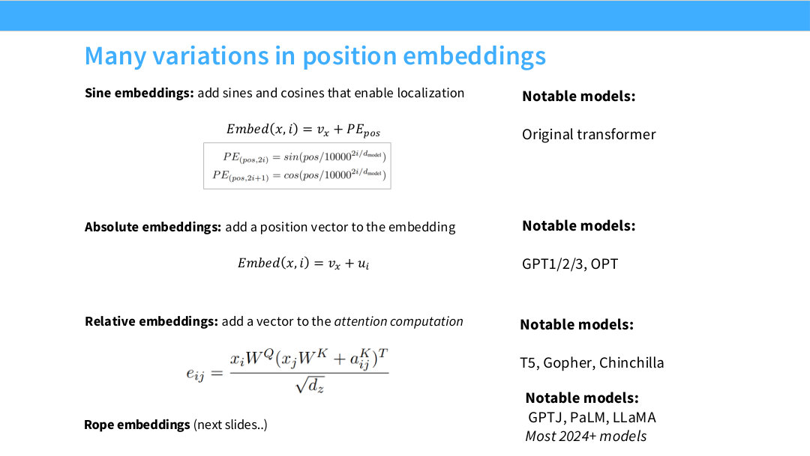

이 페이지는 Transformer 계열 모델에서 **위치 정보(position information)** 를 넣는 대표적인 방법들을 한 장에 비교한다. 슬라이드에는 네 가지 계열이 나온다.

첫째, 원래 Transformer의 **sine/cosine position embedding**이다. 슬라이드에서는 “add sines and cosines that enable localization”이라고 설명한다. 둘째, GPT 계열 초기 모델과 OPT에서 사용한 **learned absolute position embedding**이다. 셋째, T5, Gopher, Chinchilla 계열에서 사용한 **relative position embedding**이다. 넷째, GPT-J, PaLM, LLaMA 및 2024년 이후 대부분의 모델에서 많이 사용되는 **RoPE(rotary position embedding)** 이다.

이 네 방법의 차이는 “위치 정보를 어디에 넣는가”로 이해하면 가장 자연스럽다.

- sine/absolute 방식은 위치 벡터를 **입력 embedding에 더한다**.
- relative 방식은 위치 정보를 **attention score 계산에 추가한다**.
- RoPE는 위치 정보를 **query/key의 회전 변환으로 넣는다**.

왜 이런 장치가 필요할까? 기본 self-attention은 token 간 관계를 계산하지만, 위치 정보를 따로 주지 않으면 순서를 알 수 없다. token embedding만 모아 행렬 $X$를 만들고 self-attention을 계산하면,

$$
Q=XW_Q,\qquad K=XW_K,\qquad V=XW_V
$$

$$
\operatorname{Attention}(X)
=
\operatorname{softmax}\left(\frac{QK^\top}{\sqrt{d_k}}\right)V
$$

가 된다. 이 식만 보면 attention score는 token representation 사이의 dot product로 결정된다. 즉, 모델이 “이 token이 몇 번째 위치에 있는가”를 알기 위해서는 $X$ 자체에 위치 정보가 들어가 있거나, $QK^\top$ 계산 과정에 위치 정보가 들어가야 한다.

---

### 1. Sinusoidal position embedding

슬라이드의 첫 번째 방법은 원래 Transformer에서 사용한 **sinusoidal position embedding**이다. token $x$가 위치 $i$에 있을 때 입력 embedding은 다음처럼 만든다.

$$
\operatorname{Embed}(x,i)=v_x+PE_i
$$

여기서 $v_x$는 token embedding이고, $PE_i$는 위치 $i$에 대응하는 고정 position vector다. 원래 Transformer의 sinusoidal encoding은 차원 $2k$, $2k+1$에 대해 다음처럼 정의된다.

$$
PE_{i,2k}=\sin\left(\frac{i}{10000^{2k/d_{model}}}\right)
$$

$$
PE_{i,2k+1}=\cos\left(\frac{i}{10000^{2k/d_{model}}}\right)
$$

즉, 각 위치 $i$마다 여러 주파수의 sine/cosine 값을 이용해 하나의 위치 벡터를 만든다. 낮은 차원에서는 빠르게 변하는 주파수를, 높은 차원에서는 느리게 변하는 주파수를 사용한다고 보면 된다. 이렇게 하면 위치마다 서로 다른 패턴이 생기므로, 모델은 token이 문장 안에서 어디에 있는지를 어느 정도 구분할 수 있다.

예를 들어 같은 단어 `we`가 위치 0과 위치 2에 등장하면 token embedding $v_{we}$는 같지만, 입력 표현은 달라진다.

$$
\tilde{x}_0=v_{we}+PE_0
$$

$$
\tilde{x}_2=v_{we}+PE_2
$$

따라서 같은 token이라도 위치에 따라 다른 representation으로 attention에 들어간다.

여기서 다음 수식이 왜 나오는지가 중요하다. 이 수식은 **실제 attention의 $QK^\top$을 완전히 쓴 식이라기보다**, additive position embedding이 attention dot product 안에서 어떤 항들을 만들어내는지 보여주기 위한 단순화된 설명이다.

Attention score는 본질적으로 query와 key의 내적으로 계산된다. 실제로는 token representation이 $W_Q$, $W_K$ projection을 거친 뒤,

$$
q_{x,i}=(v_x+PE_i)W_Q
$$

$$
k_{y,j}=(v_y+PE_j)W_K
$$

$$
\operatorname{score}(i,j)=q_{x,i}^\top k_{y,j}
$$

로 계산된다. 이를 쓰면,

$$
q_{x,i}^\top k_{y,j}
=
\left((v_x+PE_i)W_Q\right)^\top
\left((v_y+PE_j)W_K\right)
$$

$$
=
(v_x+PE_i)^\top W_QW_K^\top(v_y+PE_j)
$$

가 된다. 다만 position embedding이 어떤 방식으로 섞이는지 직관적으로 보기 위해, projection matrix $W_Q$, $W_K$를 잠시 생략하면 다음처럼 볼 수 있다.

$$
(v_x+PE_i)^\top(v_y+PE_j)
=
v_x^\top v_y
+v_x^\top PE_j
+PE_i^\top v_y
+PE_i^\top PE_j
$$

각 항의 의미는 다음과 같다.

$$
v_x^\top v_y
$$

은 token content끼리의 유사도다. 즉 token $x$와 token $y$가 의미적으로 얼마나 관련 있는지에 해당한다.

$$
v_x^\top PE_j
$$

은 token $x$의 내용과 key 위치 $j$의 절대 위치 정보가 섞인 항이다.

$$
PE_i^\top v_y
$$

은 query 위치 $i$의 절대 위치 정보와 token $y$의 내용이 섞인 항이다.

$$
PE_i^\top PE_j
$$

은 position $i$와 position $j$ 사이의 위치 벡터끼리의 상호작용이다.

이 전개가 보여주는 핵심은 additive position embedding에서는 attention score 안에 **content-content**, **content-position**, **position-content**, **position-position** 항이 모두 섞인다는 점이다. 위치 정보를 넣는 데에는 성공하지만, score가 깔끔하게 “token 내용 + 상대 거리 $i-j$” 형태만 갖도록 보장하지는 않는다. 이것이 뒤에서 RoPE가 등장하는 이유와 연결된다.

---

### 2. Learned absolute position embedding

두 번째 방법은 **learned absolute position embedding**이다. 슬라이드에서는 “add a position vector to the embedding”이라고 설명하며, GPT-1/2/3와 OPT를 대표 예시로 든다. 위치마다 학습 가능한 벡터 $u_i$를 두고 token embedding에 더한다.

$$
\operatorname{Embed}(x,i)=v_x+u_i
$$

여기서 $u_i\in\mathbb{R}^{d_{model}}$는 위치 $i$에 대한 학습 parameter다. 전체 context length가 $L$이라면 position embedding table은 다음 크기를 갖는다.

$$
U\in\mathbb{R}^{L\times d_{model}}
$$

예를 들어 context length가 2048이고 hidden dimension이 4096이면, position embedding parameter 수는 다음과 같다.

$$
2048\times4096\approx 8.4\text{M}
$$

LLM 전체 parameter에 비하면 아주 큰 비중은 아니지만, 위치마다 별도 벡터를 학습한다는 점이 중요하다. 예를 들어 같은 token `the`가 5번 위치와 100번 위치에 등장하면 다음처럼 다른 입력 표현이 된다.

$$
\tilde{x}_5=v_{the}+u_5
$$

$$
\tilde{x}_{100}=v_{the}+u_{100}
$$

이 방식은 구현이 단순하고, 모델이 각 위치의 특성을 데이터에서 직접 학습할 수 있다는 장점이 있다. 하지만 학습한 최대 위치 $L$을 넘어서는 위치에는 $u_i$가 존재하지 않는다. 따라서 긴 context extrapolation에 약하다. 또한 absolute embedding은 위치 $i$와 $j$를 각각 별도 벡터로 표현하기 때문에, attention이 상대 거리 $i-j$를 보도록 구조적으로 강제하지 않는다.

정리하면 learned absolute embedding은 **단순하고 강력하지만 절대 위치에 묶이는 방식**이다. GPT 계열 초기 모델에서는 널리 쓰였지만, 최근 장문맥 LLM에서는 RoPE나 relative 계열 방식이 더 많이 쓰인다.

---

### 3. Relative position embedding / relative position bias

세 번째 방법은 **relative position embedding**이다. 슬라이드에서는 “add a vector to the attention computation”이라고 설명하고, T5, Gopher, Chinchilla를 예시로 든다. 핵심은 token embedding에 위치 벡터를 더하는 것이 아니라, attention 계산 단계에서 **query 위치 $i$와 key 위치 $j$의 차이**, 즉 상대 거리 $i-j$를 직접 반영하는 것이다.

가장 단순한 형태는 attention score에 상대 위치 bias를 더하는 방식이다.

$$
\operatorname{score}(i,j)
=
\frac{q_i^\top k_j}{\sqrt{d_k}}+b_{i-j}
$$

여기서 $b_{i-j}$는 query token $i$가 key token $j$를 볼 때의 상대 거리 bias다. 예를 들어 $j=i-1$이면 바로 이전 token, $j=i-10$이면 10칸 앞 token을 보는 상황이다. 모델은 이 거리별 bias를 학습해서 가까운 token을 더 선호하거나 특정 거리의 token을 더 잘 보도록 만들 수 있다.

T5에서는 모든 거리를 하나하나 따로 두지 않고 **bucket**으로 묶는다.

$$
\operatorname{score}(i,j)
=
\frac{q_i^\top k_j}{\sqrt{d_k}}+b_{\operatorname{bucket}(i-j)}
$$

예를 들어 거리가 1, 2, 3인 경우는 세밀하게 구분하고, 거리가 64 이상인 경우는 더 큰 bucket으로 묶는 식이다. 이렇게 하면 짧은 거리에서는 세밀한 위치 정보를 유지하면서도, 긴 거리에서는 parameter 수와 일반화 문제를 줄일 수 있다.

또 다른 relative embedding 방식은 key 자체에 상대 위치 벡터를 더하는 식으로 쓸 수 있다.

$$
\operatorname{score}(i,j)
=
\frac{q_i^\top (k_j+r_{i-j})}{\sqrt{d_k}}
$$

이를 전개하면 다음과 같다.

$$
\operatorname{score}(i,j)
=
\frac{q_i^\top k_j}{\sqrt{d_k}}
+
\frac{q_i^\top r_{i-j}}{\sqrt{d_k}}
$$

여기서 첫 번째 항은 token 내용 간의 유사도이고, 두 번째 항은 query 내용과 상대 위치 벡터의 상호작용이다. 즉, 모델은 “현재 token의 의미를 고려했을 때, 몇 칸 떨어진 token을 보는 것이 좋은가”를 학습할 수 있다.

작은 예시를 들면, 문장 길이가 5이고 query 위치가 $i=4$라고 하자. 이 token이 앞쪽 token들을 볼 때 상대 거리는 다음과 같다.

$$
\begin{array}{c|ccccc}
\text{key position }j & 0 & 1 & 2 & 3 & 4 \\
\hline
\text{relative distance }i-j & 4 & 3 & 2 & 1 & 0
\end{array}
$$

Relative 방식은 이 거리 정보에 따라 attention score를 다르게 조정한다. 따라서 “바로 이전 token”, “두 칸 앞 token”, “멀리 떨어진 token”을 구조적으로 구분할 수 있다. 다만 위치 정보가 query/key representation의 내적 구조 안에 자연스럽게 들어간다고 보기는 어렵고, attention score에 별도 bias나 relative vector 항을 추가하는 방식에 가깝다.

---

### 4. RoPE: rotary position embedding

네 번째 방법은 **RoPE(rotary position embedding)** 이다. 슬라이드에서는 “Rope embeddings(next slides..)”라고 적고, GPT-J, PaLM, LLaMA, 그리고 대부분의 2024년 이후 모델을 예시로 든다. 이 페이지에서는 RoPE를 자세히 설명하기보다, 다음 Page 31-35에서 다룰 핵심 아이디어를 예고한다.

RoPE의 핵심은 position vector를 token embedding에 더하는 것이 아니라, **query와 key를 위치에 따라 회전시키는 것**이다. 위치 $i$에 있는 query와 위치 $j$에 있는 key에 대해 RoPE는 다음처럼 적용된다.

$$
\tilde{q}_i=R_i q_i
$$

$$
\tilde{k}_j=R_j k_j
$$

여기서 $R_i$와 $R_j$는 위치에 따라 달라지는 회전 행렬이다. attention score는 다음과 같이 계산된다.

$$
\tilde{q}_i^\top \tilde{k}_j
=
(R_iq_i)^\top(R_jk_j)
$$

$$
=
q_i^\top R_i^\top R_j k_j
$$

회전 행렬의 성질에 의해 $R_i^\top R_j$는 두 위치의 차이에 해당하는 회전이 된다.

$$
R_i^\top R_j = R_{j-i}
$$

이 성질은 RoPE에서 매우 중요하므로 조금만 더 풀어보자. 2차원 회전 행렬을 $R(\theta)$라고 하면, 위치 $i$의 회전은 $R_i=R(i\theta)$, 위치 $j$의 회전은 $R_j=R(j\theta)$로 볼 수 있다. 회전 행렬은 orthogonal matrix이기 때문에 transpose가 inverse와 같다.

$$
R(\theta)^\top = R(\theta)^{-1}=R(-\theta)
$$

또한 회전 행렬을 연속해서 곱하면 회전 각도가 더해진다.

$$
R(a)R(b)=R(a+b)
$$

따라서 다음이 성립한다.

$$
R_i^\top R_j
=
R(i\theta)^\top R(j\theta)
=
R(-i\theta)R(j\theta)
=
R((j-i)\theta)
=
R_{j-i}
$$

직관적으로 말하면, $R_i^\top R_j$는 “$i$ 위치만큼의 회전을 먼저 되돌린 뒤, $j$ 위치만큼의 회전을 적용하는 것”이다. 그러면 절대 위치 $i$와 $j$가 각각 남는 것이 아니라, 두 위치의 차이인 $j-i$만 남는다. 실제 RoPE는 hidden dimension을 2개씩 묶어 여러 개의 2D rotation block을 적용하지만, 각 block에서 같은 성질이 성립하므로 전체 block diagonal rotation matrix에서도 동일하게 $R_i^\top R_j=R_{j-i}$가 성립한다.

따라서 attention score는 다음처럼 상대 위치 $j-i$에 의존하게 된다.

$$
\tilde{q}_i^\top \tilde{k}_j
=
q_i^\top R_{j-i} k_j
$$

이 식이 RoPE의 핵심이다. 절대 위치 $i$와 $j$를 각각 넣었지만, query-key 내적을 계산하면 결과적으로 **상대 위치 $j-i$가 자연스럽게 남는다**.

간단한 2차원 예시를 보자. 어떤 query와 key가 다음과 같다고 하자.

$$
q=\begin{bmatrix}1\\0\end{bmatrix},\qquad
k=\begin{bmatrix}1\\0\end{bmatrix}
$$

위치 차이가 0이면 두 vector는 같은 각도로 회전하므로 내적이 유지된다.

$$
(R_\theta q)^\top(R_\theta k)=q^\top k=1
$$

하지만 위치 차이 때문에 key가 query보다 $90^\circ$ 더 회전했다고 하면,

$$
R_0 q=\begin{bmatrix}1\\0\end{bmatrix},\qquad
R_{90^\circ}k=\begin{bmatrix}0\\1\end{bmatrix}
$$

이고 내적은 다음과 같다.

$$
(R_0q)^\top(R_{90^\circ}k)=0
$$

즉, RoPE는 token content의 유사도뿐 아니라 두 token 사이의 **상대적 회전 차이**, 곧 상대 위치 정보를 attention score에 반영한다.

실제 구현에서는 전체 hidden dimension을 2차원 pair들로 나누고, 각 pair마다 서로 다른 주파수로 회전시킨다.

$$
(x_0,x_1),\ (x_2,x_3),\ \cdots,\ (x_{d-2},x_{d-1})
$$

각 pair에 대해 위치 $m$에서 다음 회전을 적용한다.

$$
\begin{bmatrix}
\tilde{x}_{2t}\\
\tilde{x}_{2t+1}
\end{bmatrix}
=
\begin{bmatrix}
\cos(m\theta_t) & -\sin(m\theta_t)\\
\sin(m\theta_t) & \cos(m\theta_t)
\end{bmatrix}
\begin{bmatrix}
x_{2t}\\
x_{2t+1}
\end{bmatrix}
$$

여기서 $\theta_t$는 차원 pair마다 달라지는 주파수다. 낮은 차원 pair와 높은 차원 pair가 서로 다른 속도로 회전하기 때문에, RoPE는 다양한 거리 범위를 표현할 수 있다.

이 페이지에서 RoPE를 짧게만 언급하는 이유는 다음 페이지들에서 더 자세히 다루기 때문이다. Page 31은 RoPE가 원하는 상대 위치 조건을 설명하고, Page 32는 “we know” 예시로 회전 직관을 보여주며, Page 33-35는 실제 2D rotation, block-diagonal rotation matrix, 구현 코드 흐름을 설명한다.

---

### 이 페이지의 핵심 비교

| 방식 | 슬라이드의 설명 | 수식적 형태 | 위치 정보를 넣는 위치 | 대표 모델 | 장점 | 한계 |
|---|---|---|---|---|---|---|
| Sinusoidal | add sines and cosines that enable localization | $v_x+PE_i$ | 입력 embedding | Original Transformer | parameter 없음, 위치마다 고정 패턴 제공 | additive cross term, 상대 위치 구조가 약함 |
| Learned absolute | add a position vector to the embedding | $v_x+u_i$ | 입력 embedding | GPT-1/2/3, OPT | 단순하고 학습 가능 | 최대 길이에 묶임, 절대 위치 중심 |
| Relative | add a vector to the attention computation | $q_i^\top k_j+b_{i-j}$ 또는 $q_i^\top(k_j+r_{i-j})$ | attention score | T5, Gopher, Chinchilla | 상대 거리 직접 반영 | attention에 별도 항 추가, 구현 다양 |
| RoPE | rotary position embeddings | $(R_iq_i)^\top(R_jk_j)=q_i^\top R_{j-i}k_j$ | query/key | GPT-J, PaLM, LLaMA, 대부분의 2024+ 모델 | 내적 안에 상대 위치가 자연스럽게 반영 | long-context scaling 시 추가 조정 필요 |

정리하면, position embedding 방식의 차이는 단순한 구현 디테일이 아니다. 위치 정보를 **입력 embedding에 더할 것인지**, **attention score에 bias/vector로 넣을 것인지**, **query/key의 기하학적 변환으로 넣을 것인지**에 따라 모델이 순서와 거리를 이해하는 방식이 달라진다. 특히 위의 additive dot product 전개식은 Page 31의 RoPE 목표식,

$$
\langle f(x,i),f(y,j)\rangle = g(x,y,i-j)
$$

로 자연스럽게 이어진다. Additive embedding에서는 attention score가 absolute position과 content가 섞인 여러 항으로 전개되지만, RoPE는 query-key 내적 안에서 상대 위치 $i-j$가 직접 남도록 설계되어 있다. 이것이 최근 decoder-only LLM들이 RoPE를 선호하는 핵심 이유다.

---

## Page 31. RoPE: rotary position embeddings - Motivation

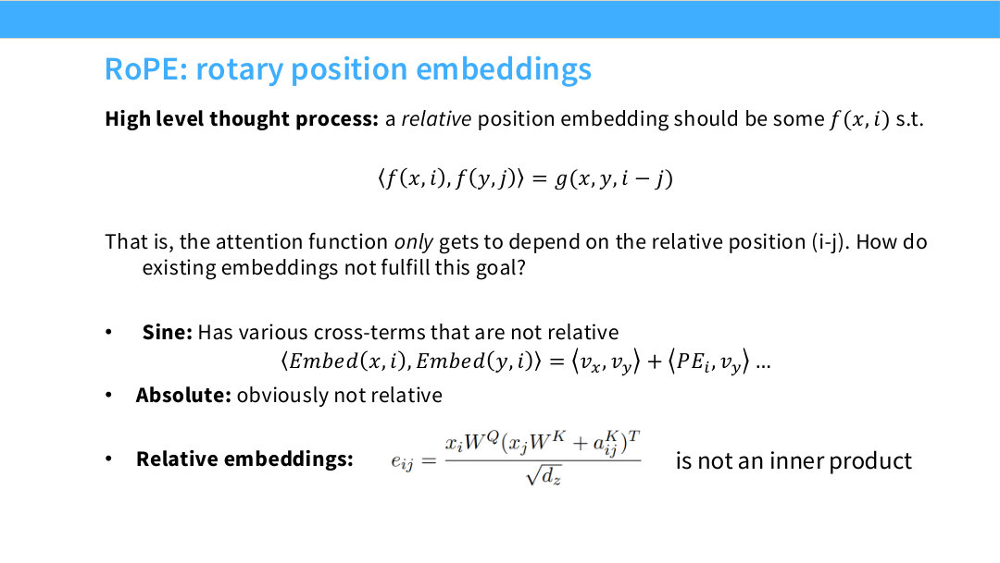

이 페이지는 RoPE를 “새로운 위치 임베딩 공식”으로 바로 설명하지 않고, 먼저 **좋은 relative position embedding이 만족해야 하는 조건**을 제시한다. 슬라이드 중앙의 핵심 수식은 다음이다.

$$
\left\langle f(x,i), f(y,j) \right\rangle = g(x,y,i-j)
$$

여기서 $x,y$는 token의 내용 표현이고, $i,j$는 각각의 위치다. $f(x,i)$는 token $x$에 위치 $i$를 반영한 표현이다. 이 식이 말하는 것은 단순하다. attention에서 두 token의 유사도를 계산할 때, 위치 정보는 $i$와 $j$라는 **절대 위치 자체**가 아니라 $i-j$라는 **상대 위치 차이**로 들어가야 한다는 것이다.

왜 이것이 자연스러운가? 예를 들어 어떤 문장에서 “형용사 바로 다음에 명사”가 오는 패턴은 문장 맨 앞에서 나타나든, 문장 중간에서 나타나든 같은 구조다. 모델 입장에서는 “몇 번째 token인가?”보다 “두 token이 얼마나 떨어져 있는가?”가 더 일반화에 유리하다. 그래서 RoPE의 출발점은 **attention score가 상대 위치에만 의존하도록 만들자**는 것이다.

슬라이드의 아래쪽은 기존 방식들이 이 목표를 어떻게 만족하지 못하는지 하나씩 보여준다.

첫째, sine positional embedding은 원래 Transformer에서 사용한 방식처럼 token embedding에 sinusoidal position vector를 더한다.

$$
\operatorname{Embed}(x,i)=v_x + PE_i
$$

그러면 두 token의 내적은 다음처럼 전개된다.

$$
\begin{aligned}
\operatorname{Embed}(x,i)^\top \operatorname{Embed}(y,j)
&= (v_x+PE_i)^\top (v_y+PE_j) \\
&= v_x^\top v_y + v_x^\top PE_j + PE_i^\top v_y + PE_i^\top PE_j.
\end{aligned}
$$

여기서 문제는 $v_x^\top PE_j$와 $PE_i^\top v_y$ 같은 **cross term**이다. token의 의미 표현과 상대 token의 절대 위치가 섞인다. 즉 score가 단순히 $i-j$의 함수로만 정리되지 않는다. 슬라이드의 “Sine: Has various cross-terms that are not relative”라는 문장은 바로 이 점을 말한다.

둘째, learned absolute embedding은 더 직접적으로 절대 위치 vector $u_i$를 더한다.

$$
\operatorname{Embed}(x,i)=v_x+u_i
$$

이 경우는 이름 그대로 absolute position을 사용하므로 **상대 위치 불변성을 만족한다고 보기 어렵다.** 모델은 위치 10과 위치 20에 대해 서로 다른 learned vector를 보게 되며, 훈련에서 보지 못한 길이로 extrapolation할 때도 한계가 생긴다.

셋째, relative embedding 또는 relative bias는 attention score에 상대 위치 정보를 직접 넣는다. 슬라이드 하단에는 다음과 같은 형태가 나온다.

$$
e_{ij}=\frac{x_i W^Q (x_j W^K + a_{ij}^{K})^\top}{\sqrt{d_z}}
$$

이 방식은 상대 위치를 쓰기 때문에 유용하지만, 슬라이드가 강조하듯이 “is not an inner product”라는 특징이 있다. 즉 query와 key를 각각 어떤 위치 의존 표현으로 바꾼 다음 그 둘의 순수 내적으로 attention score를 얻는 형태가 아니다. RoPE는 여기서 한 걸음 더 나아가, **query/key 자체를 위치에 따라 변환하되, 그 내적이 상대 위치만 보게 만드는 방식**을 찾는다.

따라서 이 페이지의 역할은 RoPE를 도입하기 위한 문제 정의다. 기존 additive positional embedding은 cross term 때문에 완전한 상대 위치 구조를 만들기 어렵고, relative bias는 효과적이지만 attention의 query-key 내적 구조와는 조금 다르다. RoPE는 이 둘 사이에서, attention의 핵심 연산인 inner product를 유지하면서 relative position을 자연스럽게 넣는 방법으로 등장한다.

---

## Page 32. RoPE: rotary position embeddings - Rotation idea

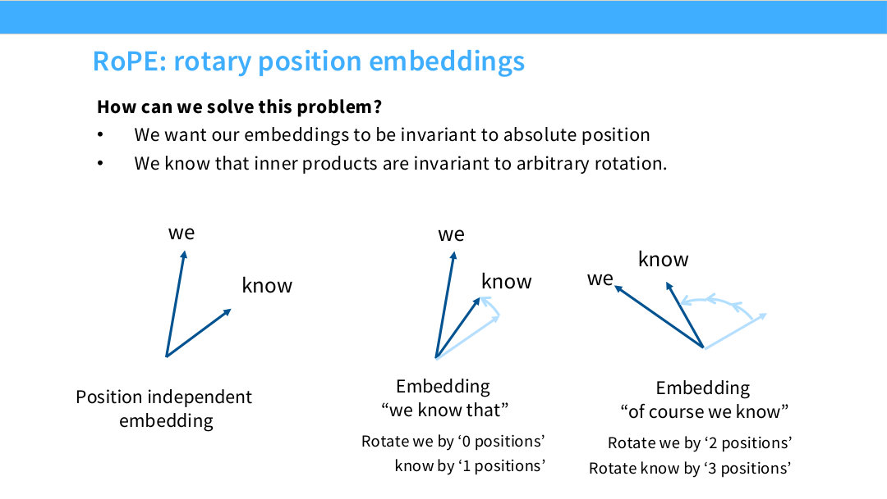

이 페이지는 Page 31의 수식적 목표를 **회전(rotation)** 이라는 직관으로 바꿔 설명한다. 슬라이드 상단에는 두 문장이 있다.

- embedding이 absolute position에 불변이면 좋다.
- inner product는 같은 회전을 양쪽에 적용해도 변하지 않는다.

2차원 회전 행렬을 쓰면 이 성질을 명확히 볼 수 있다.

$$
R(\theta)=
\begin{bmatrix}
\cos\theta & -\sin\theta \\
\sin\theta & \cos\theta
\end{bmatrix}
$$

회전 행렬은 직교 행렬이므로 다음이 성립한다.

$$
R(\theta)^\top R(\theta)=I
$$

따라서 두 vector $q,k$를 같은 각도만큼 회전시키면 내적은 변하지 않는다.

$$
(R(\theta)q)^\top(R(\theta)k)=q^\top k
$$

슬라이드의 왼쪽 그림은 **position independent embedding**을 보여준다. “we”와 “know”라는 두 단어가 각각 하나의 vector로 표현되어 있고, 아직 위치 정보는 없다. 이 상태에서는 문장 안에서 몇 번째 단어인지 알 수 없다.

가운데 그림은 “we know that”이라는 문장에서 위치 정보를 회전으로 넣는 모습을 보여준다. “we”는 0 positions만큼 회전하고, “know”는 1 position만큼 회전한다. 즉 token마다 위치 번호에 비례한 회전각을 부여한다.

오른쪽 그림은 “of course we know”라는 다른 문장을 보여준다. 여기서는 “we”가 2 positions만큼, “know”가 3 positions만큼 회전한다. 절대 위치는 가운데 그림과 다르다. 하지만 “we”와 “know” 사이의 상대 거리는 여전히 1이다. RoPE가 원하는 것은 바로 이 경우 **두 token 사이의 attention 관계가 유사하게 유지되는 것**이다.

이를 수식으로 쓰면 다음과 같다. 위치 $m$의 query와 위치 $n$의 key에 대해 RoPE는 각각 다른 각도로 회전시킨다.

$$
q_m' = R(m\theta)q, \qquad k_n' = R(n\theta)k
$$

이제 attention score는 다음과 같이 된다.

$$
\begin{aligned}
(q_m')^\top k_n'
&= (R(m\theta)q)^\top(R(n\theta)k) \\
&= q^\top R(m\theta)^\top R(n\theta)k.
\end{aligned}
$$

회전 행렬의 합성 성질에 의해,

$$
R(m\theta)^\top R(n\theta)=R((n-m)\theta)
$$

이므로,

$$
(q_m')^\top k_n'=q^\top R((n-m)\theta)k
$$

가 된다. 여기서 위치 정보는 절대 위치 $m,n$이 아니라 상대 위치 $n-m$으로만 남는다.

슬라이드의 그림을 다시 문장 예시로 보면 더 직관적이다.

- “we know that”에서 “we”는 위치 0, “know”는 위치 1이다.
- “of course we know”에서 “we”는 위치 2, “know”는 위치 3이다.

두 경우 모두 “know”의 위치에서 “we”의 위치를 빼면 상대 거리는 1이다. RoPE에서는 두 token의 회전각 차이가 같으므로, attention score의 위치 관련 부분도 같은 구조를 갖는다.

간단한 숫자 예시를 들어보자. 한 위치당 회전각을 $30^\circ$라고 하고, $q=k=(1,0)$이라고 하자. 첫 번째 문장에서 $m=0$, $n=1$이면 상대 회전각은 $30^\circ$다.

$$
(R(0^\circ)q)^\top(R(30^\circ)k)=\cos 30^\circ
$$

두 번째 문장에서 $m=2$, $n=3$이면 각각 $60^\circ$, $90^\circ$만큼 회전하지만, 상대 회전각은 여전히 $30^\circ$다.

$$
(R(60^\circ)q)^\top(R(90^\circ)k)=\cos(90^\circ-60^\circ)=\cos30^\circ
$$

즉, 절대 위치가 달라도 상대 위치가 같으면 위치에 의해 유도되는 내적 구조가 같게 유지된다. 이 페이지의 그림은 RoPE의 핵심을 가장 직관적으로 보여준다. **단어 vector 자체는 위치에 따라 회전하지만, 두 단어 사이의 내적은 회전각 차이, 즉 상대 위치만 보게 된다.**

---

## Page 33. RoPE: rotary position embeddings - Which rotation?

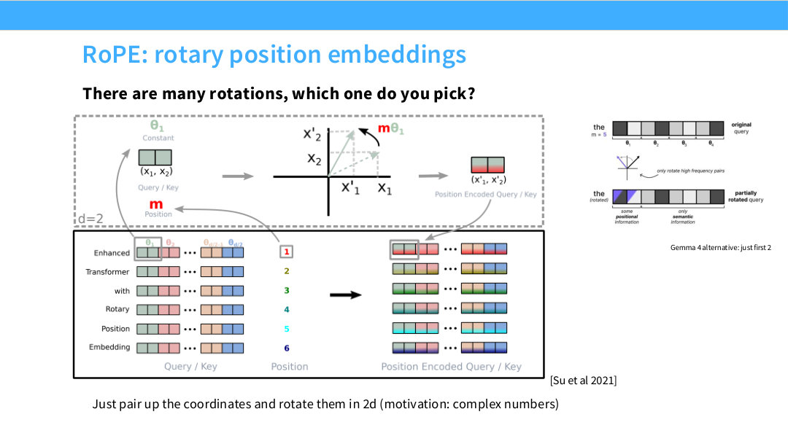

이 페이지는 “회전을 쓰자”는 아이디어를 실제 고차원 query/key vector에 어떻게 적용할지 설명한다. 슬라이드 상단의 질문은 “There are many rotations, which one do you pick?”이다. 고차원 공간에는 가능한 회전이 매우 많다. RoPE는 복잡한 임의의 고차원 회전을 쓰지 않고, 좌표를 두 개씩 묶어 각각의 2차원 평면에서 회전시키는 단순한 방식을 택한다.

슬라이드 왼쪽 위의 작은 그림은 가장 기본 단위인 $d=2$ case를 보여준다. coordinate pair $(x_1,x_2)$가 있고, 위치 $m$에 대해 각도 $m\theta_1$만큼 회전한다. 이 회전 결과가 $(x_1',x_2')$다. 즉 한 token이 위치 $m$에 있으면 그 token의 query/key vector 일부가 $m$에 비례해서 회전한다.

수식으로는 다음과 같다.

$$
\begin{bmatrix}
x_1' \\
x_2'
\end{bmatrix}
=
\begin{bmatrix}
\cos(m\theta_1) & -\sin(m\theta_1) \\
\sin(m\theta_1) & \cos(m\theta_1)
\end{bmatrix}
\begin{bmatrix}
x_1 \\
x_2
\end{bmatrix}
$$

슬라이드 아래쪽의 큰 그림은 이 2D 회전을 고차원 vector 전체에 확장하는 방법을 보여준다. query/key vector를 다음처럼 두 좌표씩 pair로 나눈다.

$$
(x_0,x_1),\quad (x_2,x_3),\quad \cdots,\quad (x_{d_h-2},x_{d_h-1})
$$

각 pair에는 서로 다른 frequency가 할당된다. 일반적인 RoPE에서는 $r$번째 pair의 frequency를 다음처럼 둔다.

$$
\theta_r=10000^{-2r/d_h}
$$

위치 $m$의 token에 대해서는 $r$번째 pair를 $m\theta_r$만큼 회전한다.

$$
\begin{aligned}
x'_{2r} &= x_{2r}\cos(m\theta_r)-x_{2r+1}\sin(m\theta_r), \\
x'_{2r+1} &= x_{2r}\sin(m\theta_r)+x_{2r+1}\cos(m\theta_r).
\end{aligned}
$$

슬라이드의 아래 그림을 보면, 왼쪽에는 원래 query/key vector가 여러 색의 coordinate pair로 나뉘어 있고, 가운데에는 position 1, 2, 3, ...이 표시되어 있다. 오른쪽에는 각 position마다 회전이 적용된 query/key vector가 나온다. 색이 서로 다른 것은 각 pair가 서로 다른 frequency로 회전한다는 의미다. 즉 모든 차원이 같은 속도로 회전하는 것이 아니라, 어떤 pair는 빠르게, 어떤 pair는 느리게 회전한다.

이 구조가 중요한 이유는 거리 정보를 여러 해상도로 표현할 수 있기 때문이다. 빠르게 회전하는 pair는 짧은 거리 변화에 민감하다. 반면 느리게 회전하는 pair는 긴 거리 변화에도 천천히 변하므로 long-range 위치 정보를 더 안정적으로 담을 수 있다. 이는 sinusoidal positional encoding이 여러 frequency의 sine/cosine을 사용하는 것과 유사하지만, RoPE에서는 이 주파수들이 additive embedding이 아니라 query/key의 rotation으로 들어간다.

슬라이드 오른쪽에는 “Gemma 4 alternative: just first 2”라는 작은 그림이 있다. 이 그림은 모든 coordinate pair를 회전시키는 대신 일부 앞쪽 pair만 회전시키는 변형을 보여준다. 그림에서 회전된 query의 일부 차원은 positional information을 담고, 나머지 차원은 semantic information을 상대적으로 더 보존하는 식으로 해석할 수 있다. 즉 최근 모델들은 RoPE의 기본 아이디어를 그대로 쓰되, 모든 차원에 위치 정보를 강하게 넣을지, 일부 차원에만 넣을지 같은 설계 변형을 실험한다.

작은 예시를 보자. head dimension이 $4$라고 하면 두 개의 coordinate pair가 있다.

$$
q=[1,0,0,1],\qquad k=[1,0,1,0]
$$

첫 번째 pair의 회전 단위를 $30^\circ$, 두 번째 pair의 회전 단위를 $10^\circ$라고 하자. query 위치가 $m=2$, key 위치가 $n=5$이면 상대 위치는 $3$이다. 첫 번째 pair는 상대적으로 $90^\circ$ 차이가 나고, 두 번째 pair는 $30^\circ$ 차이가 난다.

첫 번째 pair에 대한 위치 내적은 다음과 같다.

$$
[1,0]^\top R(90^\circ)[1,0]=\cos90^\circ=0
$$

두 번째 pair에 대해서는 다음과 같다.

$$
[0,1]^\top R(30^\circ)[1,0]=\sin30^\circ=0.5
$$

따라서 두 pair를 합치면 위치 차이에 따른 내적 기여는 $0.5$가 된다. 이 예시에서 볼 수 있듯이 RoPE는 하나의 상대 위치를 하나의 숫자로만 표현하지 않고, 여러 frequency pair의 조합으로 표현한다. 그래서 다양한 거리 패턴을 attention score 안에서 부드럽게 나타낼 수 있다.

---

## Page 34. The actual RoPE math

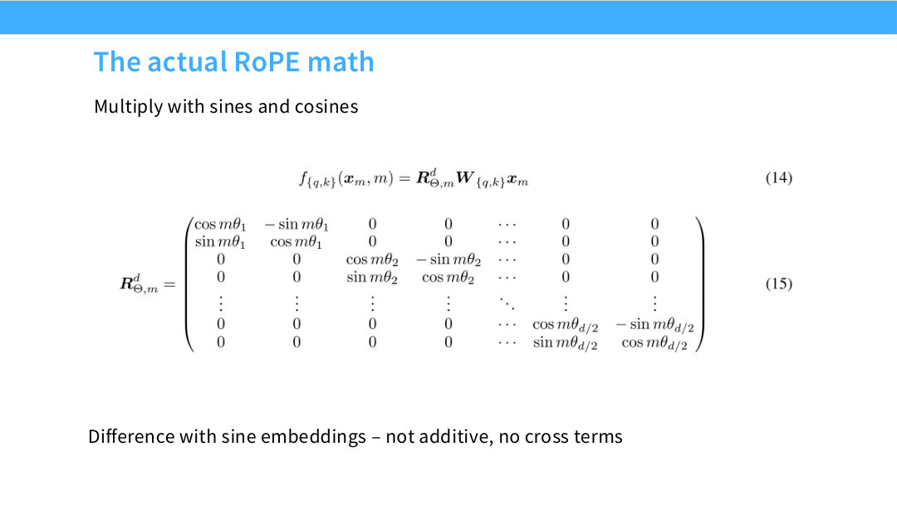

이 페이지는 앞의 직관을 실제 논문 수식 형태로 정리한다. 슬라이드 상단의 문장 “Multiply with sines and cosines”는 RoPE 구현의 핵심을 잘 요약한다. 실제로는 거대한 회전 행렬을 명시적으로 만들지 않고, query/key의 coordinate pair마다 sine과 cosine을 곱해 회전을 구현한다.

슬라이드 중앙의 첫 번째 수식은 위치 $m$의 입력 $x_m$에 대해 query 또는 key projection을 한 뒤 회전 행렬을 곱하는 형태다.

$$
f_{\{q,k\}}(x_m,m)=R_{\Theta,m}^{d}W_{\{q,k\}}x_m
$$

여기서 $W_{\{q,k\}}$는 query 또는 key projection matrix이고, $R_{\Theta,m}^{d}$는 위치 $m$에 대한 $d$차원 RoPE 회전 행렬이다. 즉 순서는 다음과 같다.

$$
x_m \rightarrow W_Qx_m \text{ 또는 } W_Kx_m \rightarrow R_{\Theta,m}^{d}(W_Qx_m \text{ 또는 } W_Kx_m)
$$

슬라이드 아래의 큰 행렬은 $R_{\Theta,m}^{d}$가 어떤 구조인지 보여준다. 이 행렬은 전체가 dense한 임의 회전 행렬이 아니라, 2차원 회전 block들이 대각선 방향으로 배치된 **block diagonal matrix**다.

$$
R_{\Theta,m}^{d}=
\begin{bmatrix}
\cos m\theta_1 & -\sin m\theta_1 & 0 & 0 & \cdots & 0 & 0 \\
\sin m\theta_1 & \cos m\theta_1 & 0 & 0 & \cdots & 0 & 0 \\
0 & 0 & \cos m\theta_2 & -\sin m\theta_2 & \cdots & 0 & 0 \\
0 & 0 & \sin m\theta_2 & \cos m\theta_2 & \cdots & 0 & 0 \\
\vdots & \vdots & \vdots & \vdots & \ddots & \vdots & \vdots \\
0 & 0 & 0 & 0 & \cdots & \cos m\theta_{d/2} & -\sin m\theta_{d/2} \\
0 & 0 & 0 & 0 & \cdots & \sin m\theta_{d/2} & \cos m\theta_{d/2}
\end{bmatrix}
$$

이 행렬을 보면 Page 33의 그림이 정확히 수식화된 것을 알 수 있다. 첫 번째 두 차원은 $m\theta_1$만큼 회전하고, 다음 두 차원은 $m\theta_2$만큼 회전하며, 마지막 두 차원은 $m\theta_{d/2}$만큼 회전한다. 각 pair는 독립적으로 회전하기 때문에 구현이 간단하고, 여러 frequency를 동시에 사용할 수 있다.

attention score에 들어가면 RoPE의 상대 위치 성질이 나타난다. 위치 $m$의 query와 위치 $n$의 key를 다음처럼 두자.

$$
q_m'=R_m q_m,\qquad k_n'=R_n k_n
$$

그러면 score는 다음이다.

$$
\begin{aligned}
(q_m')^\top k_n'
&=(R_mq_m)^\top(R_nk_n) \\
&=q_m^\top R_m^\top R_n k_n \\
&=q_m^\top R_{n-m} k_n.
\end{aligned}
$$

이 식은 Page 31의 목표였던 “attention function only depends on relative position”을 실제로 만족한다. 물론 token 내용 $q_m,k_n$도 score에 영향을 주지만, 위치에 해당하는 회전 부분은 $n-m$으로만 남는다.

슬라이드 하단의 “Difference with sine embeddings - not additive, no cross terms”라는 말은 매우 중요하다. sine positional embedding은 다음처럼 위치 vector를 token embedding에 더한다.

$$
\tilde{x}_m=x_m+PE_m
$$

이 경우 내적을 전개하면 token-position cross term이 생긴다.

$$
\tilde{x}_m^\top \tilde{y}_n
=x_m^\top y_n+x_m^\top PE_n+PE_m^\top y_n+PE_m^\top PE_n
$$

반면 RoPE는 위치 정보를 더하지 않는다. query/key에 회전 행렬을 곱한다.

$$
(R_mq_m)^\top(R_nk_n)=q_m^\top R_{n-m}k_n
$$

따라서 additive 방식에서 생기는 cross term 문제 없이, position effect가 query-key 내적 안에 상대 회전으로 들어간다.

실제 구현에서는 $R_{\Theta,m}^{d}$를 행렬로 만들지 않는다. 아래와 같은 elementwise 형태로 계산한다.

$$
\operatorname{RoPE}(x,m)=x\odot \cos_m+\operatorname{rotate\_half}(x)\odot \sin_m
$$

예를 들어,

$$
x=[x_0,x_1,x_2,x_3]
$$

이면,

$$
\operatorname{rotate\_half}(x)=[-x_1,x_0,-x_3,x_2]
$$

이고, 이는 각 pair에 대해 다음 회전을 수행하는 것과 같다.

$$
(x_0,x_1)\mapsto(x_0\cos-x_1\sin,\;x_0\sin+x_1\cos)
$$

슬라이드의 행렬 수식은 RoPE의 원리를 보여주기 위한 표현이고, 실제 코드는 cos/sin table과 elementwise operation으로 같은 효과를 낸다고 이해하면 된다.

---

## Page 35. Implementation and code for RoPE

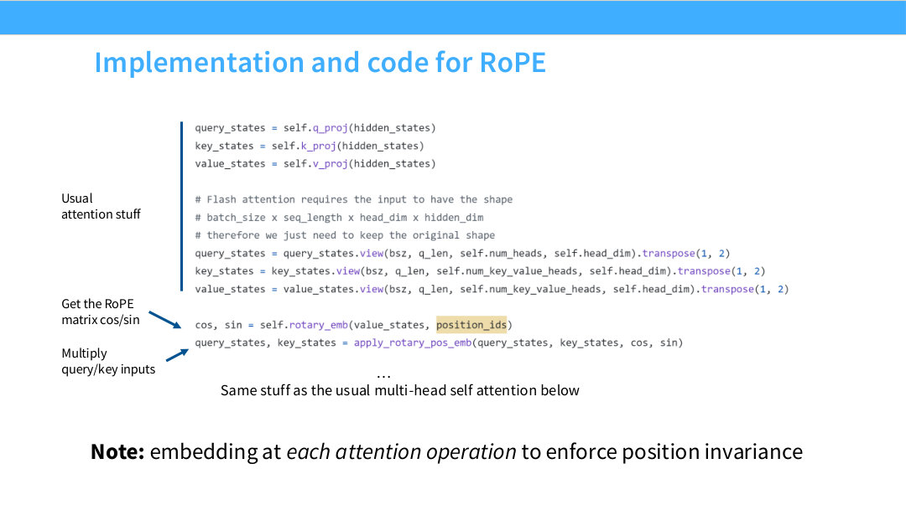

이 페이지는 RoPE가 실제 attention 코드 어디에 들어가는지 보여준다. 슬라이드 왼쪽에는 세 개의 화살표가 있다. 위쪽은 “Usual attention stuff”, 중간은 “Get the RoPE matrix cos/sin”, 아래쪽은 “Multiply query/key inputs”다. 즉 RoPE는 attention 전체를 대체하는 모듈이 아니라, 일반적인 multi-head self-attention 과정 중간에 삽입되는 작은 변환이다.

먼저 hidden states에서 query, key, value를 만든다.

$$
Q=XW_Q,\qquad K=XW_K,\qquad V=XW_V
$$

슬라이드 코드의 첫 부분이 여기에 해당한다.

$$
\texttt{query\_states}=q\_\texttt{proj}(\texttt{hidden\_states})
$$

$$
\texttt{key\_states}=k\_\texttt{proj}(\texttt{hidden\_states})
$$

$$
\texttt{value\_states}=v\_\texttt{proj}(\texttt{hidden\_states})
$$

그다음 FlashAttention 등 효율적인 attention kernel이 요구하는 shape에 맞추기 위해 query/key/value를 multi-head 형태로 reshape한다. 보통 다음 형태를 사용한다.

$$
Q,K,V\in\mathbb{R}^{B\times H\times N\times d_h}
$$

여기서 $B$는 batch size, $H$는 head 수, $N$은 sequence length, $d_h$는 head dimension이다. 슬라이드 코드의 `view(...).transpose(1, 2)`가 이 reshape와 head 축 이동을 수행한다. 즉 원래 $B\times N\times (H d_h)$ 형태였던 tensor를 $B\times H\times N\times d_h$로 바꾼다.

이후 노란색으로 강조된 `position_ids`를 사용해 각 token 위치에 해당하는 cos/sin 값을 가져온다.

$$
\texttt{cos},\texttt{sin}=\operatorname{rotary\_emb}(\texttt{value\_states},\texttt{position\_ids})
$$

여기서 `value_states`가 인자로 들어간다고 해서 value에 RoPE를 적용한다는 뜻은 아니다. 보통 dtype, device, sequence length 같은 정보를 맞추기 위해 넘기는 구현상의 관례다. 실제 RoPE 적용 대상은 query와 key다.

$$
Q_m'=\operatorname{RoPE}(Q_m,m),\qquad K_m'=\operatorname{RoPE}(K_m,m)
$$

슬라이드 코드의 핵심 줄은 다음 의미를 갖는다.

$$
\texttt{query\_states},\texttt{key\_states}
=\operatorname{apply\_rotary\_pos\_emb}(Q,K,\cos,\sin)
$$

이 줄에서 query와 key에만 cos/sin 기반 회전이 적용된다. value에는 적용하지 않는다. 이유는 attention에서 위치 정보를 반영해야 하는 곳이 attention weight를 결정하는 score이기 때문이다.

$$
\operatorname{score}(m,n)=\frac{Q_m' {K_n'}^\top}{\sqrt{d_h}}
$$

value는 softmax로 얻은 weight를 통해 섞이는 내용 vector다.

$$
\operatorname{Attention}(Q',K',V)=\operatorname{softmax}\left(\frac{Q'{K'}^\top}{\sqrt{d_h}}\right)V
$$

따라서 query/key에 RoPE를 적용하면 attention weight가 상대 위치를 반영하게 되고, value는 그 weight에 따라 선택·혼합되는 정보 역할을 유지한다.

슬라이드 하단의 “Same stuff as the usual multi-head self attention below”는 RoPE 이후에는 일반 attention과 동일하게 진행된다는 뜻이다. 즉 RoPE를 넣는다고 attention 구조 전체가 바뀌는 것이 아니다.

$$
X \rightarrow Q,K,V \rightarrow \operatorname{RoPE}(Q,K) \rightarrow Q'K'^\top \rightarrow \operatorname{softmax} \rightarrow V
$$

마지막 문장인 “embedding at each attention operation to enforce position invariance”도 중요하다. RoPE는 입력 token embedding에 한 번만 더하는 absolute embedding이 아니다. 각 attention layer에서 query/key를 만들고, 그 query/key에 위치 회전을 적용한다. 그래서 모든 layer의 attention score가 상대 위치 구조를 갖도록 만든다.

간단한 문장 예시로 보면 다음과 같다.

$$
\text{tokens}=[\text{``I''},\text{``love''},\text{``deep''},\text{``learning''}]
$$

위치를 각각 $0,1,2,3$이라고 하자. “learning” 위치의 query가 “deep” 위치의 key를 본다면 상대 위치는 $2-3=-1$이다. 반대로 “learning”이 “I”를 본다면 상대 위치는 $0-3=-3$이다. RoPE에서는 이 두 경우가 서로 다른 상대 회전각으로 attention score에 들어간다.

$$
\operatorname{score}(3,2)=\frac{q_3^\top R_{2-3}k_2}{\sqrt{d_h}}
$$

$$
\operatorname{score}(3,0)=\frac{q_3^\top R_{0-3}k_0}{\sqrt{d_h}}
$$

즉 모델은 “바로 앞 token”과 “세 칸 앞 token”을 서로 다른 위치 관계로 처리할 수 있다. 동시에 같은 상대 위치 관계가 문장의 다른 부분에 나타나면 유사한 회전 구조를 공유한다.

이 페이지는 RoPE를 실제 코드 흐름 속에 위치시킨다는 점에서 중요하다. Page 31-34가 “왜 회전인가?”와 “수식적으로 왜 상대 위치가 되는가?”를 설명했다면, Page 35는 “실제 모델에서는 query/key projection 이후, attention score 계산 직전에 RoPE가 들어간다”는 구현 위치를 보여준다.

---

## Page 36. Hyperparameters

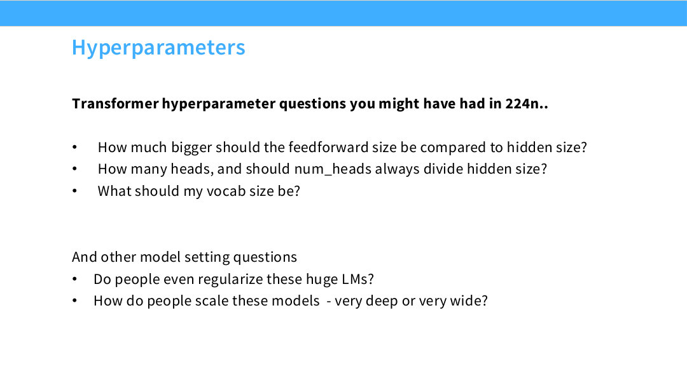

이 페이지부터는 architecture component가 아니라 hyperparameter 선택으로 넘어간다. Transformer를 구현할 때 자연스럽게 생기는 질문들이 있다. feed forward dimension은 hidden size보다 얼마나 커야 하는가? attention head 수는 몇 개가 적절한가? head dimension의 합은 항상 model dimension과 같아야 하는가? vocabulary size는 어느 정도가 좋은가?

또 다른 질문은 regularization과 scale 방향이다. 대형 LM pretraining에서도 dropout 같은 regularization이 필요한가? 모델을 키울 때 layer를 많이 쌓아 깊게 만들지, hidden dimension을 크게 해서 넓게 만들지 어떻게 결정하는가?

이 강의의 관점은 이론적 최적값을 구하는 것이 아니라, 공개된 모델들이 어떤 값을 반복적으로 선택했는지 보는 것이다. 놀랍게도 많은 hyperparameter는 모델마다 큰 차이가 없고, 매우 보수적인 기본값이 반복된다.

---

## Page 37. Surprising consensus hyperparameter 1 - FFN ratio

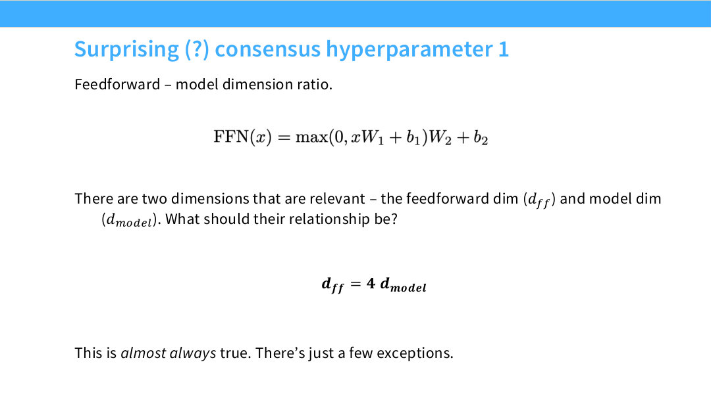

첫 번째 consensus는 feedforward dimension과 model dimension의 비율이다. Transformer FFN에는 $d_{\mathrm{model}}$과 $d_{\mathrm{ff}}$라는 두 차원이 있다. $d_{\mathrm{model}}$은 residual stream과 hidden state의 차원이고, $d_{\mathrm{ff}}$는 FFN 내부의 확장 차원이다.

전통적인 기본값은 다음이다.

$$
d_{\mathrm{ff}} = 4d_{\mathrm{model}}
$$

이 규칙은 원래 Transformer 이후 매우 널리 쓰였다. FFN은 각 token 위치에서 feature transformation을 담당하는 큰 MLP이므로, 내부 차원을 d_model보다 크게 확장한 뒤 다시 d_model로 줄이는 구조가 표현력에 유리하다.

강의가 강조하는 점은 이 4배 규칙이 거의 항상 등장한다는 것이다. 완전히 이론적으로 필연적인 값은 아니지만, 많은 모델에서 안정적으로 좋은 기본값으로 쓰였다. 다만 GLU variant와 T5 같은 예외가 있다.

---

## Page 38. Exception #1 - GLU variants

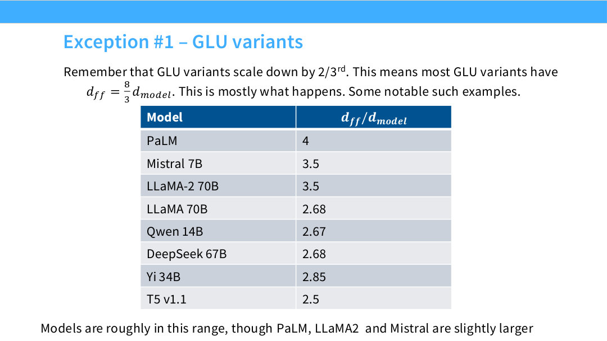

GLU 계열에서는 d_ff 비율이 달라진다. 이유는 GLU가 두 개의 input projection을 사용하기 때문이다. 하나는 activation branch, 다른 하나는 gate branch다. 따라서 기존 FFN과 같은 d_ff를 유지하면 parameter 수와 FLOPs가 증가한다.

이를 맞추기 위해 대부분의 GLU variant는 d_ff를 2/3로 줄인다. 전통적인 FFN의 4배 규칙에 2/3를 곱하면 다음이 된다.

$$
d_{\mathrm{ff}}=\frac{8}{3}d_{\mathrm{model}}\approx 2.67d_{\mathrm{model}}
$$

표를 보면 LLaMA 70B, Qwen 14B, DeepSeek 67B 등이 2.67~2.68 근처의 비율을 사용한다. Mistral 7B나 LLaMA-2 70B는 3.5 정도로 조금 크고, PaLM은 4를 사용한다. 즉 GLU 모델들은 대략 2.5~3.5 사이에 많이 위치한다.

실무적으로는 SwiGLU를 쓴다면 d_ff = 8/3 d_model을 기본값으로 생각하면 된다. 다만 특정 모델에서는 성능, hardware efficiency, tensor parallelism을 고려해 약간 크게 잡기도 한다.

---

## Page 39. Exception #2 - T5

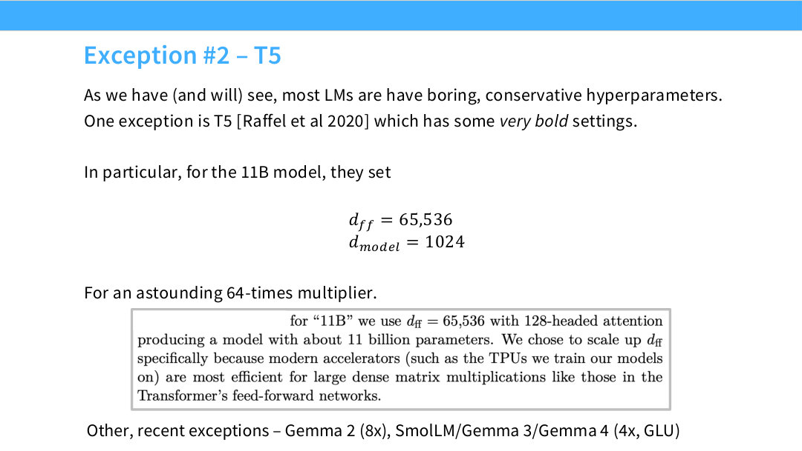

T5는 매우 과감한 예외다. 대부분의 LM이 보수적인 hyperparameter를 쓰는 것과 달리, T5 11B는 $d_{\mathrm{ff}}=65{,}536$, $d_{\mathrm{model}}=1{,}024$를 사용했다. 이는 $d_{\mathrm{ff}}$가 $d_{\mathrm{model}}$의 64배라는 뜻이다.

$$
\frac{d_{\mathrm{ff}}}{d_{\mathrm{model}}}=\frac{65{,}536}{1{,}024}=64
$$

이 선택은 일반적인 Transformer 설계 감각으로 보면 매우 크다. 슬라이드의 인용문에 따르면 TPU에서 큰 matrix multiplication 효율을 고려해 d_ff를 매우 크게 잡은 것으로 볼 수 있다.

하지만 후속 모델인 T5 v1.1은 GeGLU를 사용하면서 훨씬 표준적인 2.5배 multiplier로 이동했다. 따라서 T5의 64배 설정은 "가능은 하지만 최적은 아닐 가능성이 높다"는 교훈을 준다. 최근 예외로 Gemma 2의 8배, SmolLM/Gemma 3/Gemma 4의 4배 GLU 등도 언급된다.

---

## Page 40. Why this range of multipliers?

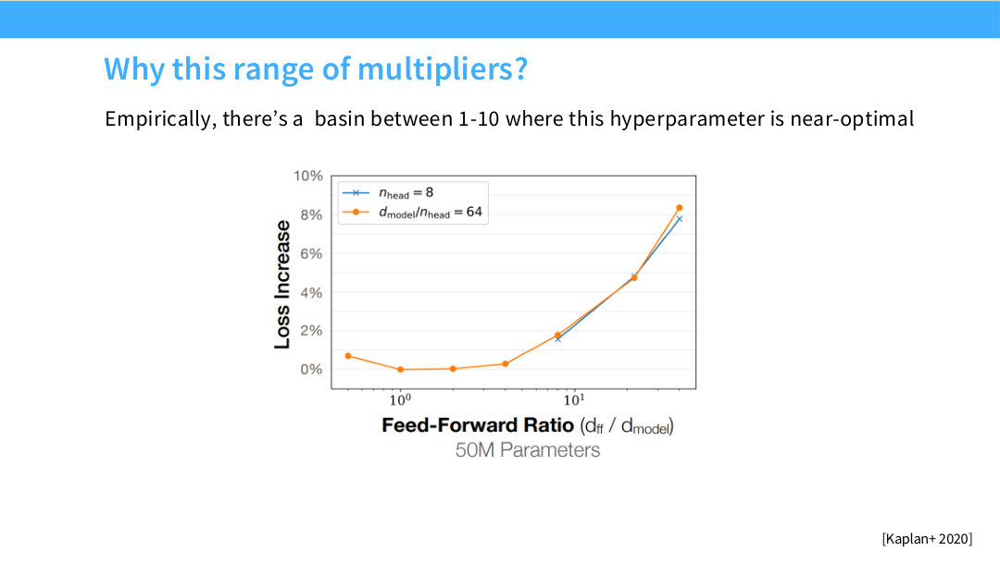

이 페이지는 왜 $d_{\mathrm{ff}}$ multiplier가 1~10 사이의 넓은 basin에서 꽤 잘 작동하는지 보여준다. Kaplan et al. 2020의 그림은 feed-forward ratio를 바꿨을 때 loss increase가 어떻게 변하는지 나타낸다.

그래프의 핵심은 특정 하나의 값만 sharp optimum인 것이 아니라, 어느 정도 넓은 구간에서 성능이 비슷하다는 점이다. 즉 d_ff/d_model = 4라는 값은 강력한 경험적 기본값이지만, 조금 달라진다고 모델이 바로 망가지지는 않는다.

이런 관점은 hyperparameter 선택에 중요하다. LLM 설계에서는 이론상 최적값보다, 성능이 크게 나빠지지 않는 안정적인 구간을 찾는 것이 더 현실적이다. 그 안에서 hardware efficiency, parallelism, memory alignment, kernel efficiency 같은 시스템 요인이 최종 선택을 좌우할 수 있다.

---

## Page 41. What can we learn from the model-dim hyperparam?

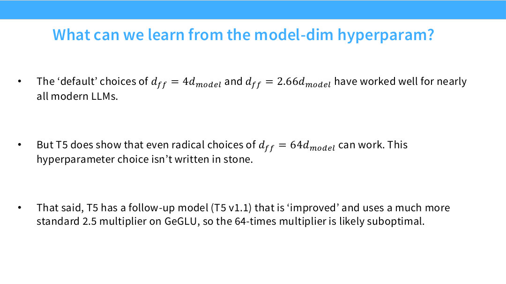

이 페이지는 d_ff 관련 교훈을 정리한다. 일반 FFN에서는 d_ff = 4 d_model이 강력한 기본값이고, GLU 계열에서는 d_ff = 2.66 d_model 근처가 표준적이다. 이 선택들은 거의 모든 현대 LLM에서 잘 작동해왔다.

하지만 이 값들이 법칙처럼 고정된 것은 아니다. T5처럼 d_ff = 64 d_model을 사용해도 모델은 학습될 수 있다. 즉 hyperparameter 선택에는 생각보다 넓은 허용 범위가 있다.

다만 가능하다는 것과 최적이라는 것은 다르다. T5 v1.1이 훨씬 표준적인 2.5배 GeGLU multiplier로 이동했다는 사실은 64배 설정이 효율적이지 않았을 가능성을 시사한다. 실무에서는 먼저 표준값을 쓰고, 명확한 이유가 있을 때만 벗어나는 것이 합리적이다.

---

## Page 42. Surprising consensus hyperparameter 2 - Head dim ratio

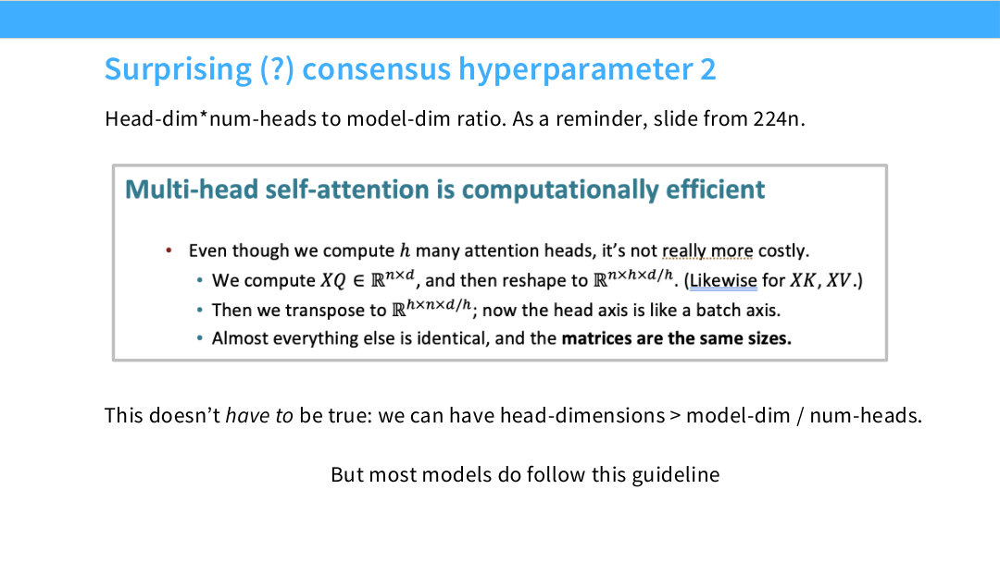

두 번째 consensus는 attention head dimension과 model dimension의 관계다. 보통 multi-head attention에서는 d_model을 num_heads로 나누어 head_dim을 정한다.

$$
d_{\mathrm{head}}\times n_{\mathrm{heads}}=d_{\mathrm{model}}
$$

이것이 반드시 그래야 하는 것은 아니다. query/key/value projection을 원하는 크기로 만들면 $d_{\mathrm{head}}$의 총합이 d_model보다 크거나 작을 수도 있다. 하지만 대부분의 모델은 이 단순한 관계를 따른다.

이 규칙의 장점은 계산과 구현이 단순하다는 것이다. Q, K, V projection이 d_model에서 d_model로 가는 큰 linear projection으로 표현되고, 이후 head 축으로 reshape하면 된다. parameter 수와 FLOPs도 예측하기 쉽다.

---

## Page 43. How many heads, what's the model dim?

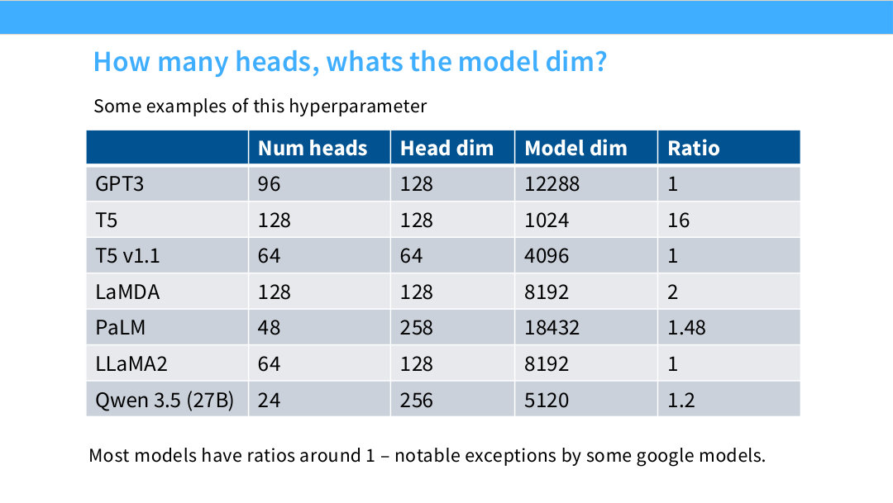

이 페이지는 실제 모델들의 num_heads, head_dim, model_dim 비율을 보여준다. GPT-3는 96 heads, head_dim 128, model_dim 12288로 ratio가 1이다. LLaMA2도 64 heads, head_dim 128, model_dim 8192로 ratio가 1이다.

반면 T5는 특이하다. T5는 128 heads, head_dim 128, model_dim 1024로 ratio가 16이다. 즉 attention 내부의 총 head dimension이 model dimension보다 훨씬 크다. LaMDA와 PaLM도 ratio가 1보다 큰 편이다.

그러나 대부분의 현대 모델은 ratio가 1 근처다. Qwen 3.5 27B도 ratio가 약 1.2로 크게 벗어나지 않는다. 이 부분은 $d_{\mathrm{ff}}$ multiplier보다 검증 근거가 약할 수 있지만, 구현과 시스템 효율 측면에서 ratio 1은 매우 자연스러운 기본값이다.

---

## Page 44. Aspect ratios

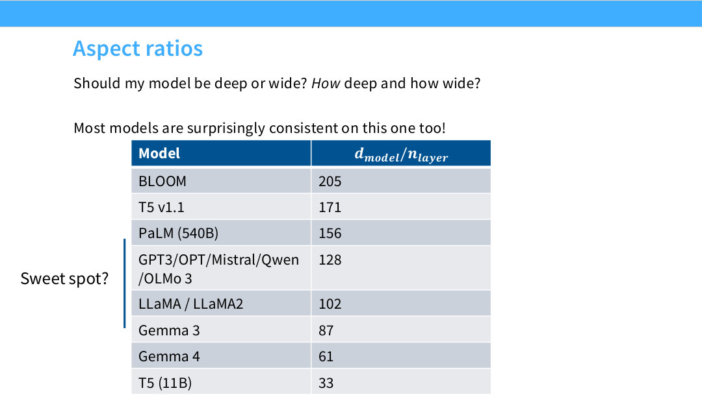

이 페이지는 모델을 deep하게 만들지 wide하게 만들지의 문제를 다룬다. 여기서 aspect ratio는 대략 d_model / n_layer로 볼 수 있다. 값이 크면 layer 수에 비해 hidden dimension이 큰 wide model이고, 값이 작으면 상대적으로 깊은 모델이다.

표를 보면 BLOOM, T5 v1.1, PaLM, GPT-3/OPT/Mistral/Qwen/OLMo 3, LLaMA 계열, Gemma 계열, T5 11B 등이 다양한 aspect ratio를 갖는다. 많은 모델은 100~200 근처에 있지만, Gemma 4는 61, T5 11B는 33처럼 훨씬 깊은 쪽으로 간다.

질문은 sweet spot이 있는가다. 모델 성능만 보면 꽤 넓은 범위가 허용되는 것처럼 보이지만, 시스템 관점에서는 깊이와 폭이 latency, pipeline parallelism, communication, memory layout에 큰 영향을 준다.

---

## Page 45. Considerations about aspect ratio

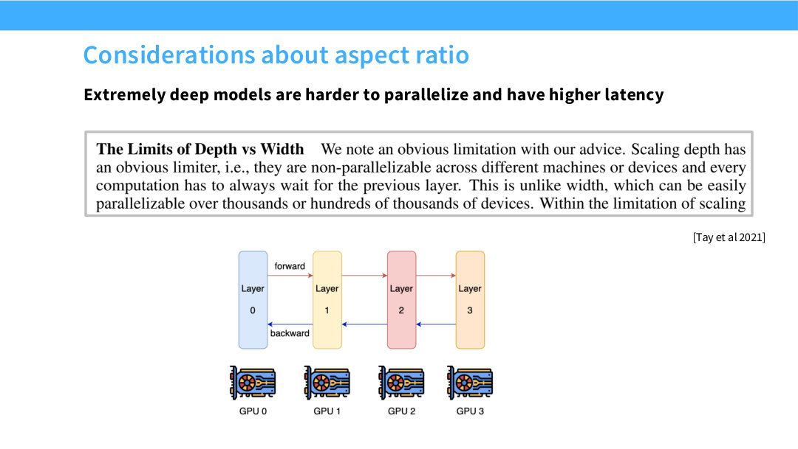

이 페이지는 매우 깊은 모델의 시스템적 단점을 설명한다. 깊은 모델은 layer가 순차적으로 쌓이기 때문에 병렬화가 어렵고 latency가 높아진다. 한 token이 마지막 layer까지 가려면 모든 layer를 순서대로 통과해야 하기 때문이다.

Tay et al. 2021의 인용은 depth scaling의 한계를 강조한다. width는 matrix multiplication 내부에서 수천 또는 수만 개 device로 병렬화하기 쉽지만, depth는 layer 순서 의존성이 강하다. pipeline parallelism을 사용할 수는 있지만 bubble, communication, scheduling overhead가 생긴다.

따라서 aspect ratio 선택은 순수 성능 문제가 아니라 systems problem이다. 같은 parameter budget이라도 더 깊은 모델은 inference latency가 커질 수 있고, 더 wide한 모델은 한 layer의 matmul이 커져 GPU utilization에는 유리할 수 있다.

---

## Page 46. Evidence on aspect ratio scaling

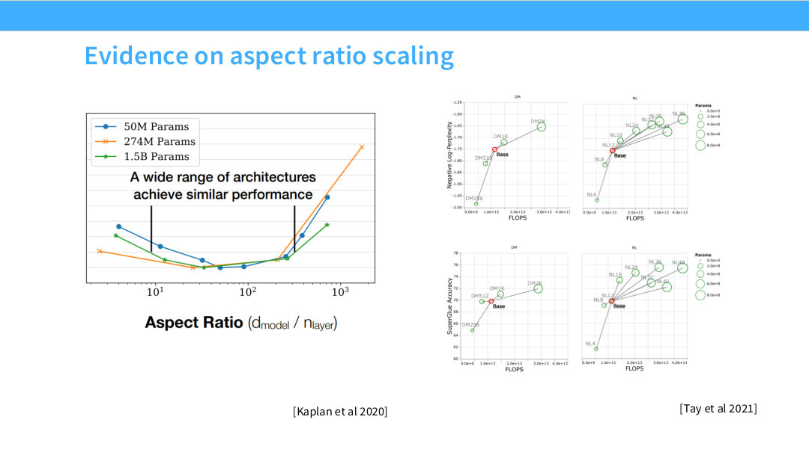

이 페이지는 aspect ratio에 대한 실험적 evidence를 보여준다. Kaplan et al. 2020의 그래프는 넓은 architecture 범위가 비슷한 성능을 낼 수 있음을 보여준다. 즉 d_model/n_layer에는 어느 정도 넓은 basin이 있다.

Tay et al. 2021의 결과도 depth와 width scaling이 task 성능에 미치는 영향을 비교한다. 어떤 task에서는 깊이가 유리하고 어떤 task에서는 폭이 유리할 수 있지만, 전체적으로 하나의 절대 법칙이 있는 것은 아니다.

강의의 교훈은 aspect ratio를 정할 때 성능 곡선만 보지 말라는 것이다. 좋은 값의 범위가 넓다면, 그 안에서는 latency, parallelization, memory, communication 같은 시스템 요인이 더 중요해진다. 그래서 현대 LLM의 architecture choice는 machine learning과 systems의 결합 문제다.

---

## Page 47. What are typical vocabulary sizes?

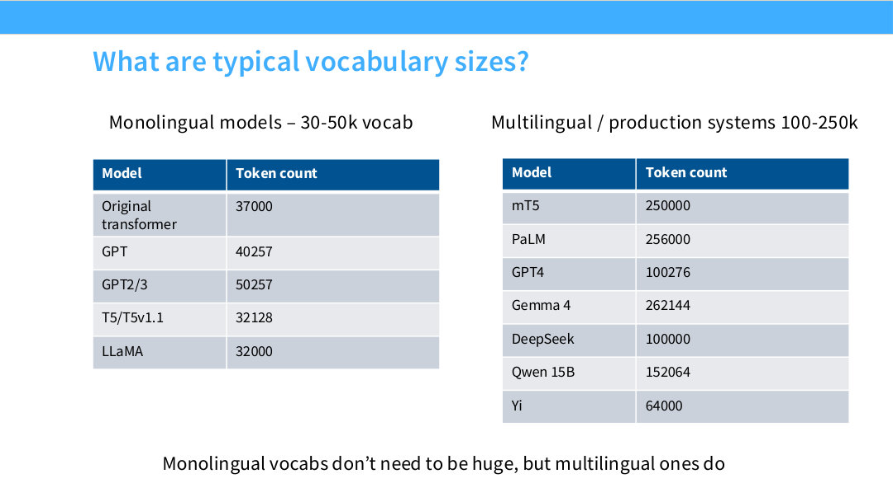

이 페이지는 vocabulary size를 비교한다. monolingual model은 대체로 30k~50k vocabulary를 사용한다. 예를 들어 GPT-2/3는 50,257, T5는 32,128, LLaMA는 32,000 정도다.

반면 multilingual 또는 production system에서는 vocabulary size가 훨씬 커진다. mT5는 250k, PaLM은 256k, GPT-4는 100,276, Gemma 4는 262,144, Qwen 15B는 152,064 정도로 제시된다.

이 차이는 언어 다양성 때문이다. 영어 중심 모델은 비교적 작은 vocab으로도 tokenization 효율을 확보할 수 있지만, 다국어 모델은 다양한 script와 형태소, 문자 체계를 처리해야 한다. vocab이 너무 작으면 한 단어가 지나치게 많은 token으로 쪼개져 sequence length가 늘고, inference/training 비용이 증가한다. 반대로 vocab이 너무 크면 embedding/output softmax parameter와 memory cost가 커진다.

---

## Page 48. Dropout and other regularization

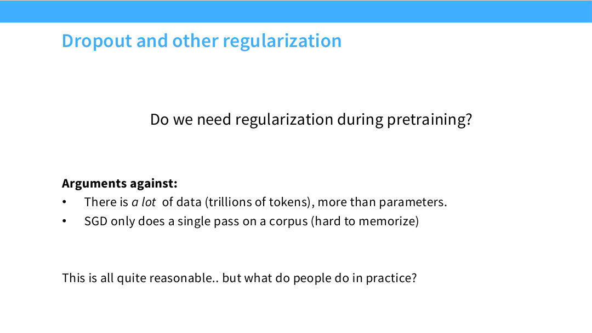

이 페이지는 대형 LM pretraining에서 regularization이 필요한지 질문한다. 일반적인 supervised learning에서는 dropout, weight decay 같은 regularization이 overfitting을 줄이는 데 사용된다.

하지만 LLM pretraining은 상황이 다르다. 데이터가 수조 token 규모로 매우 많고, 한 corpus를 사실상 한 번만 지나가는 경우도 많다. 모델 parameter보다 데이터 token 수가 훨씬 많기 때문에 전통적인 의미의 memorization/overfitting 우려가 상대적으로 작다.

그렇다면 dropout이 필요 없을까? 이 질문의 답은 다음 페이지에서 실제 모델 사례를 통해 본다. 핵심은 LLM에서 regularization은 단순히 generalization gap을 줄이는 장치라기보다 **optimization dynamics**에 영향을 주는 요소로 이해해야 한다는 점이다.

---

## Page 49. Dropout and weight decay in practice

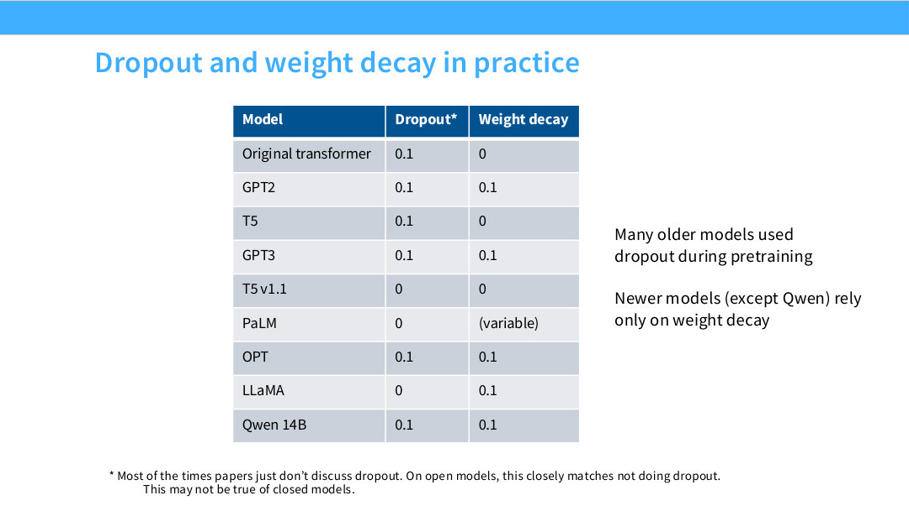

이 페이지는 실제 모델들이 dropout과 weight decay를 어떻게 사용했는지 보여준다. 오래된 모델들, 예를 들어 original Transformer, GPT-2, GPT-3, OPT, Qwen 14B 등은 dropout 0.1을 사용한 사례가 있다.

하지만 newer model들은 pretraining 중 dropout을 사용하지 않는 경우가 많다. LLaMA는 dropout 0, weight decay 0.1을 사용한다. PaLM도 dropout 0으로 제시된다. T5 v1.1은 dropout과 weight decay 모두 0으로 표시된다.

전체 흐름은 older model은 dropout을 더 자주 사용했고, newer open model은 dropout 없이 weight decay에 의존하는 방향으로 이동했다는 것이다. 다만 closed model은 세부 설정이 공개되지 않을 수 있으므로 확정적으로 말하기 어렵다.

---

## Page 50. Why weight decay LLMs?

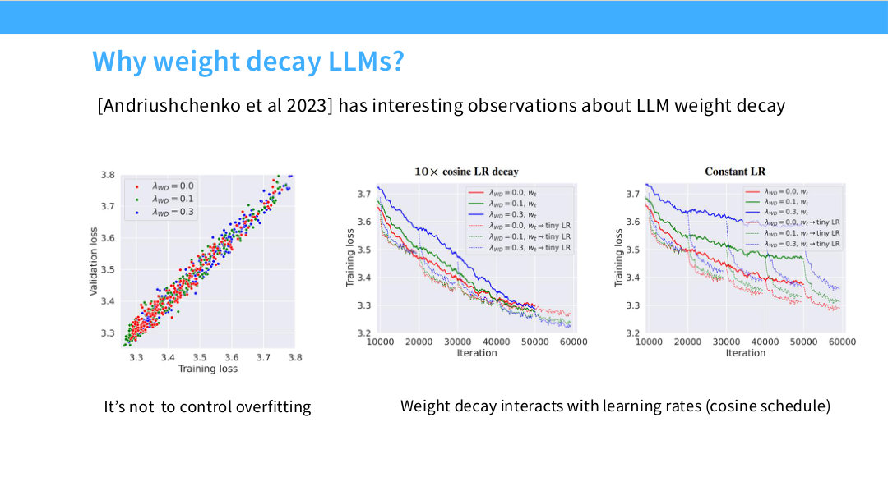

이 페이지는 LLM에서 weight decay가 왜 사용되는지 설명한다. Andriushchenko et al. 2023은 LLM weight decay에 대한 흥미로운 관찰을 제시한다.

핵심은 weight decay가 단순히 overfitting을 제어하기 위한 것만은 아니라는 점이다. 왼쪽 그림은 training loss와 validation loss가 강하게 연결되어 있음을 보여준다. 즉 전통적인 small-data setting처럼 validation만 나빠지는 overfitting 상황과는 다르다.

오른쪽 그림은 weight decay가 learning rate schedule, 특히 cosine decay와 상호작용한다는 점을 보여준다. weight decay는 parameter norm과 update dynamics를 조절하며, 학습 후반부의 optimization trajectory에 영향을 줄 수 있다. 따라서 LLM pretraining에서 weight decay는 regularization이라기보다 **optimizer dynamics 조절 장치**로 보는 것이 더 적절하다.

여기서 **optimizer dynamics**는 optimizer가 학습 중 모델 파라미터를 어떤 방향과 속도로 움직이게 만드는지, 그리고 그 움직임이 step이 진행되면서 어떻게 변하는지를 의미한다. 가장 단순한 SGD를 보면 parameter update는 다음과 같다.

$$
\theta_{t+1}=\theta_t-\eta_t \nabla_\theta L(\theta_t)
$$

이 식에서 $\eta_t$는 learning rate이고, $\nabla_\theta L(\theta_t)$는 현재 loss에 대한 gradient다. 즉 optimizer dynamics는 단순히 “loss를 줄인다”가 아니라, **현재 gradient, learning rate, momentum, weight decay, schedule이 결합되어 parameter가 loss landscape 위에서 실제로 어떤 궤적으로 이동하는가**를 보는 관점이다.

LLM pretraining에서 주로 쓰는 AdamW는 이 dynamics가 더 복잡하다. AdamW는 현재 gradient만 사용하지 않고, gradient의 이동평균과 gradient 제곱의 이동평균을 함께 사용한다.

$$
m_t=\beta_1 m_{t-1}+(1-\beta_1)g_t
$$

$$
v_t=\beta_2 v_{t-1}+(1-\beta_2)g_t^2
$$

그리고 bias correction이 적용된 $\hat{m}_t$, $\hat{v}_t$를 사용해 대략 다음과 같이 parameter를 업데이트한다.

$$
\theta_{t+1}
=
\theta_t
-
\eta_t\frac{\hat{m}_t}{\sqrt{\hat{v}_t}+\epsilon}
-
\eta_t\lambda\theta_t
$$

마지막 항 $-\eta_t\lambda\theta_t$가 AdamW의 decoupled weight decay 항이다. 이 부분만 따로 보면 다음처럼 쓸 수 있다.

$$
\theta_{t+1}=(1-\eta_t\lambda)\theta_t
$$

즉 weight decay는 매 step마다 parameter를 원점 방향으로 조금씩 줄이는 힘처럼 작동한다. 중요한 점은 이 힘의 크기가 $\lambda$만으로 정해지는 것이 아니라, 현재 learning rate $\eta_t$에도 비례한다는 것이다. 따라서 cosine learning rate schedule을 쓰면 학습 초반에는 $\eta_t$가 커서 weight decay 효과가 강하고, 학습 후반에는 $\eta_t$가 작아져 weight decay 효과도 약해진다.

이 관점에서 Page 50의 오른쪽 그림을 보면, weight decay는 validation overfitting을 막는 단순 regularizer라기보다, **learning rate schedule과 함께 parameter norm, update scale, loss 감소 경로를 조절하는 optimization control knob**에 가깝다. 특히 대규모 LM에서는 loss spike, gradient norm 증가, logit scale 증가 같은 불안정성이 실제 학습 비용과 직결되기 때문에, optimizer dynamics를 잘 조절하는 것이 최종 성능과 학습 안정성에 모두 중요하다.

직관적으로 말하면 loss landscape는 산의 지형, gradient는 내려갈 방향, learning rate는 보폭, momentum은 관성, Adam의 $v_t$는 경사 크기에 따른 속도 조절 장치, weight decay는 parameter를 원점 쪽으로 끌어당기는 힘이다. optimizer dynamics는 이 힘들이 합쳐져 모델이 실제로 어떤 경로로 이동하는지를 뜻한다. 그래서 강의의 요지는 “LLM에서도 regularization을 쓰지만, 그 효과는 작은 데이터셋에서의 과적합 방지보다 학습 궤적과 안정성을 조절하는 쪽에 더 가깝다”로 정리할 수 있다.

---

## Page 51. Summary: hyperparameters

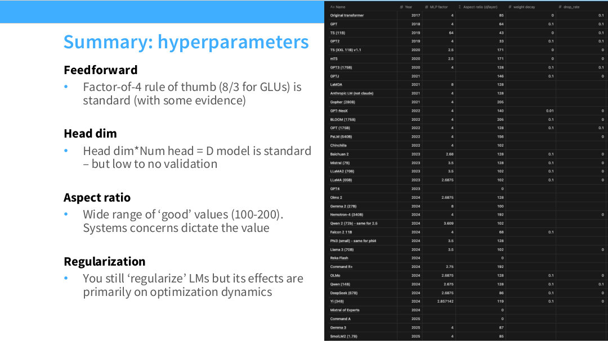

이 페이지는 hyperparameter 논의를 정리한다. feedforward dimension은 일반 FFN에서는 4배, GLU 계열에서는 8/3배가 표준적인 경험칙이다. 이 값들은 여러 현대 LLM에서 반복적으로 검증된 default다.

attention head dimension은 head_dim * num_heads = d_model이 일반적이다. 다만 이 선택은 d_ff ratio만큼 강한 validation evidence가 있는 것은 아니며, 구현과 시스템 효율에서 자연스러운 선택에 가깝다.

aspect ratio는 100~200 근처가 많이 보이지만, 성능상 좋은 값의 범위는 넓다. 그래서 실제 선택은 latency, parallelism, hardware utilization 같은 systems concern이 좌우한다. regularization은 여전히 쓰이지만, 그 효과는 overfitting 방지보다 optimization dynamics 조절에 가깝다.

---

## Page 52. Stability tricks

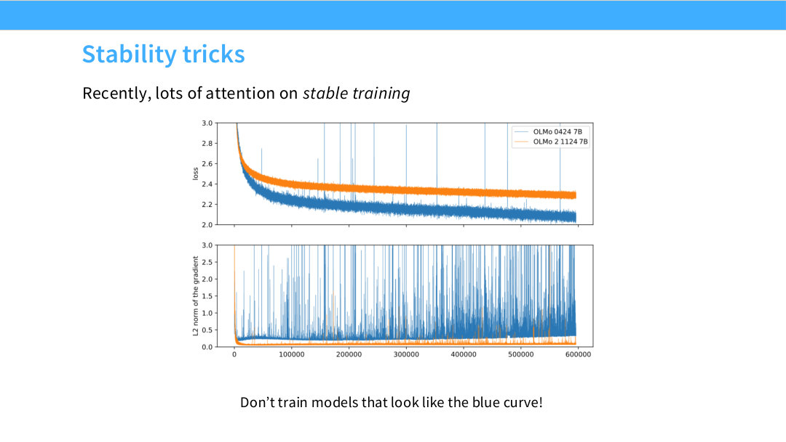

이제 학습 안정화 기법으로 넘어간다. 최근 LLM 학습에서는 loss curve가 매끄럽게 감소하지 않고 spike가 나타나거나, gradient norm이 갑자기 튀거나, 특정 softmax가 불안정해지는 문제가 많이 논의된다.

슬라이드의 파란 곡선은 학습 중 loss와 gradient norm이 크게 흔들리는 나쁜 예시로 보인다. 이런 모델은 최종 성능이 낮아질 뿐 아니라, 중간에 divergence하거나 recovery를 위해 checkpoint rewind, learning rate 조정, data filtering 등이 필요할 수 있다.

대형 모델 학습에서 안정성은 단순 편의가 아니다. 수백만 GPU-hour를 쓰는 pretraining에서 불안정한 run은 엄청난 비용 낭비로 이어진다. 그래서 최근 모델들은 architecture 내부에 안정화 기법을 적극적으로 넣는다.

---

## Page 53. Where do the issues arise? Beware of softmaxes!

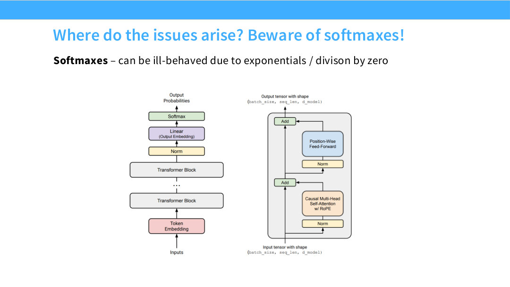

이 페이지는 불안정성이 자주 발생하는 위치로 softmax를 지목한다. softmax는 exponentiation과 normalization division을 포함한다. 입력 logit이 너무 크면 exp가 폭발하고, 분모가 비정상적으로 작거나 크면 numerical instability가 발생할 수 있다.

Transformer에는 softmax가 적어도 두 군데 있다. 하나는 output softmax다. vocabulary 전체에 대한 logits를 확률분포로 바꾼다. 다른 하나는 attention softmax다. query-key dot product score를 attention weight로 변환한다.

따라서 안정화 기법도 이 두 위치에 맞춰 등장한다. output softmax 쪽에는 z-loss, logit soft-capping이 있고, attention softmax 쪽에는 QK norm이 있다. 공통 목표는 softmax에 들어가는 logit scale을 통제하는 것이다.

---

## Page 54. Output softmax stability - the 'z-loss'

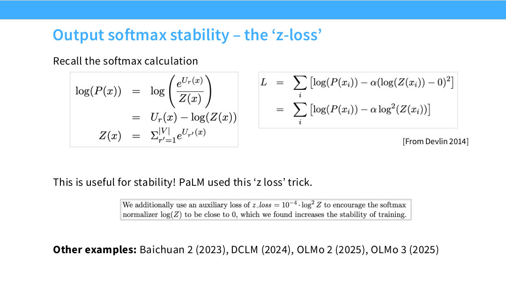

이 페이지는 output softmax에서 발생할 수 있는 불안정성을 줄이기 위한 **z-loss**를 설명한다. 슬라이드에는 Devlin 2014에서 가져온 softmax 식이 있고, 이 식의 핵심 변수인 $Z(x)$를 안정화 대상으로 삼는다는 점이 중요하다.

모델이 context $x$를 보고 vocabulary item $r$에 대해 logit 또는 unnormalized score $U_r(x)$를 출력한다고 하자. softmax 확률은 다음과 같다.

$$
P(r\mid x)=\frac{\exp(U_r(x))}{Z(x)}
$$

여기서 partition function $Z(x)$는 모든 vocabulary logit의 exponential 합이다.

$$
Z(x)=\sum_{r'}\exp(U_{r'}(x))
$$

log probability로 쓰면 다음처럼 된다.

$$
\log P(r\mid x)=U_r(x)-\log Z(x)
$$

cross-entropy 학습에서는 정답 token의 log probability를 높이도록 학습한다. 문제는 모델이 logits의 절대 scale을 계속 키울 수 있다는 점이다. 예를 들어 모든 logit이 큰 양수 방향으로 이동하면 $\exp(U_r)$와 $Z(x)$가 커지고, numerical stability가 나빠질 수 있다. softmax는 max-subtraction 같은 안정화 구현을 사용하더라도, logit scale이 지나치게 커지는 것은 optimization 측면에서 좋지 않다.

z-loss는 $\log Z(x)$가 특정 값, 보통 0 근처에 머물도록 보조 penalty를 추가한다. 개념적으로는 다음과 같은 항을 loss에 더한다.

$$
\mathcal{L}_{z}=\lambda\left(\log Z(x)\right)^2
$$

전체 loss는 다음처럼 볼 수 있다.

$$
\mathcal{L}=\mathcal{L}_{\mathrm{CE}}+\lambda\left(\log Z(x)\right)^2
$$

여기서 $\lambda$는 작은 coefficient다. 이 항은 모델에게 “정답 logit을 높이는 것은 좋지만, 전체 vocabulary logits의 scale을 무한정 키우지는 말라”는 제약을 준다. PaLM은 이 z-loss trick을 안정화를 위해 사용했다고 보고했고, 슬라이드는 Baichuan 2, DCLM, OLMo 2, OLMo 3 같은 다른 모델 사례도 함께 언급한다.

따라서 z-loss는 성능을 직접 올리는 새로운 표현 구조라기보다, **output softmax에 들어가는 logit scale을 제어해 대규모 학습 run을 더 안정적으로 만드는 장치**로 이해하면 된다.

---

## Page 55. Attention softmax stability - the 'QK norm'

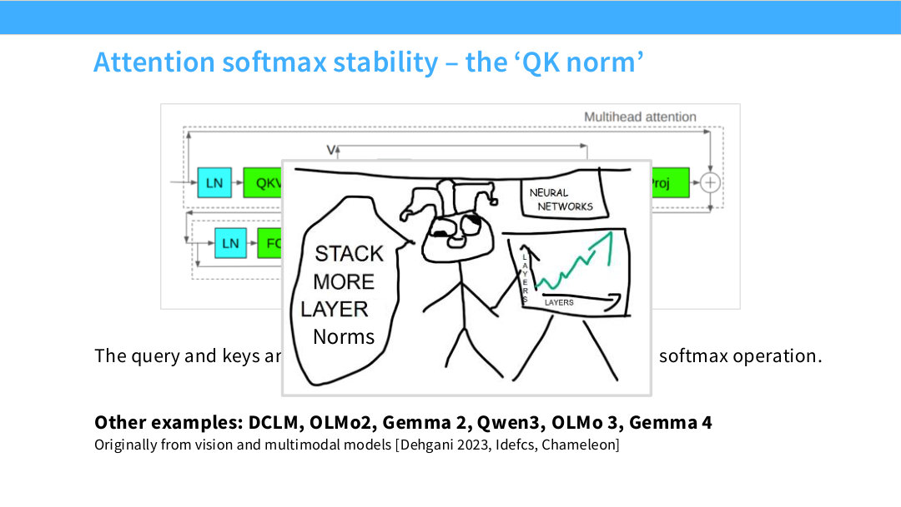

이 페이지는 attention softmax 쪽 안정화 기법인 **QK norm**을 설명한다. 슬라이드 그림은 query와 key가 softmax로 들어가기 전에 norm을 거친다는 점을 보여준다. 핵심은 attention score의 scale이 query/key norm에 직접 의존한다는 것이다.

일반적인 scaled dot-product attention score는 다음과 같다.

$$
S=\frac{QK^\top}{\sqrt{d_k}}
$$

그리고 attention weight는 softmax로 계산된다.

$$
A=\mathrm{softmax}(S)
$$

여기서 한 query vector $q_i$와 key vector $k_j$의 score는 다음이다.

$$
S_{ij}=\frac{q_i^\top k_j}{\sqrt{d_k}}
$$

**dot product는 두 벡터의 크기에 영향을 받는다.**

$$
q_i^\top k_j=\|q_i\|\|k_j\|\cos\theta_{ij}
$$

따라서 $\|q_i\|$ 또는 $\|k_j\|$가 커지면, 실제 semantic similarity가 크게 달라지지 않아도 attention logit이 커질 수 있다. attention logit이 너무 커지면 softmax는 거의 one-hot에 가까워진다.

$$
\mathrm{softmax}([0,0,20])\approx[0,0,1]
$$

이렇게 attention이 지나치게 sharp해지면 특정 token에 attention이 과도하게 몰리고, gradient가 불안정해질 수 있다. QK norm은 query와 key를 dot product하기 전에 RMSNorm 또는 LayerNorm으로 정규화해 norm scale을 통제한다.

$$
\tilde{Q}=\mathrm{Norm}(Q)
$$

$$
\tilde{K}=\mathrm{Norm}(K)
$$

$$
S=\frac{\tilde{Q}\tilde{K}^\top}{\sqrt{d_k}}
$$

이렇게 하면 attention score는 query/key vector의 크기 폭발보다 방향 정보와 상대적 관계에 더 의존하게 된다. 슬라이드는 DCLM, OLMo2, Gemma 2, Qwen3, OLMo 3, Gemma 4 같은 모델에서 QK norm이 사용된다고 언급한다. 원래 vision과 multimodal 모델에서 온 안정화 아이디어가 language model로 들어온 사례다.

정리하면 QK norm은 attention mechanism 자체를 바꾸는 것이 아니라, **attention softmax에 들어가기 전의 logit scale을 안정화하는 방법**이다. z-loss가 output softmax 쪽 scale을 다룬다면, QK norm은 attention softmax 쪽 scale을 다룬다.

---

## Page 56. Logit soft-capping

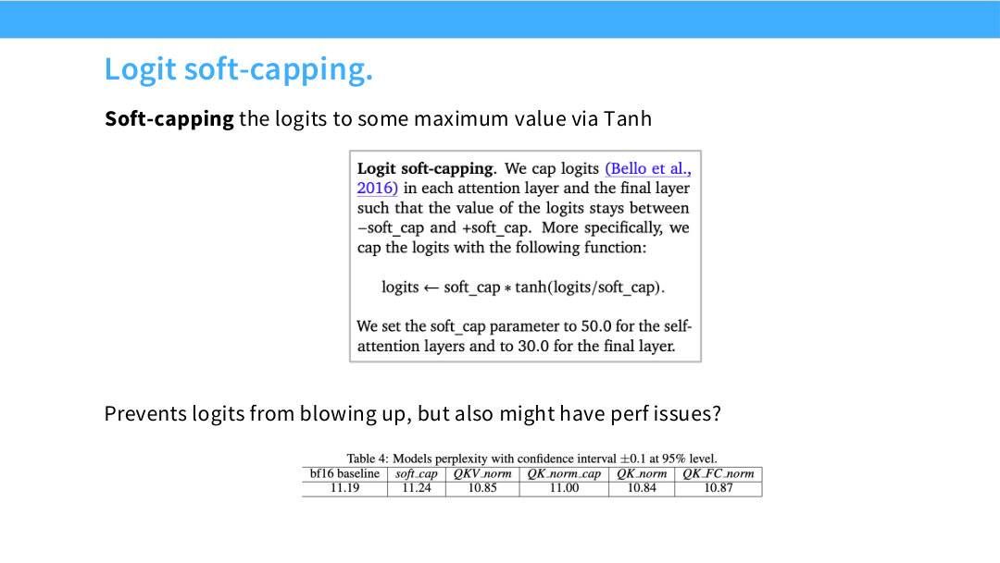

이 페이지는 또 다른 softmax 안정화 방법인 **logit soft-capping**을 설명한다. 이름 그대로 logit이 너무 커지지 않도록 제한하지만, hard clipping처럼 갑자기 잘라내지 않고 $\tanh$를 사용해 부드럽게 제한한다.

대표적인 형태는 다음이다.

$$
\tilde{z}=s\cdot \tanh\left(\frac{z}{s}\right)
$$

여기서 $z$는 원래 logit이고, $s$는 soft cap 값이다. $\tanh(u)$는 $u$가 커질수록 1에 가까워지고, 작아질수록 -1에 가까워진다. 따라서 변환된 logit $\tilde{z}$는 대략 다음 범위 안에 머무른다.

$$
-s < \tilde{z} < s
$$

예를 들어 $s=30$이고 logit이 $z=300$이라면,

$$
\tilde{z}=30\tanh(10)\approx30
$$

즉 매우 큰 logit도 softmax에 들어가기 전에는 약 30 근처로 눌린다. 반대로 logit이 작은 범위에 있을 때는 $\tanh(z/s)\approx z/s$이므로 거의 원래 값을 유지한다.

$$
|z|\ll s \quad \Rightarrow \quad s\tanh(z/s)\approx z
$$

이 점이 hard clipping과의 차이다. hard clipping은 threshold를 넘는 순간 gradient가 급격히 끊길 수 있지만, soft-capping은 부드럽게 saturation된다. 그래서 안정성 측면에서는 유리할 수 있다.

다만 슬라이드가 적은 것처럼 performance issue가 있을 수 있다. logit을 제한한다는 것은 모델이 특정 token에 매우 높은 확신을 표현하는 능력도 제한한다는 뜻이다. 따라서 soft-capping은 instability를 줄이는 대신, 필요할 때 sharp distribution을 만들기 어렵게 할 수 있다.

이 기법은 output logits 또는 attention logits 양쪽에 적용될 수 있다. 핵심은 softmax에 들어가기 전 logit scale을 제어하는 것이다. z-loss가 loss-level regularization이라면, logit soft-capping은 forward computation 자체에서 logit range를 제한하는 방법이다.

---

## Page 57. Attention heads

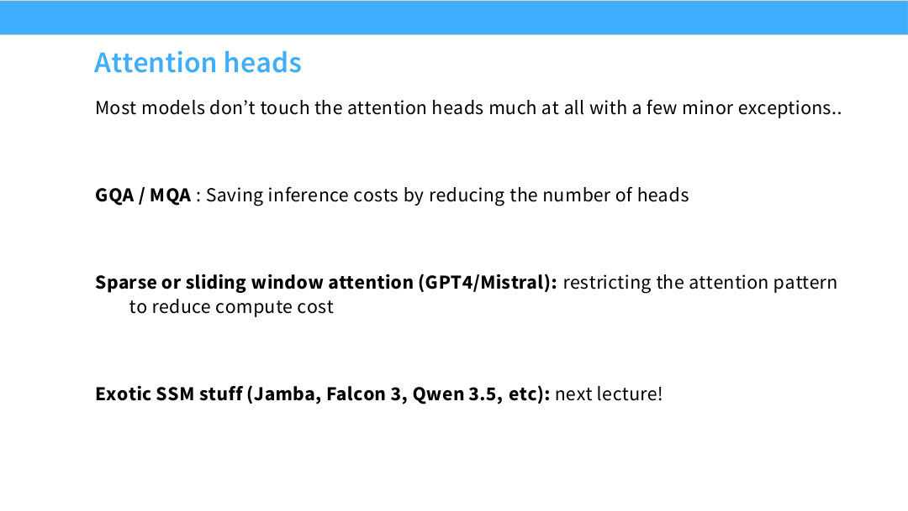

이 페이지는 지금까지 다룬 normalization, activation, position embedding, hyperparameter 논의에서 **attention head 자체의 변형**으로 넘어가는 전환점이다. 슬라이드의 첫 문장은 “대부분의 모델은 attention head를 크게 건드리지 않는다”는 것이다. 즉, 현대 LLM들은 LayerNorm을 RMSNorm으로 바꾸거나, ReLU를 SwiGLU로 바꾸거나, positional embedding을 RoPE로 바꾸는 식의 변화는 많이 주지만, multi-head attention이라는 기본 골격 자체는 대체로 유지한다.

하지만 슬라이드는 “몇 가지 minor exception”을 바로 제시한다. 첫 번째가 **GQA / MQA**다. 이들은 attention의 query head 수는 유지하되, key/value head 수를 줄여서 inference cost를 줄이는 방법이다. 여기서 중요한 비용은 학습 시 FLOPs보다 **추론 중 KV cache를 읽고 쓰는 비용**이다. autoregressive decoding에서는 매 step마다 이전 token들의 key/value를 메모리에서 읽어와야 하므로, key/value head 수를 줄이면 memory bandwidth 병목을 크게 완화할 수 있다. 뒤 페이지 58~63이 바로 이 내용을 수식과 그림으로 자세히 설명한다.

두 번째 예외는 **sparse attention 또는 sliding-window attention**이다. full attention은 모든 token pair에 대해 attention score를 계산하므로 sequence length가 $n$일 때 attention matrix가 $n\times n$ 크기가 된다. 따라서 attention score 계산과 메모리 사용량이 대략 $O(n^2)$로 증가한다. GPT-4, Mistral, GPT-OSS, Gemma 계열처럼 긴 context를 다루는 모델은 모든 layer에서 항상 full attention을 쓰기보다, 일부 layer 또는 일부 token 범위에만 attention을 허용하는 구조를 사용한다. 뒤 페이지 64~66이 이 sparse/sliding-window attention과 interleaved attention을 설명한다.

세 번째로 슬라이드는 **exotic SSM stuff**를 언급한다. Jamba, Falcon 3, Qwen 3.5 같은 모델은 attention만 쓰지 않고 SSM(State Space Model) 또는 hybrid attention 구조를 섞는 방향을 탐색한다. 다만 이 강의에서는 이를 깊게 다루지 않고 다음 강의 주제로 넘긴다. 따라서 Page 57의 역할은 분명하다. “attention head 자체는 보통 크게 바꾸지 않지만, inference cost와 long-context cost 때문에 key/value head 수와 attention pattern을 바꾸는 흐름이 중요해졌다”는 문제의식을 제시하는 페이지다.

정리하면, 이 페이지의 세 가지 키워드는 다음이다.

- **GQA / MQA**: key/value head 수를 줄여 KV cache와 decoding cost를 줄인다.
- **Sparse / sliding-window attention**: attention pattern을 제한해 long-context의 $O(n^2)$ 비용을 줄인다.
- **SSM / hybrid models**: attention 이외의 sequence modeling 구조와 결합하는 최근 흐름이다.

---

## Page 58. GQA/MQA - Reducing attention head cost
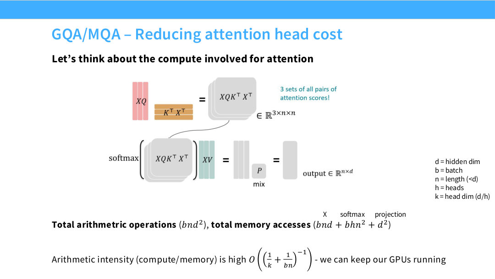

이 페이지는 뒤에서 나올 **MQA(Multi-Query Attention)** 와 **GQA(Grouped-Query Attention)** 를 설명하기 위한 준비 단계다. 바로 MQA/GQA로 들어가지 않고, 먼저 일반적인 **multi-head attention(MHA)** 이 full-sequence 상황에서 어떤 compute와 memory access 구조를 갖는지 계산한다. 슬라이드 제목의 “reducing attention head cost”는 결국 attention head가 많아질수록 특히 key/value 쪽 memory movement가 커지므로, 이를 어떻게 줄일 것인가로 이어진다.

슬라이드 오른쪽에는 기호가 정리되어 있다.

- $d$: hidden dimension, 즉 residual stream의 feature 차원
- $b$: batch size
- $n$: sequence length, 슬라이드에서는 보통 $n<d$인 상황을 가정한다.
- $h$: attention head 수
- $k$: head dimension이며 보통 $k=d/h$이다.

입력 hidden state는 다음과 같이 볼 수 있다.

$$
X\in\mathbb{R}^{b\times n\times d}
$$

일반 multi-head attention에서는 먼저 $X$를 query, key, value로 projection한다.

$$
Q=XW_Q,\qquad K=XW_K,\qquad V=XW_V
$$

각 projection matrix는 단순화하면 다음 크기를 갖는다.

$$
W_Q,W_K,W_V\in\mathbb{R}^{d\times d}
$$

head를 나누면 $Q,K,V$는 다음처럼 해석된다.

$$
Q,K,V\in\mathbb{R}^{b\times h\times n\times k},
\qquad d=hk
$$

슬라이드 중앙 그림은 이 흐름을 압축해서 보여준다. 왼쪽의 $X$에서 projection을 거쳐 $Q,K,V$가 만들어지고, 위쪽 경로에서는 $QK^\top$로 모든 query-token과 key-token 사이의 attention score를 만든다. 각 head에서 attention score는 다음 shape을 갖는다.

$$
S=QK^\top\in\mathbb{R}^{b\times h\times n\times n}
$$

여기서 $n\times n$이 나오는 이유는 sequence 안의 모든 query position이 모든 key position을 보기 때문이다. 즉 full attention은 token pair 전체를 다룬다. 그다음 score에 softmax를 적용하고 value와 곱한다.

$$
A=\operatorname{softmax}\left(\frac{QK^\top}{\sqrt{k}}\right)
$$

$$
O=AV
$$

마지막으로 head들을 합친 뒤 output projection을 적용한다. 그림의 “projection”은 이런 Q/K/V projection과 output projection을 포함한 dense linear 연산들을 가리킨다고 보면 된다.

---

슬라이드 하단의 첫 번째 계산은 arithmetic operations, 즉 계산량이다.

$$
\text{Total arithmetic operations}\approx bnd^2
$$

이 항이 나오는 가장 큰 이유는 projection 비용이다. 예를 들어 $XW_Q$ 하나만 보아도,

$$
X\in\mathbb{R}^{b\times n\times d},\qquad W_Q\in\mathbb{R}^{d\times d}
$$

이므로 대략 $bnd^2$ 규모의 multiply-add가 필요하다. 실제 attention block에는 $Q,K,V$ 세 개 projection과 output projection이 있으므로 constant factor는 더 붙는다. 하지만 강의에서는 resource accounting의 큰 구조를 보기 위해 constant factor를 생략하고 $O(bnd^2)$로 본다.

물론 attention score 계산도 비용이 있다. 각 head에서 $QK^\top$는 다음 비용을 갖는다.

$$
O(bhn^2k)=O(bn^2d)
$$

왜냐하면 $h k=d$이기 때문이다. 그런데 이 페이지는 $n<d$인 regime을 가정하므로, projection 비용 $bnd^2$가 attention score 비용 $bn^2d$보다 더 큰 항으로 볼 수 있다.

$$
\frac{bnd^2}{bn^2d}=\frac{d}{n}
$$

따라서 $d>n$이면 dense projection 쪽이 지배적이고, 슬라이드는 전체 arithmetic operations를 대표적으로 $bnd^2$로 쓴다.

---

다음은 memory accesses다. 슬라이드는 다음처럼 쓴다.

$$
\text{Total memory accesses}\approx bnd+bhn^2+d^2
$$

각 항의 의미를 나눠 보면 더 이해하기 쉽다.

첫 번째 항은 activation을 읽고 쓰는 비용이다.

$$
bnd
$$

입력 $X$, 중간 hidden state, output 등은 모두 대략 $b\times n\times d$ 규모의 activation이다. 실제로는 Q/K/V와 output까지 여러 tensor가 있지만, 여기서는 constant factor를 생략해 $bnd$로 묶어 본다.

두 번째 항은 attention score 또는 attention probability matrix와 관련된 비용이다.

$$
bhn^2
$$

각 batch와 각 head마다 $n\times n$ attention score가 생기므로 전체 구조는 $b\times h\times n\times n$이다. FlashAttention 같은 구현에서는 이 $n^2$ matrix를 HBM에 완전히 저장하지 않도록 최적화하지만, full attention이 본질적으로 모든 token pair를 다룬다는 점은 이 항으로 드러난다.

세 번째 항은 weight matrix를 읽는 비용이다.

$$
d^2
$$

$W_Q,W_K,W_V,W_O$ 같은 projection weight는 각각 대략 $d\times d$ 크기다. 실제로는 여러 개가 있으므로 constant factor가 붙지만, 큰 차원 의존성은 $d^2$로 볼 수 있다.

---

이제 arithmetic intensity를 계산한다. Arithmetic intensity는 “메모리에서 데이터를 한 단위 옮길 때 얼마나 많은 계산을 하는가”를 나타낸다.

$$
\text{Arithmetic intensity}
=
\frac{\text{arithmetic operations}}{\text{memory accesses}}
$$

슬라이드의 값을 그대로 넣으면 대략 다음 비율을 본다.

$$
\frac{bnd^2}{bnd+bhn^2+d^2}
$$

이 식을 왜 슬라이드처럼

$$
O\left(\left(\frac{1}{k}+\frac{1}{bn}\right)^{-1}\right)
$$

로 볼 수 있는지 보자. 먼저 compute 항 $bnd^2$로 denominator의 각 항을 나누면,

$$
\frac{bnd+bhn^2+d^2}{bnd^2}
=
\frac{1}{d}+\frac{hn}{d^2}+\frac{1}{bn}
$$

여기서 $h=d/k$를 대입하면,

$$
\frac{hn}{d^2}
=
\frac{(d/k)n}{d^2}
=
\frac{n}{kd}
$$

그리고 이 페이지는 $n<d$를 가정하므로 $n/d<1$이다. 따라서 attention score 쪽 memory 항은 대략 $1/k$보다 작거나 같은 규모로 볼 수 있다.

$$
\frac{n}{kd}<\frac{1}{k}
$$

또 $1/d$ 항은 보통 큰 $d$에서 작기 때문에 지배적인 직관을 위해 생략하면, denominator는 대략 다음 구조로 이해할 수 있다.

$$
\frac{1}{k}+\frac{1}{bn}
$$

따라서 arithmetic intensity는 다음처럼 요약된다.

$$
\text{Arithmetic intensity}
\approx
O\left(\left(\frac{1}{k}+\frac{1}{bn}\right)^{-1}\right)
$$

이 표현은 정확한 등식이라기보다, 어떤 값들이 full-sequence attention의 efficiency를 결정하는지 보여주는 근사다. $k$가 크고, batch와 sequence를 함께 처리하는 $bn$이 크면 denominator가 작아지고, arithmetic intensity는 커진다.

예를 들어 $k=128$, $b=8$, $n=2048$이면,

$$
\frac{1}{k}\approx 0.0078,
\qquad
\frac{1}{bn}\approx 0.000061
$$

따라서

$$
\left(\frac{1}{k}+\frac{1}{bn}\right)^{-1}
\approx 127
$$

정도의 scale이 된다. 이는 데이터를 한 번 가져왔을 때 꽤 많은 계산을 수행할 수 있다는 뜻이다.

그래서 슬라이드의 마지막 문장처럼:

$$
\text{we can keep our GPUs running}
$$

즉 full-sequence attention, training, prefill 단계에서는 큰 matrix multiplication이 많기 때문에 GPU tensor core를 비교적 잘 바쁘게 만들 수 있다. 이 상황은 대체로 compute를 많이 포함하므로 arithmetic intensity가 높다.

하지만 이 페이지의 결론은 “attention은 아무 문제가 없다”가 아니다. 정확한 결론은 다음이다.

**full-sequence attention에서는 계산량도 크고 병렬성도 커서 GPU를 잘 활용할 수 있다. 그러나 text generation처럼 token을 하나씩 생성하는 incremental decoding으로 가면, 같은 attention이라도 계산량은 줄고 KV cache memory access가 두드러져 병목 구조가 완전히 달라진다.**

그래서 다음 페이지에서 KV cache와 incremental generation을 설명하고, 그 다음에 MQA/GQA가 왜 필요한지로 이어진다.

---

## Page 59. GQA/MQA - Incremental generation and KV cache

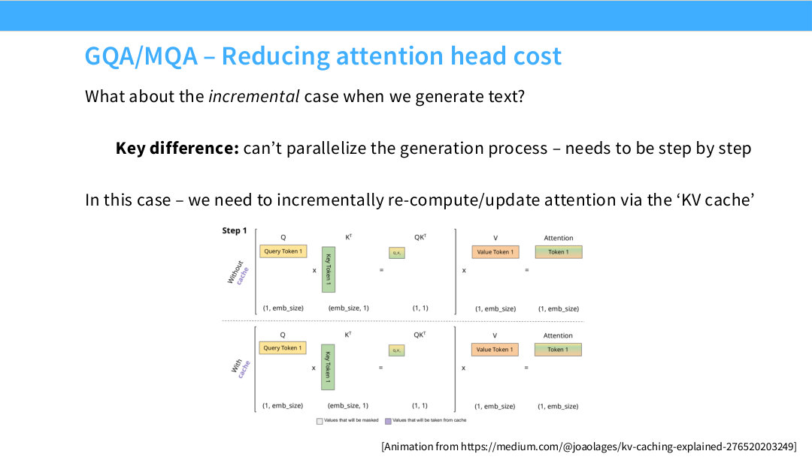

이 페이지는 text generation의 **incremental case**를 설명한다. 슬라이드의 질문은 “우리가 text를 generate할 때는 어떻게 되는가?”이다. Page 58은 prompt 전체 또는 training batch처럼 sequence를 한 번에 처리하는 경우였다. 하지만 실제 LLM serving에서는 사용자가 입력한 prompt를 읽은 뒤, 답변을 한 token씩 생성한다.

슬라이드의 핵심 문장은 다음이다.

**generation process는 병렬화할 수 없고, step by step으로 진행되어야 한다.**

Autoregressive language model은 다음 분포를 순차적으로 샘플링한다.

$$
y_t\sim p(y_t\mid x_1,\dots,x_n,y_1,\dots,y_{t-1})
$$

즉 $y_t$를 만들려면 이전 출력 $y_1,\dots,y_{t-1}$이 먼저 존재해야 한다. 그래서 training처럼 정답 sequence가 이미 주어진 상태에서는 여러 position을 병렬 처리할 수 있지만, generation에서는 아직 미래 token을 모르기 때문에 token dimension으로 병렬화할 수 없다.

슬라이드 중앙 그림은 KV cache가 없을 때와 있을 때를 비교한다. 위쪽 “without cache”에서는 query token 하나가 key token과 곱해져 attention을 만들고, value token을 곱해 output을 만든다. 아래쪽 “with cache”에서는 이전 step에서 계산해 둔 key/value를 cache에서 가져와 재사용한다. 그림 아래에는 shape도 표시되어 있다. query token은 대략 $(1,\mathrm{emb\_size})$, key는 $(\mathrm{emb\_size},1)$, attention score는 $(1,1)$, value는 $(1,\mathrm{emb\_size})$ 형태로 표현된다.

prefill 단계에서는 prompt의 모든 token에 대해 key/value를 미리 계산한다.

$$
K_{1:n}=[K_1,K_2,\dots,K_n]
$$

$$
V_{1:n}=[V_1,V_2,\dots,V_n]
$$

그 뒤 decode step $t$에서 새 token이 들어오면, 새 query $q_t$만 계산하고 이전 key/value는 cache에서 읽는다.

$$
\alpha_t
=
\operatorname{softmax}\left(\frac{q_tK_{\le t}^{\top}}{\sqrt{k}}\right)
$$

$$
o_t=\alpha_tV_{\le t}
$$

KV cache의 장점은 명확하다. 이전 token들의 $K,V$를 매번 다시 계산하지 않아도 된다. 그러나 동시에 새로운 병목이 생긴다. decode step마다 $K_{\le t}$와 $V_{\le t}$를 메모리에서 읽어야 한다. sequence가 길수록 cache도 길어지고, head 수가 많을수록 cache도 커진다.

따라서 이 페이지의 결론은 “KV cache는 decoding을 가능하게 만드는 핵심 최적화지만, 긴 context에서는 KV cache 자체가 memory bandwidth 병목이 된다”는 것이다. 이 문제를 해결하려는 대표적인 방법이 다음 페이지들에서 다루는 MQA와 GQA다.

---

## Page 60. GQA/MQA - Incremental arithmetic intensity

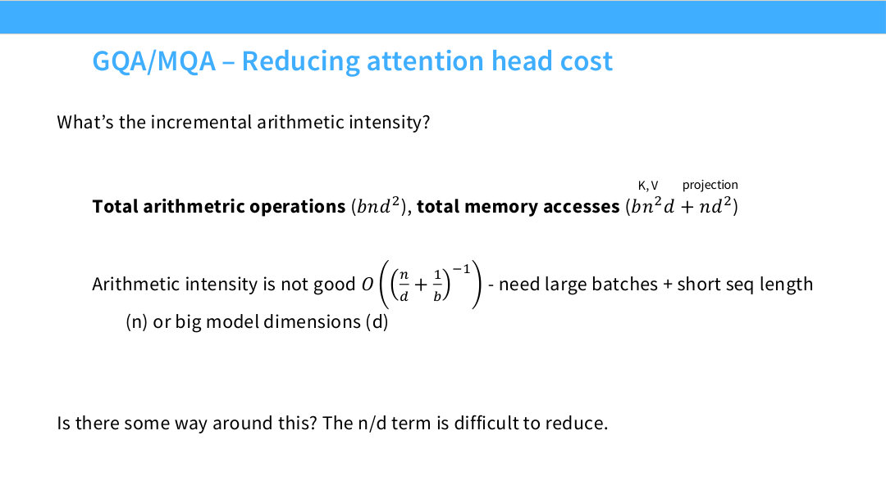

이 페이지는 incremental decoding에서 arithmetic intensity가 왜 나빠지는지 수식으로 보여준다. 슬라이드의 제목은 Page 58과 같지만, 본문 질문이 바뀐다.

**What’s the incremental arithmetic intensity?**

즉, 전체 sequence를 한꺼번에 처리하는 prefill/training이 아니라, token을 하나씩 생성하는 decode 상황에서 compute/memory 비율이 어떻게 되는지를 묻는다.

슬라이드는 전체 arithmetic operations를 다음처럼 둔다.

$$
\text{Total arithmetic operations}\approx bnd^2
$$

여기서 $n$은 생성 과정에서 누적되는 sequence length 또는 전체 decode 길이로 볼 수 있다. 각 step마다 projection과 attention 계산이 필요하고, projection 쪽의 dense matmul 비용을 대표적으로 $bnd^2$로 잡는다.

하지만 memory access는 Page 58과 다르게 다음처럼 나타난다.

$$
\text{Total memory accesses}\approx bn^2d+nd^2
$$

슬라이드 위에는 첫 번째 항에 $K,V$, 두 번째 항에 projection이라고 표시되어 있다. 즉 두 항의 의미는 다음과 같다.

$$
bn^2d
$$

이 항은 decoding 중 KV cache를 반복적으로 읽는 비용을 나타낸다. decode step이 진행될수록 현재 token은 이전 token 전체의 key/value를 attend해야 한다. 첫 step에서는 짧은 cache를 읽지만, 뒤로 갈수록 긴 cache를 읽는다. 전체 $n$ step에 대해 누적하면 대략 $n^2$ 구조가 생긴다.

$$
nd^2
$$

이 항은 projection weight를 읽는 비용이다. 각 token step마다 Q/K/V projection과 output projection에 필요한 weight를 읽고 연산해야 하므로, 전체적으로 $n$번 반복된다.

이제 arithmetic intensity는 다음처럼 계산된다.

$$
\text{AI}
\approx
\frac{bnd^2}{bn^2d+nd^2}
$$

분자와 분모를 $bnd^2$로 나누면 다음과 같은 형태가 된다.

$$
\text{AI}
\approx
\left(\frac{n}{d}+\frac{1}{b}\right)^{-1}
$$

슬라이드도 동일하게 다음 형태를 제시한다.

$$
O\left(\left(\frac{n}{d}+\frac{1}{b}\right)^{-1}\right)
$$

이 식이 말하는 바는 중요하다. arithmetic intensity를 높이려면 $n/d$가 작거나 $1/b$가 작아야 한다. 즉 다음 조건이 유리하다.

- sequence length $n$이 짧다.
- model dimension $d$가 크다.
- batch size $b$가 크다.

슬라이드도 “large batches + short seq length $(n)$ or big model dimensions $(d)$”가 필요하다고 적는다. 하지만 실제 serving에서는 이 조건을 마음대로 만족시키기 어렵다. 긴 context를 지원하려면 $n$은 커질 수밖에 없고, latency 요구사항 때문에 batch size $b$도 무한정 키울 수 없다. model dimension $d$는 모델이 정해지면 바꾸기 어렵다.

그래서 마지막 문장이 중요하다.

**Is there some way around this? The $n/d$ term is difficult to reduce.**

즉, sequence length $n$이 만드는 KV cache 비용은 구조적으로 줄이기 어렵다. 그렇다면 다른 방향으로 접근해야 한다. Page 61의 MQA는 바로 이 질문에 대한 답이다. $n$ 자체를 줄이는 대신, 각 token마다 저장하고 읽어야 하는 key/value의 차원을 줄인다.

---

## Page 61. MQA - just have fewer key dimensions

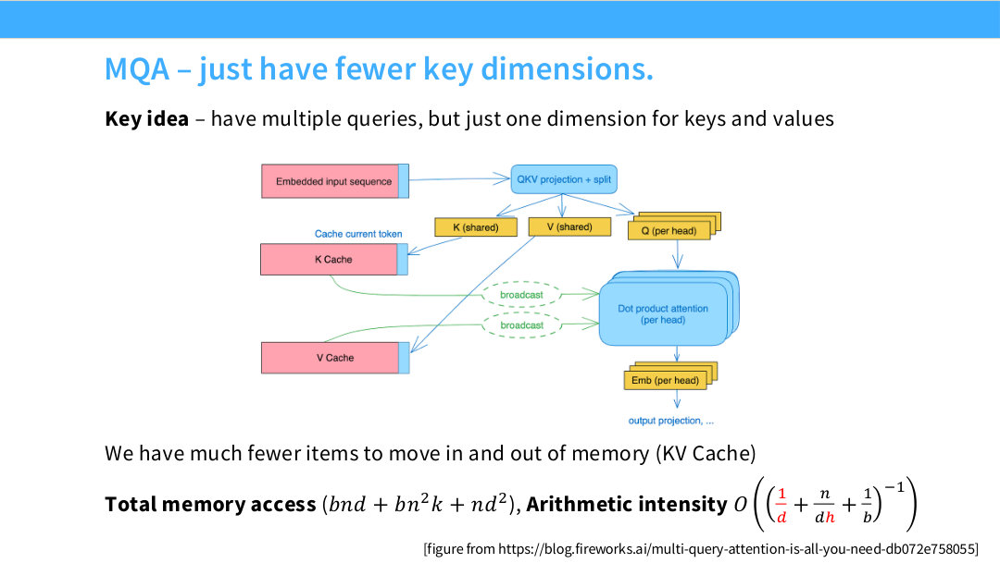

이 페이지는 **MQA(Multi-Query Attention)의 핵심 아이디어를 설명한다. 슬라이드 제목은 “just have fewer key dimensions”이고, 본문에는 “multiple queries, but just one dimension for keys and values”라고 되어 있다. 표현을 조금 더 정확히 하면, query head는 여러 개 유지하지만 key/value head는 하나만 두고 모든 query head가 이를 공유한다는 뜻이다.

일반 MHA에서는 head마다 query, key, value가 모두 따로 있다.

$$
Q_i=XW_Q^{(i)},\quad K_i=XW_K^{(i)},\quad V_i=XW_V^{(i)}
$$

$$
i=1,\dots,h
$$

따라서 decoding 중 저장해야 하는 KV cache는 head 수 $h$에 비례한다.

$$
\text{KV cache}_{\mathrm{MHA}}
\propto
2\cdot b\cdot n\cdot h\cdot k
$$

여기서 2는 key와 value 두 종류를 의미한다. $d=hk$이므로 다음처럼 볼 수 있다.

$$
\text{KV cache}_{\mathrm{MHA}}
\propto
2bnd
$$

MQA에서는 query는 head별로 유지하지만 key와 value는 공유한다.

$$
Q_i=XW_Q^{(i)},\quad K=XW_K,\quad V=XW_V
$$

$$
o_i
=
\operatorname{softmax}\left(\frac{Q_iK^\top}{\sqrt{k}}\right)V
$$

슬라이드 그림을 보면, embedded input sequence가 QKV projection을 통과한 뒤 $Q$는 “per head”로 여러 개 만들어지고, $K$와 $V$는 “shared”로 하나만 만들어진다. 이 shared $K,V$가 K cache와 V cache에 저장되고, 여러 query head로 broadcast된다. 그림의 점선 “broadcast”는 바로 이 공유를 나타낸다. 즉 head마다 다른 K/V를 읽는 것이 아니라, 하나의 K/V cache를 여러 query head가 함께 사용한다.

MQA의 KV cache 크기는 다음처럼 줄어든다.

$$
\text{KV cache}_{\mathrm{MQA}}
\propto
2\cdot b\cdot n\cdot 1\cdot k
=
2bnk
$$

MHA와 비교하면 대략 $h$배 작다.

$$
\frac{\text{KV cache}_{\mathrm{MHA}}}{\text{KV cache}_{\mathrm{MQA}}}
\approx
h
$$

예를 들어 $h=32$라면, MQA는 K/V cache를 약 32분의 1 수준으로 줄일 수 있다. decode phase가 memory-bound인 이유가 KV cache read 때문이라는 점을 생각하면, 이 감소는 inference throughput에 매우 직접적인 이득을 준다.

슬라이드 하단의 resource accounting도 이 점을 반영한다. MQA의 total memory access는 다음처럼 표시된다.

$$
\text{Total memory access}
\approx
bnd+bn^2k+nd^2
$$

Page 60의 일반 MHA에서는 KV cache 관련 항이 $bn^2d$였는데, MQA에서는 $d$ 대신 $k$가 들어간다.

$$
bn^2d\quad\rightarrow\quad bn^2k
$$

그리고 $k=d/h$이므로, KV cache read 항이 대략 $h$배 줄어든다. 슬라이드의 arithmetic intensity는 다음과 같이 주어진다.

$$
O\left(\left(\frac{1}{d}+\frac{n}{dh}+\frac{1}{b}\right)^{-1}\right)
$$

여기서 중요한 변화는 Page 60의 $n/d$ 항이 MQA에서는 $n/(dh)$로 작아졌다는 점이다. 즉 head 수 $h$만큼 KV cache 관련 병목이 완화된다.

하지만 MQA에는 trade-off가 있다. 모든 query head가 같은 key/value representation을 공유하므로, head마다 서로 다른 key/value subspace를 갖는 MHA보다 표현력이 줄어들 수 있다. 따라서 MQA는 inference efficiency를 크게 얻는 대신, 품질 손실 가능성을 감수하는 설계다. 이 trade-off는 Page 63에서 empirical result로 다시 확인한다.

---

## Page 62. Additional extensions - GQA

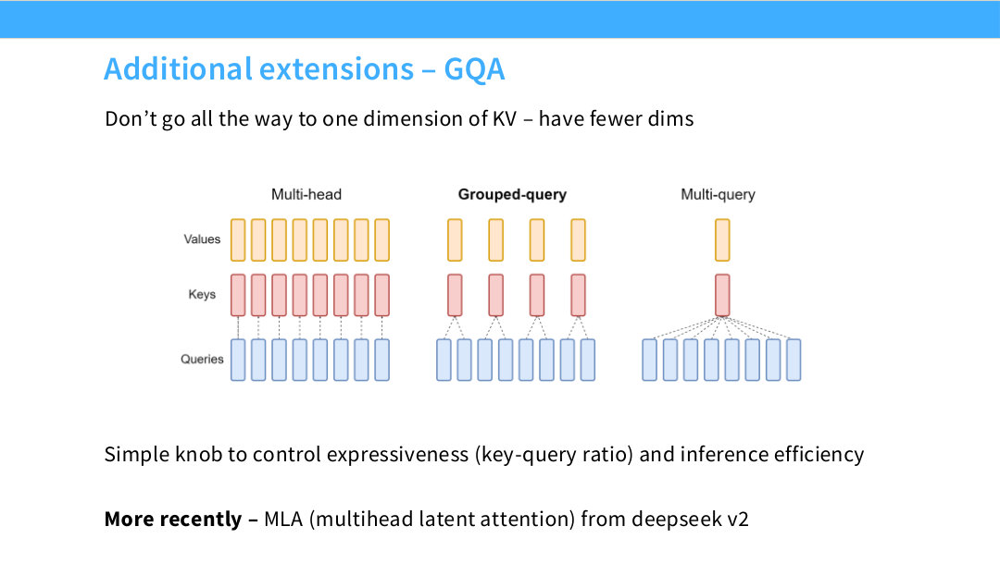

이 페이지는 MQA의 더 실용적인 확장인 **GQA(Grouped-Query Attention)를 설명한다. 슬라이드의 첫 문장은 “KV를 완전히 하나로 줄이지 말고, 더 적은 수의 K/V dimension을 갖자”는 것이다. 즉 MQA처럼 모든 query head가 하나의 K/V를 공유하는 극단으로 가지 않고, 여러 query head를 몇 개의 group으로 나누어 group마다 K/V를 공유하게 만든다.

슬라이드 중앙 그림은 세 구조를 나란히 비교한다.

왼쪽 **Multi-head**에서는 query, key, value head 수가 모두 같다. 각 query head가 자기 key/value head와 대응된다.

$$
h_q=h_{kv}
$$

오른쪽 **Multi-query**에서는 query head는 여러 개지만 key/value head는 하나뿐이다.

$$
h_{kv}=1
$$

가운데 **Grouped-query**에서는 query head 여러 개가 하나의 K/V head를 공유하는 group을 이룬다.

$$
1<h_{kv}<h_q
$$

예를 들어 query head 수가 $h_q=32$이고 K/V head 수가 $h_{kv}=8$이라면, query head 4개가 하나의 K/V head를 공유한다.

$$
\text{group size}=\frac{h_q}{h_{kv}}=\frac{32}{8}=4
$$

GQA의 KV cache 크기는 $h_{kv}$에 비례한다.

$$
\text{KV cache}_{\mathrm{GQA}}
\propto
2\cdot b\cdot n\cdot h_{kv}\cdot k
$$

MHA 대비 KV cache 비율은 다음과 같다.

$$
\frac{\text{KV cache}_{\mathrm{GQA}}}{\text{KV cache}_{\mathrm{MHA}}}
=
\frac{h_{kv}}{h_q}
$$

위 예시에서는 $h_{kv}/h_q=8/32=1/4$이므로 KV cache를 약 4분의 1로 줄인다. MQA처럼 32분의 1까지 줄이지는 않지만, query head마다 어느 정도 다양한 K/V representation을 유지할 수 있다.

슬라이드 하단의 문장처럼 GQA는 **expressiveness와 inference efficiency를 조절하는 간단한 knob**이다. $h_{kv}$를 줄이면 decoding 속도와 memory efficiency는 좋아지지만 표현력이 줄 수 있다. $h_{kv}$를 늘리면 MHA에 가까워져 표현력은 좋아지지만 KV cache 비용이 커진다.

슬라이드는 마지막에 DeepSeek V2의 **MLA(Multihead Latent Attention)도 언급한다. MLA는 단순히 K/V head 수를 줄이는 것보다 더 나아가, key/value 정보를 latent representation으로 압축해 KV cache를 더 효율적으로 다루려는 방법이다. 따라서 Page 62의 흐름은 MHA → MQA → GQA → MLA로 이어지는 “KV cache를 줄이기 위한 설계 공간”을 보여준다고 볼 수 있다.

---

## Page 63. Does MQA hurt? Sometimes

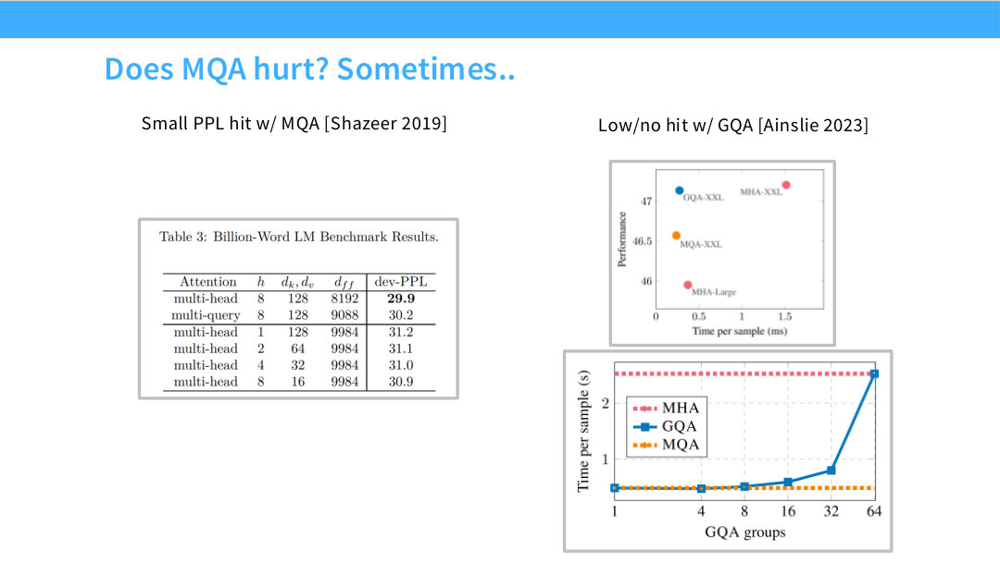

이 페이지는 MQA와 GQA의 empirical trade-off를 보여준다. 슬라이드 제목은 “Does MQA hurt? Sometimes..”이다. 즉 MQA는 KV cache를 크게 줄여 inference에는 유리하지만, 성능 손실이 전혀 없는 것은 아니라는 점을 강조한다.

왼쪽 표는 Shazeer 2019의 Billion-Word LM benchmark 결과다. 표의 기준 multi-head attention은 다음과 같은 설정에서 dev-PPL이 29.9다.

$$
h=8,\quad d_k=d_v=128,\quad d_{ff}=8192,\quad \text{dev-PPL}=29.9
$$

그 아래 multi-query attention은 같은 query head 수 $h=8$과 $d_k=d_v=128$을 유지하지만, key/value를 공유하는 방식으로 바꾼 결과다. dev-PPL은 30.2로 약간 나빠진다.

$$
\text{MHA dev-PPL}=29.9
$$

$$
\text{MQA dev-PPL}=30.2
$$

perplexity는 낮을수록 좋으므로, 이 결과는 MQA가 작은 품질 손실을 만들 수 있음을 보여준다. 표에는 다른 비교도 있다. 예를 들어 multi-head에서 head 수를 1, 2, 4로 줄이거나 head dimension을 작게 만드는 실험도 제시된다. 이 결과들은 단순히 head 수나 dimension을 줄이는 방식이 항상 좋은 것은 아니며, attention capacity를 줄이면 perplexity가 악화될 수 있음을 보여준다.

오른쪽 위 그림은 Ainslie 2023의 GQA 결과를 보여준다. x축은 time per sample, y축은 performance다. MHA-XXL은 성능은 좋지만 느리고, MQA-XXL은 빠르지만 성능이 낮다. GQA-XXL은 그 사이에서 MHA에 가까운 성능을 더 낮은 시간 비용으로 얻는 위치에 있다. 즉 GQA는 MQA보다 품질 손실이 작고, MHA보다 inference cost가 낮은 절충점이다.

오른쪽 아래 그림은 GQA groups 수에 따른 time per sample을 보여준다. MQA는 거의 가장 빠른 기준선으로 낮게 유지되고, MHA는 가장 느린 기준선으로 높게 유지된다. GQA는 group 수가 적을 때 MQA에 가까운 속도를 보이다가, group 수가 커질수록 MHA에 가까워지며 시간이 증가한다. 이 그림은 Page 62의 “GQA는 knob”이라는 설명을 실험적으로 보여준다.

따라서 이 페이지의 결론은 다음이다. MQA는 KV cache를 크게 줄여 빠르지만 성능 손실이 생길 수 있다. GQA는 key/value 공유를 완전히 하나로 몰지 않고 group 단위로 조절하기 때문에, 대부분의 현대 LLM에서 더 실용적인 선택이 된다.

---

## Page 64. Sparse / sliding window attention

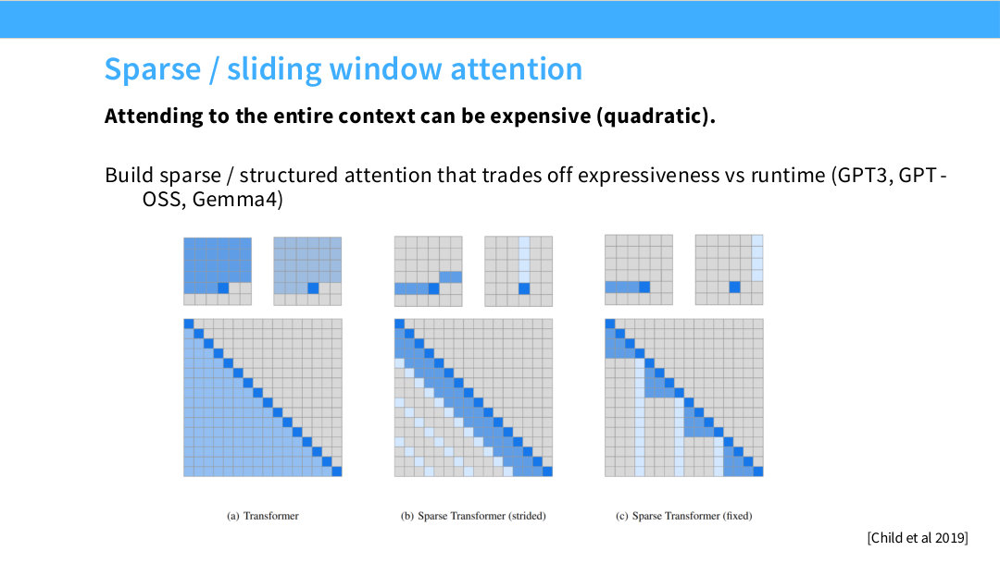

이 페이지는 GQA/MQA처럼 key/value head 수를 줄이는 방법이 아니라, **attention pattern 자체를 제한하는 방법**을 설명한다. 슬라이드의 첫 문장은 “entire context에 attend하는 것은 비싸다”이다. 이유는 full attention의 비용이 sequence length에 대해 quadratic하게 증가하기 때문이다.

full causal attention에서 attention score는 다음처럼 계산된다.

$$
S=\frac{QK^\top}{\sqrt{d_k}}
$$

sequence length가 $n$이면 $S$는 대략 $n\times n$ matrix다.

$$
S\in\mathbb{R}^{n\times n}
$$

따라서 head 하나의 attention score 계산 비용은 다음과 같다.

$$
O(n^2d_k)
$$

모든 head를 합치면 대략 다음이다.

$$
O(n^2d)
$$

이 $n^2$ 항 때문에 context length가 길어질수록 비용이 빠르게 커진다. 예를 들어 $n$이 4배가 되면 attention score 관련 비용은 16배가 된다. 그래서 long-context 모델은 모든 layer에서 full attention을 그대로 쓰기 어렵다.

슬라이드 그림은 Child et al. 2019의 sparse transformer attention pattern을 보여준다. 파란색 칸은 attention이 허용되는 위치이고, 회색 칸은 보지 않는 위치다. 왼쪽 (a) Transformer는 표준 causal full attention이다. 아래쪽 큰 matrix를 보면 대각선 아래가 거의 전부 파랗게 채워져 있다. 이는 각 token이 자신보다 앞선 모든 token을 볼 수 있음을 의미한다.

가운데 (b) Sparse Transformer의 strided pattern은 모든 과거 token을 보는 대신, 일정 간격으로 떨어진 token들을 선택적으로 본다. 그림에서 파란색이 대각선 주변뿐 아니라 줄무늬처럼 떨어진 위치에 나타나는 이유가 이것이다. strided attention은 멀리 떨어진 token에도 접근할 수 있게 해주지만, 모든 token pair를 계산하지는 않는다.

오른쪽 (c) Sparse Transformer의 fixed pattern은 local window와 일부 fixed/global 위치를 조합한다. 그림에서 대각선 주변의 파란 띠는 local attention을 의미하고, 세로 또는 가로로 나타나는 파란 구조는 특정 고정 위치를 통해 더 먼 정보를 전달하는 경로를 의미한다.

sliding-window attention은 sparse attention의 가장 직관적인 형태다. 각 token $i$가 최근 $w$개 token만 attend하도록 제한한다.

$$
j\in[i-w,i]
$$

이를 attention mask로 쓰면 다음처럼 표현할 수 있다.

$$
M_{ij}=1\quad\text{if}\quad 0\le i-j\le w
$$

$$
M_{ij}=0\quad\text{otherwise}
$$

그러면 full attention의 $O(n^2d)$ 비용이 다음처럼 줄어든다.

$$
O(n^2d)\rightarrow O(nwd)
$$

$w\ll n$이면 비용 절감이 크다. 예를 들어 $n=32{,}768$이고 $w=4{,}096$이면, 각 token이 전체 32k context가 아니라 최근 4k token만 직접 보므로 attention pattern 크기는 대략 1/8 수준으로 줄어든다.

하지만 슬라이드의 “trades off expressiveness vs runtime”이라는 문장이 중요하다. sparse attention은 빠르지만 표현력을 희생한다. full attention에서는 멀리 떨어진 두 token이 한 layer에서 바로 연결될 수 있지만, sliding-window attention에서는 window 밖 token을 직접 볼 수 없다. 여러 layer를 거치며 정보가 전달될 수는 있지만, direct long-range dependency를 처리하는 능력은 약해질 수 있다.

그래서 GPT-3, GPT-OSS, Gemma 4 같은 모델들은 sparse 또는 structured attention을 사용하더라도, 전체 모델 설계에서 long-range information을 잃지 않도록 여러 pattern을 조합한다. 바로 다음 페이지의 핵심이 이것이다. 모든 layer를 sliding-window로 만들기보다, 일부 layer는 full attention 또는 long-range attention을 섞어 local efficiency와 global context modeling을 동시에 노린다.

---

## Page 65. Current standard trick - interleave full and LR attention

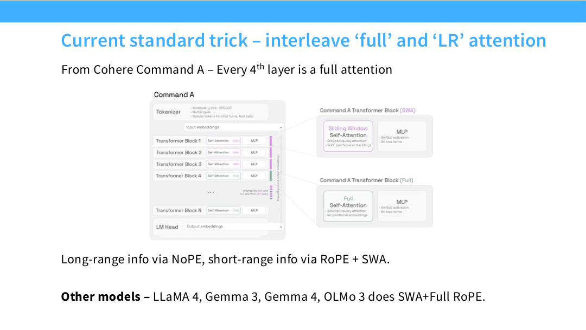

이 페이지는 최근 long-context 모델에서 자주 보이는 표준 trick을 설명한다. 모든 layer에서 full attention을 하면 비용이 너무 크고, 모든 layer에서 sliding-window attention만 하면 long-range dependency를 놓칠 수 있다. 그래서 두 방식을 **interleave**한다.

아이디어는 단순하다. 대부분의 layer에서는 local 또는 sliding-window attention을 사용하고, 일정 간격마다 full attention layer를 넣는다. 예를 들어 슬라이드의 Cohere Command A 예시는 every 4th layer가 full attention이고, 나머지는 sliding-window self-attention이다.

수식적으로 보면 layer $\ell$의 attention mask $M^{(\ell)}$을 다르게 두는 방식이다. full attention layer에서는 causal mask만 사용한다.

$$
M_{ij}^{(\ell)} =
\begin{cases}
0 & j\le i \\
-\infty & j>i
\end{cases}
$$

sliding-window layer에서는 causal 조건에 더해 window 조건을 넣는다.

$$
M_{ij}^{(\ell)} =
\begin{cases}
0 & i-w\le j\le i \\
-\infty & \text{otherwise}
\end{cases}
$$

attention은 mask를 score에 더한 뒤 softmax를 적용한다.

$$
A^{(\ell)}=\mathrm{softmax}\left(\frac{QK^\top}{\sqrt{d_k}}+M^{(\ell)}\right)
$$

이렇게 하면 local layer는 가까운 context를 싸게 처리하고, full layer는 주기적으로 먼 context 정보를 섞는다. 직관적으로는 대부분의 layer가 “근처 문맥 정리”를 하고, 몇몇 layer가 “문서 전체 정보 교환”을 담당하는 구조다.

슬라이드는 또한 long-range info에는 NoPE, short-range info에는 RoPE + SWA를 쓰는 조합을 언급한다. 이는 위치 정보 처리와 attention range를 함께 설계하는 흐름을 보여준다. RoPE는 상대적 위치 정보를 잘 주입하지만, 매우 긴 context에서 extrapolation 문제가 생길 수 있다. 그래서 long-range layer에서는 위치 bias를 덜 주거나 NoPE를 쓰고, local layer에서는 RoPE와 sliding-window attention을 결합하는 방식이 등장한다.

핵심은 long context를 다룰 때 full attention만 고집하지 않는다는 점이다. 최근 모델들은 full attention, local attention, position encoding을 layer별로 다르게 조합해 compute cost와 long-range capability의 균형을 맞춘다.

---

## Page 66. Other recent examples of interleaved attention

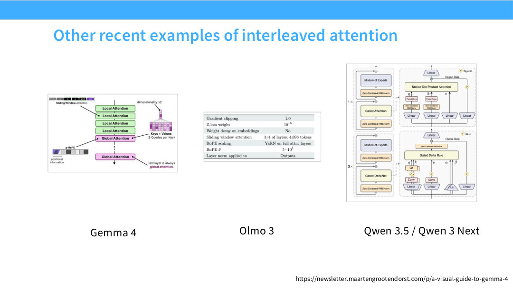

이 페이지는 interleaved attention이 단일 모델의 특수한 trick이 아니라, 여러 최신 모델에서 반복적으로 나타나는 설계 패턴임을 보여준다. 슬라이드에는 Gemma 4, OLMo 3, Qwen 3.5 / Qwen 3 Next 계열의 예시가 함께 제시된다.

왼쪽의 Gemma 4 그림은 local attention과 global attention이 섞인 구조를 시각적으로 보여준다. 대부분의 layer에서 local attention을 사용하면 attention 비용은 $O(nwd)$ 수준으로 줄어든다. 그러나 global attention layer를 주기적으로 넣으면 전체 문맥을 직접 섞을 수 있다. 즉 비용은 낮추되, long-range communication path를 완전히 없애지는 않는다.

가운데 OLMo 3 표는 layer별로 sliding-window attention과 full attention이 어떻게 반복되는지 보여주는 예시다. 이런 패턴은 단순히 “어떤 attention이 더 좋은가”의 문제가 아니라, layer stack 전체를 하나의 information routing system으로 보는 관점이다. 가까운 정보는 local layer에서 자주 업데이트하고, 먼 정보는 full layer에서 간헐적으로 섞는다.

오른쪽 Qwen 계열 그림은 attention block 구성 자체가 더 다양해지고 있음을 보여준다. 최근 모델은 full attention, local attention, linear/SSM 계열 block, MoE block 등을 섞는 방향으로 확장되고 있다. 슬라이드의 visible link는 Gemma 4 구조를 설명하는 시각 자료로, 이런 hybrid design을 이해하는 데 도움이 된다.

$$
\text{hybrid attention stack}
=
\{
\text{local},\text{local},\text{local},\text{global},\dots
\}
$$

이 페이지의 큰 메시지는 분명하다. 긴 context와 serving efficiency가 중요해지면서 attention은 더 이상 모든 layer에서 동일한 full attention으로 고정되지 않는다. 그러나 완전히 sparse하게만 가면 품질 문제가 생길 수 있기 때문에, 최신 모델들은 full attention을 일부 유지하면서 local attention으로 비용을 줄이는 hybrid 설계를 선호한다.

---

## Page 67. Recap, conclusion, etc.

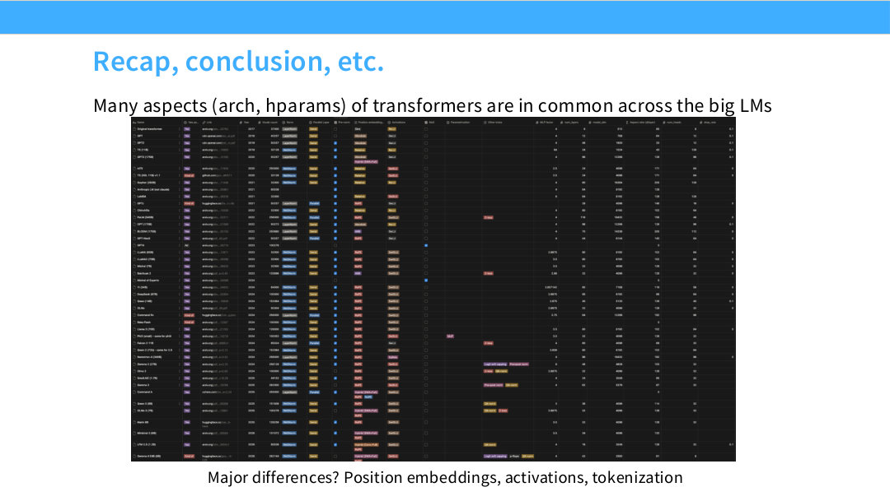

마지막 페이지는 강의 전체를 요약한다. 대형 LM의 architecture와 hyperparameter는 생각보다 많은 부분이 공통적이다. pre-norm, RMSNorm, SwiGLU, RoPE, FFN ratio, head dimension ratio, weight decay 같은 선택은 여러 모델에서 반복된다.

하지만 주요 차이도 있다. position embedding 방식, activation/FFN 구조, tokenization, attention variant, long-context 처리 방식, stability trick은 모델마다 달라질 수 있다. 특히 최근 모델들은 QK norm, logit soft-capping, SWA/full attention interleaving, GQA/MLA 같은 serving 및 stability 중심 변형을 적극적으로 도입한다.

강의의 실용적 결론은 다음과 같다. 새 LM을 구현한다면 LLaMA-like architecture를 기본값으로 삼는 것이 합리적이다. 그러나 최신 모델을 이해하거나 연구하려면 "기본값"에서 어떤 부분을 왜 바꿨는지 추적해야 한다. 현대 LLM 설계는 architecture, optimization stability, inference efficiency, hardware constraint가 함께 결정하는 문제다.

---
