 # CS336 Lecture 05 상세 정리: GPUs, CUDA, Performance, FlashAttention

이 정리본의 **메인 기준은 CS336 Lecture 05 원본 PDF/lecture note**다. 따라서 전체 구조는 원본 강의의 Page 1~55 흐름을 그대로 따른다. 각 페이지에서는 먼저 원본 슬라이드가 말하는 핵심 내용을 빠짐없이 설명하고, 그다음 필요한 경우에만 GPU/TPU 기초 개념과 추가 예시를 덧붙였다.

보충자료 [8_understanding_gpus.pdf](https://gcl-inha.github.io/ece7115/slides/8_understanding_gpus.pdf)의 내용은 원본 CS336 흐름을 대체하지 않고, 컴퓨터 구조 배경이 없는 독자가 이해하기 어려운 용어(thread, block, warp, memory hierarchy, roofline, tiling 등)를 풀어주는 **보충 설명**으로만 사용했다. 보충자료에서 온 내용은 본문에서 `보충 설명`으로 구분했다. 이 보충 자료는 인하대학교 안남혁 교수님의 [ECE7115 Multimodal VLM (LLM)](https://gcl-inha.github.io/ece7115/) 강의 자료이다.

이미지는 각 페이지의 원본 슬라이드이며, 설명은 슬라이드의 문장, 그림, 표, 수식이 자연스럽게 이어지도록 구성했다.


## 먼저 잡고 가는 기초 개념: CPU/GPU/TPU를 읽기 위한 최소 용어 사전

이번 강의는 CUDA, GPU, TPU, memory hierarchy, kernel 최적화를 다루기 때문에 컴퓨터 구조 용어가 많이 나온다. 아래 개념을 먼저 잡아두면 뒤의 슬라이드가 훨씬 덜 낯설다. 이 절은 원본 페이지 흐름에 들어가기 전의 사전 지식이며, 실제 강의 정리는 `Page 1`부터 시작한다.

### 프로그램, 프로세스, 스레드

**프로그램**(program)은 아직 실행되기 전의 코드 또는 실행 파일이다. 디스크에 저장된 `train.py`, `python` 실행 파일, 컴파일된 binary, 또는 CUDA kernel 코드가 모두 프로그램에 해당한다. 프로그램은 “무엇을 해야 하는지 적힌 설계도”에 가깝다. 파일로 존재할 뿐이므로 그 자체가 CPU를 쓰거나 메모리를 크게 차지하면서 실행되는 것은 아니다.

예를 들어 다음 명령을 생각해보자.

```bash

python train.py

```

여기서 `train.py`는 프로그램이다. 이 명령을 실제로 실행하면 운영체제(OS)는 이 프로그램을 메모리에 올리고, 실행 중인 작업 단위를 하나 만든다. 이것이 **프로세스**(process)다. 같은 `train.py`를 터미널 두 개에서 동시에 실행하면, 프로그램 파일은 하나지만 프로세스는 두 개가 생긴다.

프로세스는 실행 중인 프로그램의 **인스턴스**(instance)라고 볼 수 있다. 운영체제는 각 프로세스에 다음과 같은 실행 환경을 제공한다.


- 독립적인 메모리 공간(address space)

- 실행 중인 코드와 데이터

- heap, stack 같은 런타임 메모리 영역

- 열린 파일, socket, device handle

- 현재 어디까지 실행했는지를 나타내는 실행 상태

즉 프로그램이 “레시피 파일”이라면, 프로세스는 “그 레시피를 실제로 펼쳐놓고 요리 중인 주방”이다. 레시피 파일 하나로 여러 주방을 동시에 열 수 있듯이, 프로그램 하나로 여러 프로세스를 동시에 만들 수 있다.

**스레드**(thread)는 프로세스 안에서 실제 명령을 따라 실행하는 흐름이다. 하나의 프로세스는 하나 이상의 스레드를 가질 수 있다. 스레드는 같은 프로세스의 메모리 공간을 공유하지만, 각 스레드는 자기만의 실행 위치, call stack, register 상태를 가진다.

비유하면 다음과 같다.


```math
\text{프로그램} = \text{요리책},\quad
\text{프로세스} = \text{요리책을 펼쳐 실제로 운영 중인 주방},\quad
\text{스레드} = \text{주방 안에서 일하는 요리사 한 명}
```

  
실행 구조를 더 단순화하면 다음 흐름이다.

  

```math
\text{Program} \rightarrow \text{Process} \rightarrow \text{Thread} \rightarrow \text{Instruction}
```

  
예를 들어 PyTorch 학습 코드를 실행하면 먼저 CPU 쪽에서 Python 프로세스가 만들어진다. 이 Python 프로세스가 `torch.matmul`, `torch.nn.functional.softmax` 같은 연산을 호출하면, 내부적으로 GPU에게 CUDA kernel 실행을 요청한다. 그러면 GPU에서는 수많은 GPU thread가 생성되어 tensor의 서로 다른 부분을 병렬로 처리한다.

여기서 주의할 점은 **CPU thread와 GPU thread는 같은 이름을 쓰지만 무게감이 다르다**는 것이다. CPU thread는 운영체제가 관리하는 비교적 무거운 실행 단위에 가깝고, GPU thread는 CUDA kernel 안에서 대량으로 만들어지는 훨씬 가벼운 실행 단위다. GPU에서는 수천~수만 개 thread가 같은 kernel code를 실행하면서 서로 다른 데이터 index를 처리한다.

예를 들어 vector에 1을 더하는 CUDA kernel을 생각해보자.

```cuda

int i = blockIdx.x * blockDim.x + threadIdx.x;

y[i] = x[i] + 1;

```


모든 GPU thread는 같은 코드 줄을 실행하지만, 각 thread의 `i` 값이 다르다. 따라서 thread 0은 `x[0]`, thread 1은 `x[1]`, thread 2는 `x[2]`를 처리한다. 이처럼 GPU는 “같은 명령을 많은 데이터에 반복 적용하는 작업”에 강하다.

CPU는 소수의 강한 실행 흐름이 복잡한 분기와 제어를 잘 처리하는 쪽에 가깝고, GPU는 아주 많은 가벼운 thread가 같은 종류의 계산을 대량으로 나눠 처리하는 쪽에 가깝다. 이 차이가 뒤에서 나오는 SIMT, warp, memory coalescing, control divergence를 이해하는 출발점이다.


### Instruction: 하드웨어가 실제로 실행하는 명령 단위

**Instruction**은 CPU/GPU가 실제로 실행하는 낮은 수준의 명령 단위다. 우리가 Python이나 CUDA로 작성한 코드는 그대로 하드웨어에서 실행되는 것이 아니라, load, store, add, multiply, branch 같은 더 작은 instruction들의 sequence로 바뀐다.

예를 들어 `c = a + b`라는 코드는 개념적으로 다음 단계들로 나뉜다.

```text

1. a를 메모리에서 읽는다. // load

2. b를 메모리에서 읽는다. // load

3. a와 b를 더한다. // add

4. 결과를 c 위치에 저장한다. // store

```

  

이 관계를 정리하면 다음과 같다.

  

```math
\text{Program} \rightarrow \text{Process} \rightarrow \text{Thread} \rightarrow \text{Instructions}
```

  

즉 program은 실행할 코드 전체이고, process는 실행 중인 program instance이며, thread는 instruction들을 실제로 따라가며 실행하는 흐름이다. GPU에서 중요한 점은 수많은 thread가 같은 kernel의 instruction들을 실행하지만, 각 thread가 가진 thread index가 다르기 때문에 서로 다른 데이터 위치를 처리한다는 것이다.

### CUDA에서의 thread, block, grid

CUDA에서는 GPU에게 일을 시킬 때 보통 아주 많은 thread를 만든다. 그런데 thread를 하나씩 따로 관리하지 않고, 여러 thread를 **block**으로 묶고, 여러 block을 모아 **grid**를 만든다.

```math
\text{Grid} \supset \text{Block} \supset \text{Thread}
```

예를 들어 큰 행렬 $C=A B$를 계산한다고 하자. 전체 행렬 $C$를 여러 작은 영역으로 나누고, 각 block이 $C$의 한 tile을 담당하게 만들 수 있다. block 안의 thread들은 각자 tile 안의 몇 개 원소를 계산한다. 이때 같은 block 안의 thread들은 **shared memory**를 공유할 수 있어서 협업이 가능하다.

### Warp와 SIMT

GPU thread는 실제로는 보통 **warp**라는 단위로 묶여 실행된다. NVIDIA GPU 기준으로 warp는 32개의 연속된 thread 묶음이다. 같은 warp 안의 thread들은 같은 instruction을 동시에 실행한다. 이를 **SIMT**(Single Instruction, Multiple Threads)라고 부른다.

쉽게 말해 GPU는 다음 방식에 강하다.

```math
\text{같은 계산을 수많은 데이터에 반복 적용}
```

예를 들어 vector의 모든 원소에 ReLU를 적용하거나, 행렬곱에서 수많은 곱셈-덧셈을 반복하는 일이 GPU에 잘 맞는다. 반대로 같은 warp 안의 thread들이 서로 다른 조건문을 타면 일부 thread가 기다려야 하므로 성능이 떨어진다. 이것이 뒤에서 말하는 **control divergence**다.

### Kernel이란 무엇인가?

CUDA에서 **kernel**은 GPU에서 실행되는 함수다. Python/PyTorch에서 `torch.matmul`, `torch.relu`, `softmax` 같은 연산을 호출하면 내부적으로 하나 이상의 GPU kernel이 실행된다. kernel 하나가 실행될 때는 많은 block과 thread가 만들어져 같은 함수를 병렬로 수행한다.

예를 들어 non-fused 방식에서는 다음처럼 여러 kernel이 따로 실행될 수 있다.

```math
\text{matmul kernel} \rightarrow \text{softmax kernel} \rightarrow \text{dropout kernel} \rightarrow \text{matmul kernel}
```

fusion은 이 중 여러 kernel을 하나로 합쳐 중간 결과를 HBM에 쓰고 다시 읽는 일을 줄이는 기법이다.

### GPU memory hierarchy

GPU에는 여러 층의 memory가 있다. 가까울수록 빠르지만 작고, 멀수록 크지만 느리다.

| 이름 | 위치/범위 | 특징 | 비유 |
|---|---|---|---|
| Register | thread 내부 | 가장 빠름, 매우 작음 | 요리사가 손에 들고 있는 재료 |
| Shared memory / L1 | SM 내부, block 공유 | 빠름, block 안 thread들이 공유 | 같은 조리대 위의 재료 |
| L2 cache | GPU chip 내부 공유 | 여러 SM이 공유 | 주방 안 공용 선반 |
| Global memory / HBM | GPU 외부 memory chip | 크지만 느림 | 멀리 있는 창고 |

GPU 최적화의 핵심은 HBM이라는 먼 창고를 자주 왕복하지 않고, 한 번 가져온 데이터를 register/shared memory에서 최대한 재사용하는 것이다. 뒤에서 나오는 **tiling**, **coalescing**, **FlashAttention**이 모두 이 관점과 연결된다.


### GPU를 구성하는 주요 요소: 큰 그림부터 잡기

GPU를 처음 볼 때 가장 헷갈리는 점은 `SM`, `CUDA core`, `Tensor Core`, `register`, `shared memory`, `L1/L2 cache`, `HBM` 같은 용어가 한꺼번에 나온다는 것이다. 이 용어들은 모두 GPU 안에서 서로 다른 역할을 한다. 가장 단순하게는 GPU를 다음 계층으로 보면 된다.

```math
\text{GPU chip}
\rightarrow
\text{many SMs}
\rightarrow
\text{warps/threads}
\rightarrow
\text{CUDA cores / Tensor Cores}
```

그리고 memory는 다음처럼 가까운 순서로 볼 수 있다.

```math
\text{register}
\rightarrow
\text{shared memory / L1 cache}
\rightarrow
\text{L2 cache}
\rightarrow
\text{global memory / VRAM / HBM}
```

**GPU chip**은 전체 장치다. 우리가 “A100 GPU”, “H100 GPU”라고 부를 때의 GPU는 여러 개의 계산 블록과 큰 메모리 인터페이스를 가진 하나의 accelerator다. GPU chip 안에는 여러 개의 **SM**(Streaming Multiprocessor)이 들어 있다.

**SM**은 GPU 안의 독립적인 작업장이다. CUDA block은 보통 하나의 SM에 배정되어 실행된다. 각 SM은 warp scheduler, register file, shared memory/L1 cache, CUDA core, Tensor Core, load/store unit 등을 가지고 있다. 즉 SM은 “thread block을 받아 실제로 실행하는 단위”라고 보면 된다.

**Warp scheduler**는 SM 안에서 어떤 warp를 다음에 실행할지 고르는 장치다. NVIDIA GPU에서 warp는 보통 32개 thread 묶음이다. 어떤 warp가 global memory를 기다리고 있으면 scheduler는 다른 준비된 warp를 실행시켜 GPU가 놀지 않게 한다. 이것이 GPU가 memory latency를 숨기는 중요한 방식이다.

**CUDA core 또는 ALU**는 일반적인 scalar/vector 산술 연산을 수행하는 계산 유닛이다. 덧셈, 곱셈, 비교, 주소 계산, element-wise operation 등이 여기에 해당한다. 하지만 LLM의 큰 matrix multiplication은 보통 CUDA core보다 **Tensor Core**에서 훨씬 효율적으로 처리된다.

**Tensor Core**는 작은 행렬 tile의 multiply-accumulate를 전담하는 특수 계산 유닛이다. 예를 들어 bf16/fp16/fp8 행렬곱에서 Tensor Core는 여러 원소의 곱셈과 덧셈을 한 번에 처리한다. Transformer의 linear layer, attention projection, MLP는 대부분 큰 matmul이므로 Tensor Core 활용률이 LLM training/inference 성능을 크게 좌우한다.

**Register file**은 각 thread가 사용하는 가장 가까운 저장 공간이다. register는 매우 빠르지만 thread마다 사용할 수 있는 수가 제한되어 있다. 너무 많은 register를 쓰는 kernel은 한 SM에 동시에 올릴 수 있는 thread 수가 줄어들 수 있는데, 이것을 occupancy 감소와 연결해서 설명한다.

**Shared memory**는 같은 thread block 안의 thread들이 함께 쓰는 빠른 on-chip memory다. 프로그래머가 명시적으로 데이터를 올리고 재사용하는 scratchpad에 가깝다. 예를 들어 matmul에서 $A$와 $B$의 작은 tile을 HBM에서 한 번 읽어 shared memory에 올린 뒤, block 안 thread들이 여러 번 재사용할 수 있다.

**L1 cache**는 SM 가까이에 있는 자동 cache다. shared memory와 달리 프로그래머가 직접 관리하지 않고, global memory load/store를 빠르게 하기 위해 hardware가 자동으로 사용한다. 일부 NVIDIA GPU에서는 shared memory와 L1 cache가 같은 물리 SRAM pool을 나눠 쓰기도 하지만, 개념적으로 shared memory는 명시적 작업 공간이고 L1 cache는 자동 cache다.

**L2 cache**는 GPU chip 전체가 공유하는 cache다. 여러 SM이 global memory를 읽을 때, 자주 쓰는 데이터가 L2에 남아 있으면 HBM까지 가지 않아도 된다. L2는 shared memory보다 크지만 느리고, HBM보다는 훨씬 빠른 중간 계층이다.

**Global memory**는 CUDA 프로그래밍 모델에서 보는 가장 큰 device memory 공간이다. 물리적으로는 GPU 보드에 붙은 **VRAM** 또는 데이터센터 GPU의 **HBM**에 저장된다. PyTorch에서 `device="cuda"`로 만든 tensor는 보통 global memory에 놓인다고 보면 된다. HBM은 VRAM을 구현하는 메모리 기술 중 하나이고, GDDR보다 대역폭이 훨씬 커서 AI/HPC GPU에서 많이 쓰인다.

**Memory controller와 interconnect**도 중요하다. memory controller는 GPU chip이 HBM/GDDR과 데이터를 주고받는 통로를 관리한다. PCIe나 NVLink는 GPU와 CPU, 또는 GPU와 GPU 사이를 연결한다. 단일 GPU 안의 HBM bandwidth가 아무리 커도, multi-GPU training에서는 GPU 간 통신 bandwidth가 또 다른 병목이 될 수 있다.

LLM 관점에서 이 구성 요소들은 다음처럼 연결된다.

| 구성 요소               | 쉬운 의미                   | LLM에서 주로 보이는 역할                         |
| ------------------- | ----------------------- | --------------------------------------- |
| SM                  | GPU 안의 독립 작업장           | CUDA block 실행, warp scheduling          |
| Warp scheduler      | 어떤 warp를 실행할지 고르는 제어 장치 | memory latency 숨기기, thread 실행 관리        |
| CUDA core / ALU     | 일반 계산기                  | element-wise op, 주소 계산, 작은 연산           |
| Tensor Core         | 행렬곱 전용 계산기              | linear layer, attention/MLP matmul 가속   |
| Register            | thread 개인 초고속 저장 공간     | 현재 계산 중인 scalar/tile fragment 저장        |
| Shared memory       | block 내부 공유 작업대         | tiling, data reuse, FlashAttention류 최적화 |
| L1 cache            | SM 가까운 자동 cache         | global memory 접근 일부 가속                  |
| L2 cache            | GPU 전체 공유 cache         | 여러 SM의 global memory access 완충          |
| Global memory / HBM | GPU의 큰 창고               | weights, activations, KV cache 저장       |
| PCIe/NVLink         | GPU 밖으로 나가는 통신로         | CPU-GPU 전송, multi-GPU communication     |

이제 뒤의 Page 8~12를 읽을 때는 다음 한 문장을 기억하면 된다.

```math
\text{GPU 성능 최적화} = \text{Tensor Core를 바쁘게 유지하면서 HBM 왕복을 줄이는 것}
```


### Latency와 throughput

**Latency**는 하나의 일이 끝날 때까지 걸리는 시간이다. 예를 들어 요청 하나가 10ms 만에 끝나면 latency가 낮다고 말한다. **Throughput**은 단위 시간당 처리량이다. 예를 들어 초당 10,000개 token을 처리하면 throughput이 높다고 말한다.

CPU는 보통 개별 작업의 latency를 낮추는 데 강하고, GPU는 전체 throughput을 높이는 데 강하다. 그래서 GPU는 “한 요청을 가장 빠르 
### GPU와 TPU

GPU는 원래 그래픽 처리를 위해 발전했지만, 지금은 행렬곱을 매우 빠르게 수행하는 범용 accelerator로 쓰인다. TPU는 Google이 ML workload, 특히 matrix multiplication을 위해 설계한 accelerator다. 둘 다 큰 matrix multiplication unit과 빠른 HBM을 가진다는 점에서는 유사하지만, 실행 모델과 네트워킹, memory 구조, programming stack이 다르다.

강의에서 TPU가 나오는 이유는 “GPU만 특별하다”는 이야기를 하려는 것이 아니라, 현대 accelerator들이 대체로 다음 공통 구조를 가진다는 점을 보여주기 위해서다.

```math
\text{가벼운 control} + \text{큰 matmul unit} + \text{빠른 memory}
```

---


## Page 1. Lecture 5 - CS336

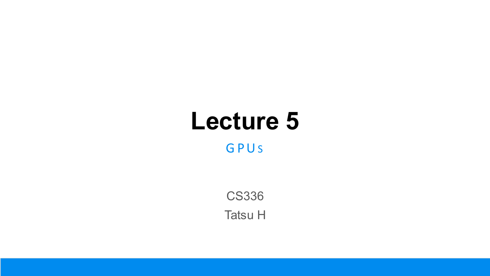

Lecture 5는 GPU와 CUDA를 중심으로, 딥러닝 workload가 실제 하드웨어에서 왜 빠르거나 느려지는지를 다룬다. 이전 강의들이 Transformer 구조, resource accounting, attention/FFN 설계에 초점을 맞췄다면, 이번 강의는 그 연산들이 실제 GPU 위에서 어떻게 실행되는지로 관점을 낮춘다.

이 강의의 최종 목표는 단순히 CUDA 문법을 배우는 것이 아니라, **LLM 학습과 추론에서 병목이 어디서 생기는지**를 이해하는 것이다. 특히 현대 LLM 성능은 모델 구조뿐 아니라 GPU의 memory hierarchy와 kernel 구현 방식에 크게 좌우된다.

---

## Page 2. Outline and goals

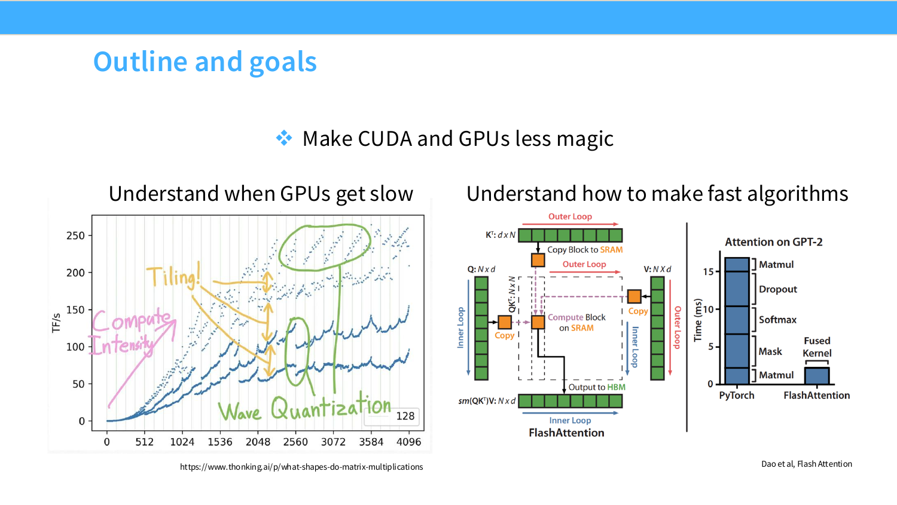

이 페이지는 강의 전체 목표를 제시한다. 핵심 문장은 “**Make CUDA and GPUs less magic**”이다. GPU가 왜 빠른지, 반대로 어떤 경우에 GPU가 느려지는지를 원리 기반으로 이해하자는 뜻이다.

왼쪽 그림은 matrix multiplication shape에 따라 실제 TFLOP/s가 크게 달라지는 현상을 보여준다. 같은 행렬곱처럼 보여도 matrix 크기, tile alignment, wave quantization, compute intensity에 따라 throughput이 크게 달라진다. 그래서 GPU 성능은 단순히 “H100은 몇 TFLOP/s다”라고 끝낼 수 없고, workload shape와 memory access pattern까지 같이 봐야 한다.

오른쪽 그림은 FlashAttention의 block/tile 구조와 PyTorch attention 대비 FlashAttention의 시간 감소를 보여준다. 이 강의는 결국 **GPU가 느려지는 조건을 이해하고, 그 조건을 피하는 알고리즘을 설계하는 법**으로 이어진다. 관련 배경 링크로는 matrix multiplication shape 분석 글과 FlashAttention 논문이 제시된다: [What shapes do matrix multiplications like?](https://www.thonking.ai/p/what-shapes-do-matrix-multiplications), Dao et al. FlashAttention.

---

## Page 3. Before we start


이 페이지는 강의 자료의 주요 참고 출처를 밝힌다. Horace He의 블로그, CUDA Mode group, TPU/GPU scaling book 등이 언급된다. 이 출처들이 중요한 이유는 GPU 성능 최적화가 단순한 API 사용법이 아니라 **하드웨어 구조, 컴파일러, kernel, memory hierarchy를 함께 이해해야 하는 주제**이기 때문이다.

Horace He의 글은 시스템을 first principles로 설명하는 데 강점이 있고, CUDA Mode는 실제 CUDA/GPU 프로그래밍 커뮤니티에 가깝다. TPU/GPU book은 accelerator 구조와 대규모 모델 scaling을 연결해 설명한다. 추가 링크로 [nichijou.co](https://nichijou.co/)와 [Jonathan Hui Medium](https://jonathan-hui.medium.com/)도 언급된다.

---

## Page 4. Organization today

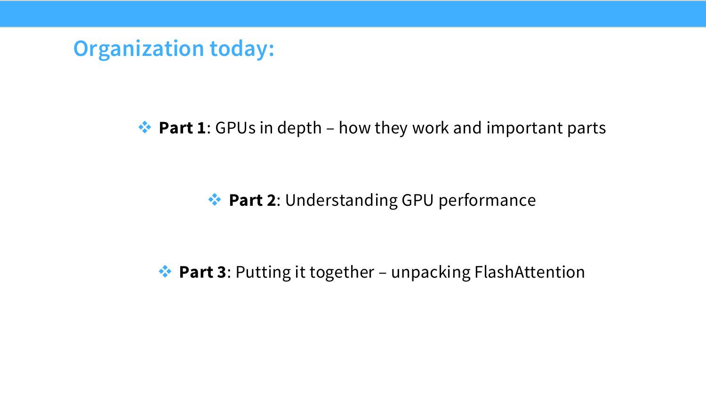

오늘 강의는 세 부분으로 나뉜다.

첫 번째는 GPU 내부 구조다. 여기서는 SM, thread, block, warp, register, shared memory, global memory 같은 기본 구성 요소를 이해한다. 두 번째는 GPU performance를 이해하는 파트다. arithmetic intensity, memory-bound, compute-bound, low precision, fusion, recomputation, coalescing, tiling을 다룬다. 세 번째는 지금까지의 개념을 사용해 FlashAttention을 해석한다.

즉 강의 흐름은 다음과 같다.

```math
\text{GPU 구조 이해}
\rightarrow
\text{GPU 성능 병목 이해}
\rightarrow
\text{FlashAttention 원리 이해}
```

이 구조를 기억하면 각 페이지가 왜 등장하는지 자연스럽게 이어진다.

---

## Page 5. Setting the stage: compute leads to predictable perf

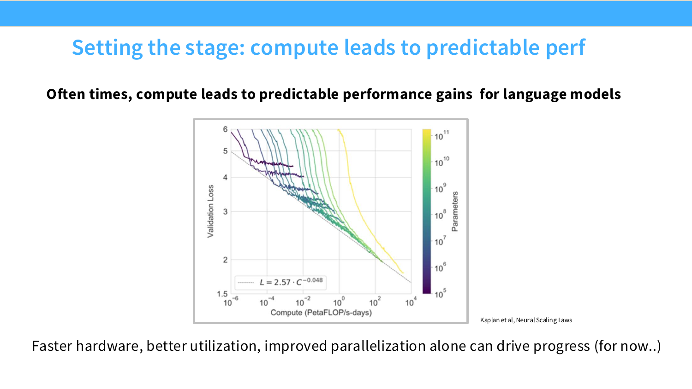

이 페이지는 LLM에서 compute가 왜 중요한지를 scaling law 관점으로 시작한다. Kaplan et al.의 Neural Scaling Laws 그림은 compute가 늘어날수록 validation loss가 예측 가능한 방식으로 감소하는 경향을 보여준다.

여기서 중요한 메시지는 **성능 향상이 항상 새로운 모델 아이디어에서만 나오지는 않는다**는 점이다. 더 빠른 하드웨어, 더 높은 utilization, 더 나은 parallelization만으로도 일정 기간 동안 모델 성능 향상을 밀어붙일 수 있다.

LLM scaling을 아주 단순화하면 다음과 같다.

```math
\text{더 많은 compute}
\Rightarrow
\text{더 큰 모델 또는 더 많은 데이터 학습}
\Rightarrow
\text{낮은 loss와 더 좋은 성능}
```

물론 무한히 지속되는 법칙은 아니지만, 현재 LLM 발전에서 compute efficiency는 여전히 핵심 축이다.

---
#### 보충 설명: Understanding GPUs 자료와 연결

보충 설명에서는 이 흐름을 “지난주 LLM case study에서 배운 것”으로 다시 정리한다. 거대한 Transformer를 web-scale dataset으로 pre-training하면 compute 증가에 따라 성능이 비교적 예측 가능하게 좋아지고, 더 빠른 hardware와 더 나은 parallelization이 곧 모델 성능 향상으로 이어질 수 있다는 것이다.

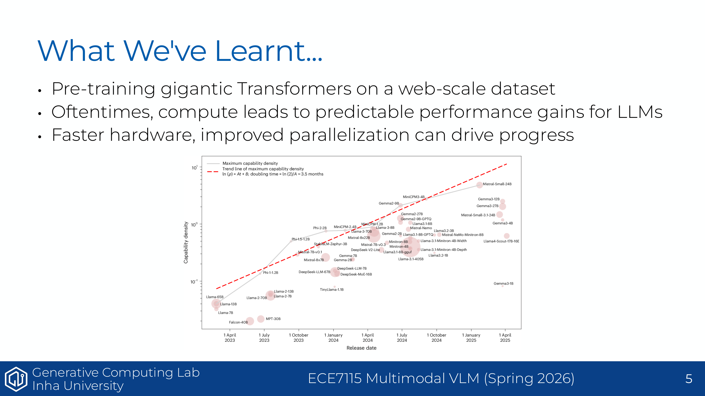

이 말은 “모델 구조 아이디어가 덜 중요하다”는 뜻이 아니다. 다만 LLM 규모에서는 좋은 구조도 결국 다음 조건을 만족해야 한다.

```math
\text{좋은 구조}
\quad + \quad
\text{GPU에서 효율적으로 실행 가능}
\quad \Rightarrow \quad
\text{실제로 scale 가능한 구조}
```

예를 들어 attention 변형, GQA, FlashAttention, FP8 training, MoE routing은 모두 모델 품질뿐 아니라 하드웨어 효율과 직접 연결된다. 그래서 CS336 Lecture 05의 GPU 파트는 Lecture 03의 architecture/hyperparameter 논의와 분리된 주제가 아니라, 현대 LLM 설계의 뒷면을 이해하는 내용이다.

## Page 6. How do we get compute scaling? Early on - Dennard scaling

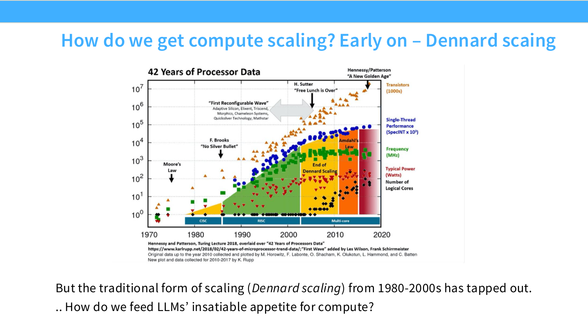

이 페이지는 과거 compute scaling의 주된 원천이었던 Dennard scaling을 설명한다. Dennard scaling은 트랜지스터가 작아질수록 전압과 전력 밀도도 함께 줄어들어, 더 많은 트랜지스터를 빠르게 동작시킬 수 있다는 관찰이다.

슬라이드의 “42 Years of Processor Data” 그래프는 Moore's Law, single-thread performance, frequency, power, logical cores 등의 장기 추세를 보여준다. 1980~2000년대에는 공정 미세화와 frequency 증가가 성능을 강하게 밀어올렸지만, **이후 전력/열 한계 때문에 전통적인 scaling이 둔화되었다.**

```math
\text{Dennard scaling이 끝났다면, LLM의 compute 요구를 어떻게 충족할 것인가?}
```

이 질문의 답이 바로 GPU 기반 parallel scaling이다.

---

## Page 7. Parallel scaling continues

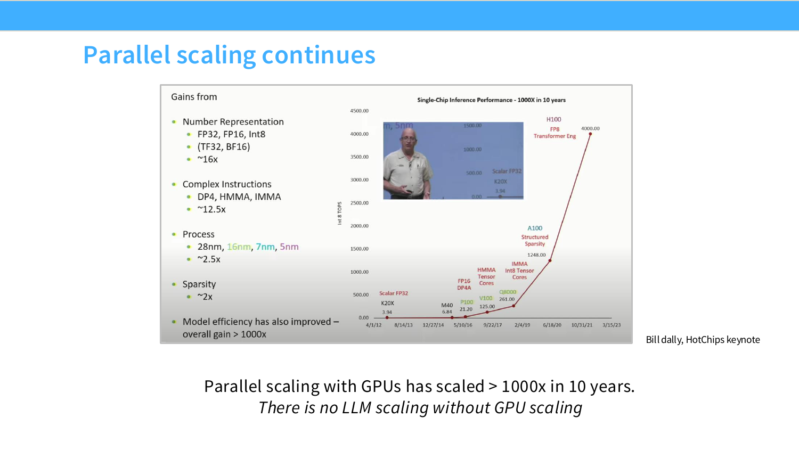

이 페이지는 Dennard scaling 이후에도 **parallel scaling**이 계속되었음을 보여준다. Bill Dally의 HotChips keynote 자료를 통해 GPU single-chip inference performance가 약 10년 동안 1000배 이상 증가한 흐름을 보여준다.

슬라이드 왼쪽에는 성능 향상의 요인이 나뉘어 있다. number representation, 즉 FP32에서 FP16, BF16, INT8, TF32 등으로 내려가는 저정밀 표현은 큰 효과를 냈고, 복잡한 instruction인 DP4, HMMA, IMMA도 성능 향상에 기여했다. 공정 미세화와 sparsity, model efficiency 역시 일부 기여했다.

핵심 문장은 “**There is no LLM scaling without GPU scaling**”이다. LLM의 scaling은 단순히 parameter 수를 키우는 문제가 아니라, 그 parameter를 실제로 학습하고 추론할 수 있게 해주는 GPU scaling 위에 서 있다.

---
#### 보충 설명: Understanding GPUs 자료와 연결

보충 설명으로 보면, 해당 자료는 이 부분을 Moore's Law, Dennard scaling, multicore scaling의 흐름으로 조금 더 넓게 설명한다. Moore's Law는 트랜지스터 밀도가 약 2년마다 증가한다는 관찰이고, Dennard scaling은 트랜지스터가 작아질 때 전력 밀도도 유지되어 더 높은 clock frequency를 얻을 수 있다는 관찰이다. 그러나 Dennard scaling은 leakage current와 power wall 때문에 2000년대 중반 이후 사실상 약해졌다.

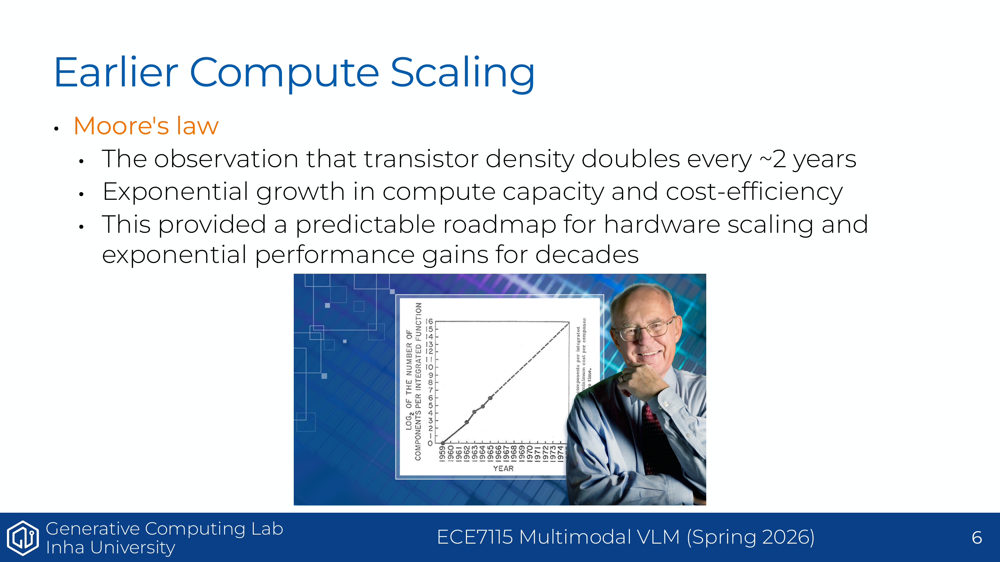

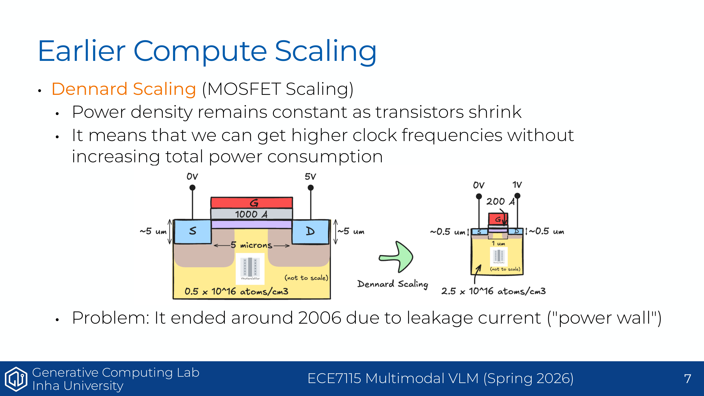

이후 성능 향상은 단일 core의 clock을 무한히 올리는 방식이 아니라, 더 많은 core를 병렬로 사용하는 방향으로 이동했다. GPU는 이 병렬화 흐름의 극단적인 형태다. CPU가 복잡한 branch와 control을 잘 처리하는 소수의 강한 core라면, GPU는 비교적 단순한 연산 유닛을 매우 많이 배치해 **throughput**을 극대화한다.

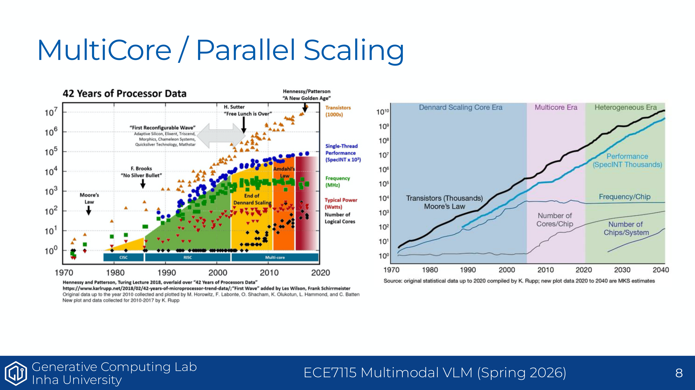


#### 보충 설명: Understanding GPUs 자료와 연결

NVIDIA GPU의 발전도 단순히 공정 미세화만으로 이루어진 것이 아니다. 보충 자료의 Bill Dally HotChips slide는 최근 GPU 성능 향상에서 number representation, 즉 FP32에서 TF32/BF16/FP16/INT8/FP8로 내려가는 저정밀 표현과 HMMA/IMMA 같은 matrix instruction이 큰 비중을 차지했다고 설명한다.

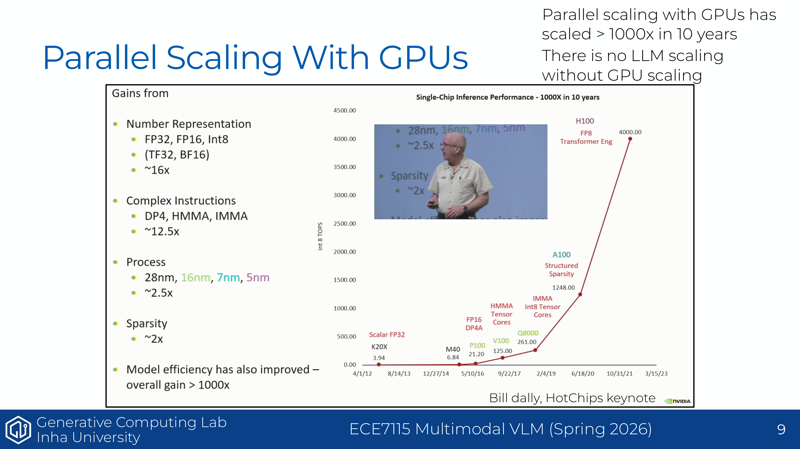

그래서 “GPU scaling 없이는 LLM scaling도 없다”는 문장이 나온다. 이는 LLM의 발전이 parameter 수나 dataset 크기만의 문제가 아니라, 그 계산을 실제로 밀어 넣을 수 있는 GPU execution/memory system의 발전과 함께 간다는 뜻이다.

## Page 8. How is a GPU different from a CPU?

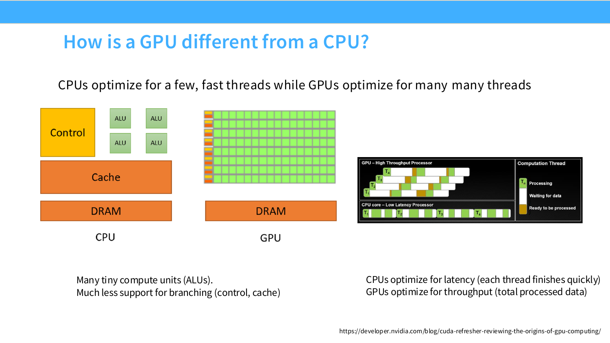


이 페이지를 이해할 때 가장 먼저 구분해야 할 것은 **CPU thread**와 **GPU thread**의 감각 차이다. CPU thread는 운영체제가 관리하는 비교적 큰 실행 흐름이고, 웹 서버나 Python 프로그램에서 말하는 thread가 여기에 가깝다. 반면 GPU thread는 CUDA kernel 안에서 만들어지는 훨씬 작은 작업자다. GPU는 이런 작은 thread를 엄청 많이 만들어서, 같은 계산을 서로 다른 데이터에 병렬로 적용한다.

예를 들어 $x$라는 vector의 모든 원소에 $y_i=2x_i+1$을 적용한다고 하자. CPU는 몇 개의 강한 core가 원소들을 나눠 처리한다. GPU는 수천 개 이상의 가벼운 thread를 만들어 각 thread가 원소 몇 개를 맡도록 한다. 그래서 GPU는 복잡한 의사결정보다 대량의 단순 반복 연산에 강하다.

이 페이지는 CPU와 GPU의 철학적 차이를 보여준다. CPU는 적은 수의 thread를 매우 빠르게 실행하는 데 최적화되어 있다. 그래서 control logic, cache, branch prediction이 중요하다. 반면 GPU는 매우 많은 thread를 동시에 실행해 전체 처리량을 높이는 데 최적화되어 있다.

슬라이드 그림에 나오는 **control, ALU, cache, DRAM**은 컴퓨터 구조를 볼 때 가장 기본이 되는 구성 요소다. 각각의 의미를 먼저 잡아두면 CPU/GPU 차이가 훨씬 잘 보인다.

**Control**은 말 그대로 “무슨 명령을 어떤 순서로 실행할지”를 관리하는 부분이다. CPU는 일반 프로그램을 실행해야 하므로 `if`, `for`, 함수 호출, 예외 처리, branch prediction처럼 복잡한 흐름 제어를 잘해야 한다. 그래서 CPU는 control logic에 많은 면적과 전력을 쓴다. 반면 GPU는 수많은 thread가 같은 명령을 서로 다른 데이터에 적용하는 경우를 가정한다. 따라서 GPU는 CPU처럼 복잡한 흐름 제어를 각 thread마다 정교하게 처리하기보다는, 동일한 연산을 대량으로 밀어붙이는 데 초점을 둔다.

**ALU**(Arithmetic Logic Unit)는 실제 산술/논리 연산을 수행하는 작은 계산기다. 덧셈, 곱셈, 비교, bit operation 같은 기본 연산을 처리한다. CPU는 강력한 core 몇 개 안에 상대적으로 적은 수의 ALU를 두지만, GPU는 작고 단순한 ALU를 매우 많이 배치한다. 그래서 GPU는 하나의 복잡한 작업을 빠르게 끝내기보다는, 수천~수만 개의 비슷한 작업을 동시에 처리하는 데 강하다. LLM에서 matrix multiplication이 GPU에 잘 맞는 이유도 결국 많은 원소에 대해 multiply-add를 반복하기 때문이다.

**Cache**는 계산 유닛 가까이에 있는 작고 빠른 메모리다. DRAM에서 데이터를 매번 가져오면 너무 느리기 때문에, 최근에 썼거나 곧 다시 쓸 가능성이 높은 데이터를 가까운 cache에 보관한다. CPU는 프로그램 흐름이 복잡하고 memory access pattern이 불규칙할 수 있으므로 cache를 크게 두고, branch prediction과 함께 latency를 줄이는 데 집중한다. GPU도 cache가 있지만, CPU처럼 큰 cache로 모든 latency를 줄이기보다는 많은 thread를 동시에 실행해서 어떤 thread가 메모리를 기다리는 동안 다른 thread가 계산하도록 만든다.

**DRAM**은 큰 용량의 main memory다. CPU에서는 system memory, GPU에서는 global memory/HBM에 해당한다고 보면 된다. 용량은 크지만 ALU나 register/cache에 비해 멀고 느리다. 그래서 DRAM에서 데이터를 가져오는 비용, 즉 memory movement가 커지면 GPU의 많은 ALU가 계산할 데이터가 오기를 기다리게 된다. CS336에서 memory-bound, arithmetic intensity, roofline model을 계속 강조하는 이유가 여기에 있다.

왼쪽 그림에서 CPU는 control과 cache가 크고 ALU가 상대적으로 적다. 이는 CPU가 **복잡한 명령 흐름을 낮은 latency로 처리하는 장치**라는 뜻이다. 반대로 GPU는 control/cache 비중이 작고, 작은 ALU가 매우 많다. 이는 GPU가 복잡한 분기와 낮은 latency보다 **동일한 연산을 대량으로 반복하는 throughput**에 강하다는 뜻이다.

예를 들어 웹 브라우저, 운영체제, Python 인터프리터처럼 실행 흐름이 복잡한 프로그램은 CPU에 잘 맞는다. 반대로 `C = A @ B` 같은 행렬곱은 각 output 원소를 비슷한 방식으로 계산하므로 GPU에 잘 맞는다. GPU는 control을 단순화하고 ALU를 많이 배치한 대신, 프로그램이 GPU 친화적인 형태, 즉 많은 thread가 같은 kernel을 실행하는 형태일 때 성능이 잘 나온다.

| 구성 요소 | 의미 | CPU에서의 비중/역할 | GPU에서의 비중/역할 |
|---|---|---|---|
| Control | 명령 흐름, 분기, 스케줄링 제어 | 큼. 복잡한 프로그램 흐름과 낮은 latency에 중요 | 상대적으로 작음. 같은 명령을 많은 데이터에 적용하는 데 초점 |
| ALU | 실제 산술/논리 연산 수행 | 강한 core 안에 비교적 적게 배치 | 작고 단순한 ALU를 매우 많이 배치 |
| Cache | 가까운 고속 메모리 | 큼. 불규칙한 memory access의 latency 완화 | 상대적으로 작음. 많은 thread와 locality로 latency를 숨김 |
| DRAM/HBM | 큰 외부/전역 메모리 | 크지만 느림. cache가 latency를 많이 가려줌 | 크지만 느림. memory movement가 큰 병목이 될 수 있음 |

| 구분 | CPU | GPU |
|---|---|---|
| 최적화 목표 | latency | throughput |
| thread 수 | 적음 | 매우 많음 |
| control/cache | 큼 | 상대적으로 작음 |
| ALU/compute unit | 상대적으로 적지만 강함 | 매우 많지만 개별 thread는 가벼움 |
| 적합한 workload | 복잡한 분기, 일반 프로그램 | 대량 병렬 연산, matmul |

슬라이드에 포함된 NVIDIA CUDA refresher 링크는 GPU computing의 기원을 설명한다: [CUDA refresher](https://developer.nvidia.com/blog/cuda-refresher-reviewing-the-origins-of-gpu-computing/)

---
#### 보충 설명: Understanding GPUs 자료와 연결

보충 자료의 CPU/GPU 비교 그림은 이 차이를 더 직관적으로 보여준다. CPU 쪽은 control, cache, branch prediction이 상대적으로 크고, GPU 쪽은 작은 compute unit이 격자처럼 많이 배치되어 있다. 즉 CPU는 “복잡한 길을 빠르게 달리는 한 대의 경주차”에 가깝고, GPU는 “직선도로를 동시에 달리는 수많은 차량”에 가깝다.

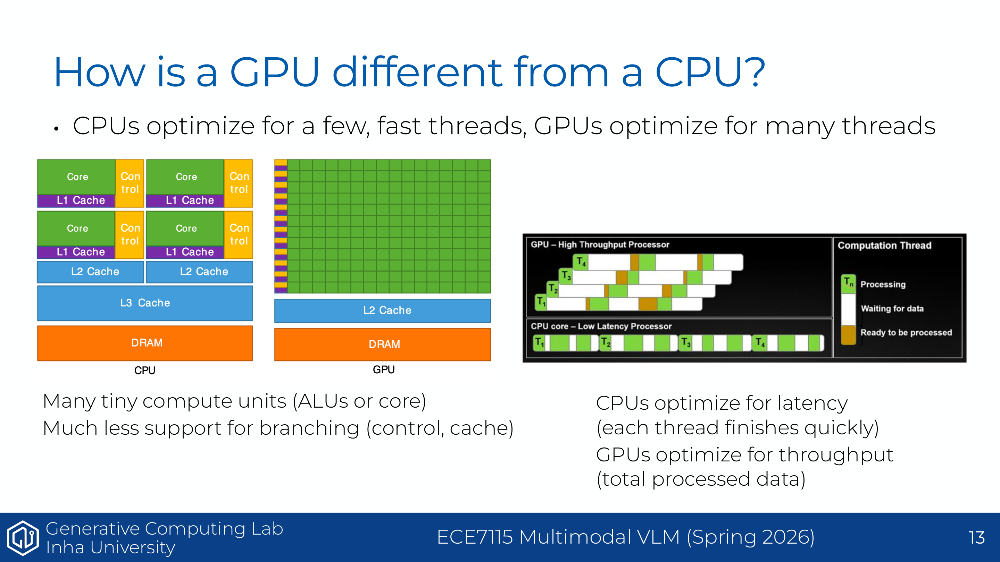

이 차이는 LLM workload와 잘 맞는다. Transformer의 핵심 연산은 대부분 matrix multiplication, vector operation, reduction이다. 이들은 많은 원소에 같은 연산을 반복 적용하므로 GPU의 SIMT/throughput 모델에 잘 맞는다. 반대로 thread마다 서로 다른 복잡한 분기나 작은 irregular 작업이 많아지면 GPU가 가진 수많은 ALU를 충분히 활용하지 못한다.

## Page 9. Anatomy of a GPU - execution units

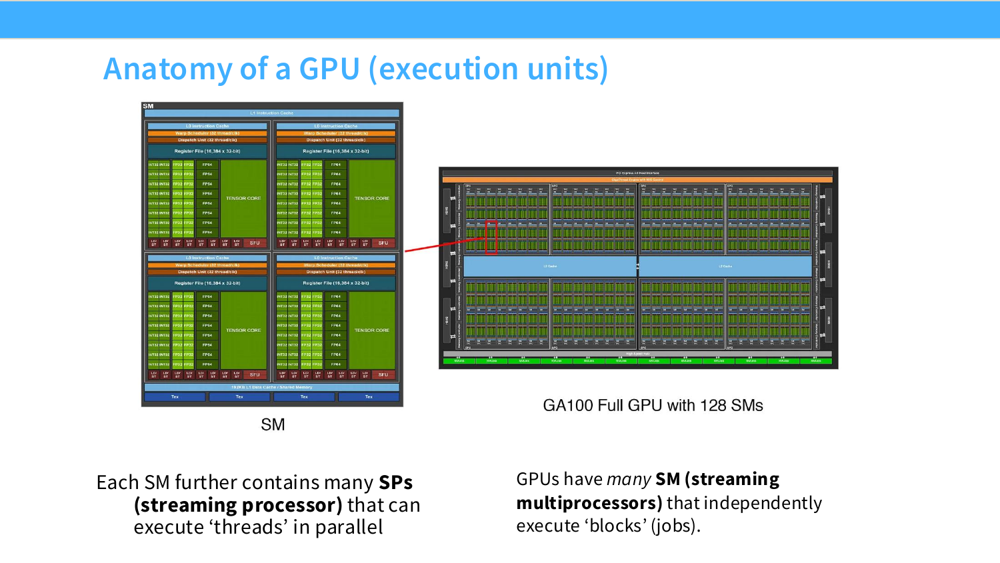


여기서 **SM**은 GPU 안의 작은 공장 하나라고 생각하면 된다. GPU 전체가 하나의 공장 단지가 아니라, 여러 개의 SM이라는 독립 작업장으로 이루어져 있다. 각 SM은 자기 안에 여러 실행 유닛, scheduler, register file, shared memory를 가지고 있고, CUDA block을 받아 실행한다.

**SP/CUDA core/ALU**는 실제 산술 연산을 수행하는 작은 계산기다. 다만 현대 GPU에서는 일반 CUDA core만 중요한 것이 아니라, 행렬곱을 전담하는 **Tensor Core**가 매우 중요하다. LLM에서는 대부분의 큰 FLOPs가 matrix multiplication에서 나오므로 Tensor Core를 얼마나 잘 쓰느냐가 실제 성능을 크게 좌우한다.

이 페이지는 GPU의 실행 단위를 설명한다. GPU는 여러 개의 **SM**(Streaming Multiprocessor)로 구성된다. 각 SM은 독립적으로 block이라는 작업 단위를 실행할 수 있다.

각 SM 내부에는 많은 **SP(streaming processor)** 또는 CUDA core가 있으며, 이들이 thread를 병렬로 실행한다. 따라서 GPU는 하나의 거대한 core가 아니라, 많은 SM들이 독립적으로 block을 처리하고, 각 SM 내부의 여러 실행 유닛이 thread를 처리하는 계층적 구조다.

개념적으로는 다음과 같이 볼 수 있다.

```math
\text{GPU}
\rightarrow
\text{many SMs}
\rightarrow
\text{many SPs/CUDA cores}
\rightarrow
\text{many threads}
```

여기서 중요한 점은 **GPU의 병렬성은 한 단계에서만 생기는 것이 아니라 여러 단계에서 동시에 생긴다**는 것이다. GPU 전체에는 여러 SM이 있고, 각 SM은 여러 block 또는 warp를 처리하며, 각 warp 안에는 32개 thread가 있다. 그리고 각 thread는 CUDA core나 Tensor Core가 처리할 작은 계산의 일부를 담당한다.

SM 내부 구성 요소를 조금 더 풀면 다음과 같다.

| SM 내부 요소           | 역할                                 | 직관                |
| ------------------ | ---------------------------------- | ----------------- |
| Warp scheduler     | 실행 가능한 warp를 고르고 instruction을 내보냄  | 작업반장              |
| Register file      | 각 thread의 임시 값을 저장                 | 작업자 개인 손안의 메모장    |
| CUDA core / ALU    | 일반 산술/논리 연산 수행                     | 작은 계산기            |
| Tensor Core        | matrix tile multiply-accumulate 수행 | 행렬곱 전용 기계         |
| Load/store unit    | memory load/store 명령 처리            | 창고와 작업대 사이의 운반 담당 |
| Shared memory / L1 | block-local 재사용과 cache             | SM 안의 공동 작업대      |

예를 들어 matmul kernel을 생각해보자. 전체 output matrix를 tile로 나누면, 각 tile은 어떤 block이 담당한다. 그 block은 하나의 SM에서 실행되고, block 안 thread들은 $A$와 $B$의 작은 tile을 shared memory에 올린다. 이후 Tensor Core가 그 tile을 이용해 multiply-accumulate를 수행한다. 이때 register에는 현재 계산 중인 fragment가 저장되고, warp scheduler는 준비된 warp들을 번갈아 실행한다.

이 구조를 이해하면 “GPU를 잘 쓴다”는 말의 의미가 더 명확해진다. 단순히 GPU에 tensor를 올린다고 빠른 것이 아니라, 충분히 많은 block을 만들어 여러 SM을 채우고, 각 SM 안에서 warp들이 놀지 않게 하고, Tensor Core가 처리할 만큼 큰 matmul을 제공해야 한다. 반대로 작은 연산을 너무 잘게 나누거나, 매번 HBM을 기다리게 만들면 GPU의 많은 실행 유닛이 idle 상태가 된다.

오른쪽의 GA100 full GPU 그림은 A100 계열 GPU가 128개의 SM을 가진다는 점을 보여준다. LLM workload에서 큰 batch와 큰 matrix multiplication이 중요한 이유는 이런 많은 SM들을 동시에 바쁘게 만들기 위해서다.

---
#### 보충 설명: Understanding GPUs 자료와 연결

보충 설명으로 보면, 해당 자료는 GPU 내부 실행 단위를 GA100 예시로 설명한다. GPU 전체에는 여러 개의 **SM**(Streaming Multiprocessor)이 있고, 각 SM은 block 단위의 일을 독립적으로 실행한다. SM 안에는 많은 execution lane과 register/shared memory가 있어, block 안의 여러 thread를 병렬로 처리한다.

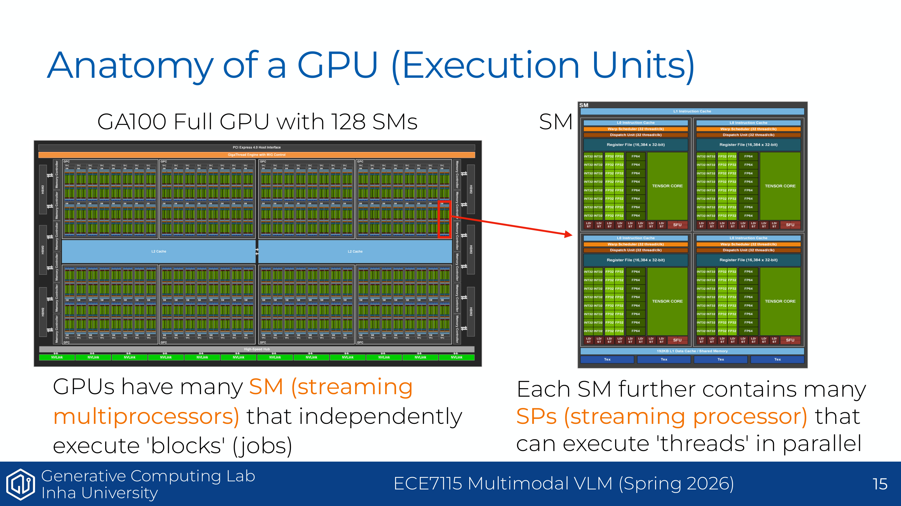

PyTorch에서 `torch.matmul(x, w)`를 호출하면 Python 코드가 직접 수천 개 thread를 만드는 것은 아니다. 내부적으로 CUDA kernel이 launch되고, 그 kernel이 grid/block/thread 구조로 GPU에 배치된다. 큰 matmul에서는 output matrix의 여러 tile이 block으로 나뉘고, 각 block이 특정 SM에 배정되어 자신의 tile을 계산한다.

## Page 10. Anatomy of a GPU - memory

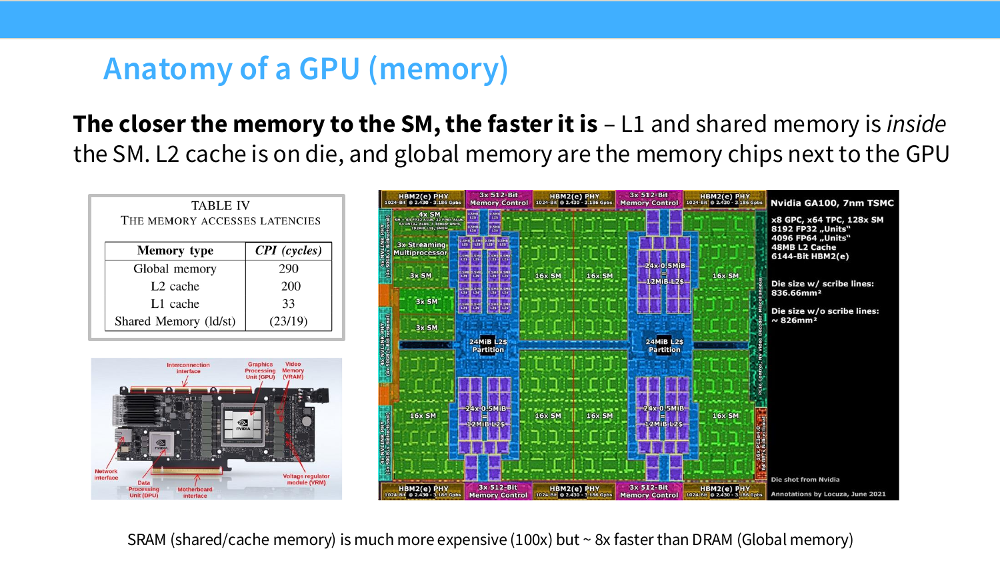


컴퓨터 구조를 처음 보면 memory 이름이 많아서 헷갈릴 수 있다. 가장 중요한 기준은 **가까운 memory는 빠르고 작다**, **먼 memory는 크고 느리다**이다. register는 thread 바로 옆에 있는 초고속 메모리이고, shared memory는 같은 block 안 thread들이 같이 쓰는 작은 작업대다. global memory 또는 HBM은 용량이 크지만 멀리 있는 창고라서 접근 비용이 크다.

예를 들어 요리를 한다고 하면, 손에 들고 있는 재료가 register, 같은 조리대 위에 놓은 재료가 shared memory, 주방 안 공용 선반이 L2 cache, 창고가 HBM이다. 창고를 왕복하는 횟수를 줄이고 조리대 위 재료를 재사용할수록 요리가 빨라지는 것처럼, GPU kernel도 HBM 접근을 줄이고 shared memory/register 재사용을 늘릴수록 빨라진다.

이 페이지는 GPU memory hierarchy를 설명한다. 핵심 원리는 **SM에 가까운 memory일수록 빠르지만 작고 비싸다**는 것이다.

- register: 각 thread가 사용하는 가장 가까운 저장 공간
- shared memory / L1 cache: SM 내부에 있는 빠른 memory
- L2 cache: GPU die 위에 있는 공유 cache
- global memory / HBM: GPU 옆 memory chip에 있는 큰 memory

각 memory 계층은 “누가 볼 수 있는가”와 “얼마나 빠른가”가 다르다. register는 thread 개인용이라 가장 빠르지만 다른 thread가 직접 볼 수 없다. shared memory는 같은 block 안 thread들이 함께 볼 수 있으므로 협업에 적합하다. L2 cache는 여러 SM이 공유하는 중간 완충 공간이고, global memory/HBM은 모든 block이 접근할 수 있는 큰 저장소다.

| Memory | 접근 범위 | 누가 관리하나 | 빠르기/크기 | 예시 |
|---|---|---|---|---|
| Register | thread private | compiler/hardware | 가장 빠름, 매우 작음 | 누산 중인 scalar, tile fragment |
| Shared memory | block 내부 thread 공유 | programmer/kernel이 명시적으로 사용 | 빠름, 작음 | matmul tile, attention block |
| L1 cache | SM 근처 | hardware 자동 관리 | 빠름, 작음 | global load 캐싱 |
| L2 cache | GPU 전체 SM 공유 | hardware 자동 관리 | 중간 속도, 중간 크기 | weight/KV cache 재사용 완충 |
| Global memory/HBM | 모든 thread/block | programmer가 tensor 배치, hardware가 접근 | 큼, 느림 | model weights, activations, KV cache |

여기서 `shared memory / L1 cache`라고 같이 쓰는 이유는 둘 다 SM 가까이에 있는 on-chip SRAM 계층이기 때문이다. 하지만 둘은 같은 말이 아니다. **Shared memory는 프로그래머가 직접 올려놓고 쓰는 block-local scratchpad**이고, **L1 cache는 hardware가 자동으로 관리하는 cache**다. 일부 GPU에서는 같은 물리 SRAM pool을 설정에 따라 shared memory와 L1 cache로 나눠 쓰지만, CUDA 프로그래밍 관점에서는 역할이 다르다.

VRAM, global memory, HBM의 관계도 정리해둘 필요가 있다. **Global memory**는 CUDA가 보는 논리적 주소 공간이고, **VRAM/HBM**은 그 데이터가 실제로 저장되는 물리적 GPU 메모리다. **HBM**은 VRAM을 구현하는 기술 중 하나이며, 데이터센터 GPU에서 높은 bandwidth를 얻기 위해 많이 사용된다.

```math
\text{CUDA global memory} \approx \text{GPU VRAM/HBM에 저장되는 큰 device memory}
```

슬라이드의 latency 표는 global memory가 매우 느리고, shared memory가 훨씬 빠르다는 점을 보여준다. 또한 SRAM(shared/cache memory)은 DRAM(global memory)보다 훨씬 비싸지만 더 빠르다. 따라서 빠른 GPU 알고리즘은 같은 데이터를 global memory에서 반복해서 읽지 않고, shared memory/register에 올려서 재사용하려 한다.

이 관점은 뒤에서 나오는 tiling과 FlashAttention의 핵심이 된다.

```math
\text{느린 HBM 접근을 줄이고, 빠른 SRAM/shared memory 재사용을 늘린다.}
```

---
#### 보충 설명: Understanding GPUs 자료와 연결

보충 자료의 memory slide는 A100 기준으로 DRAM/HBM 80GB, L2 40MB, L1/shared memory 약 192KB per SM처럼 크기 차이를 구체적으로 보여준다. 여기서 숫자 자체보다 중요한 것은 **가까운 메모리일수록 빠르지만 작고, 먼 메모리일수록 크지만 느리다**는 계층 구조다.

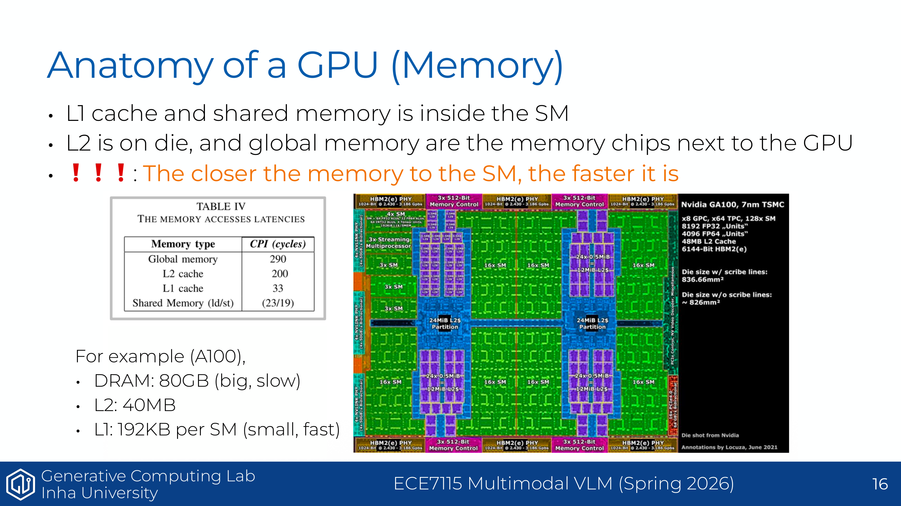

LLM 연산을 최적화할 때 “메모리를 줄인다”는 말은 단순히 VRAM 용량을 아낀다는 뜻만은 아니다. 같은 tensor를 HBM에서 여러 번 읽고 쓰면, compute unit은 충분히 있는데 데이터 이동이 느려서 기다리게 된다. 따라서 성능 최적화는 다음 질문으로 바뀐다.

```math
\text{한 번 HBM에서 가져온 데이터를 register/shared memory에서 얼마나 많이 재사용할 수 있는가?}
```

이 질문에 대한 대표 답이 tiling이고, attention에 적용한 대표 사례가 FlashAttention이다.

## Page 11. Execution model of a GPU

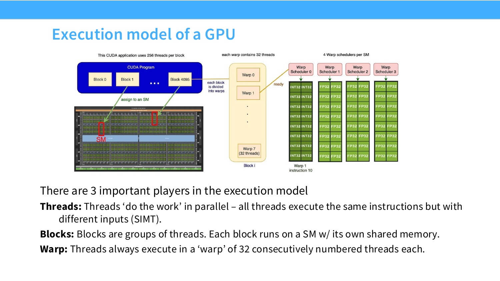

이 페이지는 CUDA를 처음 볼 때 가장 중요한 구조다. CUDA kernel을 실행하면 하나의 거대한 grid가 만들어지고, grid 안에는 많은 block이 있으며, 각 block 안에는 많은 thread가 있다. block은 보통 하나의 SM에 배정되어 실행된다. 그래서 같은 block 안 thread들은 같은 SM 안의 shared memory를 공유할 수 있지만, 서로 다른 block 사이에서는 shared memory를 직접 공유할 수 없다.

작은 예시를 들어보자. $1024 \times 1024$ 행렬의 각 원소에 ReLU를 적용한다고 하자. 전체 원소 수는 약 100만 개다. 이때 block 하나가 256개 thread를 가진다면, 대략 4096개 block을 만들어 전체 원소를 나눠 처리할 수 있다. 각 thread는 자신에게 배정된 index의 원소를 읽고, ReLU를 계산하고, 결과를 쓴다. 이처럼 thread는 “실제 일을 하는 작업자”, block은 “작업자 팀”, grid는 “전체 작업 계획”이다.

이 페이지는 CUDA execution model의 세 주체를 설명한다. 첫째, **thread**는 실제 일을 수행하는 최소 실행 단위다. 둘째, **block**은 thread들의 묶음이며, 하나의 block은 하나의 SM에서 실행되고 block 내부 thread들은 shared memory를 공유할 수 있다. 셋째, **warp**는 32개의 연속된 thread 묶음이며, 실제 실행은 warp 단위로 일어난다.

GPU의 실행 모델은 SIMT(Single Instruction, Multiple Threads)다. 즉 여러 thread가 같은 instruction을 실행하지만, 각 thread는 다른 input을 처리한다. 이는 벡터화와 비슷하지만, 프로그래밍 모델은 thread 단위로 작성한다는 점이 다르다.

여기서 “같은 instruction을 실행하지만 다른 input을 처리한다”는 말은 다음 예시로 이해하면 된다. CUDA kernel 안에 다음과 같은 코드가 있다고 하자.

```cuda
y[i] = x[i] * 2 + 1;
```

이 코드는 모든 thread가 동일하게 실행하는 코드다. 하지만 thread마다 자신의 index `i`가 다르다. NVIDIA GPU에서 하나의 warp는 보통 32개 thread이므로, warp 하나가 이 instruction을 실행하면 다음과 같은 일이 일어난다.

```text
Warp = 32개 thread 묶음

공통 instruction:
"각자 자기 위치의 x[i]를 읽고, 2를 곱한 뒤 1을 더해 y[i]에 저장하라."

Thread 0  -> x[0]  읽고 y[0]  계산
Thread 1  -> x[1]  읽고 y[1]  계산
Thread 2  -> x[2]  읽고 y[2]  계산
...
Thread 31 -> x[31] 읽고 y[31] 계산
```

즉 **instruction은 같고, 데이터 주소만 thread별로 다르다.** 이 패턴이 GPU가 가장 좋아하는 data parallelism이다. 같은 연산을 큰 tensor의 많은 원소에 반복 적용하는 ReLU, elementwise add, matmul tile 계산이 GPU에 잘 맞는 이유가 여기에 있다.

반대로 같은 warp 안의 thread들이 서로 다른 instruction 흐름을 타면 문제가 생긴다. 예를 들어 어떤 thread는 `if` branch를 실행하고, 다른 thread는 `else` branch를 실행해야 하면, warp는 두 branch를 동시에 실행하지 못하고 한쪽 branch를 먼저 실행한 뒤 다른 branch를 실행한다. 이때 해당 branch에 속하지 않는 thread는 잠시 idle 상태가 된다. 이것이 뒤에서 설명하는 **control divergence**다.

구조를 정리하면 다음과 같다.

```math
\text{Grid} \supset \text{Blocks} \supset \text{Warps} \supset \text{Threads}
```

warp가 중요한 이유는 뒤의 control divergence와 memory coalescing 때문이다. 같은 warp 안 thread들은 함께 움직이므로, 서로 다른 branch를 타거나 서로 멀리 떨어진 memory를 읽으면 성능이 떨어진다.

---
#### 보충 설명: Understanding GPUs 자료와 연결

보충 설명으로 보면, 해당 자료는 GPU execution model을 thread, thread block, warp 세 단위로 정리한다. CUDA 프로그래밍에서 thread는 논리적으로 가장 작은 작업자이고, thread block은 thread의 묶음이며, warp는 실제 hardware가 실행하는 32개 thread 묶음이다.

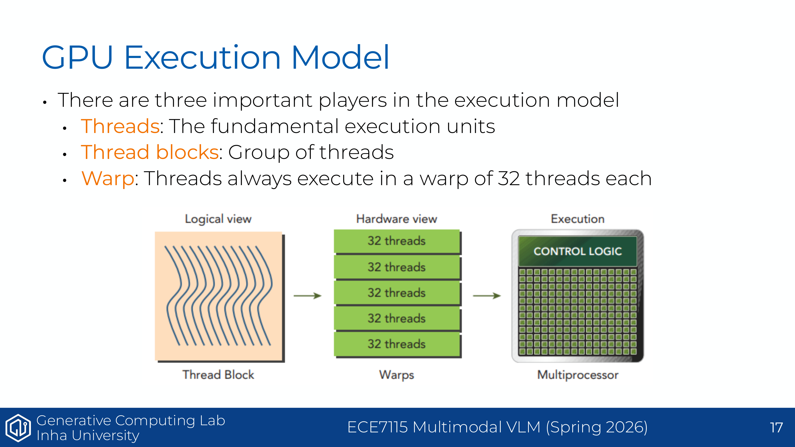

논리적으로는 block 안에 thread가 많이 있는 것처럼 보이지만, 실제 하드웨어는 이 thread들을 32개 단위 warp로 나누어 실행한다. scheduler는 warp에 instruction 하나를 broadcast하고, warp 안의 thread들은 서로 다른 데이터에 같은 instruction을 수행한다.

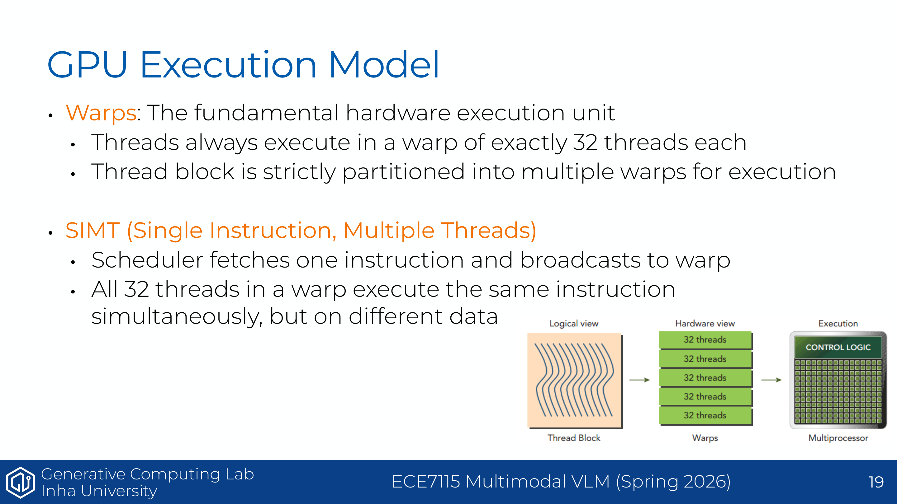

예를 들어 warp의 32개 thread가 각각 vector의 서로 다른 index에 대해 `y[i] = x[i] * 2 + 1`을 계산한다면 GPU는 매우 효율적으로 실행한다. 반대로 16개 thread는 `if` branch, 나머지 16개 thread는 `else` branch를 실행해야 한다면 같은 warp가 한 번에 한 경로만 실행할 수 있어 일부 thread가 idle 상태가 된다. 이것이 control divergence다.

## Page 12. Memory model of a GPU

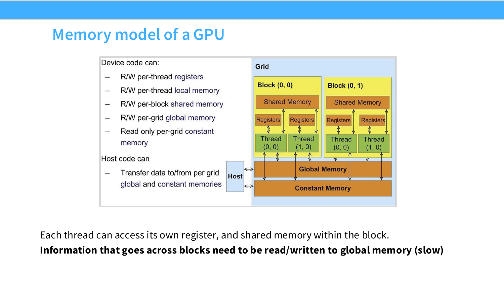

여기서 중요한 것은 memory의 **scope**다. register는 thread 개인 소유라서 가장 빠르지만 다른 thread가 직접 볼 수 없다. shared memory는 block 단위로 공유되므로 같은 block 안 thread들이 협업할 때 유용하다. global memory는 모든 block이 접근할 수 있지만 느리다.

따라서 GPU 알고리즘은 보통 다음 방식으로 설계된다. 먼저 global memory에서 필요한 데이터를 block 단위로 가져와 shared memory에 올린다. 그다음 block 내부 thread들이 shared memory의 데이터를 여러 번 재사용한다. 마지막으로 결과만 global memory에 쓴다. 이 패턴이 뒤에서 나오는 tiling과 FlashAttention의 기본 골격이다.

이 페이지는 GPU memory model을 설명한다. 각 thread는 자신의 register를 사용할 수 있고, 같은 block 안 thread들은 shared memory를 공유할 수 있다. 하지만 block을 넘어서는 정보 교환은 global memory를 통해야 한다.

그림에서 block마다 shared memory와 register가 따로 있고, 모든 block이 global memory를 통해 연결된다. 따라서 block 내부 통신은 비교적 빠르지만, block 간 통신은 느리다.

이 구조 때문에 CUDA 알고리즘 설계에서는 다음 질문이 중요하다.

```math
\text{어떤 데이터를 block 내부 shared memory에 올려서 재사용할 수 있는가?}
```

matrix multiplication의 tiling은 이 질문의 대표적 답이다. 여러 thread가 반복해서 읽을 matrix tile을 global memory에서 한 번만 읽어 shared memory에 올리고, 이후에는 빠른 shared memory에서 재사용한다.

---
#### 보충 설명: Understanding GPUs 자료와 연결

보충 자료의 memory model 그림은 thread/block/grid별로 접근 가능한 memory 범위를 보여준다. 각 thread는 자신의 register를 사용하고, 같은 block 안의 thread들은 shared memory를 통해 빠르게 협업할 수 있다. 그러나 block을 넘어서는 정보 교환은 global memory를 거쳐야 하므로 훨씬 비싸다.

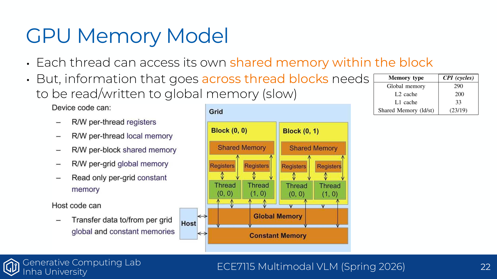

이 구조 때문에 GPU kernel을 설계할 때는 “한 block 내부에서 해결할 수 있는 일”과 “block 간 communication이 필요한 일”을 구분해야 한다. Matmul tiling이 강력한 이유도 output tile 하나를 계산하는 데 필요한 대부분의 협업을 block 내부  shared memory에서 처리할 수 있기 때문이다. 반대로 block 간 synchronization이나 global memory 왕복이 잦은 알고리즘은 GPU에서 느려지기 쉽다.

## Page 13. Side thread - What about TPUs?

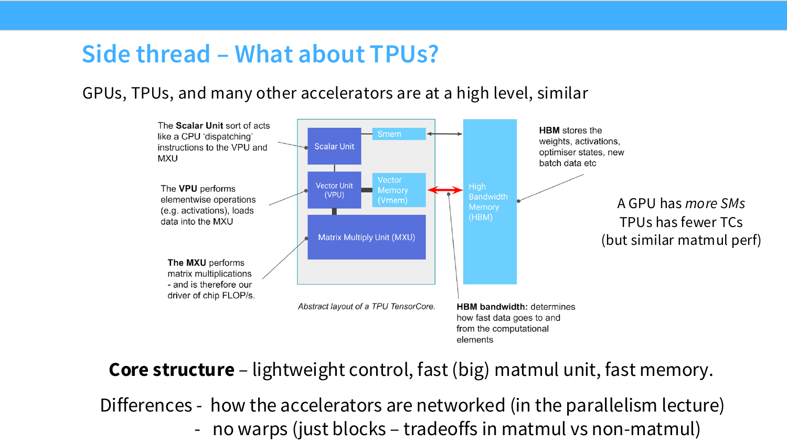


TPU를 처음 보면 GPU와 완전히 다른 장치처럼 보이지만, ML workload 관점에서는 공통점이 많다. 둘 다 일반 CPU처럼 복잡한 branch와 운영체제 작업을 잘 처리하려는 장치가 아니라, 대량의 tensor 연산, 특히 matrix multiplication을 빠르게 처리하려는 accelerator다.

TPU의 **MXU**(Matrix Multiply Unit)는 GPU의 Tensor Core와 비슷한 역할을 한다. 즉 큰 행렬곱을 매우 빠르게 수행하는 전용 회로다. 반면 GPU는 더 많은 SM과 warp 기반 실행 모델을 가지고 있어서 matmul 외의 다양한 kernel을 상대적으로 유연하게 처리할 수 있다. 그래서 TPU는 “큰 matmul에 강한 전용 장치”, GPU는 “matmul도 강하고 범용 kernel도 더 유연한 accelerator” 정도로 직관화할 수 있다.

이 페이지는 GPU와 TPU를 비교한다. 강의의 핵심은 GPU와 TPU가 고수준에서는 유사한 accelerator라는 점이다. 둘 다 lightweight control, 빠른 큰 matmul unit, 빠른 memory를 중심으로 설계된다.

그림은 TPU 내부 구조를 scalar unit, vector unit, matrix multiply unit(MXU), HBM으로 나누어 보여준다. TPU에서 MXU는 matrix multiplication을 담당하는 핵심 장치이고, HBM은 weight, activation, optimizer state 등을 저장한다.

차이는 execution granularity와 네트워킹 구조에 있다. GPU는 많은 SM을 가지고 warp 단위 실행 모델을 사용한다. TPU는 상대적으로 적은 tensor core 또는 MXU를 가지고, warp 개념 없이 block 중심으로 동작한다. 이 차이는 matmul에는 강하지만 non-matmul operation에서는 trade-off를 만들 수 있다.

---
#### 보충 설명: Understanding GPUs 자료와 연결

보충 설명으로 보면, 해당 자료는 TPU도 GPU와 완전히 다른 세계가 아니라, high level에서는 비슷한 accelerator라고 설명한다. 핵심 구조는 **가벼운 control**, **큰 matmul unit**, **빠른 memory**다. 차이는 GPU는 많은 SM과 warp 기반 실행 모델을 갖고, TPU는 TensorCore에 대응되는 MXU(Matrix Multiply Unit)와 systolic-array 계열 구조를 중심으로 설계되며, warp 개념은 없다는 점이다.

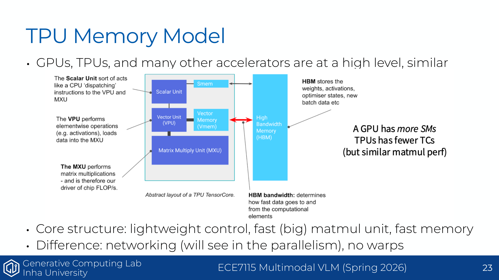

이 관점에서 보면 GPU/TPU 모두 LLM을 빠르게 실행하려면 결국 같은 질문을 피할 수 없다.

```math
\text{matmul unit은 충분히 바쁜가?}
\qquad
\text{memory에서 데이터를 제때 공급하는가?}
```

즉 accelerator 종류가 달라도, arithmetic intensity와 memory movement를 보는 관점은 계속 유효하다.

## Page 14. Side thread - What about TPUs? - mapping table

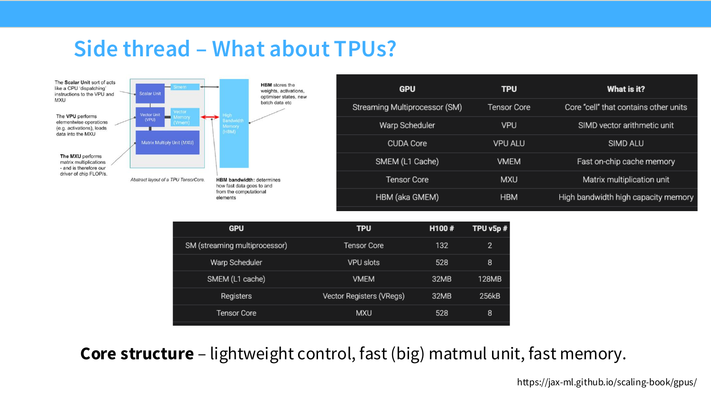


이 표는 이름이 다른 부품들이 실제로는 어떤 역할을 하는지 대응시키는 페이지다. 예를 들어 GPU의 SM은 여러 연산 유닛과 memory를 포함하는 작업장이고, TPU의 Tensor Core도 비슷하게 하나의 큰 계산 타일 역할을 한다. GPU의 Tensor Core와 TPU의 MXU는 둘 다 matrix multiplication 전용 회로에 가깝다.

처음 읽을 때는 모든 이름을 외우려고 하기보다 다음 대응만 기억해도 충분하다.

| 역할 | GPU 쪽 이름 | TPU 쪽 이름 | 직관 |
|---|---|---|---|
| 작업장 | SM | Tensor Core | block/tile을 처리하는 큰 단위 |
| 작은 벡터/스칼라 연산 | CUDA core, ALU | VPU/ALU | matmul 외의 보조 연산 |
| 행렬곱 전용 회로 | Tensor Core | MXU | LLM FLOPs의 핵심 엔진 |
| 빠른 내부 메모리 | shared memory/L1 | VMEM | 가까운 작업대 |
| 큰 외부 메모리 | HBM | HBM | 큰 창고 |

이 페이지는 GPU와 TPU 용어를 대응시킨다. 표는 GPU의 SM이 TPU의 Tensor Core에, warp scheduler가 TPU의 VPU, CUDA core가 TPU의 VPU ALU, shared memory/L1 cache가 VMEM, Tensor Core가 MXU, HBM이 HBM에 대응된다는 식으로 정리한다.

핵심은 이름은 다르지만, 구조적 역할은 비슷하다는 것이다. accelerator는 대체로 다음 세 요소를 가진다.

1. lightweight control
2. 큰 matmul unit
3. 높은 bandwidth memory

슬라이드 하단 표는 H100과 TPU v5p의 대략적 구성을 비교한다. GPU는 SM이 더 많고, TPU는 더 적은 수의 큰 tensor core/MXU를 가진다. 따라서 동일한 matmul throughput을 내더라도 세부 성능 병목은 다르게 나타날 수 있다. 관련 자료는 [JAX scaling book - GPUs](https://jax-ml.github.io/scaling-book/gpus/)이다.

---

## Page 15. Strengths of the GPU model

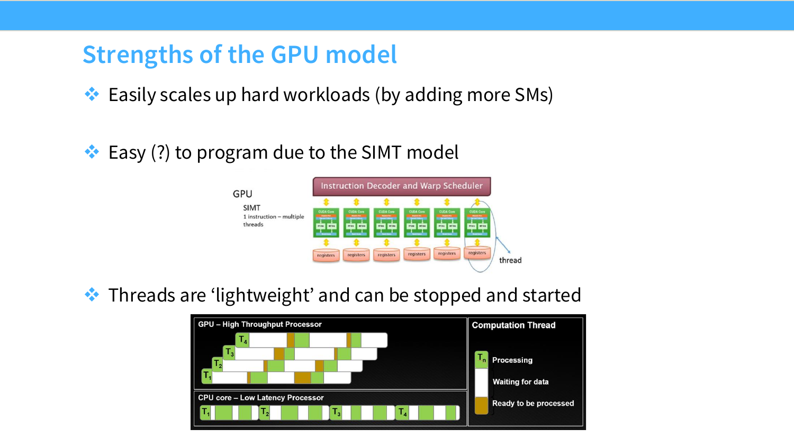

이 페이지는 GPU 모델의 장점을 세 가지로 정리한다.

첫째, hard workload를 쉽게 scale up할 수 있다. SM을 더 많이 넣으면 병렬 처리량이 증가한다. 둘째, SIMT 모델 덕분에 프로그래밍이 상대적으로 쉽다. 개발자는 thread 단위로 코드를 작성하지만, GPU는 내부적으로 warp 단위로 실행한다. 셋째, thread가 lightweight하다. GPU는 많은 thread를 실행하고, 일부 thread가 memory를 기다릴 때 다른 thread를 실행해 latency를 숨길 수 있다.

이 구조는 GPU가 latency를 줄이는 장치가 아니라, latency를 많은 thread로 숨겨 전체 throughput을 높이는 장치라는 점을 보여준다.

```math
\text{GPU performance} \approx \text{many lightweight threads} + \text{high throughput units} + \text{latency hiding}
```

---

## Page 16. GPUs as fast matrix multipliers

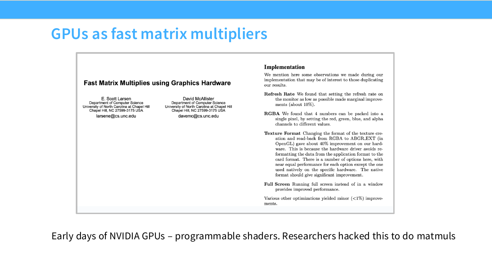

이 페이지는 GPU가 matrix multiplication accelerator로 발전해온 배경을 설명한다. 초기 NVIDIA GPU는 programmable shader 중심이었다. 원래는 그래픽스 계산을 위한 장치였지만, 연구자들이 shader를 활용해 matrix multiplication을 수행하기 시작했다.

슬라이드에 있는 “Fast Matrix Multiplies using Graphics Hardware” 자료는 GPU가 범용 수치 계산, 특히 matmul에 쓰이기 시작한 초기 사례를 보여준다. LLM에서 matmul은 거의 모든 핵심 연산의 중심이다. Linear projection, attention score, MLP 모두 큰 matmul로 구현된다.

따라서 GPU의 발전은 곧 matmul을 빠르게 하는 방향으로 진행되었고, 다음 페이지에서 등장하는 Tensor Core가 이 흐름을 결정적으로 가속했다.

---

## Page 17. New matmul hardware means matmuls are fast and special

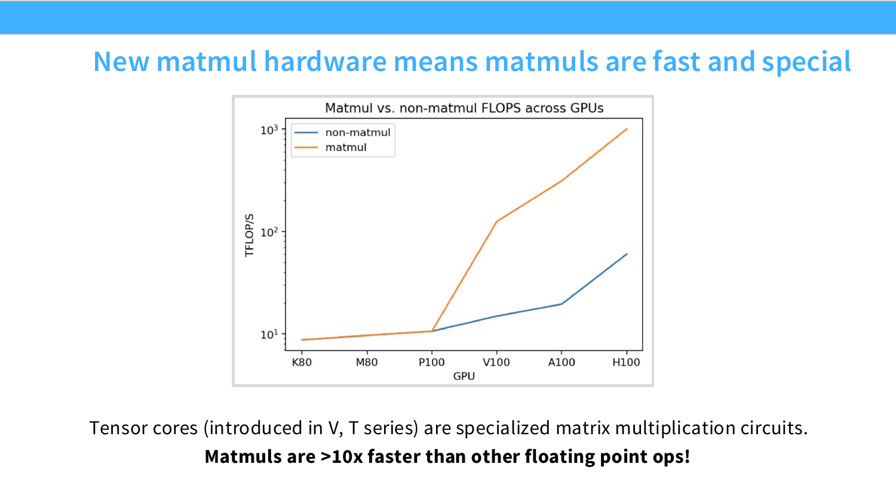

이 페이지는 Tensor Core의 중요성을 설명한다. Tensor Core는 Volta, Turing 세대부터 도입된 특수 matrix multiplication 회로다. 일반 CUDA core가 scalar/vector floating point operation을 처리한다면, Tensor Core는 작은 matrix tile의 multiply-accumulate를 매우 빠르게 수행한다.

그림은 GPU 세대가 올라갈수록 matmul FLOPs가 non-matmul FLOPs보다 훨씬 빠르게 증가했음을 보여준다. 슬라이드의 핵심 문장은 “**Matmuls are >10x faster than other floating point ops**”이다.

이 말은 LLM kernel 설계에서 매우 중요하다. 현대 GPU는 matmul을 엄청 빠르게 처리하지만, non-matmul pointwise operation, memory movement, synchronization은 상대적으로 비싸다. 따라서 빠른 모델 구현은 가능하면 연산을 matmul 중심으로 만들고, matmul 사이의 data movement를 줄여야 한다.

---
#### 보충 설명: Understanding GPUs 자료와 연결

보충 설명으로 보면, 해당 자료는 Tensor Core가 왜 중요한지도 명확하게 연결한다. 초기 GPU는 programmable shader를 “해킹하듯” matmul에 활용했지만, 이후 NVIDIA는 Volta/Turing 계열부터 matrix multiplication 전용 회로인 Tensor Core를 본격적으로 도입했다.

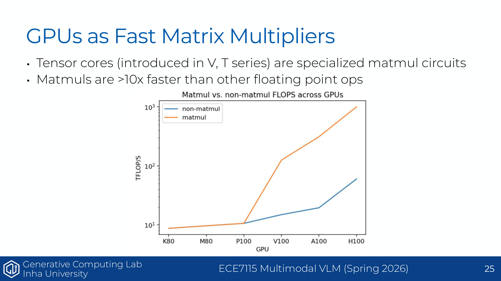

그래프의 핵심은 matmul FLOP/s가 non-matmul FLOP/s보다 훨씬 빠르게 증가했다는 점이다. 그래서 현대 GPU에서는 “FLOPs가 많다”는 말이 모든 연산에 똑같이 적용되지 않는다. Tensor Core가 잘 처리하는 큰 matmul은 매우 빠르지만, elementwise op, reduction, irregular memory access는 상대적으로 느릴 수 있다.

이 차이는 LLM 최적화에서 중요하다. Transformer의 큰 linear projection과 FFN은 Tensor Core 친화적인 matmul이지만, softmax, layer norm, dropout, masking 같은 연산은 memory-bound이거나 non-matmul 성격이 강하다. **FlashAttention은 바로 이 비싼 non-matmul/IO 부분을 줄이는 방향으로 설계된다.**

## Page 18. Compute scaling is faster than memory scaling

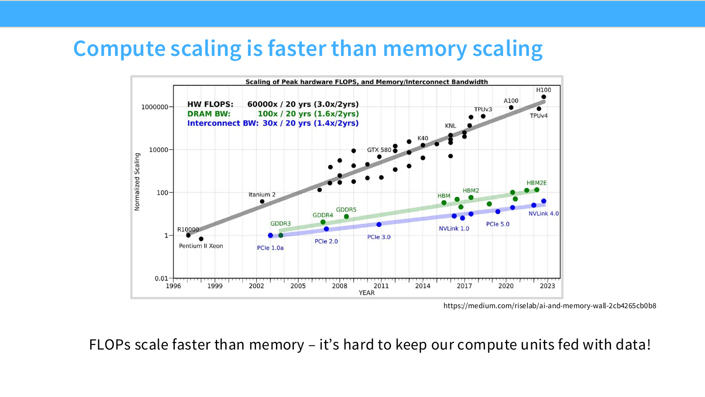

이 페이지는 memory wall 문제를 보여준다. 그래프는 peak hardware FLOPs가 DRAM bandwidth와 interconnect bandwidth보다 훨씬 빠르게 증가했음을 보여준다. 즉 GPU의 계산 능력은 크게 증가했지만, 데이터를 공급하는 속도는 그만큼 증가하지 않았다.

이 때문에 현대 GPU 성능 병목은 자주 다음 형태가 된다.

```math
\text{Tensor Core는 계산할 준비가 되어 있지만, 데이터가 HBM에서 아직 도착하지 않음}
```

즉 compute unit을 먹여 살리는 것이 어려워진다. 이것이 arithmetic intensity와 roofline model이 중요한 이유다. 같은 FLOPs라도 데이터를 많이 움직이면 memory-bound가 되고, 데이터를 재사용해 계산을 많이 하면 compute-bound에 가까워진다. 관련 링크는 [AI and Memory Wall](https://medium.com/riselab/ai-and-memory-wall-2cb4265cb0b8)이다.

---
#### 보충 설명: Understanding GPUs 자료와 연결

보충 자료의 compute scaling vs memory scaling 그림은 GPU 최적화가 왜 memory movement 중심이 되는지를 보여준다. Peak FLOP/s는 빠르게 증가했지만, DRAM bandwidth와 interconnect bandwidth는 그보다 훨씬 느리게 증가했다.

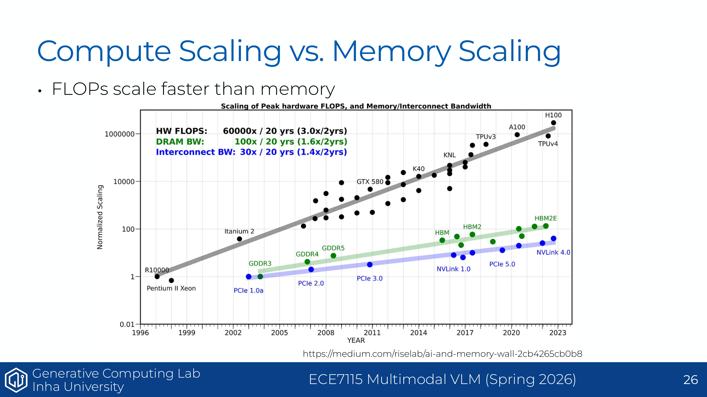

따라서 현대 GPU에서는 계산 능력 자체보다 데이터를 가져오는 속도가 병목이 되는 경우가 많다. 이를 흔히 **memory wall**이라고 부른다. Tensor Core가 아무리 빠르게 곱셈-덧셈을 처리할 수 있어도, 필요한 데이터를 HBM에서 제때 공급하지 못하면 SM은 idle 상태가 된다.

이후 등장하는 low precision, fusion, recomputation, coalescing, tiling은 모두 memory wall을 우회하는 방식이다. 각각의 목적은 다르지만 공통적으로 다음 둘 중 하나를 한다.

```math
\text{Bytes moved를 줄인다}
\quad \text{or} \quad
\text{한 번 옮긴 byte로 더 많은 FLOPs를 수행한다}
```

## Page 19. Recap: GPUs - what are they and how do they work

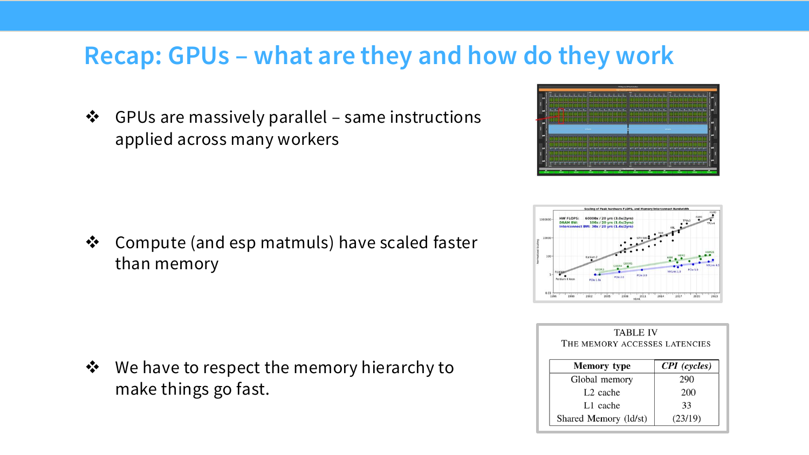

Part 1의 요약 페이지다. 세 가지 메시지를 정리한다.

첫째, GPU는 massively parallel 장치다. 같은 instruction을 많은 worker에게 적용하는 방식으로 throughput을 높인다. 둘째, compute, 특히 matmul 성능은 memory보다 훨씬 빠르게 scaling되었다. 셋째, 따라서 GPU를 빠르게 쓰려면 memory hierarchy를 존중해야 한다.

이 요약은 이후 Part 2로 자연스럽게 이어진다. 앞으로의 질문은 단순하다.

```math
\text{어떻게 global memory 접근을 줄이고, 데이터를 재사용하며, Tensor Core를 바쁘게 만들 것인가?}
```

이 질문의 답으로 low precision, fusion, recomputation, coalescing, tiling이 등장한다.

---

## Page 20. Part 2: Making ML workloads fast on a GPU

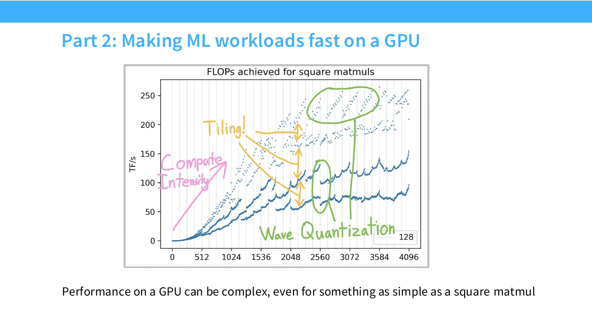

Part 2는 GPU에서 ML workload를 빠르게 만드는 방법을 다룬다. 슬라이드의 square matmul 그래프는 동일한 종류의 연산인 matrix multiplication에서도 matrix size에 따라 achieved FLOP/s가 크게 달라짐을 보여준다.

그래프에는 tiling, compute intensity, wave quantization 같은 주석이 있다. 이는 GPU performance가 단순히 연산량으로만 결정되지 않고, tile shape, memory alignment, SM occupancy, matmul kernel 선택 등에 의해 복잡하게 달라진다는 뜻이다.

이 파트의 목표는 이 복잡한 그래프를 이해할 수 있는 개념적 도구를 얻는 것이다.

---

## Page 21. What makes ML workloads fast? The roofline model

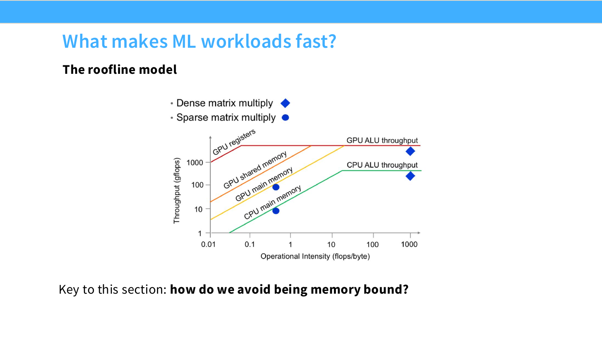


roofline model은 하드웨어 성능을 이해하기 위한 가장 직관적인 그림이다. 쉽게 말하면 GPU에서 프로그램이 느려지는 이유는 크게 두 가지다. 첫째, 계산기가 부족해서 느릴 수 있다. 이것이 **compute-bound**다. 둘째, 계산기는 놀고 있는데 데이터가 memory에서 늦게 와서 느릴 수 있다. 이것이 **memory-bound**다.

여기서 arithmetic intensity는 “데이터를 1 byte 가져올 때 계산을 얼마나 많이 하는가”다. 예를 들어 ReLU는 원소를 읽고 쓰는 데 비해 계산이 거의 없으므로 intensity가 낮다. 반대로 큰 matmul은 한 번 가져온 값을 여러 곱셈-덧셈에 재사용할 수 있어 intensity가 높다. 그래서 roofline model은 이후 low precision, fusion, tiling, FlashAttention을 하나의 관점으로 묶어준다.

이 페이지는 roofline model을 소개한다. roofline model은 workload의 성능이 두 가지 상한 중 작은 값으로 제한된다고 본다.

```math
\text{Achievable performance}
=
\min\left(P_{\text{peak}},\ I \cdot B_{\text{mem}}\right)
```

여기서 $P_{\text{peak}}$는 GPU의 peak compute throughput이고, $B_{\text{mem}}$은 memory bandwidth, $I$는 arithmetic intensity다.

```math
I = \frac{\text{FLOPs}}{\text{Bytes moved}}
```

왼쪽 기울어진 선은 memory bandwidth가 병목인 영역이다. 이 영역에서는 arithmetic intensity가 낮아 데이터를 많이 옮기고 계산은 적게 한다. 오른쪽 수평선은 compute peak가 병목인 영역이다. 이 영역에서는 memory는 충분히 공급되고 compute unit이 최대 속도에 가까워진다.

슬라이드의 핵심 질문은 “**how do we avoid being memory bound?**”이다. 이후 기법들은 대부분 memory-bound를 피하거나 완화하는 방법이다.

---
#### 보충 설명: Understanding GPUs 자료와 연결

보충 설명으로 보면, 해당 자료는 execution time을 다음처럼 매우 단순한 식으로 설명한다.

```math
T_{\text{compute}}=\frac{\text{FLOPs}}{P_{\text{peak}}},
\qquad
T_{\text{comm}}=\frac{\text{Bytes moved}}{B_{\text{mem}}}
```

계산과 통신이 완벽히 overlap된다고 이상화하면 전체 시간은 대략 둘 중 큰 값에 의해 결정된다.

```math
T_{\text{total}}\approx \max(T_{\text{compute}},T_{\text{comm}})
```

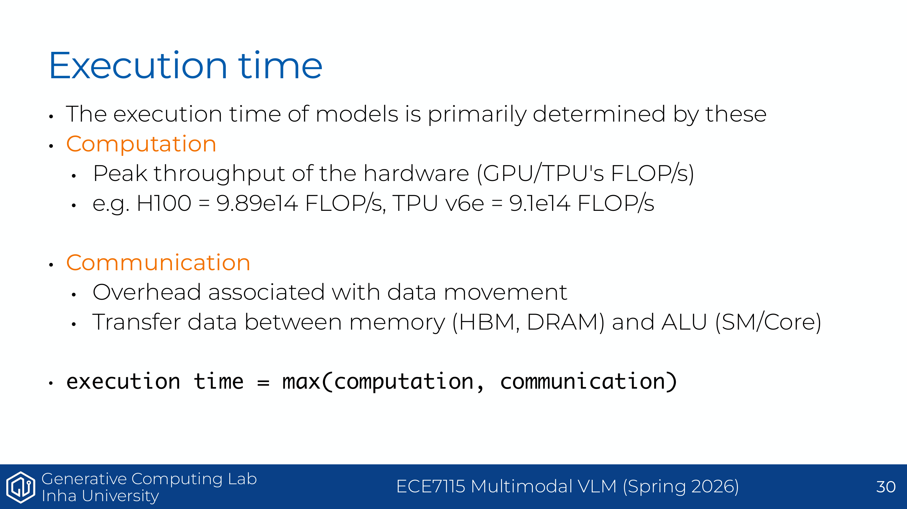

Arithmetic intensity는 이 둘의 상대적 크기를 한 숫자로 압축한다.

```math
I=\frac{\text{FLOPs}}{\text{Bytes moved}}
```

하드웨어도 자기만의 기준 intensity를 갖는다. 보충 자료에서는 H100의 ridge point를 약 $295\ \text{FLOPs/Byte}$로 둔다. workload의 intensity가 이보다 낮으면 memory bandwidth가 병목이고, 이보다 높으면 compute throughput이 병목이다.

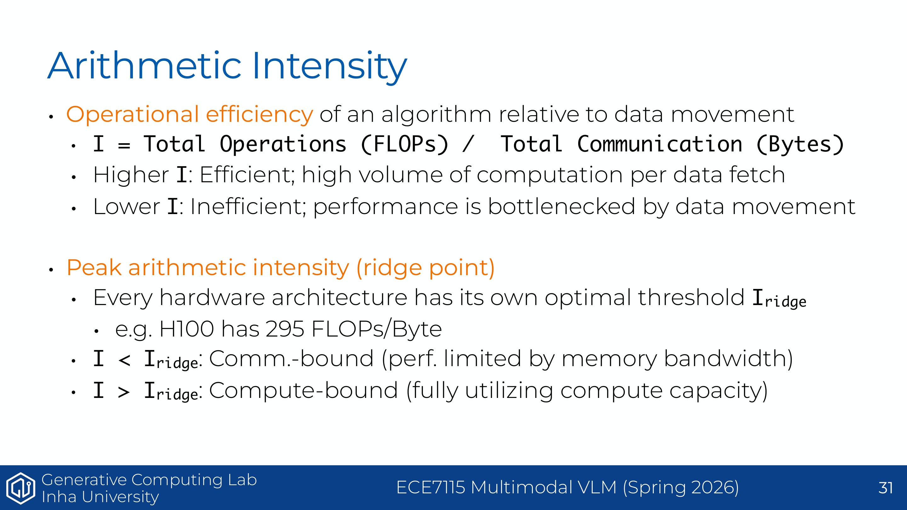

예를 들어 ReLU는 원소 하나를 읽고 쓰지만 계산은 비교 한 번 정도라 intensity가 매우 낮다. 반면 큰 matmul은 한 번 읽은 값을 여러 output 계산에 재사용하므로 intensity가 높다. 따라서 같은 GPU에서도 ReLU는 memory-bound, 큰 matmul은 compute-bound에 가까울 수 있다.

## Page 22. How do we make GPUs go fast? 

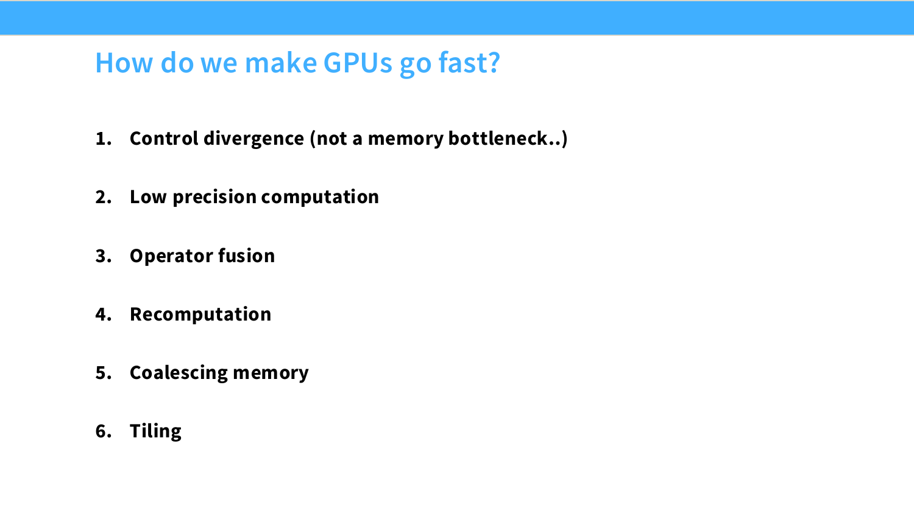

이 페이지는 GPU를 빠르게 만드는 대표 기법 여섯 가지를 나열한다.

1. control divergence 줄이기
2. low precision computation
3. operator fusion
4. recomputation
5. coalescing memory
6. tiling

이 중 control divergence는 memory bottleneck은 아니지만 SIMT execution model 때문에 중요하다. 나머지는 대부분 memory movement를 줄이거나 arithmetic intensity를 높이는 기법이다.

전체적으로 보면 다음 목표를 공유한다.

```math
\text{global memory 접근 감소}
+
\text{data reuse 증가}
+
\text{Tensor Core 활용 증가}
```

---
#### 보충 설명: Understanding GPUs 자료와 연결

보충 설명으로 보면, 해당 자료는 이 여섯 가지 기법 중 control divergence를 제외한 다섯 가지를 roofline 관점에서 다시 묶는다. 목표는 두 방향이다.

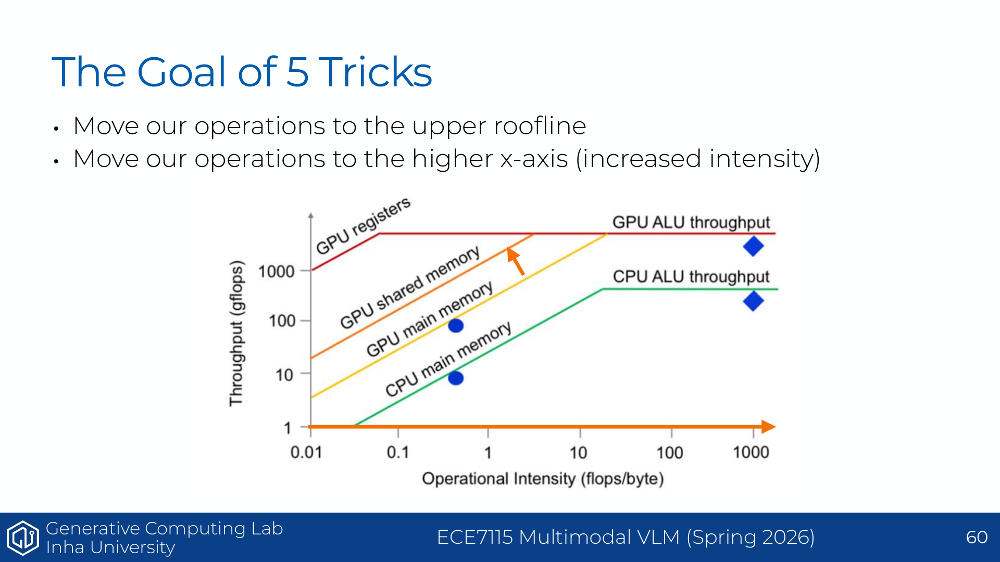

첫째, workload를 roofline의 위쪽으로 올린다. 이는 같은 arithmetic intensity에서 더 높은 실제 FLOP/s를 얻는다는 뜻이다. coalescing, tiling, kernel implementation 개선은 GPU가 낼 수 있는 성능에 더 가까이 가게 만든다.

둘째, workload를 x축의 오른쪽으로 이동시킨다. 이는 arithmetic intensity를 높인다는 뜻이다. low precision은 bytes moved를 줄이고, fusion은 중간 tensor의 HBM 왕복을 줄이며, tiling은 한 번 가져온 데이터를 shared memory에서 재사용하게 만든다.

정리하면 각 trick은 다음처럼 대응된다.

| 기법 | 직접 줄이는 것 | roofline 관점의 효과 |
|---|---:|---|
| Low precision | 원소당 bytes | intensity 증가 |
| Operator fusion | 중간 tensor read/write | memory traffic 감소 |
| Recomputation | activation 저장량 | memory capacity/traffic 감소, FLOPs 증가 |
| Coalescing | memory transaction 수 | effective bandwidth 증가 |
| Tiling | global memory 반복 read | data reuse 증가, intensity 증가 |

즉 “GPU 최적화”는 무작정 CUDA를 복잡하게 짜는 일이 아니라, workload가 roofline에서 어디에 있는지 보고 병목 방향에 맞는 trick을 적용하는 일이다.

## Page 23. Control divergence - not a memory issue

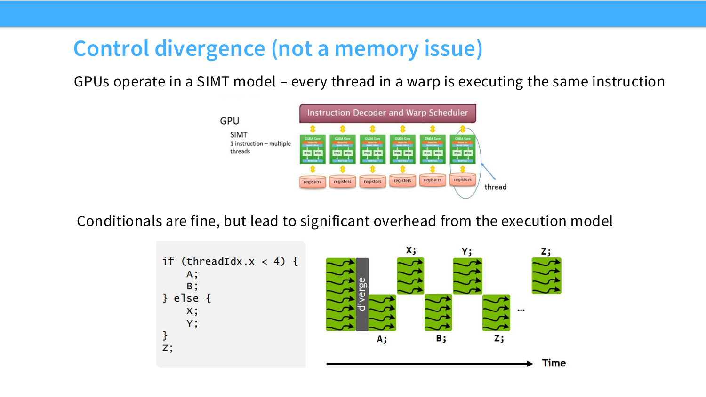

이 페이지는 GPU가 느려지는 또 다른 이유인 **control divergence**를 설명한다. 제목에 “not a memory issue”라고 적혀 있는 이유는, 이 병목이 HBM이나 cache에서 데이터를 늦게 가져와서 생기는 문제가 아니라 **GPU의 실행 모델**, 즉 SIMT 방식 때문에 생기는 문제이기 때문이다.

GPU에서는 여러 thread가 warp 단위로 묶여 실행된다. NVIDIA GPU 기준으로 보통 하나의 warp는 32개 thread이며, 이 warp는 **instruction decoder와 warp scheduler**가 내려주는 같은 instruction을 함께 실행한다. 그림 위쪽의 “1 instruction – multiple threads”는 바로 이 의미다. 예를 들어 하나의 instruction이 “각자 자기 위치의 `x[i]`를 읽어라”라면, thread 0은 `x[0]`, thread 1은 `x[1]`, thread 2는 `x[2]`를 읽는다. 즉 **instruction은 같지만, 각 thread가 처리하는 데이터와 register 값은 다르다.**

문제는 조건문을 만났을 때 생긴다. 슬라이드의 코드는 다음과 같은 구조다.

```cuda
if (threadIdx.x < 4) {
    A;
    B;
} else {
    X;
    Y;
}
Z;
```

여기서 `threadIdx.x`는 block 안에서 각 thread가 갖는 고유한 index다. 어떤 thread는 `threadIdx.x < 4` 조건을 만족해서 `A, B` branch를 실행해야 하고, 나머지 thread는 `else` branch의 `X, Y`를 실행해야 한다. CPU처럼 각 thread가 완전히 독립적으로 서로 다른 instruction stream을 자유롭게 실행한다면 문제가 작을 수 있지만, warp 안의 thread들은 기본적으로 같은 instruction을 함께 실행하도록 설계되어 있다.

그래서 warp 안에서 branch가 갈라지면 GPU는 두 branch를 동시에 한 번에 실행하지 못하고, **branch를 순차적으로 실행**한다. 먼저 `A, B`를 실행할 때는 `if` 조건을 만족한 thread들만 active 상태가 되고, `else`에 해당하는 thread들은 mask되어 쉬게 된다. 그다음 `X, Y`를 실행할 때는 반대로 `else` thread들만 active가 되고, `if` branch thread들은 쉬게 된다. 마지막으로 두 branch가 다시 합쳐지는 지점에서 모든 thread가 `Z`를 실행한다.

슬라이드 오른쪽의 timeline 그림은 이 흐름을 보여준다. 처음에는 warp가 함께 실행되다가 `diverge` 지점에서 갈라지고, 이후 `A_i, B_i` branch와 `X_i, Y_i` branch가 시간축 위에서 순서대로 실행된다. branch 실행이 끝난 뒤에는 다시 reconvergence가 일어나고, 공통 instruction인 `Z_i`는 warp 전체가 함께 실행한다.

중요한 점은 **조건문 자체가 나쁜 것이 아니라, 같은 warp 안에서 서로 다른 branch를 타는 것이 비싸다**는 것이다. warp 안의 모든 thread가 같은 branch를 타면 divergence가 거의 없다. 예를 들어 32개 thread가 모두 `if` branch로 가면 GPU는 그냥 `A, B, Z`를 실행하면 된다. 하지만 같은 warp 안에서 일부는 `if`, 일부는 `else`로 나뉘면 두 경로를 직렬화해야 하므로 실제 활용률이 떨어진다.

수식처럼 요약하면 다음과 같다.

```math
\text{Control divergence}
\Rightarrow
\text{branch serialization within a warp}
\Rightarrow
\text{lower active thread utilization}
```

이 병목은 memory bandwidth가 부족해서 생기는 것이 아니라, **같은 warp가 한 번에 하나의 instruction stream만 효율적으로 실행할 수 있다는 SIMT 실행 모델의 제약**에서 나온다. 따라서 GPU에서 빠른 kernel을 만들려면 memory access pattern뿐 아니라, warp 안의 thread들이 가능하면 같은 control flow를 따르도록 코드와 data layout을 설계하는 것도 중요하다.

---

## Page 24. Trick 1: Low precision computation

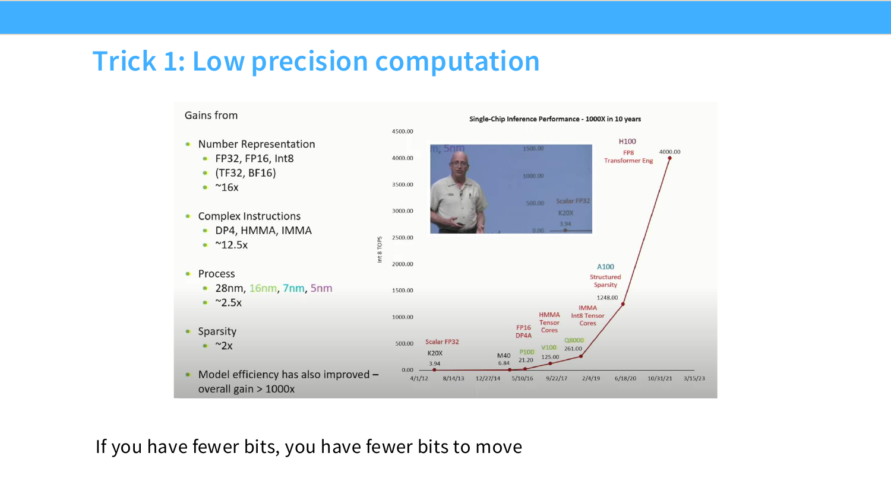


첫 번째 성능 최적화 기법은 low precision computation이다. 슬라이드의 핵심 문장은 “**If you have fewer bits, you have fewer bits to move**”다.

FP32는 숫자 하나에 32bit, 즉 4 bytes를 사용한다. FP16/BF16은 16bit, 즉 2 bytes를 사용한다. INT8은 1 byte, FP8은 1 byte, FP4는 0.5 byte 수준이다. dtype을 낮추면 동일한 원소 수를 저장하고 이동하는 데 필요한 memory traffic이 줄어든다.

메모리 관점에서는 다음과 같이 볼 수 있다.

```math
\text{bytes moved} = \text{number of elements} \times \text{bytes per element}
```

따라서 dtype을 낮추면 memory-bound workload의 성능을 직접 개선할 수 있고, Tensor Core가 지원하는 dtype이면 compute throughput도 크게 올라갈 수 있다.

---

## Page 25. Low precision improves arithmetic intensity

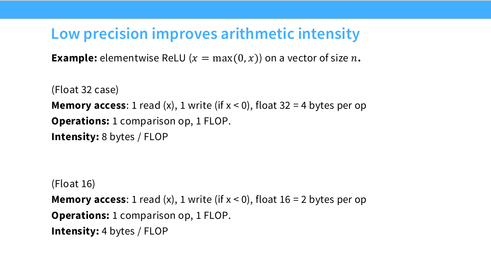

이 페이지는 elementwise ReLU 예시로 low precision이 arithmetic intensity에 주는 영향을 설명한다. ReLU는 다음 연산이다.

```math
y = \max(0,x)
```

원소가 $n$개인 vector에서 ReLU는 원소마다 비교 1번 정도의 매우 작은 계산만 수행한다. 그러나 memory에서는 $x$를 읽고 $y$를 써야 한다.

FP32라면 원소 하나가 4 bytes이므로, read 4 bytes와 write 4 bytes가 필요해 총 8 bytes가 움직인다. 계산은 약 1 FLOP 또는 1 comparison 수준이므로 슬라이드는 이를 **8 bytes/FLOP**로 표현한다. FP16이면 read 2 bytes와 write 2 bytes로 총 4 bytes가 되어 **4 bytes/FLOP**가 된다.

여기서 주의할 점은 슬라이드가 일반적인 arithmetic intensity인 FLOPs/byte가 아니라, 그 역수인 bytes/FLOP로 설명한다는 점이다.

```math
\text{Arithmetic intensity} = \frac{\text{FLOPs}}{\text{Bytes}}
```

FP32 ReLU는 대략:

```math
I_{\text{FP32}} = \frac{1}{8}\ \text{FLOPs/byte}
```

FP16 ReLU는:

```math
I_{\text{FP16}} = \frac{1}{4}\ \text{FLOPs/byte}
```

따라서 FP16은 FP32보다 arithmetic intensity가 2배 높다. 하지만 여전히 매우 낮기 때문에 ReLU 같은 elementwise operation은 memory-bound인 경우가 많다.

---

## Page 26. Low precision drives faster matrix multiplies

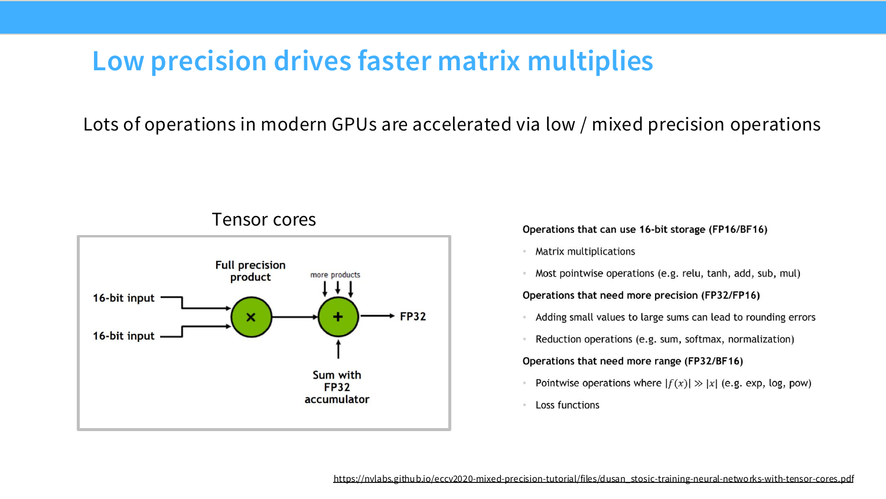

이 페이지는 low precision이 memory traffic뿐 아니라 matrix multiplication throughput도 높인다는 점을 설명한다. 현대 GPU의 Tensor Core는 FP16/BF16/TF32/FP8 같은 low 또는 mixed precision matrix multiplication을 하드웨어적으로 가속한다.

그림은 16-bit input 두 개를 곱하고, 결과를 FP32 accumulator에 누적하는 구조를 보여준다. 이는 mixed precision의 전형적 패턴이다.

```math
\text{FP16/BF16 input} \times \text{FP16/BF16 input}
\rightarrow
\text{FP32 accumulation}
```

오른쪽 목록은 어떤 연산이 16-bit storage를 사용할 수 있고, 어떤 연산은 더 높은 precision/range가 필요한지를 구분한다. Matrix multiplication과 대부분의 pointwise operation은 16-bit storage가 가능하지만, loss function, 일부 reduction, exp/log/pow 같은 range가 중요한 연산은 FP32가 필요할 수 있다.

즉 low precision은 무조건 모든 것을 낮은 bit로 바꾸는 것이 아니라, **연산별로 필요한 precision과 range를 구분해 mixed precision으로 운영하는 것**이다. 관련 링크는 NVIDIA mixed precision tutorial이다: [Tensor Cores tutorial](https://nvlabs.github.io/eccv2020-mixed-precision-tutorial/files/dusan_stosic-training-neural-networks-with-tensor-cores.pdf).

---

## Page 27. Frontiers in low precision - FP8 and MXFP8

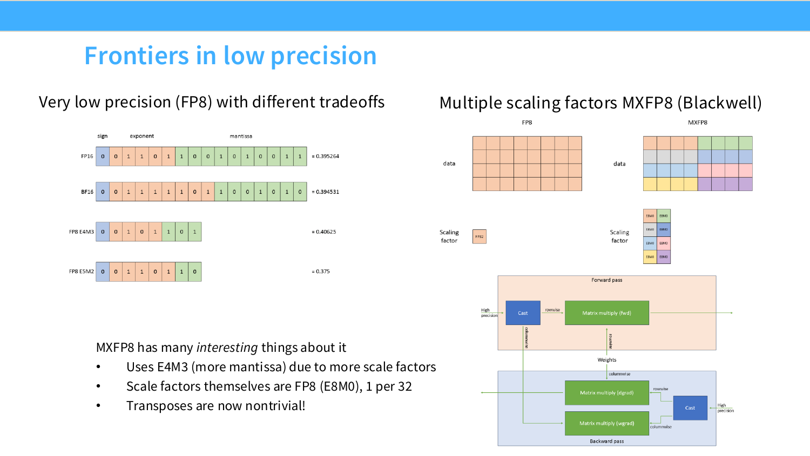

이 페이지는 low precision의 frontier로 **FP8**과 **MXFP8**을 설명한다. 앞 페이지까지는 FP32에서 FP16/BF16으로 내려가면 memory movement가 줄고 Tensor Core throughput이 올라간다는 흐름이었다. Page 27은 여기서 한 단계 더 내려가서, 숫자 하나를 8bit로 표현할 때 어떤 trade-off가 생기고, 그 한계를 scale factor로 어떻게 보완하는지를 보여준다.

먼저 왼쪽 그림은 같은 실수 값을 FP16, BF16, FP8 E4M3, FP8 E5M2가 어떻게 다르게 근사하는지 보여준다. floating point 숫자는 보통 세 부분으로 나뉜다.

```math
\text{floating point}
=
\text{sign} + \text{exponent} + \text{mantissa}
```

- **sign**은 양수/음수를 나타낸다.
- **exponent**는 숫자의 크기 범위, 즉 dynamic range를 담당한다.
- **mantissa**는 같은 크기 범위 안에서 얼마나 촘촘하게 값을 표현할 수 있는지, 즉 precision을 담당한다.

floating point를 아주 단순화해서 쓰면 다음과 같은 형태로 볼 수 있다.

```math
x \approx (-1)^s \times 2^e \times m
```

여기서 $s$는 sign, $e$는 exponent, $m$은 mantissa가 만드는 유효숫자다. 따라서 bit 수가 제한되어 있을 때 exponent에 bit를 더 주면 훨씬 크거나 작은 값을 표현할 수 있지만, mantissa가 줄어들어 값 사이 간격이 거칠어진다. 반대로 mantissa에 bit를 더 주면 같은 범위 안에서 더 정밀하게 표현할 수 있지만, 표현 가능한 최대/최소 범위는 줄어든다.

FP16과 BF16의 차이도 이 관점에서 이해할 수 있다.

- **FP16**은 exponent보다 mantissa에 더 많은 bit를 주기 때문에 상대적으로 정밀하지만, 표현 범위는 BF16보다 좁다.
- **BF16**은 FP32와 같은 8bit exponent를 사용하므로 범위가 넓다. 대신 mantissa가 짧아서 정밀도는 낮다.

FP8도 마찬가지다. 슬라이드에 나온 두 대표 형식은 다음과 같다.

```math
\text{FP8 E4M3} = 1\text{ sign bit} + 4\text{ exponent bits} + 3\text{ mantissa bits}
```

```math
\text{FP8 E5M2} = 1\text{ sign bit} + 5\text{ exponent bits} + 2\text{ mantissa bits}
```

즉 **E4M3**는 mantissa가 3bit라서 FP8 중에서는 상대적으로 정밀하다. 하지만 exponent가 4bit라 표현 범위가 제한된다. 반면 **E5M2**는 exponent가 5bit라 더 넓은 범위를 표현할 수 있지만, mantissa가 2bit라 값의 간격이 더 거칠다.

이 차이는 LLM 학습에서 중요하다. weight나 activation처럼 값의 분포가 비교적 안정적인 tensor에는 더 정밀한 E4M3가 유리할 수 있다. 반면 gradient처럼 값의 크기가 갑자기 커지거나 작아질 수 있는 tensor에는 더 넓은 범위를 가진 E5M2가 필요할 수 있다. 다만 실제 시스템에서는 tensor 종류, layer, training 단계, hardware kernel 지원에 따라 선택이 달라진다.

---

FP8을 그대로 쓰기 어려운 이유는 숫자 범위와 정밀도가 모두 제한되기 때문이다. 그래서 실제 FP8 연산에서는 보통 **scale factor**를 함께 사용한다. 핵심 아이디어는 원래 값을 바로 FP8로 저장하지 않고, 먼저 scale로 나눈 뒤 FP8 범위에 맞게 저장하는 것이다. 

```math
q = \operatorname{cast}_{\mathrm{FP8}}\left(\frac{x}{s}\right)
```

나중에 실제 값으로 사용할 때는 다시 scale을 곱해 복원한다.

```math
\hat{x} = s \cdot q
```

여기서 $s$가 scale factor다. 직관적으로 말하면 scale factor는 **실수 tensor를 FP8이 잘 표현할 수 있는 범위로 zoom-in/zoom-out 해주는 배율**이다.

가장 단순한 방식은 tensor 전체에 scale factor 하나를 쓰는 것이다. 오른쪽 위의 FP8 그림은 이 상황을 단순화해서 보여준다. 큰 matrix 전체가 하나의 색으로 표시되어 있고, 아래에 하나의 FP32 scaling factor가 붙어 있다. 이는 tensor 전체가 하나의 전역 scale을 공유한다는 뜻이다.

문제는 tensor 안의 값 분포가 균일하지 않을 때 생긴다. 예를 들어 어떤 tensor가 다음과 같다고 하자.

```math
[0.01,\ 0.02,\ 0.03,\ 100.0]
```

하나의 scale을 tensor 전체에 맞추면, 큰 값 $100.0$을 표현하기 위해 scale이 커져야 한다. 그러면 작은 값 $0.01,0.02,0.03$은 FP8의 거친 격자에서 거의 비슷한 값으로 뭉개질 수 있다. 즉 outlier 하나가 tensor 전체의 precision을 망칠 수 있다.

---

오른쪽의 **MXFP8** 그림은 이 문제를 줄이기 위해 하나의 tensor에 여러 scale factor를 쓰는 방식을 보여준다. MXFP8의 MX는 보통 **microscaling**을 의미한다. 즉 tensor 전체에 scale 하나를 쓰는 것이 아니라, 작은 block마다 scale을 따로 둔다.

슬라이드에서는 MXFP8의 특징을 세 가지로 요약한다.

첫째, **scale factor를 더 많이 사용하기 때문에 E4M3를 사용할 수 있다.** E4M3는 E5M2보다 exponent 범위가 좁지만 mantissa가 더 많아 정밀하다. block마다 local scale을 따로 주면 각 block의 값들을 FP8이 표현하기 좋은 범위로 맞출 수 있으므로, 넓은 exponent가 필요한 부담이 줄어든다. 그 결과 E4M3처럼 precision이 더 좋은 FP8 format을 적극적으로 사용할 수 있다.

둘째, **scale factor 자체도 FP8 E8M0 형식으로 저장하며, 32개 값마다 scale 하나를 둔다.** E8M0는 mantissa가 없는 scale 전용 형식으로 이해하면 된다. 즉 scale은 정밀한 임의 실수라기보다 power-of-two에 가까운 배율로 저장된다. 32개 값마다 1byte scale을 하나 추가하므로 overhead도 비교적 작다.

```math
\text{scale overhead per value}
= \frac{1\ \text{byte}}{32}
=0.03125\ \text{byte/value}
```

즉 data는 값 하나당 1byte이고, scale overhead는 값 하나당 약 0.03125byte다. bit로 보면 값 하나당 8bit에 scale overhead가 0.25bit 정도 추가되는 셈이다.

셋째, **transpose가 nontrivial해진다.** 이 문장이 Page 27에서 가장 중요한 시스템 관점의 포인트다. block별 scale을 쓰면, matrix를 transpose할 때 scale grouping이 그대로 유지되지 않는다.

예를 들어 matrix $W$를 row 방향으로 32개씩 묶어 quantization했다고 하자.

```math
W_{i,0:31}\ \text{share one scale},\qquad
W_{i,32:63}\ \text{share another scale}
```

이제 $W^\top$가 필요하면, 원래 row 방향으로 붙어 있던 32개 값이 transpose 후에는 column 방향으로 흩어진다. 따라서 $W$의 quantized bytes를 단순히 view만 바꿔서 $W^\top$처럼 사용할 수 없다. $W^\top$에 맞는 block grouping과 scale factor를 다시 만들어야 할 수 있다.

이 점은 training에서 특히 중요하다. forward pass에서는 보통 activation과 weight의 특정 방향 matmul이 필요하고, backward pass에서는 gradient 계산 때문에 transpose 방향의 matmul이 필요하다. 따라서 MXFP8 training에서는 forward용 quantized tensor와 backward/transpose용 quantized tensor를 별도로 관리해야 할 수 있다. 이 내용이 바로 다음 Page 28의 “MXFP8 training in practice”로 이어진다.

오른쪽 아래 그림은 이 점을 pipeline 관점에서 보여준다. high precision tensor를 곧바로 모든 곳에서 MXFP8로 저장하는 것이 아니라, matmul에 들어가기 전에 필요한 방향에 맞게 cast하고, forward pass와 backward pass에서 row-wise/column-wise quantization이 따로 등장한다. 따라서 MXFP8은 단순한 dtype 하나가 아니라, **data format + scale management + transpose-aware quantization strategy**까지 포함하는 training system 설계 문제라고 보는 것이 정확하다.

정리하면, FP8은 8bit로 숫자를 표현해 memory movement와 matmul 비용을 줄이는 방법이고, MXFP8은 FP8의 제한된 range/precision 문제를 block별 scale factor로 완화하는 방식이다. 다만 scale을 많이 쓰는 순간 transpose, backward pass, quantized tensor 관리가 복잡해지므로, low precision은 단순히 bit 수를 줄이는 문제가 아니라 hardware kernel과 training pipeline 전체를 함께 설계해야 하는 문제다.

---

## Page 28. MXFP8 training in practice

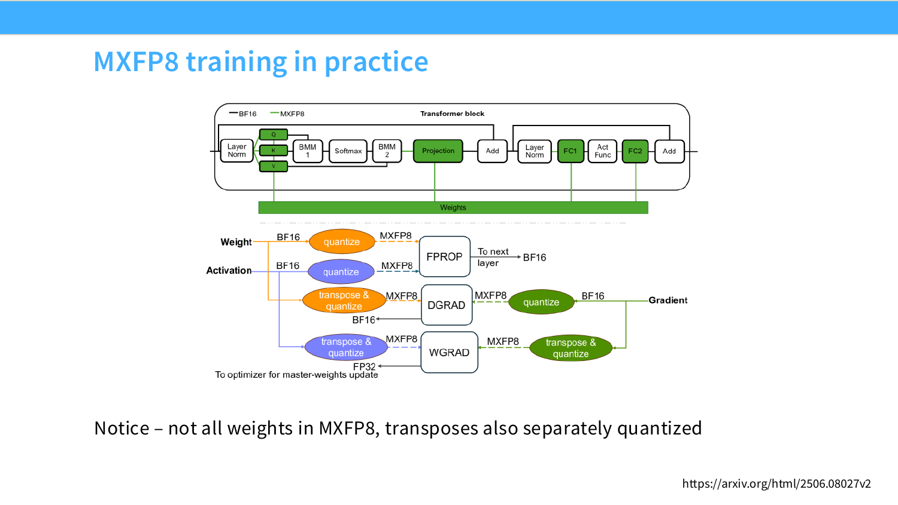

이 페이지는 MXFP8이 실제 training pipeline에서 어떻게 쓰이는지 보여준다. 슬라이드의 Transformer block 그림에서 모든 연산과 모든 weight가 MXFP8로만 처리되는 것은 아니다. 일부는 BF16, FP32를 유지하고, 특정 matmul/activation/gradient 경로에 quantize/dequantize가 들어간다.

그림 하단은 forward, backward, gradient update 경로에서 weight, activation, gradient가 어떤 precision으로 움직이는지 보여준다. FP8 training은 단순히 weight를 FP8로 저장하는 것이 아니라, forward propagation, backward propagation, weight gradient computation 각각에서 필요한 transpose와 quantization을 별도로 고려해야 한다.

핵심 문장은 “**not all weights in MXFP8, transposes also separately quantized**”이다. 이는 low precision training이 dtype 하나를 고르는 문제가 아니라, 각 tensor의 역할과 방향에 맞는 scale과 quantized representation을 관리하는 시스템 문제라는 뜻이다. 관련 자료는 슬라이드의 논문 링크다: [arXiv 2506.08027v2](https://arxiv.org/html/2506.08027v2).

---

## Page 29. Frontiers in low precision - MXFP4

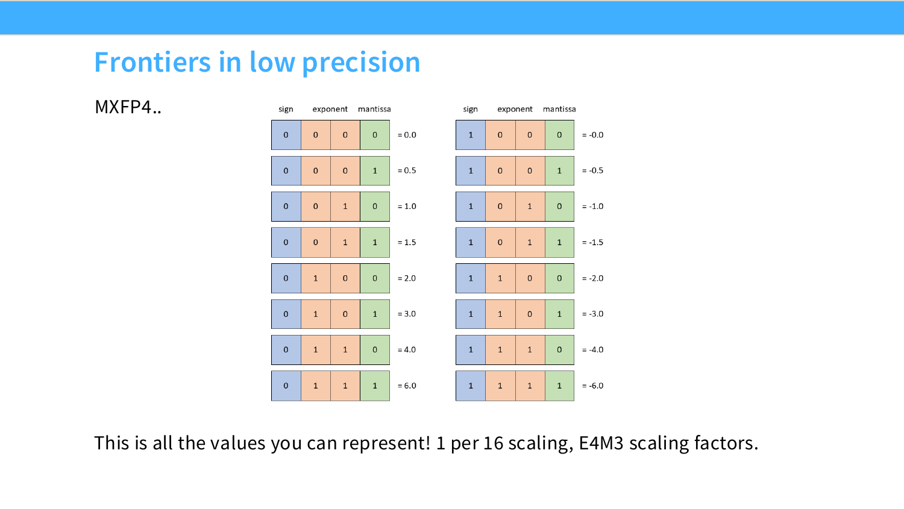

이 페이지는 FP4 계열 표현을 보여준다. 슬라이드에는 4bit floating point에서 표현 가능한 값들이 나열되어 있다. 부호 bit, exponent bit, mantissa bit의 조합이 매우 적기 때문에 표현 가능한 값 자체가 극도로 제한된다.

슬라이드의 값들을 보면 대략 다음과 같은 값만 표현할 수 있다.

```math
0,\ \pm 0.5,\ \pm 1.0,\ \pm 1.5,\ \pm 2.0,\ \pm 3.0,\ \pm 4.0,\ \pm 6.0
```

따라서 FP4만으로는 다양한 크기의 실수를 직접 표현할 수 없다. 그래서 scale factor가 반드시 필요하다. 슬라이드는 **1 per 16 scaling, E4M3 scaling factors**라고 설명한다. 즉 16개 값이 하나의 scale factor를 공유하고, 그 scale factor가 FP8 E4M3 형태로 표현되는 구조를 말한다.

복원은 개념적으로 다음과 같다.

```math
x \approx q_{\text{FP4}} \times s_{\text{block}}
```

여기서 $q_{\text{FP4}}$는 4bit로 저장된 값이고, $s_{\text{block}}$은 16개 값이 공유하는 scale이다. 이 구조는 memory movement를 크게 줄일 수 있지만, quantization error, scale 관리, transpose 관리가 더 어려워진다.

---

## Page 30. Trick 2: Operator fusion 

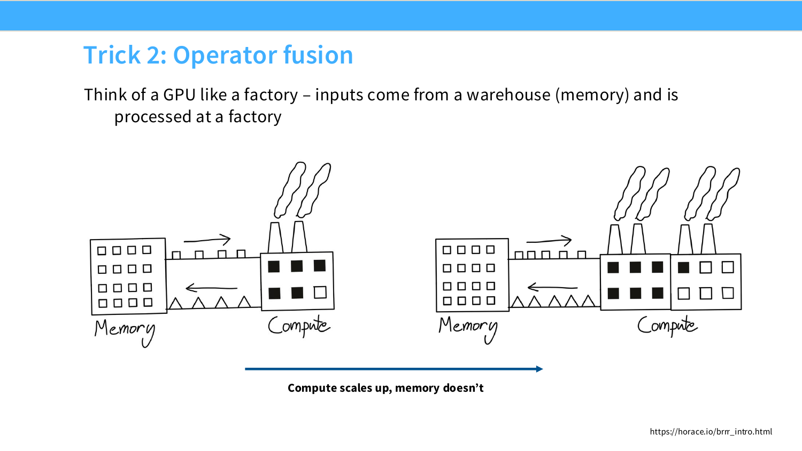


여기서 operator는 PyTorch에서 하나의 연산처럼 보이는 단위다. 예를 들어 `add`, `relu`, `dropout`, `softmax`, `matmul`이 operator다. operator마다 별도 GPU kernel이 실행되면, 각 kernel 사이에서 중간 tensor가 HBM에 저장되고 다시 읽힌다.

fusion은 여러 operator를 하나의 kernel 안에 넣어 중간 결과를 register나 shared memory에 둔 채 바로 다음 계산으로 넘기는 것이다. 초보자 관점에서는 “여러 번 창고를 왕복하지 말고, 작업대 위에서 한 번에 이어서 처리하자”로 이해하면 된다.

두 번째 기법은 operator fusion이다. 슬라이드는 GPU를 공장에 비유한다. memory는 창고, compute unit은 공장이다. 입력이 창고에서 공장으로 오고, 처리된 결과가 다시 창고로 돌아간다.

문제는 compute는 계속 강해졌지만 memory bandwidth는 그만큼 빠르게 늘지 않았다는 점이다. 그래서 작은 operation을 여러 번 나누어 실행하면, 매번 중간 결과를 memory에 쓰고 다시 읽는 비용이 커진다.

operator fusion의 목표는 여러 operation을 하나의 kernel로 합쳐서 중간 결과를 HBM에 쓰지 않도록 하는 것이다.

```math
\text{op}_1 \rightarrow \text{write HBM} \rightarrow \text{op}_2 \rightarrow \text{write HBM}
```

대신:

```math
\text{fused kernel}:\quad \text{op}_1,\text{op}_2,\text{op}_3\ \text{inside registers/shared memory}
```

이렇게 하면 memory traffic과 kernel launch overhead를 줄일 수 있다. 관련 비유는 Horace He의 글 [Making Deep Learning Go Brrrr From First Principles](https://horace.io/brrr_intro.html)에서 나온다.

---

## Page 31. Operator fusion to minimize memory access

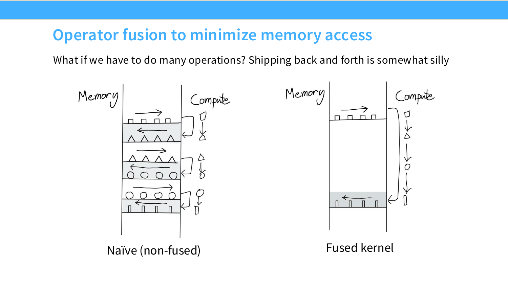

이 페이지는 fusion이 왜 memory access를 줄이는지 그림으로 보여준다. 왼쪽 non-fused kernel에서는 operation 하나를 할 때마다 memory와 compute 사이를 왕복한다. 중간 결과가 매번 memory에 저장되고, 다음 operation에서 다시 읽힌다.

오른쪽 fused kernel에서는 여러 operation이 하나의 kernel 내부에서 이어진다. 중간 결과를 register나 shared memory에 유지한 채 다음 operation을 수행하므로, memory로 왕복하는 횟수가 줄어든다.

핵심은 다음과 같다.

```math
\text{FLOPs는 거의 그대로지만, Bytes moved가 줄어든다.}
```

따라서 arithmetic intensity가 올라간다.

```math
I = \frac{\text{FLOPs}}{\text{Bytes moved}}
```

fusion은 특히 elementwise operation이 여러 개 이어질 때 효과가 크다. elementwise operation은 FLOPs가 작고 memory movement가 상대적으로 크기 때문이다.

---


여기서 중요한 감각은 fusion이 FLOPs를 줄이는 기법이 아니라는 점이다. 경우에 따라 fused kernel 내부에서 같은 수학 연산을 그대로 수행하므로 FLOPs는 거의 동일하다. 그러나 중간 결과를 HBM에 쓰고 다시 읽지 않기 때문에 bytes moved가 줄어든다.

예를 들어 다음처럼 세 연산이 있다고 하자.

```math
y=\sin(x),\quad z=\cos(y),\quad w=z+1
```

non-fused라면 $y$와 $z$가 각각 HBM에 저장될 수 있다. fused라면 한 thread가 register 안에서 $\sin$, $\cos$, add를 이어서 수행하고 최종 $w$만 HBM에 쓴다.

```math
\text{non-fused}: x\rightarrow y\rightarrow z\rightarrow w \quad (\text{중간 tensor HBM 저장})
```

```math
\text{fused}: x\rightarrow \text{register 내부 연산}\rightarrow w \quad (\text{최종 결과만 저장})
```

이것이 FlashAttention에서 softmax, scaling, masking, $PV$ 계산을 가능한 한 하나의 kernel 안으로 밀어 넣는 이유다.

## Page 32. Example - sines and cosines

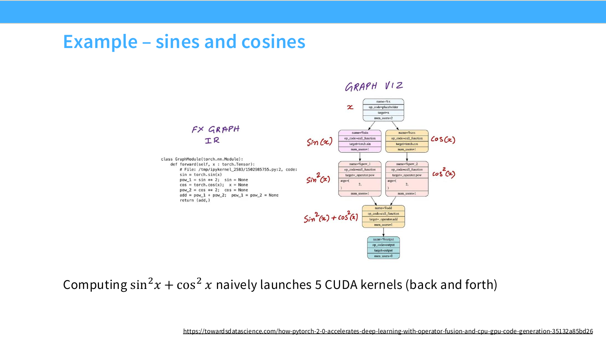

이 페이지는 $\sin^2 x + \cos^2 x$ 계산 예시를 보여준다. 수학적으로는 항상 1에 가까운 간단한 식이지만, naive PyTorch execution에서는 여러 CUDA kernel이 순서대로 launch될 수 있다.

대략적인 operation graph는 다음과 같다.

```math
x \rightarrow \sin(x) \rightarrow \sin^2(x)
```

```math
x \rightarrow \cos(x) \rightarrow \cos^2(x)
```

```math
\sin^2(x)+\cos^2(x)
```

이를 naive하게 계산하면 sin, square, cos, square, add 등 여러 pointwise kernel이 launch되고, 각 kernel 사이에서 중간 tensor가 HBM에 쓰였다가 다시 읽힌다. 슬라이드는 이를 5 CUDA kernels라고 설명한다.

관련 링크는 PyTorch 2.0의 operator fusion과 code generation을 설명하는 글이다: [How PyTorch 2.0 accelerates deep learning](https://towardsdatascience.com/how-pytorch-2-0-accelerates-deep-learning-with-operator-fusion-and-cpu-gpu-code-generation-35132a85bd26).

---

## Page 33. Fusion example

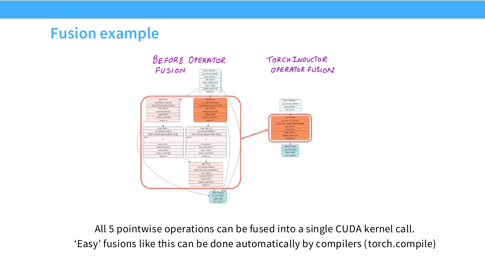

이 페이지는 Page 32의 예시였던

```math
y=\sin^2(x)+\cos^2(x)
```

를 GPU에서 어떻게 더 효율적으로 실행할 수 있는지 보여준다. 여기서 슬라이드가 말하는 “fuse할 수 있다”는 말은 수학적으로 식을 새로운 식으로 바꾼다는 뜻이 아니다. **여러 개의 CUDA kernel로 나뉘어 실행되던 pointwise operation들을 하나의 CUDA kernel 안에서 연속으로 실행하게 만든다**는 뜻이다.

Page 32의 naive 실행을 먼저 다시 보면, 계산 그래프는 대략 다음처럼 나뉜다.

```math
a=\sin(x)
```

```math
b=a^2
```

```math
c=\cos(x)
```

```math
d=c^2
```

```math
y=b+d
```

각 단계가 별도 CUDA kernel로 실행되면 다음과 같은 일이 발생한다.

| 단계 | 연산 | 발생하는 문제 |
|---|---|---|
| 1 | $a=\sin(x)$ | $x$를 읽고 $a$를 HBM/global memory에 저장 |
| 2 | $b=a^2$ | $a$를 다시 읽고 $b$를 저장 |
| 3 | $c=\cos(x)$ | $x$를 다시 읽고 $c$를 저장 |
| 4 | $d=c^2$ | $c$를 다시 읽고 $d$를 저장 |
| 5 | $y=b+d$ | $b,d$를 읽고 최종 $y$를 저장 |

즉 계산 자체는 단순하지만, 중간 tensor인 $a,b,c,d$가 계속 HBM에 쓰였다가 다시 읽힌다. GPU에서 HBM 접근은 register나 shared memory 접근보다 훨씬 비싸기 때문에, 이런 pointwise operation은 FLOPs보다 **memory movement**가 병목이 되기 쉽다.

원소 하나 $i$에 대해서 naive 실행을 쓰면 다음과 같다.

```math
x_i \rightarrow \sin(x_i) \rightarrow a_i \quad \text{저장}
```

```math
a_i \quad \text{다시 읽기} \rightarrow a_i^2 \rightarrow b_i \quad \text{저장}
```

```math
x_i \rightarrow \cos(x_i) \rightarrow c_i \quad \text{저장}
```

```math
c_i \quad \text{다시 읽기} \rightarrow c_i^2 \rightarrow d_i \quad \text{저장}
```

```math
b_i,d_i \quad \text{다시 읽기} \rightarrow b_i+d_i \rightarrow y_i \quad \text{저장}
```

Page 33의 fusion은 이 과정을 하나의 kernel 안에서 다음처럼 처리한다.

```math
y_i = \sin(x_i)^2 + \cos(x_i)^2
```

각 thread는 자기 index $i$에 대해 $x_i$를 한 번 읽고, $\sin(x_i)$, $\cos(x_i)$, 제곱, 덧셈을 thread 내부의 register에서 이어서 계산한 뒤 최종 결과 $y_i$만 HBM에 저장한다.

```math
x_i \quad \text{읽기}
\rightarrow
\sin(x_i),\ \cos(x_i),\ \sin^2(x_i)+\cos^2(x_i) \quad \text{register에서 계산}
\rightarrow
 y_i \quad \text{저장}
```

따라서 fused execution의 핵심 이득은 다음과 같다.

```math
\text{중간 tensor의 HBM write/read 감소}
\Rightarrow
\text{memory movement 감소}
\Rightarrow
\text{memory-bound pointwise operation의 속도 개선}
```

이게 가능한 이유는 이 예시의 연산들이 모두 **pointwise operation**이기 때문이다. pointwise operation은 각 output 원소가 같은 위치의 input 원소에만 의존한다.

```math
y_i=f(x_i)
```

또는 두 입력이 있어도 다음처럼 같은 index끼리만 의존한다.

```math
z_i=f(x_i,y_i)
```

따라서 $y_0$를 계산할 때 $x_1,x_2,\ldots$가 필요 없고, $y_1$을 계산할 때도 $x_0,x_2,\ldots$가 필요 없다. 각 원소 계산이 독립적이므로, 각 thread가 자기 원소를 끝까지 계산할 수 있다.

```math
y_0 = \sin^2(x_0)+\cos^2(x_0)
```

```math
y_1 = \sin^2(x_1)+\cos^2(x_1)
```

```math
y_2 = \sin^2(x_2)+\cos^2(x_2)
```

이런 구조에서는 여러 pointwise operator를 하나의 CUDA kernel로 묶기 쉽다. 슬라이드 오른쪽의 after graph에서 TorchInductor가 여러 연산 노드를 하나의 fused block으로 묶는 이유가 여기에 있다. PyTorch 2.x의 `torch.compile`과 TorchInductor는 계산 그래프를 분석해서 이런 pointwise fusion을 자동으로 수행할 수 있다.

다만 모든 연산이 이렇게 쉽게 fuse되는 것은 아니다. 예를 들어 softmax는 각 원소가 자기 자신만 보고 계산되지 않는다.

```math
\mathrm{softmax}(x_i)=\frac{e^{x_i}}{\sum_j e^{x_j}}
```

여기서는 denominator인 $\sum_j e^{x_j}$를 계산하기 위해 같은 row의 여러 원소를 함께 봐야 한다. 즉 reduction과 synchronization이 필요하다. matrix multiplication도 각 output 원소가 여러 input 원소의 inner product에 의존하기 때문에 단순 pointwise fusion과는 성격이 다르다.

그래서 이 페이지의 메시지는 두 단계로 이해하면 좋다.

첫째, **쉬운 fusion**은 pointwise operation들을 하나의 kernel로 묶어서 중간 tensor를 HBM에 쓰지 않게 만드는 것이다.

둘째, FlashAttention처럼 더 복잡한 fusion은 softmax와 attention matrix multiplication처럼 dependency가 있는 연산까지 memory movement를 줄이도록 알고리즘 자체를 재구성하는 것이다.

즉 Page 33은 후반부 FlashAttention으로 가기 전에, 가장 단순한 형태의 operator fusion을 통해 “GPU 성능 최적화의 핵심은 FLOPs만 줄이는 것이 아니라 HBM 왕복을 줄이는 것”이라는 직관을 심어주는 페이지다.

관련 링크는 PyTorch 2.0의 operator fusion과 code generation을 설명하는 글이다: [How PyTorch 2.0 accelerates deep learning](https://towardsdatascience.com/how-pytorch-2-0-accelerates-deep-learning-with-operator-fusion-and-cpu-gpu-code-generation-35132a85bd26).

---

## Page 34. Trick 3: recomputation

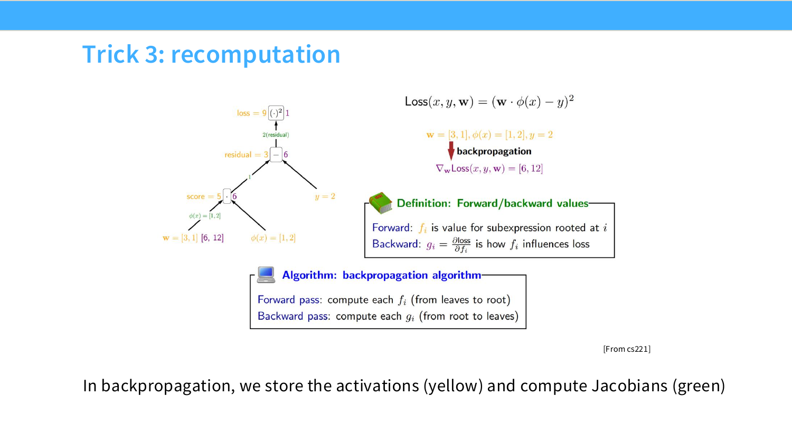

이 페이지의 세 번째 기법은 **recomputation**이다. 앞의 Page 32~33에서 fusion이 “중간 tensor를 HBM에 쓰지 않도록 여러 연산을 하나의 kernel 안에서 이어 계산하는 방법”이었다면, recomputation은 조금 다른 방향의 trade-off다. 핵심은 **forward 때 계산한 중간 activation을 모두 저장하지 않고, backward 때 필요하면 다시 계산한다**는 것이다.

일반적인 학습은 다음 순서로 진행된다.

```math
\text{forward} \rightarrow \text{loss} \rightarrow \text{backward}
```

예를 들어 여러 layer가 있을 때 forward는 다음처럼 중간 activation을 만든다.

```math
x_1=f_1(x_0),\quad x_2=f_2(x_1),\quad x_3=f_3(x_2),\quad x_4=f_4(x_3)
```

backward에서는 chain rule을 적용해야 하므로 각 layer의 gradient 계산에 forward 때의 값이 필요하다. 그래서 기본 autograd는 forward 중에 $x_1,x_2,x_3$ 같은 activation을 저장해둔다. 슬라이드의 CS221 그림에서 노란색은 forward value 또는 activation, 초록색은 Jacobian/backward value에 해당한다고 볼 수 있다.

문제는 이 activation 저장이 GPU memory를 많이 사용한다는 점이다. 특히 LLM에서는 sequence length, batch size, hidden dimension, layer 수가 모두 크기 때문에 activation 저장량이 빠르게 커진다. recomputation은 이 문제를 다음 방식으로 완화한다.

```math
\text{일부 activation 저장 생략}
\quad \Rightarrow \quad
\text{backward 때 필요한 activation을 다시 forward 계산}
```

즉 recomputation의 기본 trade-off는 다음과 같다.

```math
\text{less memory} \quad \Longleftrightarrow \quad \text{more compute}
```

처음에는 이미 계산한 값을 버리고 다시 계산하는 것이 비효율처럼 보일 수 있다. 하지만 GPU에서는 작은 elementwise 연산이나 일부 중간 activation을 저장하고 다시 읽는 비용이, 그것을 다시 계산하는 비용보다 더 비쌀 수 있다. 특히 HBM/VRAM capacity와 bandwidth가 병목일 때는 FLOPs를 조금 더 쓰더라도 memory movement를 줄이는 편이 유리하다.

여기서 **recomputation**과 **gradient checkpointing**, 더 정확히는 **activation checkpointing**의 관계를 구분해야 한다.

| 개념 | 의미 |
|---|---|
| Recomputation | 저장하지 않은 값을 나중에 다시 계산하는 실제 동작 |
| Activation checkpointing / gradient checkpointing | 어떤 activation은 저장하고 어떤 activation은 버릴지 정하는 메모리 절약 전략 |

즉 activation checkpointing은 전략이고, recomputation은 그 전략을 실행할 때 발생하는 동작이다. 예를 들어 모든 layer activation을 저장하지 않고 몇 개 layer의 출력만 checkpoint로 저장하면, backward 때 checkpoint 사이의 중간 activation은 다시 forward를 돌려 복원한다. 이 다시 계산하는 과정이 recomputation이다.

---

## Page 35. Storing and retrieving activations can be expensive

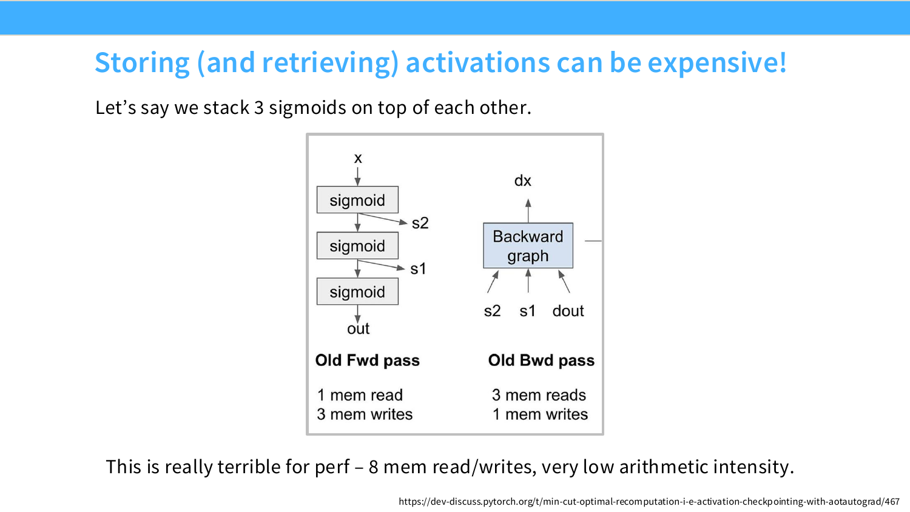

이 페이지는 왜 activation 저장과 읽기가 비쌀 수 있는지를 작은 예시로 보여준다. 슬라이드는 sigmoid 세 개를 연속으로 적용하는 계산 그래프를 사용한다. 간단히 쓰면 다음과 같은 형태다.

```math
s_1=\sigma(x),\quad s_2=\sigma(s_1),\quad s_3=\sigma(s_2)
```

기본 방식에서는 forward pass 중에 $s_1$, $s_2$, $s_3$ 같은 중간 activation을 저장한다. backward pass에서 각 sigmoid의 gradient를 계산하려면 해당 sigmoid의 forward output이 필요하기 때문이다. sigmoid의 미분은 다음처럼 output 값을 사용해 쓸 수 있다.

```math
\sigma'(u)=\sigma(u)(1-\sigma(u))
```

따라서 $s_1$을 저장해두면 backward에서 $\sigma'(x)=s_1(1-s_1)$을 바로 계산할 수 있다. 이것이 activation을 저장하는 이유다.

슬라이드는 old forward pass와 old backward pass의 memory traffic을 비교한다. forward에서는 입력을 읽고 여러 중간 activation을 쓴다. backward에서는 저장해둔 activation을 다시 읽고 gradient를 쓴다. 슬라이드 표현대로 보면 전체적으로 여러 번의 memory read/write가 발생한다.

이 예시의 핵심은 sigmoid 계산 자체가 엄청난 FLOPs를 요구하지 않는다는 점이다. 반면 activation을 HBM에 저장하고 다시 읽는 것은 실제 wall-clock time에서 부담이 될 수 있다. 즉 이런 elementwise-heavy 계산은 arithmetic intensity가 낮다.

```math
\text{Arithmetic Intensity}
=
\frac{\text{FLOPs}}{\text{Bytes moved}}
```

sigmoid나 ReLU 같은 elementwise operation은 각 원소에 대해 계산은 적게 하지만, 값을 읽고 쓰는 memory movement는 반드시 발생한다. 따라서 다음과 같은 상황이 된다.

```math
\text{low arithmetic intensity operation}
\Rightarrow
\text{memory access dominates runtime}
```

이 페이지는 recomputation이 왜 가능한지를 설명하기 전에, 먼저 “저장해두는 것도 공짜가 아니다”라는 점을 강조한다. activation을 저장하면 backward 계산은 편해지지만, 그만큼 GPU memory capacity를 차지하고 HBM read/write traffic도 증가한다.

관련 링크는 PyTorch의 min-cut recomputation/activation checkpointing 논의다: [PyTorch dev discuss](https://dev-discuss.pytorch.org/t/min-cut-optimal-recomputation-i-e-activation-checkpointing-with-aotautograd/467).

---

## Page 36. Throw away the activations, re-compute them

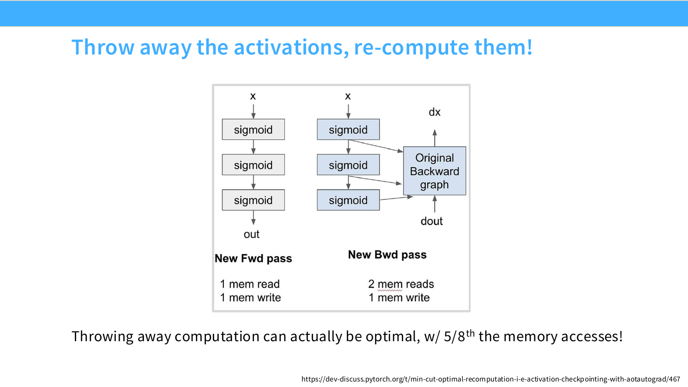

이 페이지는 Page 35의 반대 전략을 보여준다. 즉 forward 때 모든 activation을 저장하지 않고 일부를 버린 뒤, backward 때 필요한 값을 다시 계산한다. 슬라이드는 activation을 버리고 recompute하면 memory access가 기존의 $5/8$ 수준으로 줄어들 수 있다고 설명한다.

이를 직관적으로 비교하면 다음과 같다.

| 방식 | Forward 때 하는 일 | Backward 때 하는 일 | 장점 | 단점 |
|---|---|---|---|---|
| 모든 activation 저장 | 중간값을 모두 HBM에 저장 | 저장된 값을 읽어 gradient 계산 | 재계산이 적음 | memory 사용량과 memory traffic 증가 |
| recomputation | 일부 중간값을 저장하지 않음 | 필요한 중간값을 다시 forward 계산 | memory 사용량과 traffic 감소 | FLOPs 증가 |

간단한 layer chain 예시로 보면 더 명확하다.

```math
x_1=f_1(x_0),\quad x_2=f_2(x_1),\quad x_3=f_3(x_2)
```

기본 방식은 $x_1,x_2,x_3$를 모두 저장한다. 반면 checkpointing을 쓰면 예를 들어 $x_0$와 $x_3$만 저장하고, backward에서 $x_1$이나 $x_2$가 필요할 때 다음처럼 다시 계산한다.

```math
x_1=f_1(x_0),\quad x_2=f_2(x_1)
```

여기서 다시 계산하는 행위가 recomputation이다. 이때 $x_0$나 $x_3$처럼 저장해둔 기준점이 checkpoint다. 그래서 activation checkpointing은 “어디를 저장할지 정하는 전략”이고, recomputation은 “저장하지 않은 구간을 다시 계산하는 동작”이라고 구분할 수 있다.

LLM training에서 activation checkpointing은 매우 중요하다. sequence length가 길어질수록 attention activation과 MLP activation이 커지고, layer 수가 많아질수록 저장해야 하는 activation도 누적된다. 모든 것을 저장하면 batch size를 줄여야 하거나, 아예 모델이 GPU memory에 들어가지 않을 수 있다. checkpointing은 compute를 더 쓰는 대신 더 긴 context, 더 큰 batch, 더 큰 model을 학습할 수 있게 한다.

이 관점은 FlashAttention backward와도 연결된다. FlashAttention forward는 거대한 attention probability matrix를 HBM에 저장하지 않는다. 그러면 backward 때 필요한 attention score/probability를 어떻게 얻을까? 필요한 tile을 다시 계산한다. 즉 FlashAttention도 memory를 아끼기 위해 recomputation을 사용하는 대표적인 예다.

정리하면 이 페이지의 메시지는 다음과 같다.

```math
\text{저장하는 것이 항상 빠른 것은 아니다.}
```

GPU에서는 특히 HBM access가 비싸므로, 저장해두고 읽는 대신 필요한 순간 다시 계산하는 편이 전체 성능이나 memory capacity 측면에서 유리할 수 있다.

---

## Page 37. Trick 4: Memory coalescing and DRAM

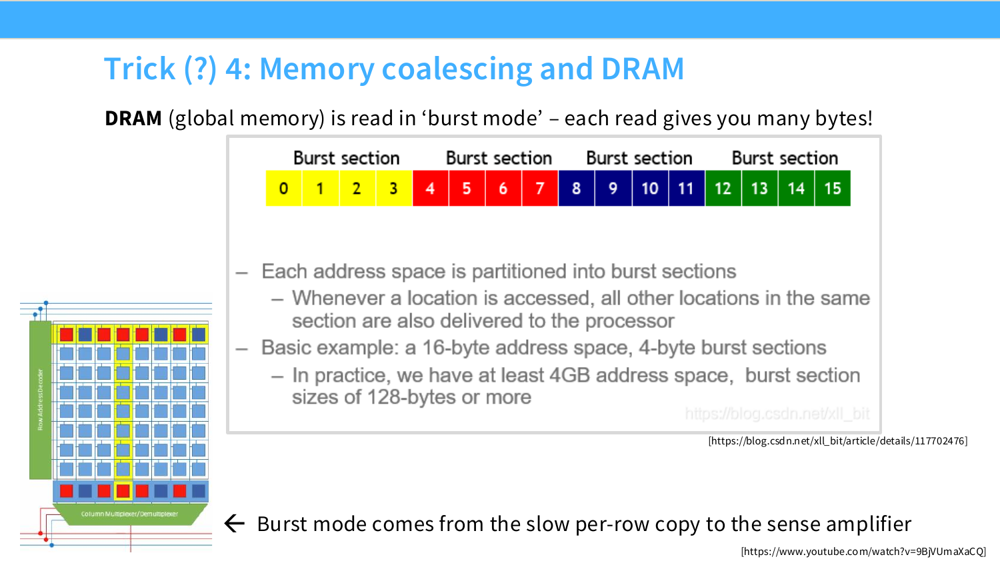

이제 네 번째 최적화 기법인 **memory coalescing**으로 넘어간다. 여기서 핵심 질문은 단순하다.

> 여러 GPU thread가 global memory, 즉 HBM/DRAM에서 데이터를 읽을 때, 이 요청들이 하드웨어 입장에서 “한 번에 묶어서 처리하기 좋은 형태인가?”

이 질문이 중요한 이유는 DRAM이 데이터를 **정확히 요청한 1 byte만** 가져오는 장치가 아니기 때문이다. 슬라이드의 첫 문장처럼 DRAM은 보통 **burst mode**로 읽힌다. 즉 어떤 주소 하나를 요청하더라도, 실제로는 그 주소가 포함된 연속된 주소 구간이 함께 이동한다.

슬라이드의 예시는 16-byte address space를 4-byte burst section으로 나눈다.

```math
[0,1,2,3],\ [4,5,6,7],\ [8,9,10,11],\ [12,13,14,15]
```

만약 주소 1을 읽으면, 하드웨어는 주소 1만 딱 가져오는 것이 아니라 같은 burst section에 있는 0, 1, 2, 3을 함께 가져온다. 실제 GPU에서는 이 단위가 슬라이드 예시보다 훨씬 크고, cache line이나 memory transaction 단위로 처리된다고 이해하면 된다. 강의는 개념을 단순화하기 위해 “burst section”이라는 그림으로 설명한다.

DRAM이 이렇게 동작하는 이유는 아래 DRAM 구조 그림과 연결된다. DRAM array에서는 원하는 cell 하나를 직접 즉시 읽는 것이 아니라, 먼저 row를 sense amplifier/row buffer 쪽으로 복사하고 그 안에서 필요한 column을 선택한다. 이 row 접근 과정이 비싸기 때문에, 한 번 row를 열었으면 주변의 연속된 데이터를 같이 전달하는 편이 효율적이다.

그래서 memory coalescing의 직관은 다음과 같다.

```math
\text{같은 warp의 thread들이 인접한 주소를 읽음}
\Rightarrow
\text{적은 수의 DRAM transaction}
```

반대로 thread들이 흩어진 주소를 읽으면 다음처럼 된다.

```math
\text{같은 warp의 thread들이 멀리 떨어진 주소를 읽음}
\Rightarrow
\text{많은 DRAM transaction}
```

예를 들어 warp 안의 32개 thread가 있고, 각 thread가 `float32` 하나를 읽는다고 하자. `float32`는 4 byte이므로 32개 thread가 연속된 원소를 읽으면 총 128 byte 범위를 읽는다.

```math
\text{Thread } t \rightarrow x[base+t]
```

이 경우 주소는 거의 연속적이다.

```math
\text{addr}(x[base+t]) = \text{base address} + 4t
```

따라서 하드웨어는 이 32개의 load를 적은 수의 memory transaction으로 처리할 수 있다. 반대로 다음처럼 stride가 큰 접근을 하면,

```math
\text{Thread } t \rightarrow x[base+1024t]
```

thread마다 읽는 주소가 4096 byte씩 떨어진다. 이 경우 각 thread의 요청이 서로 다른 burst/cache line에 걸릴 가능성이 높고, 같은 32개 값을 읽더라도 훨씬 많은 memory transaction이 필요하다.

이 페이지 하단의 링크는 이 현상을 설명하기 위한 참고 자료다. DRAM burst mode에 대한 설명은 [CSDN burst mode](https://blog.csdn.net/xll_bit/article/details/117702476)에 연결되어 있고, DRAM row/sense amplifier 구조는 [DRAM explainer](https://www.youtube.com/watch?v=9BjVUmaXaCQ) 영상과 연결된다.

여기서 중요한 점은 coalescing이 연산량을 줄이는 기법은 아니라는 것이다. 읽어야 하는 원소 개수는 그대로다. 다만 같은 데이터를 읽더라도, 하드웨어가 처리해야 하는 memory transaction 수를 줄여 **effective memory bandwidth**를 높인다.

```math
\text{coalescing} \neq \text{FLOPs 감소}
```

```math
\text{coalescing} = \text{같은 memory bandwidth로 더 많은 유효 데이터를 가져오는 것}
```

---

## Page 38. Memory coalescing

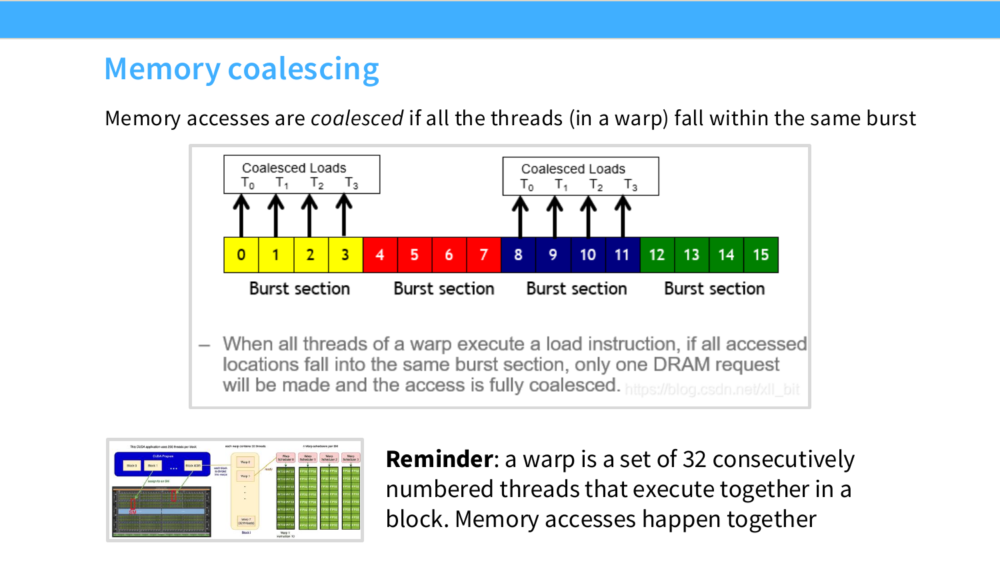

이 페이지는 memory coalescing을 더 직접적으로 정의한다.

> 같은 warp 안의 thread들이 같은 burst section 안의 주소를 읽으면 memory access가 coalesced되었다고 말한다.

여기서 다시 warp를 떠올리면 된다. GPU에서 warp는 보통 **연속 번호를 가진 32개 thread가 함께 실행되는 묶음**이다. 같은 warp 안의 thread들은 같은 load instruction을 동시에 실행한다. 다만 각 thread가 읽는 주소는 다를 수 있다.

예를 들어 다음 instruction을 생각해보자.

```text
각 thread는 자기 lane 번호에 해당하는 x 값을 읽어라.
```

그러면 실제로는 다음처럼 실행된다.

```text
Thread 0  -> x[0]
Thread 1  -> x[1]
Thread 2  -> x[2]
...
Thread 31 -> x[31]
```

이때 `x[0]`, `x[1]`, ..., `x[31]`이 memory에 연속적으로 저장되어 있다면 coalescing이 잘 된다. 같은 warp 안에서 발생한 32개의 load가 하드웨어 입장에서는 하나 또는 적은 수의 넓은 memory transaction으로 묶일 수 있기 때문이다.

슬라이드의 그림은 단순화를 위해 thread $T_0,T_1,T_2,T_3$ 네 개만 보여준다. $T_0,T_1,T_2,T_3$가 주소 0, 1, 2, 3을 읽으면 모두 같은 burst section 안에 있으므로 **coalesced load**가 된다. 또 다른 예로 주소 8, 9, 10, 11을 읽어도 같은 burst section 안에 있으므로 coalesced load가 된다.

반대로 다음과 같은 접근은 좋지 않다.

```text
Thread 0  -> x[0]
Thread 1  -> x[1024]
Thread 2  -> x[2048]
Thread 3  -> x[3072]
```

읽는 원소 수는 4개로 같지만, 주소가 서로 멀리 떨어져 있다. 이 경우 여러 burst section을 건드리므로 memory transaction 수가 늘어난다.

정리하면 coalescing은 다음 조건을 좋아한다.

```math
\text{same warp} + \text{same instruction} + \text{contiguous addresses}
\Rightarrow
\text{coalesced memory access}
```

그리고 성능 관점에서는 다음 효과를 낸다.

```math
\text{fewer memory transactions}
\Rightarrow
\text{higher effective bandwidth}
\Rightarrow
\text{faster memory-bound kernels}
```

주의할 점도 있다. 실제 NVIDIA GPU에서는 “정확히 하나의 burst section”이라는 강의식 표현보다 더 복잡하게, cache line 크기, memory transaction 크기, alignment, L1/L2 cache 동작 등이 관여한다. 하지만 초심자 관점에서는 다음 하나만 기억하면 충분하다.

> 같은 warp의 thread들이 인접한 주소를 동시에 읽도록 만들면 GPU memory system이 훨씬 좋아한다.

이 개념이 바로 다음 페이지의 matrix multiplication 예시로 이어진다.

---

## Page 39. Coalescing for matrix multiplication

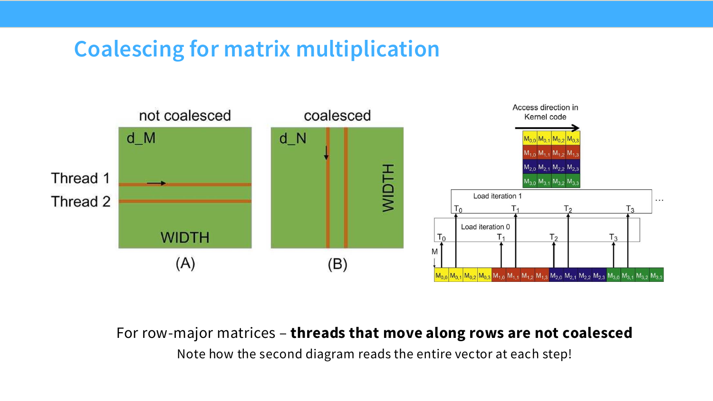

이 페이지는 coalescing이 matrix multiplication에서 왜 까다로운지 보여준다. 여기서 헷갈리기 쉬운 문장이 있다.

> For row-major matrices - threads that move along rows are not coalesced.

row-major matrix에서는 “row 방향이 연속 저장되는 것 아닌가?”라고 생각할 수 있다. 맞다. row-major layout에서는 같은 row 안에서 column index가 1씩 증가할 때 memory 주소도 연속적으로 증가한다.

행렬 $A$의 크기가 `HEIGHT x WIDTH`이고 row-major로 저장되어 있다면 주소는 다음과 같다.

```math
\text{addr}(A[i,j])
=
\text{base}(A)+(i\cdot \text{WIDTH}+j)\cdot \text{sizeof(dtype)}
```

따라서 같은 row에서 인접한 column을 읽으면 주소가 연속적이다.

```math
A[i,0], A[i,1], A[i,2], A[i,3]
\quad\Rightarrow\quad
\text{contiguous}
```

그런데 슬라이드가 말하는 “threads that move along rows”는 **각 thread가 자기 row를 따라 움직이는 배치**를 뜻한다. 예를 들어 thread 0은 row 0을 담당하고, thread 1은 row 1을 담당한다고 하자. 두 thread가 같은 loop step에서 각각 다음 원소를 읽으면,

```math
T_0 \rightarrow A[0,k]
```

```math
T_1 \rightarrow A[1,k]
```

이 두 주소의 차이는 대략 `WIDTH`만큼 벌어진다.

```math
\text{addr}(A[1,k])-\text{addr}(A[0,k])
=
\text{WIDTH}\cdot \text{sizeof(dtype)}
```

즉 각 thread가 개별적으로는 row 방향으로 움직이고 있지만, **같은 순간에 warp thread들이 읽는 주소**는 서로 다른 row에 흩어져 있다. coalescing에서 중요한 것은 “각 thread의 시간 방향 이동”이 아니라 “같은 warp가 같은 instruction에서 동시에 읽는 주소들의 모양”이다.

따라서 다음 두 경우를 구분해야 한다.

```math
\text{좋은 경우: } T_t \rightarrow A[i, j+t]
```

같은 row의 인접 column을 여러 thread가 동시에 읽으므로 주소가 연속적이다.

```math
\text{나쁜 경우: } T_t \rightarrow A[i+t, j]
```

서로 다른 row의 같은 column을 여러 thread가 동시에 읽으므로 주소 간격이 `WIDTH`만큼 벌어진다.

오른쪽 그림도 이 관점에서 보면 된다. 각 load iteration에서 thread들이 어떤 vector를 동시에 읽는지에 따라, 같은 vector 전체를 반복해서 읽거나 coalescing이 깨질 수 있다. 행렬곱은 수식 자체는 단순하다.

```math
P_{ij}=\sum_k M_{ik}N_{kj}
```

하지만 GPU kernel에서는 output $P_{ij}$를 어떤 thread가 맡을지, warp 안 thread들이 어떤 $M$과 $N$ 원소를 동시에 읽을지, row-major layout과 access direction이 맞는지가 성능을 크게 좌우한다.

결론은 다음이다.

```math
\text{matrix multiplication 성능}
\neq
\text{수식만의 문제}
```

```math
\text{matrix multiplication 성능}
=
\text{thread mapping} + \text{memory layout} + \text{coalescing} + \text{data reuse}
```

이 페이지는 다음 tiling 파트로 넘어가는 징검다리다. coalescing은 “한 번 읽을 때 잘 읽는 방법”이고, tiling은 “한 번 읽은 데이터를 여러 번 재사용하는 방법”이다.

---

## Page 40. Trick 5: tiling

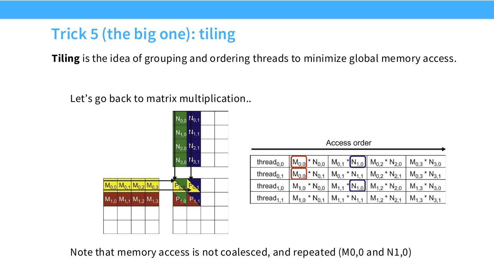

다섯 번째 기법은 강의에서 “the big one”이라고 부르는 **tiling**이다. 앞의 coalescing이 memory transaction을 효율적으로 만드는 기법이었다면, tiling은 더 근본적으로 **global memory를 다시 읽는 횟수 자체를 줄이는 기법**이다.

행렬곱을 다시 보자.

```math
P=MN
```

각 output 원소는 다음과 같이 계산된다.

```math
P_{ij}=\sum_k M_{ik}N_{kj}
```

슬라이드의 표를 보면 여러 thread가 각자 output 원소 하나를 담당한다. 예를 들어 `thread_{0,0}`은 $P_{0,0}$을 계산하고, `thread_{0,1}`은 $P_{0,1}$을 계산한다. 그런데 이 둘은 모두 $M$의 같은 row를 필요로 한다.

```math
P_{0,0}: M_{0,0},M_{0,1},M_{0,2},M_{0,3}\ \text{필요}
```

```math
P_{0,1}: M_{0,0},M_{0,1},M_{0,2},M_{0,3}\ \text{필요}
```

즉 $M_{0,0}$ 같은 원소가 여러 output 계산에서 반복해서 쓰인다. 또한 $P_{0,0}$과 $P_{1,0}$은 $N$의 같은 column을 공유하므로 $N_{1,0}$ 같은 원소도 반복해서 쓰인다.

naive kernel에서는 이런 반복 사용이 global memory 위에서 일어난다. 즉 같은 $M_{0,0}$을 여러 thread가 HBM에서 여러 번 가져올 수 있다. HBM access가 비싼 상황에서는 이것이 큰 병목이 된다.

Tiling의 아이디어는 다음과 같다.

> output matrix의 작은 사각형 영역을 한 block이 맡고, 그 output tile을 계산하는 데 필요한 input tile을 shared memory에 올려 여러 thread가 재사용한다.

비유하면, 도서관 창고에 있는 책을 매번 가져오는 대신, 필요한 몇 페이지를 책상 위에 펼쳐놓고 여러 사람이 같이 보는 것과 같다.

- global memory/HBM: 크지만 멀고 느린 창고
- shared memory: 작지만 block 안 thread들이 빠르게 공유하는 책상
- tile: 책상 위에 잠시 올려두는 작은 데이터 조각

그래서 tiling의 핵심은 다음 수식으로 요약할 수 있다.

```math
\text{load once from global memory}
\rightarrow
\text{reuse many times in shared memory}
```

이제 다음 페이지는 이 과정을 “phase” 단위로 보여준다.

---

## Page 41. Tiling - store and reuse information in shared memory

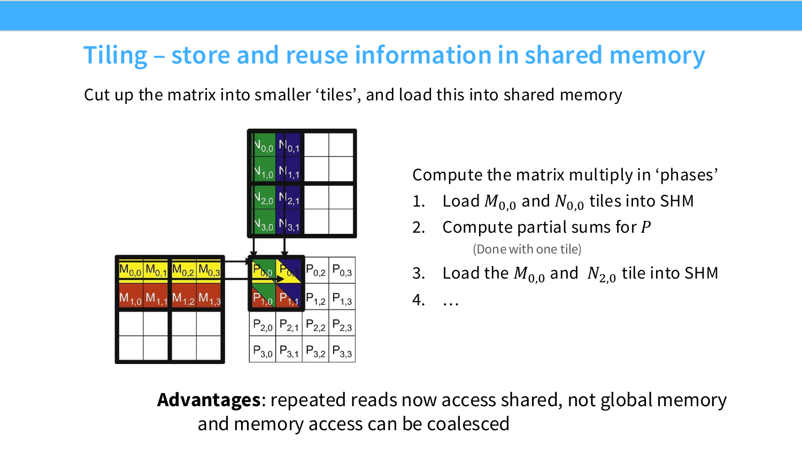

이 페이지는 tiling을 실제 실행 흐름으로 설명한다. matrix를 작은 tile로 자른 뒤, 계산할 output tile에 필요한 $M$ tile과 $N$ tile을 shared memory에 올린다. 그다음 block 내부 thread들이 shared memory에 있는 tile을 사용해 partial sum을 계산한다.

슬라이드의 흐름은 다음과 같다.

첫 번째 phase에서는 $M_{0,0}$ tile과 $N_{0,0}$ tile을 shared memory, 즉 SHM에 load한다.

```math
M_{0,0} \rightarrow \text{SHM}
```

```math
N_{0,0} \rightarrow \text{SHM}
```

그다음 이 두 tile을 사용해 $P$의 왼쪽 위 output tile에 대한 partial sum을 계산한다. 이때 한 번 shared memory에 올라온 $M_{0,0}$과 $N_{0,0}$의 원소들은 block 안 여러 thread가 반복해서 사용한다.

두 번째 phase에서는 다음 $k$ 방향 tile을 가져온다. 슬라이드에서는 $M_{0,0}$과 $N_{2,0}$ tile을 다시 load하는 식으로 표현되어 있다. 핵심은 output tile 하나를 완성하려면 $k$ dimension을 따라 여러 tile pair를 순회해야 한다는 점이다.

수식으로 쓰면 원래 행렬곱은 다음과 같다.

```math
P_{ij}=\sum_{r=0}^{N-1}M_{ir}N_{rj}
```

Tiling은 이 summation index $r$을 tile 단위로 나눈다.

```math
P_{ij}
=
\sum_{t=0}^{N/T-1}\sum_{r=tT}^{(t+1)T-1}M_{ir}N_{rj}
```

여기서 $T$가 tile size다. 내부의 작은 합은 shared memory에 올린 tile로 계산하고, 바깥쪽 $t$ loop가 phase를 나타낸다.

이 구조의 장점은 두 가지다.

첫째, 반복 read가 global memory가 아니라 shared memory에서 발생한다.

```math
\text{반복 접근 위치: HBM} \rightarrow \text{SHM}
```

둘째, global memory에서 tile을 가져올 때도 thread mapping을 잘 잡으면 coalesced load가 가능하다. 즉 tiling은 coalescing과 경쟁하는 기법이 아니라 같이 쓰이는 기법이다.

```math
\text{good matmul kernel}
=
\text{coalesced global load}
+
\text{shared memory reuse}
+
\text{Tensor Core friendly tile shape}
```

---

## Page 42. Tiling math

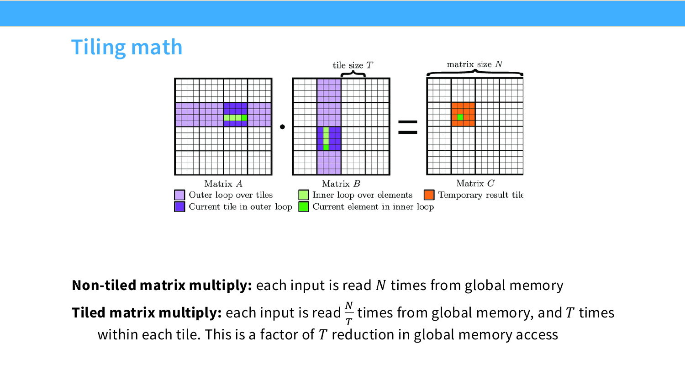

이 페이지는 tiling이 왜 global memory access를 줄이는지 수학적으로 보여준다. 정사각 행렬곱 $C=AB$를 생각하자. 각 행렬의 크기는 $N\times N$이고 tile size는 $T$라고 하자.

먼저 non-tiled matrix multiplication을 보자. output 원소 $C_{ij}$ 하나를 계산하려면 $A$의 row 하나와 $B$의 column 하나를 읽는다.

```math
C_{ij}=\sum_{k=0}^{N-1}A_{ik}B_{kj}
```

output 원소는 $N^2$개 있고, 각 output 원소마다 $A$에서 $N$개, $B$에서 $N$개를 읽는다고 단순화하면 global memory read는 대략 다음과 같다.

```math
\text{non-tiled reads} \approx 2N^3
```

물론 cache가 일부 도와줄 수 있지만, naive한 관점에서는 같은 input 원소가 여러 output 계산에서 반복해서 global memory에서 읽힌다. 슬라이드의 표현처럼 각 input은 대략 $N$번 global memory에서 읽힐 수 있다.

이제 tiled matrix multiplication을 보자. output tile 하나의 크기를 $T\times T$라고 하면, 그 tile을 계산하기 위해 한 phase에서 $A$ tile 하나와 $B$ tile 하나를 shared memory에 올린다.

```math
A_{tile}\in\mathbb{R}^{T\times T},
\qquad
B_{tile}\in\mathbb{R}^{T\times T}
```

한 phase에서 global memory에서 읽는 원소 수는 대략 다음과 같다.

```math
T^2 + T^2 = 2T^2
```

output tile 개수는 $(N/T)^2$개이고, 각 output tile을 완성하려면 $k$ 방향으로 $N/T$개의 phase가 필요하다. 따라서 전체 global read는 대략 다음과 같다.

```math
\text{tiled reads}
\approx
2T^2\cdot\left(\frac{N}{T}\right)^2\cdot\left(\frac{N}{T}\right)
=
\frac{2N^3}{T}
```

즉 global memory read가 약 $T$배 줄어든다.

```math
\frac{\text{non-tiled reads}}{\text{tiled reads}}
\approx
\frac{2N^3}{2N^3/T}
=T
```

슬라이드의 문장도 이 내용이다.

```math
\text{Non-tiled: each input is read } N \text{ times from global memory}
```

```math
\text{Tiled: each input is read } \frac{N}{T}\text{ times from global memory, and }T\text{ times within each tile}
```

중요한 점은 “$T$번 읽는다”는 부분이 사라지는 것이 아니라, 그 $T$번의 반복 접근이 훨씬 빠른 shared memory에서 일어난다는 것이다.

또한 tiling은 arithmetic intensity도 올린다. 행렬곱의 FLOPs는 여전히 대략 $2N^3$이다. 그런데 global memory movement는 $2N^3$에서 $2N^3/T$로 줄어든다. 따라서 FLOPs per byte가 증가하고, workload가 roofline model에서 오른쪽으로 이동한다.

```math
\text{arithmetic intensity}
=
\frac{\text{FLOPs}}{\text{bytes moved}}
```

```math
\text{tiling} \Rightarrow \text{bytes moved 감소} \Rightarrow \text{arithmetic intensity 증가}
```

이것이 tiling이 GPU matmul 성능의 핵심인 이유다.

---

## Page 43. Complexities with tiling

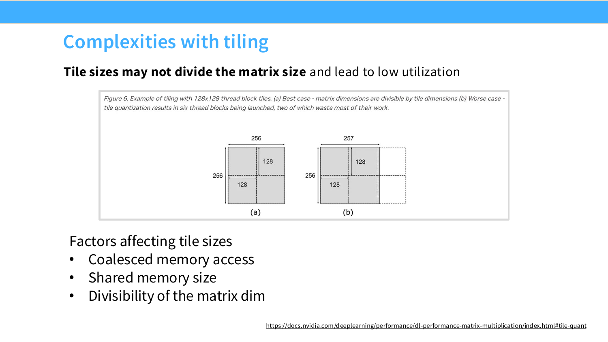

이 페이지는 tiling이 강력하지만 공짜는 아니라는 점을 설명한다. 가장 먼저 등장하는 문제는 **tile size가 matrix size를 딱 나누지 못하는 경우**다.

슬라이드 그림은 tile size가 $128\times128$인 경우를 보여준다. matrix dimension이 $256\times256$이면 정확히 $2\times2$개의 tile로 나뉜다. 모든 tile이 꽉 차 있으므로 utilization이 좋다.

```math
\frac{256}{128}=2
```

하지만 dimension이 257이 되면 이야기가 달라진다. 257은 128로 나누어떨어지지 않기 때문에 한쪽 방향에 tile이 하나 더 필요하다.

```math
\left\lceil\frac{257}{128}\right\rceil=3
```

즉 실제 원소는 1개 column만 더 늘었을 뿐인데, tile 관점에서는 거의 비어 있는 tile들을 추가로 만들어야 한다. 그림에서는 257 쪽이 점선 영역까지 포함해 더 많은 thread block을 launch해야 하고, 그중 일부는 대부분의 작업이 padding/빈 영역에 해당한다.

이 현상을 tile quantization이라고 볼 수 있다. 연속적인 matrix size가 실제 실행에서는 tile 단위로 양자화되기 때문에, 작은 크기 변화가 갑자기 큰 성능 차이를 만들 수 있다.

```math
\text{logical size 증가: } 256 \rightarrow 257
```

```math
\text{tile grid 증가: } 2 \rightarrow 3
```

이 페이지 하단의 세 요소도 중요하다.

첫째, **coalesced memory access**다. tile shape가 좋아도 global memory에서 tile을 가져오는 방식이 coalesced되지 않으면 bandwidth를 낭비한다.

둘째, **shared memory size**다. tile이 너무 크면 shared memory에 들어가지 않는다. 또는 들어가더라도 한 SM에 동시에 올라갈 수 있는 block 수가 줄어 occupancy가 낮아질 수 있다.

셋째, **divisibility of the matrix dimension**이다. matrix dimension이 tile size로 잘 나누어져야 빈 tile이 적고 utilization이 높다.

관련 NVIDIA 문서는 tile quantization 문제를 더 자세히 설명한다: [NVIDIA matrix multiplication performance - tile quantization](https://docs.nvidia.com/deeplearning/performance/dl-performance-matrix-multiplication/index.html#tile-quant).

Understanding GPUs 자료도 같은 내용을 보충한다. tile size를 고를 때는 계산량뿐 아니라 shared memory 용량, coalescing 가능성, matrix dimension과의 나눗셈 관계를 같이 봐야 한다.

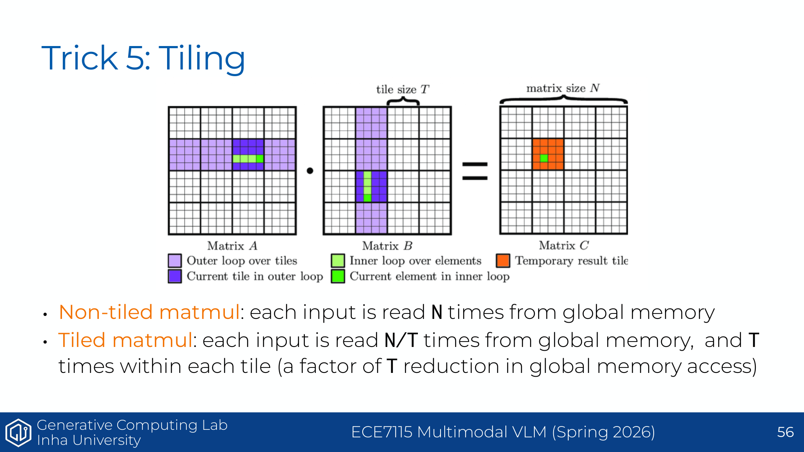

따라서 실제 LLM 구현에서 hidden dimension, vocab size, sequence block size 등을 64, 128, 256 같은 배수로 맞추는 일이 흔하다. 이는 수학적 필요 때문이 아니라 GPU kernel이 좋아하는 tile/alignment 구조를 맞추기 위한 경우가 많다.

---

## Page 44. Complexities with tiling 2 - memory alignment

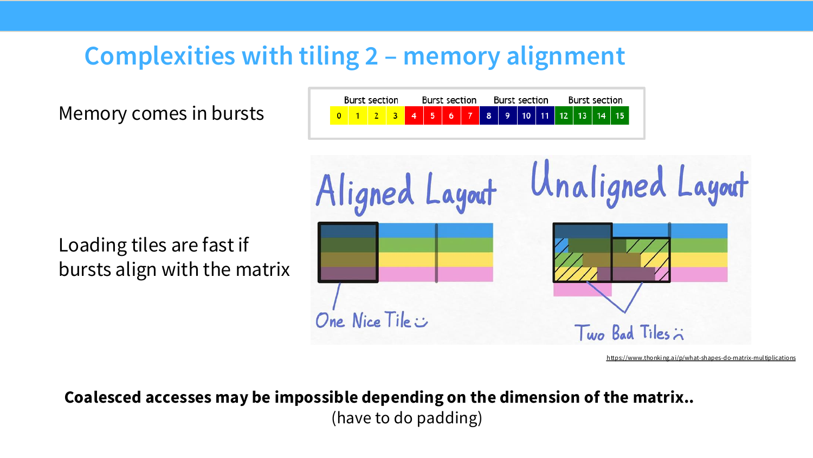

이 페이지는 tiling의 두 번째 복잡성인 **memory alignment**를 설명한다. 앞에서 DRAM은 burst 단위로 데이터를 읽는다고 했다. 그러면 tile을 global memory에서 shared memory로 가져올 때도, tile의 시작 주소와 모양이 burst boundary와 잘 맞아야 효율적이다.

슬라이드 위쪽의 burst section 그림을 다시 보자. 주소는 다음처럼 burst section으로 나뉜다.

```math
[0,1,2,3],\ [4,5,6,7],\ [8,9,10,11],\ [12,13,14,15]
```

어떤 tile이 정확히 burst boundary에 맞춰져 있으면 필요한 데이터를 적은 수의 transaction으로 가져올 수 있다. 슬라이드의 aligned layout은 이 상황을 “one nice tile”로 표현한다.

반대로 tile이 burst boundary와 어긋나 있으면, 논리적으로는 하나의 tile을 읽는 것처럼 보여도 실제 memory transaction은 여러 burst section에 걸친다. 슬라이드의 unaligned layout이 “two bad tiles”처럼 보이는 이유다.

이 차이는 작은 예시로 이해할 수 있다. burst size가 4개 원소라고 하자. 어떤 thread block이 4개 연속 원소를 읽어야 한다.

좋은 경우:

```math
[0,1,2,3]
```

이 경우 하나의 burst section에 들어간다.

나쁜 경우:

```math
[2,3,4,5]
```

논리적으로는 여전히 4개 원소지만, 실제로는 두 burst section을 건드린다.

```math
[0,1,2,3]\quad\text{and}\quad[4,5,6,7]
```

즉 필요한 데이터 수는 같아도 memory transaction 수가 늘어난다.

이 때문에 coalesced access가 matrix dimension에 따라 구조적으로 어려울 수 있다. 이때는 padding을 넣어 dimension을 hardware-friendly한 배수로 맞추는 것이 더 빠를 수 있다.

```math
\text{padding으로 원소 수 증가}
\quad\text{하지만}\quad
\text{alignment 개선으로 runtime 감소 가능}
```

관련 링크는 matrix multiplication shape 분석 글이다: [What shapes do matrix multiplications like?](https://www.thonking.ai/p/what-shapes-do-matrix-multiplications).

Understanding GPUs 자료도 이를 burst mode와 연결한다. tile이 burst boundary와 잘 맞으면 필요한 데이터를 적은 transaction으로 가져오고, 그렇지 않으면 같은 tile을 읽기 위해 더 많은 transaction을 수행한다.

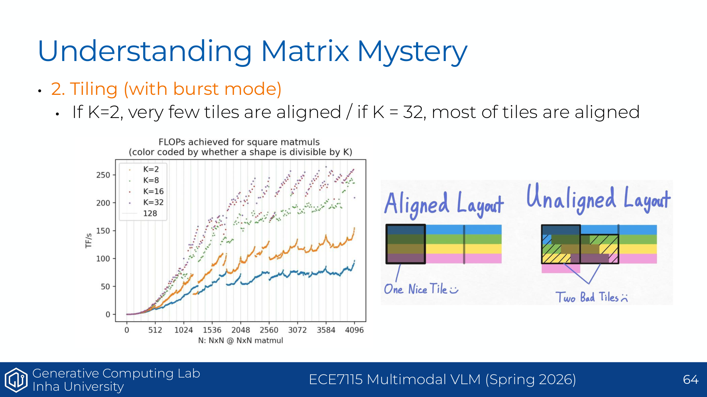

이 관점은 뒤에서 나오는 Karpathy의 vocab size padding 사례와 직접 연결된다. 더 큰 matrix가 오히려 빠를 수 있는 이유는, 추가된 dimension이 useless dimension이더라도 tile alignment와 kernel path를 개선할 수 있기 때문이다.

---

## Page 45. Putting it together: understanding a matrix mystery

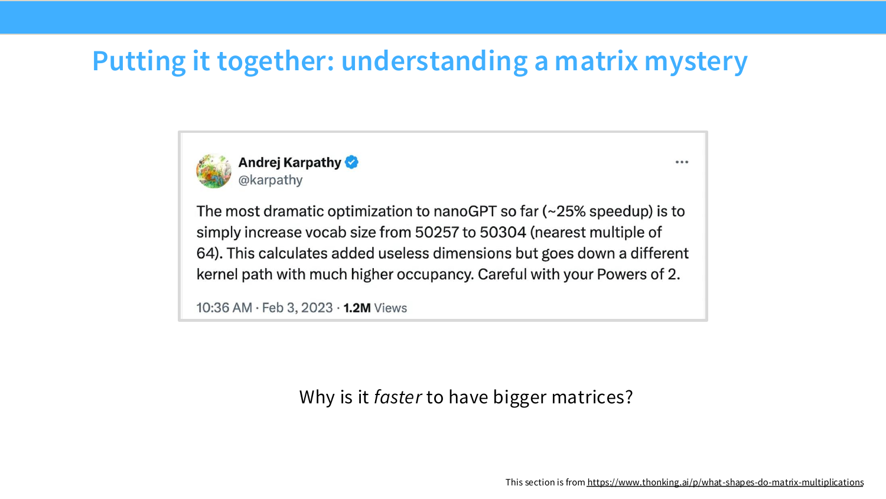

이 페이지는 앞에서 배운 coalescing, tiling, alignment를 실제 사례에 적용한다. 슬라이드에는 Andrej Karpathy의 트윗이 나온다. nanoGPT에서 vocabulary size를 50257에서 50304로 늘렸더니 약 25% speedup이 발생했다는 내용이다.

직관적으로는 이상하다. vocabulary size가 커지면 output projection matrix도 커진다. 계산해야 할 logit dimension도 늘고, parameter도 늘어난다. 게다가 새로 추가된 dimension은 실제 token에 대응하지 않는 useless dimension일 수도 있다.

그런데도 빨라진 이유는 GPU kernel이 좋아하는 shape로 바뀌었기 때문이다. 50304는 64의 배수에 가깝고, 많은 matmul kernel이 8, 16, 32, 64, 128 같은 배수 shape에서 더 좋은 Tensor Core utilization, memory alignment, occupancy를 얻는다.

여기서 occupancy는 SM 안에서 얼마나 많은 warp/block이 동시에 active하게 돌 수 있는지를 나타내는 개념이다. 어떤 shape는 kernel이 더 효율적인 code path를 사용하게 만들고, 더 많은 SM을 더 잘 채울 수 있다.

즉 이 사례는 다음 교훈을 준다.

```math
\text{작은 matrix} \neq \text{항상 빠른 matrix}
```

```math
\text{조금 더 큰 matrix} + \text{hardware-friendly shape}
\Rightarrow
\text{더 빠른 runtime 가능}
```

LLM에서 vocab size, hidden size, intermediate size, batch/sequence block size를 특정 배수로 맞추는 이유가 여기에 있다. 이는 모델링 관점의 선택이 아니라 system/hardware 관점의 선택일 때가 많다.

이 섹션의 출처 링크는 슬라이드 하단의 [What shapes do matrix multiplications like?](https://www.thonking.ai/p/what-shapes-do-matrix-multiplications)이다.

---

## Page 46. Matrix mystery

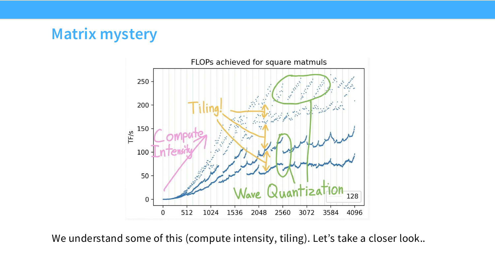

이 페이지는 square matrix multiplication의 실제 throughput 그래프를 보여준다. x축은 matrix size $N$, y축은 달성한 FLOP/s 또는 TFLOP/s다. 이상적으로는 matrix size가 커질수록 성능이 부드럽게 증가하다가 어느 지점에서 plateau에 도달할 것처럼 보인다.

하지만 그래프는 훨씬 복잡하다. 크게 세 가지 패턴이 보인다.

첫째, 작은 matrix에서 큰 matrix로 갈수록 전반적으로 성능이 올라간다. 이는 **compute intensity**가 증가하기 때문이다. matrix가 커질수록 한 번 가져온 input 원소를 더 많은 multiply-add에 재사용할 수 있고, launch overhead나 memory movement의 상대적 비중이 줄어든다.

둘째, 같은 $N$ 근처에서도 여러 성능 band가 보인다. 슬라이드의 손글씨 “Tiling!”이 가리키는 부분이다. 같은 크기의 matmul이라도 tile size, alignment, divisibility가 좋으면 더 높은 band에 올라가고, 그렇지 않으면 낮은 band에 머문다.

셋째, 성능이 sawtooth처럼 주기적으로 올라갔다가 갑자기 떨어지는 구간이 있다. 슬라이드의 “Wave Quantization”이 가리키는 부분이다. 이는 전체 tile 수가 SM 개수와 잘 맞느냐에 따라 생기는 현상이다.

따라서 이 그래프는 단순한 “행렬이 클수록 빠르다” 그래프가 아니다. 다음 세 요소가 섞여 있다.

```math
\text{observed matmul throughput}
=
f(\text{compute intensity},\ \text{tiling/alignment},\ \text{wave quantization})
```

Understanding GPUs 자료는 이 그래프를 세 요인으로 나누어 설명한다.

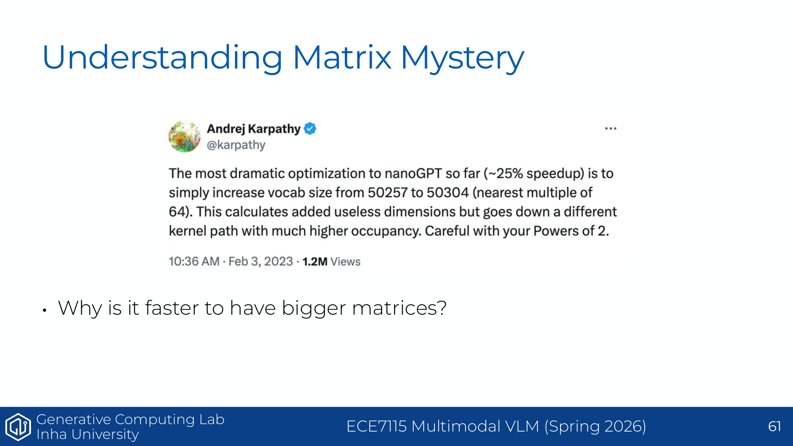

또 다른 보충 슬라이드는 roofline 관점에서 이 기법들의 목표를 보여준다. 어떤 기법은 roofline 위쪽으로 올려 실제 throughput을 높이고, 어떤 기법은 arithmetic intensity를 높여 x축 오른쪽으로 이동시킨다.


지금까지 배운 기법을 연결하면 다음과 같다.

- coalescing: 같은 memory movement에서 더 높은 effective bandwidth를 얻음
- fusion: 중간 tensor의 HBM 왕복을 줄임
- recomputation: 저장할 tensor를 다시 계산해 memory movement/capacity를 줄임
- tiling: global memory read를 shared memory reuse로 바꿈
- quantization: byte 수를 줄여 arithmetic intensity를 높임

이제 다음 두 페이지는 그래프의 주요 원인 중 tiling/alignment와 wave quantization을 더 자세히 설명한다.

---

## Page 47. Part 1: tiling

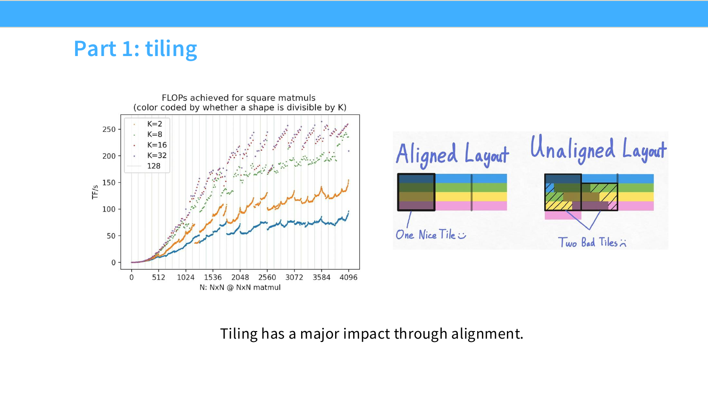

이 페이지는 matrix mystery의 첫 번째 원인으로 tiling, 특히 **alignment**를 강조한다. 왼쪽 그래프는 square matmul의 성능을 matrix shape가 특정 $K$ 값으로 나누어지는지에 따라 색으로 나누어 보여준다. $K=2,8,16,32$처럼 더 큰 단위로 잘 나누어지는 shape일수록 더 좋은 kernel path나 tile alignment를 얻을 가능성이 높다.

오른쪽 그림은 앞서 본 aligned layout과 unaligned layout이다. 이 그림이 말하는 핵심은 다음이다.

> 같은 $N\times N$ matmul이라도, $N$이 tile/burst/Tensor Core가 좋아하는 배수와 맞으면 훨씬 빠를 수 있다.

예를 들어 어떤 kernel이 내부적으로 $128\times128$ 또는 $256\times128$ tile을 쓴다고 하자. matrix dimension이 이 tile shape와 잘 맞으면 대부분의 tile이 꽉 차고 memory access도 aligned된다. 반대로 dimension이 애매하면 일부 tile이 비거나, memory burst boundary를 어긋나게 건드린다.

```math
N \equiv 0 \pmod{128}
\quad\Rightarrow\quad
\text{tile utilization 좋음}
```

```math
N \equiv 1 \pmod{128}
\quad\Rightarrow\quad
\text{거의 빈 tile이 추가될 수 있음}
```

이것이 Karpathy의 vocab padding 사례와 연결된다. `vocab_size=50257`은 모델링 관점에서는 자연스러운 숫자일 수 있지만, GPU matmul kernel 관점에서는 애매한 숫자다. 반면 50304처럼 64의 배수에 가까운 값은 alignment와 tile utilization을 개선할 수 있다.

여기서 중요한 감각은 다음이다.

```math
\text{parameter 수가 조금 증가해도}
\quad
\text{kernel efficiency가 크게 좋아지면 runtime은 감소할 수 있다.}
```

즉 GPU 성능은 FLOPs 수만으로 예측하기 어렵다. 같은 FLOPs라도 hardware-friendly shape인지가 중요하다.

---

## Page 48. Part 2: wave quantization

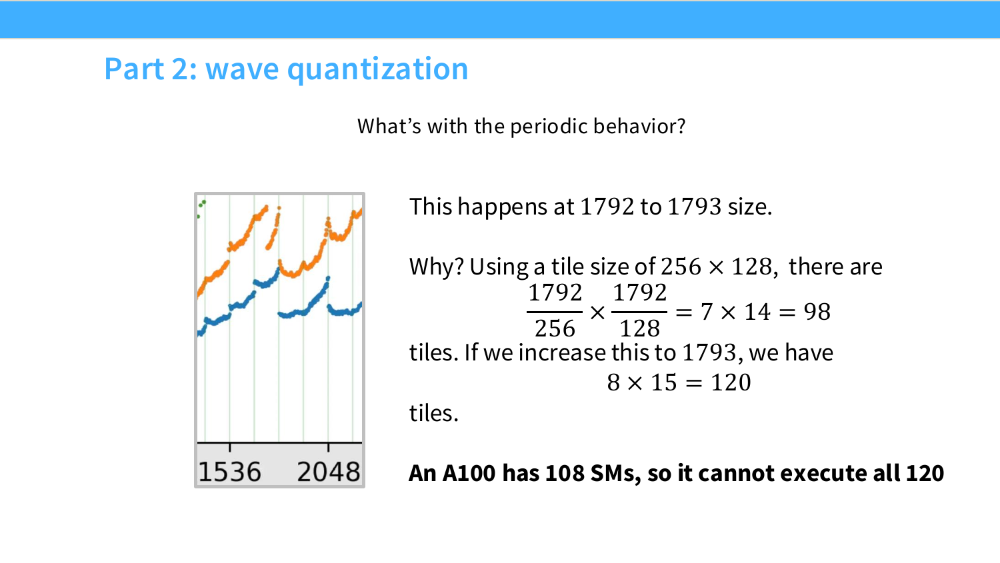

이 페이지는 matrix mystery의 두 번째 원인인 **wave quantization**을 설명한다. 여기서 wave란 GPU의 SM들이 한 번에 처리하는 tile/block 묶음이라고 보면 된다.

A100 GPU에는 108개의 SM이 있다고 하자. 각 tile을 하나의 block이 처리한다고 단순화하면, 동시에 최대 108개의 tile을 처리할 수 있다. 전체 tile 개수가 108개 이하라면 한 wave로 끝난다. 전체 tile 개수가 108개를 넘으면 두 번째 wave가 필요하다.

슬라이드는 $N=1792$에서 $N=1793$으로 아주 조금 커졌을 때 성능이 튀는 이유를 보여준다. tile size가 $256\times128$이라고 하자.

$N=1792$일 때 필요한 tile 수는 다음과 같다.

```math
\frac{1792}{256}\times\frac{1792}{128}
=
7\times14
=
98
```

98개 tile은 A100의 108개 SM보다 적다. 따라서 한 wave에서 대부분 처리할 수 있다.

그런데 $N=1793$이 되면 나누어떨어지지 않으므로 ceiling을 써야 한다.

```math
\left\lceil\frac{1793}{256}\right\rceil
\times
\left\lceil\frac{1793}{128}\right\rceil
=
8\times15
=
120
```

tile 수가 98개에서 120개로 갑자기 증가한다. 문제는 A100의 SM이 108개라는 점이다. 120개 tile을 한 번에 모두 실행할 수 없으므로 다음처럼 두 wave가 필요하다.

```math
\text{wave 0}: 108\text{ tiles}
```

```math
\text{wave 1}: 12\text{ tiles}
```

두 번째 wave에서는 12개 tile만 실행되므로 108개 SM 중 대부분이 놀게 된다. 이 마지막 불완전한 wave를 tail wave라고 볼 수 있다.

```math
\text{tail utilization}
=
\frac{12}{108}
\approx 11.1\%
```

따라서 matrix size가 1만 증가했는데도 runtime이 갑자기 늘 수 있다. 이것이 wave quantization이다.

Understanding GPUs 자료는 이 tail wave를 그림으로 보여준다.

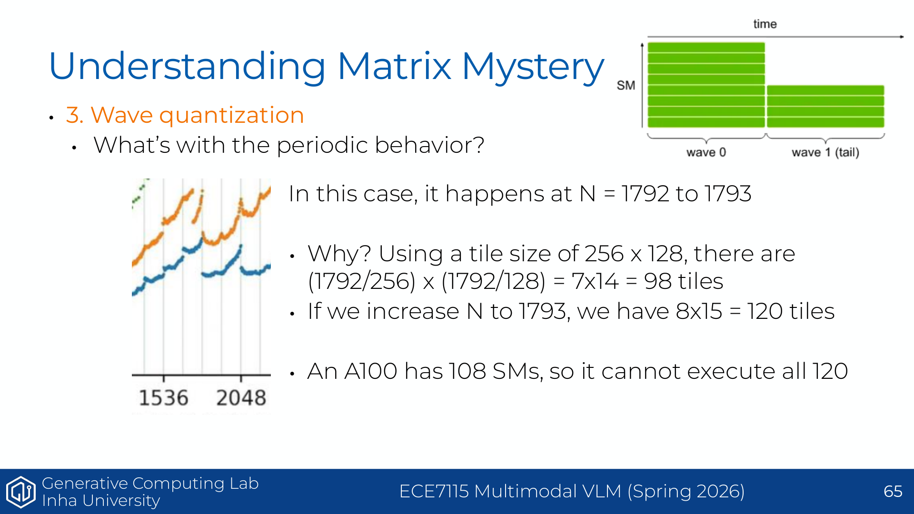

정리하면 wave quantization은 다음 현상이다.

```math
\text{logical work가 조금 증가}
\quad\Rightarrow\quad
\text{tile count가 계단식으로 증가}
\quad\Rightarrow\quad
\text{SM utilization이 갑자기 나빠짐}
```

그래프에서 성능이 주기적으로 올라갔다가 급격히 떨어지는 sawtooth 패턴은 이런 tile count와 SM count의 mismatch 때문에 나타난다.

---

## Page 49. Recap of part 2: making ML workloads go fast

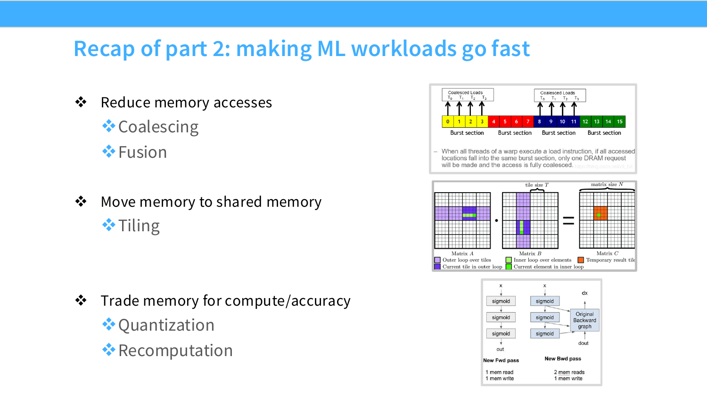

이 페이지는 GPU performance 파트 전체를 요약한다. 지금까지 배운 기법들은 모두 “GPU가 잘하는 방식으로 workload를 바꾸는 것”이다. 크게 세 범주로 나눌 수 있다.

첫째, **memory access를 줄인다**.

Coalescing은 같은 warp의 memory request를 연속 주소로 맞춰 transaction 수를 줄인다.

```math
\text{coalescing}:\quad
\text{scattered transactions} \rightarrow \text{fewer wide transactions}
```

Fusion은 여러 operator 사이의 중간 tensor를 HBM에 저장하고 다시 읽는 과정을 줄인다.

```math
\text{fusion}:\quad
\text{write intermediate} + \text{read intermediate} \rightarrow \text{keep in register/kernel}
```

둘째, **memory를 shared memory로 옮긴다**.

Tiling은 global memory에서 가져온 tile을 shared memory에 저장하고 block 내부 thread들이 재사용하게 만든다.

```math
\text{tiling}:\quad
\text{HBM repeated reads} \rightarrow \text{SHM repeated reads}
```

셋째, **memory를 compute 또는 accuracy와 교환한다**.

Quantization은 표현 bit 수를 줄여 byte movement를 줄인다. 예를 들어 FP32 대신 FP16/FP8을 쓰면 같은 원소 수를 옮겨도 byte 수가 줄어든다.

```math
\text{quantization}:\quad
\text{fewer bytes per element}
```

Recomputation은 activation이나 intermediate를 저장하지 않고, 필요할 때 다시 계산한다.

```math
\text{recomputation}:\quad
\text{save memory} \leftrightarrow \text{extra FLOPs}
```

이 다섯 기법을 한 줄로 묶으면 다음과 같다.

```math
\text{GPU optimization}
=
\text{reduce HBM traffic}
+
\text{increase reuse}
+
\text{use compute-friendly formats/shapes}
```

이제 강의는 이 개념들을 사용해 FlashAttention을 해석한다. 즉 FlashAttention은 갑자기 등장한 별개의 알고리즘이 아니라, 앞에서 배운 coalescing, tiling, fusion, recomputation, IO-awareness가 attention에 적용된 대표 사례다.

---

## Page 50. Part 3: Using what we know to understand FlashAttention

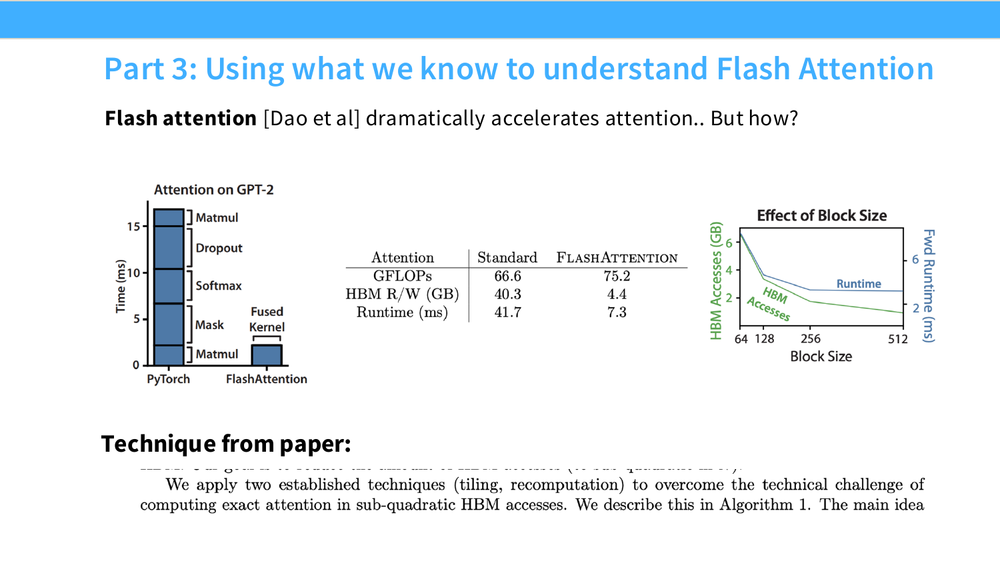

이 페이지부터는 지금까지 배운 GPU 최적화 관점으로 **FlashAttention**을 이해한다. 핵심은 다음이다.

> FlashAttention은 attention 수식을 근사하는 방법이 아니라, exact attention을 더 IO-efficient하게 계산하는 방법이다.

슬라이드 왼쪽 막대그래프를 보면 PyTorch attention은 여러 kernel로 나뉘어 실행된다. matmul, mask, softmax, dropout, 다시 matmul 같은 연산이 각각 분리되어 있다. 이렇게 kernel이 분리되면 각 단계의 중간 tensor가 HBM에 저장되고, 다음 kernel이 다시 HBM에서 읽는다.

반면 FlashAttention은 여러 단계를 fused kernel로 묶는다. 그래서 중간 attention score/probability matrix를 HBM에 크게 materialize하지 않는다.

가운데 표가 핵심을 잘 보여준다.

| 항목 | Standard Attention | FlashAttention |
|---|---:|---:|
| GFLOPs | 66.6 | 75.2 |
| HBM R/W | 40.3 GB | 4.4 GB |
| Runtime | 41.7 ms | 7.3 ms |

흥미로운 점은 FlashAttention의 GFLOPs가 오히려 더 많다는 것이다.

```math
75.2 > 66.6
```

그런데 runtime은 훨씬 짧다.

```math
7.3\text{ ms} \ll 41.7\text{ ms}
```

이것은 attention이 단순 compute-bound workload가 아니라 HBM read/write에 크게 지배되는 workload임을 보여준다. FlashAttention은 FLOPs를 조금 더 쓰더라도 HBM traffic을 크게 줄여 전체 시간을 줄인다.

```math
\text{more FLOPs but less HBM access}
\Rightarrow
\text{faster runtime}
```

오른쪽 그래프는 block size의 영향을 보여준다. block size를 키우면 보통 HBM access는 줄어든다. 더 큰 tile을 한 번에 처리하므로 재사용이 늘기 때문이다. 하지만 block이 너무 크면 shared memory/register 사용량이 커져 occupancy가 낮아질 수 있다. 따라서 block size는 무조건 클수록 좋은 것이 아니라 hardware resource에 맞게 조절해야 한다.

슬라이드 하단의 논문 인용문은 FlashAttention의 핵심 기법을 말한다. exact attention을 sub-quadratic HBM access로 계산하기 위해 **tiling**과 **recomputation**을 사용한다는 것이다.

FlashAttention을 앞의 다섯 기법과 연결하면 다음과 같다.

```math
\text{FlashAttention}
=
\text{tiling}
+
\text{fusion}
+
\text{online softmax}
+
\text{backward recomputation}
```

---

## Page 51. Recap of attention computation

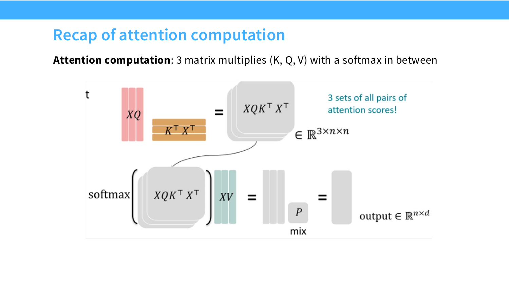

FlashAttention을 이해하기 전에 일반 attention 계산을 다시 정리한다. 입력 sequence representation을 $X\in\mathbb{R}^{n\times d}$라고 하자. Transformer attention에서는 먼저 $X$로부터 query, key, value를 만든다.

```math
Q=XW_Q
```

```math
K=XW_K
```

```math
V=XW_V
```

그다음 attention score를 계산한다.

```math
S=QK^\top
```

실제 구현에서는 보통 scaling도 포함한다.

```math
S=\frac{QK^\top}{\sqrt{d_h}}
```

그다음 row-wise softmax를 적용해 attention probability를 만든다.

```math
P=\operatorname{softmax}(S)
```

마지막으로 value와 곱해 output을 만든다.

```math
O=PV
```

슬라이드에서는 이를 “3 matrix multiplies with a softmax in between”이라고 표현한다. 여기서 관점에 따라 세 projection $W_Q,W_K,W_V$를 포함해 말할 수도 있고, attention core만 보면 $QK^\top$, softmax, $PV$가 핵심이다.

중요한 병목은 $S$와 $P$의 크기다. sequence length가 $n$이면,

```math
S\in\mathbb{R}^{n\times n}
```

```math
P\in\mathbb{R}^{n\times n}
```

이다. 즉 sequence length가 길어질수록 attention score/probability matrix는 $n^2$로 커진다.

naive implementation에서는 다음 일이 발생한다.

1. $S=QK^\top$를 계산한다.
2. $S$를 HBM에 저장한다.
3. softmax kernel이 $S$를 HBM에서 다시 읽는다.
4. $P=\operatorname{softmax}(S)$를 HBM에 저장한다.
5. $PV$ matmul이 $P$를 HBM에서 다시 읽는다.

즉 문제는 FLOPs만이 아니라 $S$와 $P$라는 거대한 중간 matrix의 HBM 왕복이다.

Understanding GPUs 자료도 이 naive attention의 communication-heavy한 구조를 보여준다.

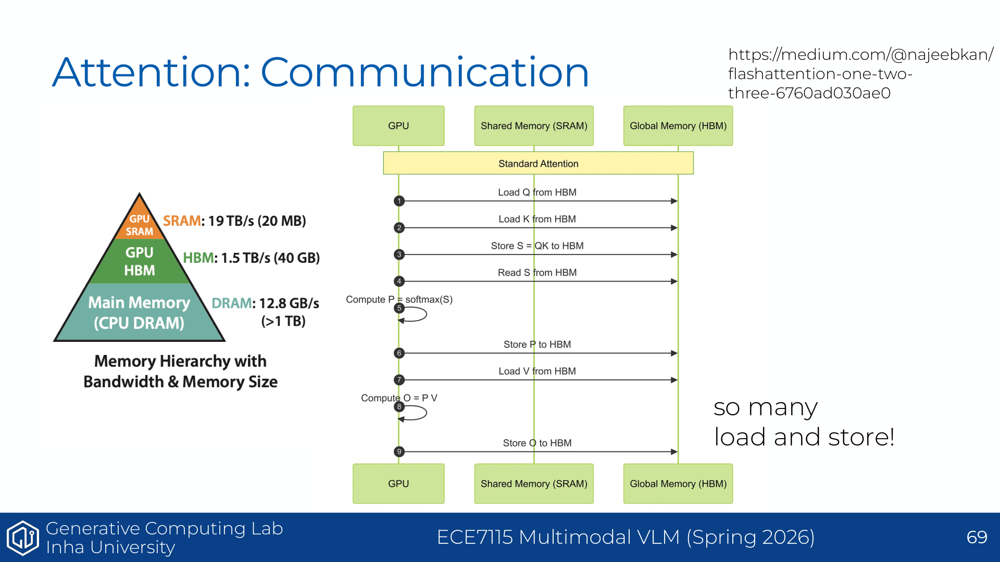

따라서 FlashAttention의 목표는 다음과 같이 정리된다.

```math
\text{Do not materialize } S \text{ and } P \text{ in HBM}
```

하지만 softmax는 row 전체를 알아야 계산되는 것처럼 보인다. 이것이 다음 페이지의 핵심 질문이다.

---

## Page 52. Tiling part 1: tiling for the KQV matrix multiply

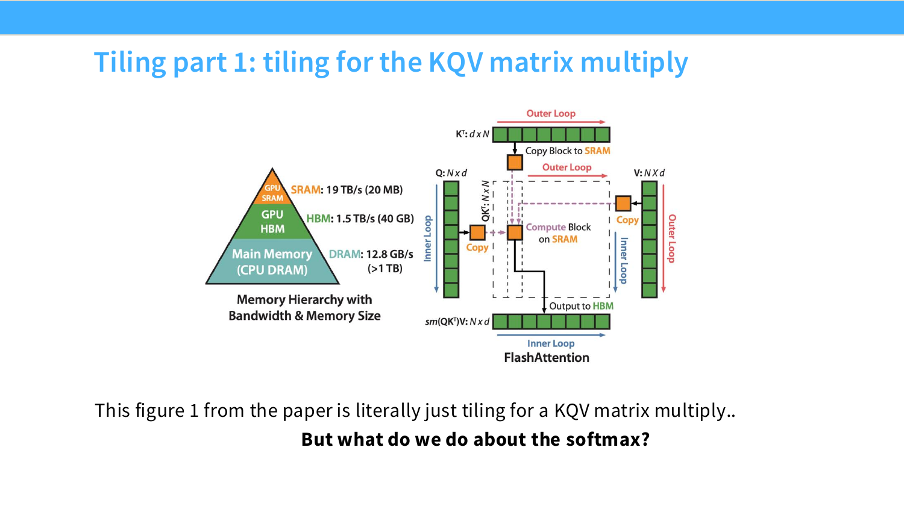

이 페이지는 FlashAttention의 첫 번째 아이디어가 사실 앞에서 배운 tiling과 같다는 점을 보여준다. 슬라이드 왼쪽에는 memory hierarchy가 있다.

- GPU SRAM: 약 19 TB/s, 약 20 MB
- GPU HBM: 약 1.5 TB/s, 약 40 GB
- CPU DRAM: 약 12.8 GB/s, 1 TB 이상

숫자는 장치마다 다를 수 있지만 메시지는 분명하다. SRAM/shared memory/register는 매우 빠르지만 작고, HBM은 크지만 상대적으로 느리다. FlashAttention은 이 차이를 이용한다.

일반 attention은 $QK^\top$ 전체를 만들어 $n\times n$ score matrix를 HBM에 저장한다. 반면 FlashAttention은 $Q$, $K$, $V$를 block으로 나누고, 필요한 block만 SRAM/shared memory에 올려 계산한다.

그림의 오른쪽 흐름은 다음처럼 이해하면 된다.

1. $K,V$의 일부 block을 HBM에서 SRAM으로 복사한다.
2. $Q$의 일부 block을 SRAM으로 복사한다.
3. SRAM 안에서 작은 score block을 계산한다.

```math
S_{block}=Q_{block}K_{block}^\top
```

4. 이 score block을 이용해 output accumulator를 갱신한다.
5. score block 전체를 HBM에 저장하지 않고 버린다.

즉 FlashAttention은 attention matrix 전체를 만들지 않고, 작은 tile 단위로 잠깐 만들었다가 바로 소비한다.

```math
S\in\mathbb{R}^{n\times n}\ \text{전체를 HBM에 저장}
\quad\text{하지 않음}
```

여기까지는 matmul tiling과 비슷하다. 그런데 attention에는 softmax가 있다. softmax는 row 전체의 max와 denominator가 필요하다.

```math
\operatorname{softmax}(s_i)=\frac{e^{s_i}}{\sum_j e^{s_j}}
```

안정적인 계산에서는 row maximum도 필요하다.

```math
\operatorname{softmax}(s_i)=\frac{e^{s_i-m}}{\sum_j e^{s_j-m}},\qquad m=\max_j s_j
```

문제는 tile 하나만 보고 있을 때는 전체 row의 maximum과 denominator를 모른다는 것이다.

그래서 다음 질문이 생긴다.

```math
\text{softmax를 tile-by-tile로 정확하게 계산할 수 있는가?}
```

Understanding GPUs 자료도 같은 질문을 던진다.

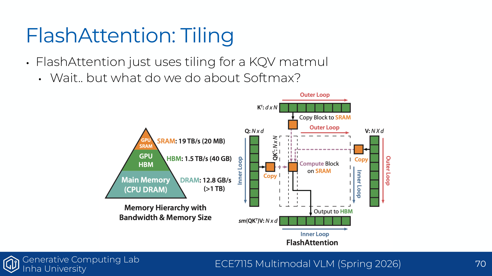

다음 페이지의 online softmax가 이 질문의 답이다.

---

## Page 53. Tiling part 2: incremental computation of the softmax

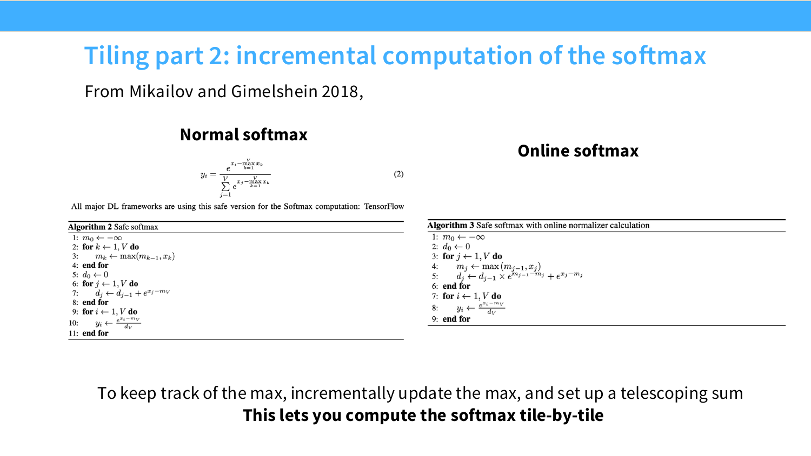

이 페이지는 FlashAttention의 핵심 수학 도구인 **online softmax**를 설명한다. 출처는 Milakov and Gimelshein 2018이다.

먼저 안전한 softmax부터 보자. vector $x=(x_1,\dots,x_N)$에 대해 numerical stability를 위해 최대값을 뺀다.

```math
m=\max_{k=1}^{N}x_k
```

```math
d=\sum_{j=1}^{N}e^{x_j-m}
```

```math
y_i=\frac{e^{x_i-m}}{d}
```

일반 safe softmax는 보통 세 번 훑는다.

1. 전체를 훑어서 max $m$을 구한다.
2. 다시 훑어서 denominator $d$를 구한다.
3. 다시 훑어서 각 $y_i$를 계산한다.

FlashAttention에서는 row 전체를 HBM에 저장해 두고 여러 번 훑고 싶지 않다. 그래서 online softmax는 max와 denominator를 한 번에 점진적으로 업데이트한다.

$i$번째 원소까지 봤을 때의 maximum을 $m_i$, denominator를 $d_i$라고 하자.

```math
m_i=\max(m_{i-1},x_i)
```

새로운 max가 바뀔 수 있으므로, 기존 denominator $d_{i-1}$는 새 max 기준으로 rescale해야 한다.

기존 denominator는 다음 기준으로 계산되어 있었다.

```math
d_{i-1}=\sum_{j=1}^{i-1}e^{x_j-m_{i-1}}
```

그런데 이제 기준이 $m_i$가 되면 다음 값을 원한다.

```math
\sum_{j=1}^{i-1}e^{x_j-m_i}
```

이를 변형하면,

```math
e^{x_j-m_i}
=
e^{x_j-m_{i-1}}e^{m_{i-1}-m_i}
```

따라서 기존 합 전체에 $e^{m_{i-1}-m_i}$를 곱하면 새 기준으로 맞출 수 있다.

```math
d_i
=
d_{i-1}e^{m_{i-1}-m_i}+e^{x_i-m_i}
```

이게 telescoping sum trick의 핵심이다.

block 단위로 쓰면 더 FlashAttention스럽다. 기존까지 본 block의 max/sum을 $m_{old},l_{old}$라고 하고, 새 block의 max/sum을 $m_{blk},l_{blk}$라고 하자.

```math
m_{new}=\max(m_{old},m_{blk})
```

```math
l_{new}
=
e^{m_{old}-m_{new}}l_{old}
+
e^{m_{blk}-m_{new}}l_{blk}
```

이 식 덕분에 softmax를 tile-by-tile로 계산해도 전체 row를 한 번에 본 것과 같은 결과를 얻을 수 있다. 즉 FlashAttention은 approximate attention이 아니라 exact attention이다.

Understanding GPUs 자료는 normal softmax, safe softmax, online softmax의 memory access 차이를 비교한다.

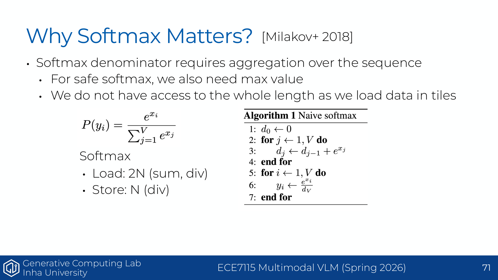

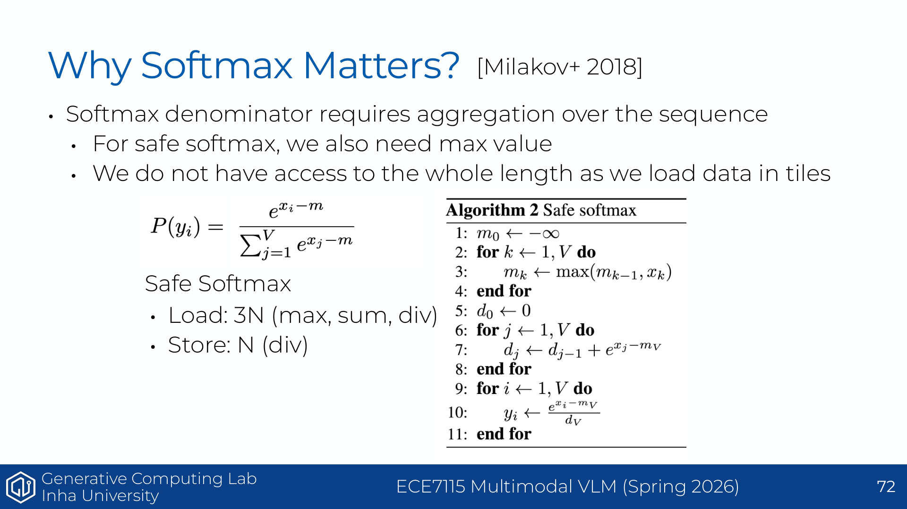

Online softmax는 max와 denominator를 함께 갱신함으로써 extra pass를 줄인다.

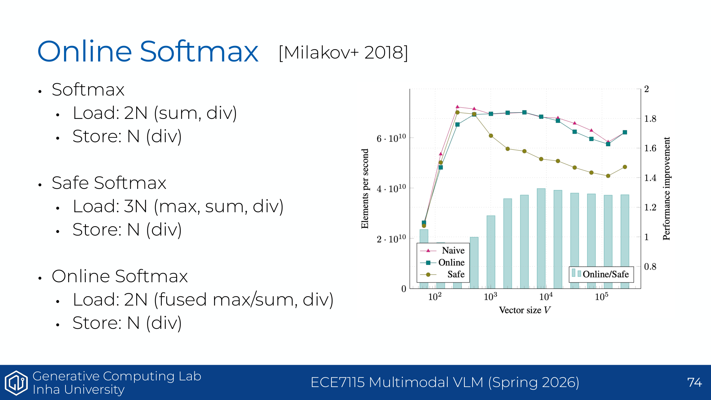

이제 남은 질문은 softmax denominator뿐 아니라 $PV$ output까지 tile-by-tile로 누적할 수 있느냐다. 다음 페이지가 이를 종합한다.

---

## Page 54. Putting it all together - the forward pass of FlashAttention

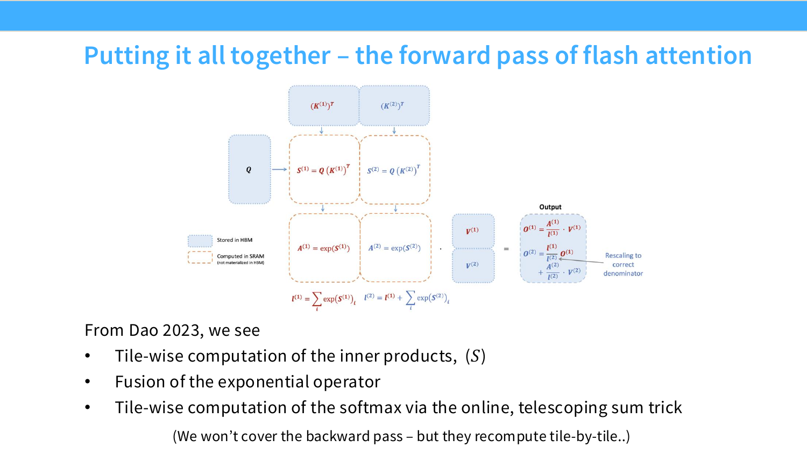

이 페이지는 FlashAttention forward pass를 하나로 합친다. 그림에서 파란색 점선 박스는 HBM에 저장된 tensor를 의미하고, 주황색 점선 박스는 SRAM/shared memory에서 계산되며 HBM에 materialize되지 않는 중간값을 의미한다.

먼저 $Q$ block과 첫 번째 $K$ block으로 score block을 계산한다.

```math
S^{(1)}=Q(K^{(1)})^\top
```

그다음 exponential을 계산한다.

```math
A^{(1)}=\exp(S^{(1)})
```

이때 실제 안정적 구현에서는 앞 페이지의 max trick을 같이 사용한다. 단순화를 위해 그림은 $A=\exp(S)$ 형태로 보여준다.

첫 번째 block만 봤을 때의 normalization denominator를 $l^{(1)}$라고 하면,

```math
l^{(1)}=\sum_i \exp(S_i^{(1)})
```

첫 번째 block의 output 기여는 다음처럼 쓸 수 있다.

```math
O^{(1)}=\frac{A^{(1)}}{l^{(1)}}V^{(1)}
```

이제 두 번째 $K,V$ block을 보면 새로운 score와 exponential이 생긴다.

```math
S^{(2)}=Q(K^{(2)})^\top
```

```math
A^{(2)}=\exp(S^{(2)})
```

전체 denominator는 첫 번째 block의 denominator와 두 번째 block의 denominator를 합친 값이다.

```math
l^{(2)}=l^{(1)}+\sum_i\exp(S_i^{(2)})
```

따라서 기존 output $O^{(1)}$도 새 denominator 기준으로 다시 scale해야 한다. 슬라이드 오른쪽의 “Rescaling to correct denominator”가 바로 이 부분이다.

단순화하면 다음처럼 볼 수 있다.

```math
O^{(2)}
=
\frac{l^{(1)}}{l^{(2)}}O^{(1)}
+
\frac{A^{(2)}}{l^{(2)}}V^{(2)}
```

안정적인 online softmax까지 포함한 실제 개념은 row별 max도 함께 rescale한다. 기존 max와 denominator를 $m_{old},l_{old}$, 새 tile score를 $S_t$라고 하자.

```math
m_{new}=\max(m_{old},\operatorname{rowmax}(S_t))
```

현재 tile의 exponential은 새 max 기준으로 계산한다.

```math
P_t=\exp(S_t-m_{new})
```

기존 denominator는 새 max 기준으로 rescale한다.

```math
l_{new}=e^{m_{old}-m_{new}}l_{old}+\operatorname{rowsum}(P_t)
```

output도 같은 방식으로 rescale해서 누적한다. unnormalized output accumulator를 $u$라고 두면,

```math
u_{new}=e^{m_{old}-m_{new}}u_{old}+P_tV_t
```

최종 output은 다음과 같다.

```math
O=\frac{u}{l}
```

이 과정의 핵심은 $S$나 $P$ 전체를 HBM에 저장하지 않는다는 점이다. 각 tile의 score는 SRAM/shared memory 안에서 잠깐 만들어지고, online softmax와 output accumulator update에 사용된 뒤 버려진다.

슬라이드 하단의 세 bullet은 이를 정확히 요약한다.

- inner product $S$를 tile-wise로 계산한다.
- exponential operator를 별도 kernel로 분리하지 않고 fusion한다.
- online telescoping sum trick으로 softmax를 tile-wise로 계산한다.

슬라이드는 backward pass를 자세히 다루지 않지만, 마지막에 “they recompute tile-by-tile”이라고 언급한다. forward에서 $S$와 $P$ 전체를 저장하지 않았기 때문에 backward에서 필요한 score/probability tile은 다시 계산한다. 이것이 recomputation이다.

Understanding GPUs 자료는 online softmax를 attention output까지 확장한 흐름을 보여준다.

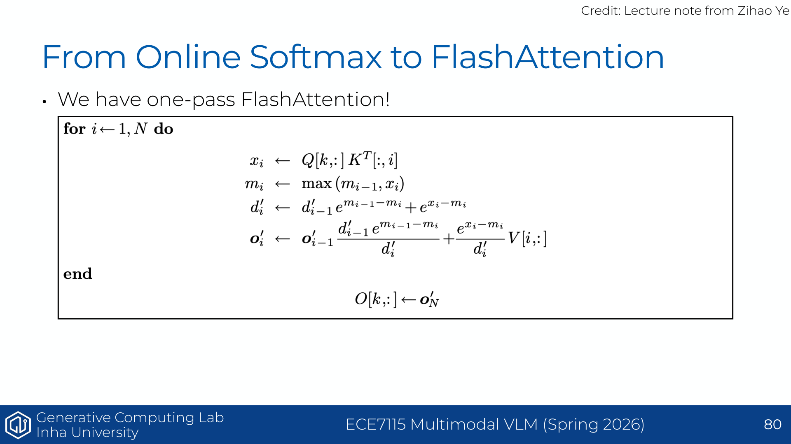

그리고 이를 tiling과 결합하면 다음 그림처럼 FlashAttention이 된다.

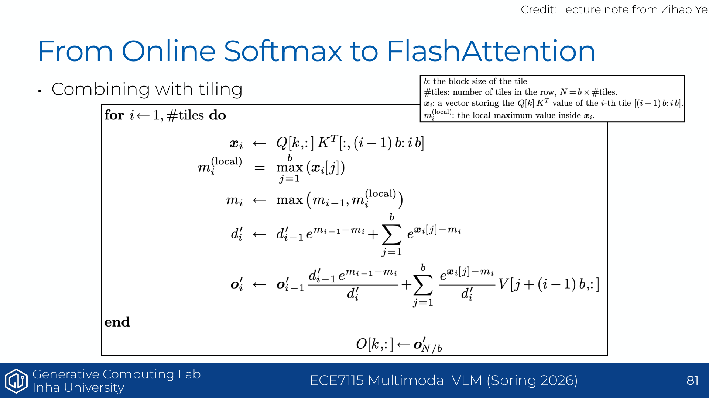

마지막으로 backward에서 recomputation과 kernel fusion이 어떻게 연결되는지도 같은 자료에서 설명한다.

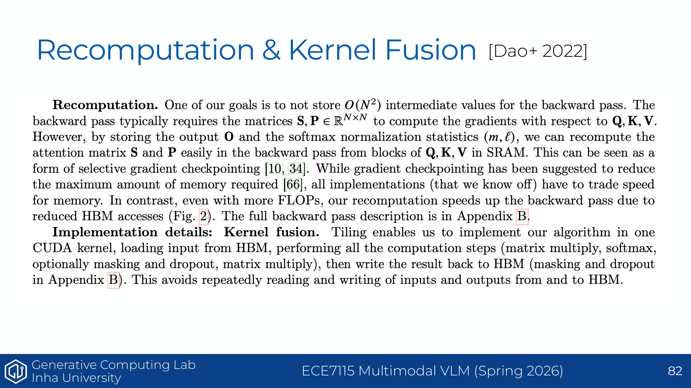

보충 자료의 FlashAttention 요약도 같은 메시지다. FlashAttention은 FLOPs를 조금 더 쓸 수 있지만, HBM access를 크게 줄이기 때문에 전체 runtime이 감소한다.

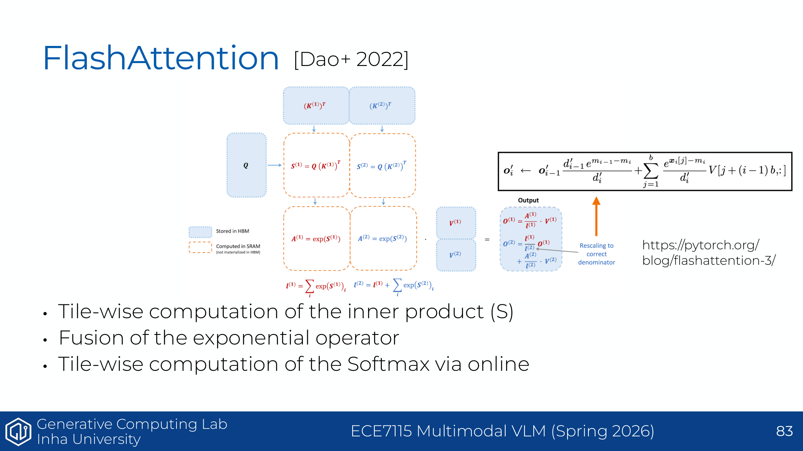

정리하면 다음과 같다.

```math
\text{FlashAttention forward}
=
\text{tile-wise }QK^\top
+
\text{fused exp/softmax}
+
\text{online output accumulation}
```

```math
\text{FlashAttention backward}
=
\text{stored small statistics}
+
\text{tile-wise recomputation}
```

---

## Page 55. Recap for the whole lecture

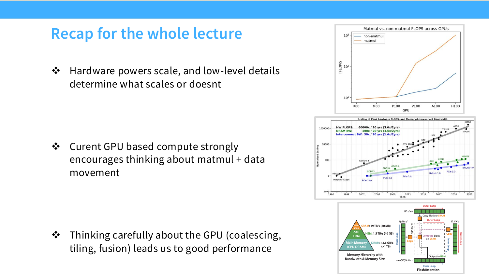

마지막 페이지는 Lecture 05 전체 메시지를 정리한다.

첫째, 하드웨어가 scale을 가능하게 하지만, low-level detail이 무엇이 scale되고 무엇이 scale되지 않는지를 결정한다. GPU의 peak FLOPs가 아무리 높아도 workload가 memory-bound이면 그 성능을 제대로 쓰지 못한다.

둘째, 현재 GPU 기반 compute는 **matmul + data movement** 중심으로 사고하도록 강하게 요구한다. LLM의 핵심 연산은 대부분 matrix multiplication이고, Tensor Core는 이 연산을 매우 빠르게 처리한다. 그러나 주변의 memory movement, softmax, normalization, elementwise operation, unaligned access, control divergence는 여전히 병목이 된다.

셋째, GPU를 신중하게 이해하면 좋은 알고리즘 설계로 이어진다. 이번 강의에서 본 최적화 기법은 다음처럼 연결된다.

| 기법 | 핵심 아이디어 | 줄이는 것 |
|---|---|---|
| Low precision | 원소당 byte 수를 줄임 | memory movement, compute cost |
| Fusion | 여러 kernel을 하나로 묶음 | intermediate HBM read/write |
| Recomputation | 저장하지 않고 다시 계산 | activation/intermediate storage |
| Coalescing | warp memory 요청을 연속 주소로 맞춤 | memory transaction 수 |
| Tiling | shared memory에서 tile 재사용 | repeated HBM read |

FlashAttention은 이 강의의 좋은 종합 예시다. attention 수식은 그대로 유지하지만, $S$와 $P$ 전체를 HBM에 저장하지 않도록 tiling, fusion, online softmax, recomputation을 조합한다.

강의 전체를 한 줄로 정리하면 다음과 같다.

```math
\text{Fast LLM systems}
=
\text{matmul-friendly computation}
+
\text{minimal data movement}
+
\text{hardware-aware algorithms}
```

여기서 중요한 사고방식은 “수식상 계산량이 적은가?”만 묻지 않는 것이다. 실제 GPU에서는 다음 질문을 함께 해야 한다.

```math
\text{How many bytes move?}
```

```math
\text{Are accesses coalesced?}
```

```math
\text{Can data be reused in shared memory/registers?}
```

```math
\text{Does the shape match Tensor Core/tile/SM scheduling?}
```

이 질문들이 LLM 학습과 추론 최적화에서 매우 중요하다.

---

## 부록. Lecture 05 핵심 용어 한 번 더 정리

| 용어 | 짧은 뜻 | 강의에서 중요한 이유 |
|---|---|---|
| CPU | 소수의 강한 core로 복잡한 작업을 빠르게 처리하는 범용 processor | latency 중심 사고를 이해하기 위한 비교 대상 |
| GPU | 수많은 작은 실행 유닛으로 같은 연산을 대량 병렬 처리하는 accelerator | LLM 학습/추론 compute의 중심 |
| TPU | ML workload, 특히 matmul을 위해 설계된 accelerator | GPU와 다른 accelerator도 유사한 병목을 가진다는 점을 보여줌 |
| Process | 실행 중인 프로그램 단위 | CPU/OS 관점의 실행 단위 |
| Thread | 실제 명령을 실행하는 흐름 | GPU에서는 수많은 lightweight worker로 사용됨 |
| CUDA kernel | GPU에서 실행되는 함수 | PyTorch 연산의 실제 GPU 실행 단위 |
| Grid | kernel launch 전체 작업 영역 | 많은 block을 포함 |
| Block | thread 묶음, 보통 하나의 SM에서 실행 | shared memory를 공유하는 협업 단위 |
| Warp | 32개 thread의 실제 실행 묶음 | divergence, coalescing의 기준 단위 |
| SM | GPU 내부의 독립적인 실행 작업장 | block을 실행하고 shared memory/register를 가짐 |
| Tensor Core | matrix multiplication 전용 회로 | LLM의 큰 matmul을 빠르게 처리 |
| Register | thread 개인이 쓰는 초고속 저장 공간 | 가장 빠르지만 매우 작음 |
| Shared memory | block 안 thread들이 공유하는 빠른 메모리 | tiling과 FlashAttention의 핵심 작업 공간 |
| Global memory/HBM | GPU의 큰 외부 메모리 | 크지만 느려서 접근을 줄여야 함 |
| SIMT | 같은 instruction을 여러 thread가 서로 다른 데이터에 실행 | GPU 실행 모델의 핵심 |
| Control divergence | 같은 warp 안 thread들이 서로 다른 branch를 타는 현상 | branch serialization으로 throughput 저하 |
| Arithmetic intensity | bytes moved 대비 FLOPs | memory-bound/compute-bound 판단 기준 |
| Memory-bound | compute보다 memory 이동이 병목 | fusion, coalescing, tiling으로 완화 |
| Compute-bound | memory보다 계산 유닛이 병목 | Tensor Core 활용과 low precision이 중요 |
| Coalescing | warp의 memory 요청을 연속 주소로 합치는 것 | effective bandwidth 증가 |
| Tiling | 큰 tensor를 작은 tile로 나눠 shared memory에서 재사용 | global memory 접근 감소 |
| Fusion | 여러 operator를 하나의 kernel로 합침 | 중간 tensor HBM 왕복 감소 |
| Recomputation | 저장하지 않고 필요할 때 다시 계산 | memory를 compute로 교환 |
| FlashAttention | IO-aware exact attention 알고리즘 | attention matrix를 HBM에 저장하지 않아 빠름 |

