# Lecture 9. Scaling Laws - Basics

이 문서는 CS336 Lecture 9 강의자료를 페이지별로 정리한 노트입니다. 이번 강의의 핵심은 **scaling law**를 단순한 경험식이 아니라, 대규모 언어모델을 설계할 때 실제 의사결정에 쓰는 **예측 도구**로 이해하는 것입니다.

---

## 전체 핵심 요약

Scaling law는 모델 크기, 데이터 크기, compute, batch size, learning rate, architecture 같은 요소가 모델 성능과 어떤 관계를 갖는지 설명하는 경험적 법칙입니다. 강의에서는 특히 다음 질문을 다룹니다.

1. 데이터가 늘어나면 성능은 어떤 형태로 좋아지는가?
2. 큰 모델을 짧게 학습하는 것과 작은 모델을 오래 학습하는 것 중 무엇이 좋은가?
3. 큰 모델의 hyperparameter를 직접 비싸게 튜닝하지 않고, 작은 모델 실험으로 예측할 수 있는가?
4. Chinchilla scaling law는 Kaplan scaling law와 왜 다른 결론을 냈는가?
5. 훈련 compute 최적 모델과 실제 배포에서 좋은 모델은 왜 다를 수 있는가?

핵심 메시지는 다음과 같습니다.

> 작은 scale에서 얻은 규칙을 조심스럽게 extrapolation하면, 큰 모델 학습 전에 architecture, optimizer, depth, batch size, learning rate, 데이터/모델 크기 trade-off를 상당 부분 예측할 수 있다.

---

## 주요 공식 정리

### 공식 선정 기준

이 섹션은 lecture09 슬라이드에 등장하는 모든 문자를 기계적으로 전사한 것이 아니라, 강의 내용을 복습할 때 필요한 **핵심 공식**을 기준으로 정리한 것입니다. 기준은 다음과 같습니다.

1. 슬라이드 본문에 수식으로 직접 등장한 공식
2. 그래프나 그림 안에 등장하지만 강의 메시지를 이해하는 데 중요한 공식
3. 슬라이드에서는 압축적으로만 제시되지만, 개념 이해를 위해 필요한 표준 형태의 보충 공식

따라서 **강의 흐름상 중요한 공식은 대부분 포함**했지만, 논문 그림 안의 작은 plot label, fitting coefficient, 축 표기까지 모두 전사한 것은 아닙니다. 이 섹션의 목적은 “슬라이드에 나온 scaling law의 핵심 수식들을 이해 가능한 형태로 정리하는 것”입니다.

---

### 1. 기본 power-law scaling

Scaling law의 기본 형태는 어떤 scale 변수 $x$가 커질수록 error 또는 loss가 power-law 형태로 감소한다는 것입니다.

```math
\mathrm{Error}(x) \propto x^{-\alpha}
```

조금 더 일반적인 형태는 irreducible loss(이론적으로 줄일 수 없는 최소 손실) 또는 asymptotic floor(scaling curve가 무한히 커질 때 수렴하는 바닥값)를 포함해 다음처럼 씁니다.

```math
L(x) = A x^{-\alpha} + L_{\infty}
```

각 항의 의미는 다음과 같습니다.

- $x$: data size, model size, compute 등 scale 변수
- $A$: 전체 loss scale을 조절하는 계수
- $\alpha$: scaling exponent. 클수록 scale 증가에 따른 성능 개선이 빠름
- $L_{\infty}$: 아무리 scale을 키워도 남는 irreducible loss 또는 asymptotic floor

양변에 log를 취하면 power-law는 직선이 됩니다.

```math
\log \mathrm{Error}(x) = -\alpha \log x + C
```

즉 log-log plot에서 직선처럼 보인다는 것은, 성능 개선이 대략 power-law를 따른다는 뜻입니다. 이때 직선의 기울기가 $-\alpha$입니다.

---

### 2. Sample complexity bound: 이론적 upper bound의 예시

강의 초반에는 이론가들이 오래전부터 sample complexity와 convergence rate를 다뤄왔다는 점을 보여줍니다. 예를 들어 finite hypothesis class에 대한 generalization bound는 다음 형태로 제시됩니다.

```math
\epsilon(\hat{h})
\le
\min_{h \in \mathcal{H}} \epsilon(h)
+
2\sqrt{\frac{1}{m}\log\frac{2k}{\delta}}
```

각 기호의 의미는 다음과 같습니다.

- $\hat{h}$: 학습으로 얻은 hypothesis
- $\mathcal{H}$: 가능한 hypothesis 집합
- $k$: hypothesis 개수. 보통 $k = \lvert\mathcal{H}\rvert$로 볼 수 있음
- $m$: sample 수
- $\delta$: confidence level과 관련된 값. 보통 확률 $1-\delta$ 이상으로 bound가 성립한다고 해석
- $\epsilon(h)$: hypothesis $h$의 error

오른쪽 두 번째 항이 일반화 오차의 복잡도 항입니다.

```math
2\sqrt{\frac{1}{m}\log\frac{2k}{\delta}}
```

여기서 $m$이 커질수록 이 항은 대략 $1/\sqrt{m}$ 비율로 감소합니다. 즉 sample이 많아질수록 generalization gap이 줄어든다는 것을 보여줍니다.

다만 강의에서 강조하는 핵심은, 이런 이론적 bound는 실제 LLM의 realized loss를 직접 예측하는 scaling law와는 다르다는 점입니다. Scaling law는 보통 이론적 upper bound라기보다 실제 실험 곡선을 fitting해 얻는 empirical law에 가깝습니다.

---

### 3. Smooth density estimation의 convergence rate

또 다른 이론적 예시로 smooth density estimation의 rate가 제시됩니다. 대표적인 rate는 다음과 같이 나타납니다.

```math
\psi_n = n^{-\frac{\beta}{2\beta + 1}}
```

그리고 특정 조건 아래에서 estimator의 오차는 다음처럼 bound됩니다.

```math
\sup_{p \in \mathcal{P}(\beta, L)}
\mathbb{E}_p\left[
\left(\hat{p}_n(x_0) - p(x_0)\right)^2
\right]
\le
C\psi_n^2
```

각 기호의 의미는 다음과 같습니다.

- $n$: sample 수
- $p$: 실제 density
- $\hat{p}_n$: $n$개 sample로부터 얻은 density estimator
- $x_0$: density를 추정하려는 특정 지점
- $\mathcal{P}(\beta, L)$: smoothness가 $\beta$이고 크기가 $L$로 제한된 density class
- $\beta$: smoothness parameter. 클수록 더 매끄러운 함수 class
- $C$: 상수
- $\psi_n$: sample 수 $n$에 따른 convergence rate

이 식의 핵심은 고전적인 추정 문제에서도 오차가 $n$에 대해 polynomial rate로 줄어든다는 점입니다. 즉 scaling law에서 보이는 power-law 형태는 완전히 임의적인 현상이 아니라, 통계적 추정 문제에서도 자연스럽게 등장합니다.

---

### 4. Hestness-style learning curve

Hestness et al. 계열의 초기 neural scaling law에서는 learning curve를 다음과 같은 power-law + asymptote 형태로 봅니다.

```math
\epsilon(m) = \alpha m^{\beta} + \gamma
```

각 기호의 의미는 다음과 같습니다.

- $\epsilon(m)$: training data size 또는 scale $m$에서의 error
- $m$: training data size 또는 scale 변수
- $\alpha$: curve의 scale을 조절하는 계수
- $\beta$: scaling exponent. error가 감소하려면 보통 $\beta < 0$인 형태로 해석
- $\gamma$: asymptotic error. 데이터를 많이 늘려도 남는 error floor

이 식은 앞에서 쓴 표기와 다음처럼 대응시킬 수 있습니다.

```math
\epsilon(m) = A m^{-\alpha} + \epsilon_{\infty}
```

여기서는 notation이 조금 바뀝니다.

- Hestness식의 $\alpha$: 계수
- Hestness식의 $\beta$: 음수 exponent
- 일반 scaling law의 $\alpha$: 양수 exponent

즉 같은 그리스 문자를 쓰더라도 논문이나 강의에 따라 의미가 다를 수 있으므로, 수식의 위치에 따라 해석해야 합니다.

이 식은 세 구간을 설명하는 데 유용합니다.

- small data region: 데이터가 너무 적어 power-law가 잘 맞지 않을 수 있음
- power-law region: log-log plot에서 거의 직선
- irreducible error region: scale을 늘려도 개선 폭이 작아짐

---

### 5. Kaplan-style data scaling 예시

Language modeling에서 Kaplan et al.은 dataset size $D$와 test loss 사이에 power-law 관계가 나타난다는 것을 보였습니다. 슬라이드의 대표 식은 다음과 같습니다.

```math
L(D) = \left(\frac{D}{5.4 \times 10^{13}}\right)^{-0.095}
```

핵심은 계수 자체보다 exponent입니다.

```math
\alpha \approx 0.095
```

즉 dataset size가 증가하면 loss가 줄어들지만, 감소율은 $D^{-0.095}$처럼 상당히 완만합니다. 그래서 LLM pretraining에서는 데이터와 compute를 많이 늘려도 loss가 급격히 떨어지는 것이 아니라, log-log plot에서 천천히 개선됩니다.

---

### 6. 평균 추정 toy example

강의에서는 power-law가 왜 자연스럽게 나타나는지 설명하기 위해 평균 추정 예시를 사용합니다.

입력 데이터가 다음과 같다고 합시다.

```math
x_1, \ldots, x_n \sim \mathcal{N}(\mu, \sigma^2)
```

평균 추정량은 다음과 같습니다.

```math
\hat{\mu} = \frac{1}{n}\sum_{i=1}^{n}x_i
```

이때 평균 제곱 오차는 다음과 같이 감소합니다.

```math
\mathbb{E}\left[(\hat{\mu} - \mu)^2\right] = \frac{\sigma^2}{n}
```

로그를 취하면 다음과 같습니다.

```math
\log(\mathrm{Error}) = -\log n + 2\log \sigma
```

따라서 이 경우 log-log plot의 기울기는 $-1$입니다.

```math
\mathrm{slope} = -1
```

강의의 메시지는 다음입니다.

> 단순 평균 추정에서는 error가 $1/n$으로 줄어드는 명확한 scaling law가 있다. 하지만 neural scaling law의 exponent는 보통 이보다 훨씬 작고 task마다 다르다.

---

### 7. 일반적인 polynomial rate

평균 추정 예시를 일반화하면, 많은 estimation problem에서 error는 다음처럼 polynomial rate로 감소합니다.

```math
\mathrm{Error}(n) = O(n^{-\alpha})
```

또는 단순히 다음과 같이 쓸 수 있습니다.

```math
\mathrm{Error}(n) \propto \frac{1}{n^{\alpha}}
```

여기서 $\alpha$가 바로 scaling exponent입니다. $\alpha$가 클수록 데이터 증가의 효과가 크고, 작을수록 같은 성능 개선을 위해 훨씬 더 많은 데이터가 필요합니다.

---

### 8. Nonparametric learning의 dimension-dependent scaling

Neural network는 매우 flexible한 함수 근사기이므로, 강의에서는 nonparametric learning 관점의 예시도 듭니다.

2D unit box에서 다음과 같은 데이터를 생각합니다.

```math
y_i = f(x_i) + \mathcal{N}(0, 1)
```

2D 공간을 한 변의 길이가 다음과 같은 box로 나눕니다.

```math
n^{-1/4}
```

그러면 대략 box 수는 $\sqrt{n}$개이고, 각 box에는 $\sqrt{n}$개의 sample이 들어갑니다. 이때 추정 오차는 다음처럼 나타납니다.

```math
\mathrm{Error} \approx \frac{1}{\sqrt{n}} + \mathrm{other\ smoothness\ terms}
```

이를 $d$차원으로 일반화하면 다음과 같습니다.

```math
\mathrm{Error}(n) = n^{-1/d}
```

log-log plot에서는 다음 직선 형태가 됩니다.

```math
y = -\frac{1}{d}x + C
```

여기서 $x = \log n$, $y = \log \mathrm{Error}$입니다. 이 식은 차원이 커질수록 scaling exponent가 작아진다는 점을 보여줍니다.

```math
\alpha = \frac{1}{d}
```

즉 고차원 문제에서는 데이터가 늘어나도 error가 천천히 줄어듭니다. 강의에서는 이것을 neural scaling law의 작은 exponent를 직관적으로 이해하는 한 가지 방향으로 소개합니다.

---

### 9. Distribution shift scaling: slope보다 offset이 바뀐다

강의에서는 data composition이 바뀔 때 scaling curve가 어떻게 달라지는지도 언급합니다. 핵심 문장은 다음입니다.

> Data composition affects the offset, not the slope.

이를 간단히 식으로 쓰면 다음과 같이 볼 수 있습니다.

```math
\mathrm{Error}_q(n) \approx A n^{-\alpha} + C(q)
```

각 기호의 의미는 다음과 같습니다.

- $q$: data source proportion 또는 data mixture
- $A n^{-\alpha}$: 데이터 크기 증가에 따른 공통 감소 경향
- $C(q)$: 데이터 구성에 따라 달라지는 offset 또는 intercept

중요한 점은 $q$가 바뀌어도 exponent $\alpha$, 즉 slope는 크게 바뀌지 않고, offset 또는 intercept $C(q)$가 달라질 수 있다는 것입니다.

실무적으로는 다음 의미가 있습니다.

- 데이터 품질/분포가 좋으면 같은 데이터 크기에서도 loss curve가 아래로 이동한다.
- 하지만 데이터가 늘어날 때의 감소율 자체는 비슷할 수 있다.
- 따라서 data mixture selection은 scaling curve의 intercept를 최적화하는 문제처럼 볼 수 있다.

---

### 10. Data repetition에서 effective data

현실의 pretraining에서는 unique data가 유한하기 때문에 같은 token을 여러 번 반복해서 학습할 수 있습니다. 하지만 반복 데이터는 새로운 데이터와 같은 가치를 갖지 않습니다. 이를 반영하기 위해 effective data $D'$를 사용합니다.

강의의 식은 다음과 같습니다.

```math
D' = U_D + U_D R_D^*\left(1 - e^{-R_D/R_D^*}\right)
```

각 변수는 다음을 의미합니다.

- $D'$: effective data
- $U_D$: unique tokens
- $R_D$: repetition 또는 반복 정도
- $R_D^*$: repetition benefit이 얼마나 빨리 saturate되는지를 조절하는 상수

반복이 적을 때는 다음 근사가 가능합니다.

```math
1 - e^{-R_D/R_D^*} \approx \frac{R_D}{R_D^*}
```

따라서:

```math
D' \approx U_D + U_D R_D
```

초기 반복은 어느 정도 새로운 데이터처럼 도움이 됩니다.

반대로 $R_D$가 매우 커지면:

```math
e^{-R_D/R_D^*} \rightarrow 0
```

따라서:

```math
D' \rightarrow U_D + U_D R_D^*
```

즉 반복을 무한히 늘려도 effective data는 무한히 증가하지 않고 saturation됩니다. 이것이 “repeated data is less valuable than new data”라는 메시지입니다.

---

### 11. Critical batch size

Batch size는 어느 지점까지는 throughput과 step efficiency를 높이지만, 너무 커지면 diminishing return이 발생합니다. 이 전환점을 critical batch size라고 합니다.

강의에서는 특정 target loss에 대해 다음 두 값을 측정한다고 설명합니다.

- $S$: target loss에 도달하는 데 필요한 training steps
- $E$: target loss에 도달하는 데 필요한 examples

여러 batch size에서 $S$와 $E$를 측정하면 다음 curve를 fitting할 수 있습니다.

```math
\frac{S}{S_{\min}} - 1
=
\left(\frac{E}{E_{\min}} - 1\right)^{-1}
```

여기서:

- $S_{\min}$: 매우 큰 batch에서 달성 가능한 최소 step 수
- $E_{\min}$: 매우 작은 batch에서 달성 가능한 최소 example 수

Critical batch size는 다음처럼 정의됩니다.

```math
B_{\mathrm{crit}} = \frac{E_{\min}}{S_{\min}}
```

직관적으로는 “step 수를 줄이는 이득”과 “더 많은 example을 쓰는 비용”이 균형을 이루는 batch size입니다. 슬라이드에서는 이 값이 대략 다음과 관련된다고 설명합니다.

```math
B_{\mathrm{crit}}
\approx
\frac{\mathrm{Tr}(\Sigma)}{\lVert g \rVert^2}
```

여기서:

- $\Sigma$: gradient covariance
- $g$: full-batch gradient
- $\mathrm{Tr}(\Sigma)$: gradient noise의 전체 크기
- $\lVert g \rVert^2$: gradient signal의 크기

즉 gradient noise가 클수록 더 큰 batch가 의미 있을 수 있고, gradient signal이 강하면 작은 batch로도 충분할 수 있습니다.

---

### 12. Joint data-model scaling: 데이터와 모델 크기를 함께 보기

LLM 설계에서 중요한 질문은 “더 많은 데이터를 써야 하는가, 더 큰 모델을 써야 하는가?”입니다. Joint data-model scaling law는 데이터 크기 $n$과 모델 크기 $m$이 error에 함께 미치는 영향을 모델링합니다.

Rosenfeld-style 형태는 다음과 같습니다.

```math
\mathrm{Error}(n, m) = A n^{-\alpha} + B m^{-\beta} + C
```

슬라이드에서는 계수 없이 다음처럼 단순화되어 제시됩니다.

```math
\mathrm{Error}(n, m) = n^{-\alpha} + m^{-\beta} + C
```

각 항의 의미는 다음과 같습니다.

- $n^{-\alpha}$: data-limited error. 데이터가 부족해서 생기는 오차
- $m^{-\beta}$: model-limited error. 모델 capacity가 부족해서 생기는 오차
- $C$: irreducible error 또는 offset

Kaplan-style joint fit은 슬라이드에서 다음과 같이 제시됩니다.

```math
\mathrm{Error}(m, n) = \left[m^{-\alpha} + n^{-1}\right]^{\beta}
```

두 식 모두 데이터와 모델 중 하나만 키워서는 충분하지 않고, 둘 사이의 trade-off가 있다는 점을 보여줍니다.

---

### 13. 제한된 비용에서 모델 크기와 데이터 크기 최적화

Joint scaling law를 사용하면 제한된 비용 아래에서 모델 크기와 데이터 크기를 최적화하는 문제로 볼 수 있습니다.

```math
\min_{n,m} \quad A n^{-\alpha} + B m^{-\beta} + C
```

subject to:

```math
\mathrm{Cost}(n,m) \le \mathcal{C}_{\mathrm{budget}}
```

실제 비용은 단순히 training FLOPs만이 아니라 다음 요소를 포함할 수 있습니다.

- training compute
- data collection/cleaning cost
- hyperparameter search cost
- inference/serving cost

강의 후반부에서 강조하는 중요한 점은 **train-optimal model이 실제 deployment-optimal model과 다를 수 있다**는 것입니다. 학습 compute만 고정하면 Chinchilla-style optimal point가 나오지만, 배포에서는 inference compute가 대부분을 차지할 수 있으므로 더 작은 모델을 더 오래 학습시키는 것이 유리할 수 있습니다.

---

### 14. Kaplan compute-optimal scaling

Kaplan et al.의 결론은 compute budget $C$가 증가할 때 optimal parameter count $N_{\mathrm{opt}}$와 optimal token count $D_{\mathrm{opt}}$가 서로 다른 속도로 증가한다는 것이었습니다.

슬라이드의 식은 다음과 같습니다. 엄밀히는 상수항을 생략한 scaling 관계이므로 $=$보다 $\propto$로 쓰는 편이 더 안전합니다.

```math
N_{\mathrm{opt}} \propto C^{0.73}
```

```math
D_{\mathrm{opt}} \propto C^{0.27}
```

따라서 tokens per parameter는 다음처럼 됩니다.

```math
\frac{D_{\mathrm{opt}}}{N_{\mathrm{opt}}}
\propto
C^{0.27 - 0.73}
=
C^{-0.46}
```

즉 Kaplan의 결론에서는 compute가 커질수록 parameter를 훨씬 빠르게 늘리고, parameter당 token 수는 오히려 줄어듭니다. Chinchilla는 이 결론이 잘못된 방향이라고 보고, 모델 크기와 데이터 크기를 더 균형 있게 늘리는 쪽이 compute-optimal하다고 주장합니다.

---

### 15. IsoFLOPs와 Chinchilla-style fitting

Chinchilla 파트에서는 세 가지 fitting 방법이 나옵니다.

1. **Minimum over runs**: 모든 training curve의 envelope에서 최소 loss를 취해 power-law를 fitting
2. **IsoFLOPs**: 동일 FLOP budget에서 model size를 바꿔가며 loss valley의 minimum을 찾음
3. **Joint fits**: model size-data grid 전체에 대해 joint scaling law를 least squares로 fitting

Chinchilla-style joint loss는 보통 다음 형태로 이해할 수 있습니다.

```math
L(N, D) = E + \frac{A}{N^{\alpha}} + \frac{B}{D^{\beta}}
```

여기서:

- $N$: parameter count
- $D$: training tokens
- $E$: irreducible loss
- $A/N^{\alpha}$: model size 부족으로 인한 loss
- $B/D^{\beta}$: data 부족으로 인한 loss

IsoFLOPs 방식은 같은 compute budget 안에서 $N$과 $D$를 바꾸며 loss가 가장 낮은 지점을 찾는 절차입니다. 즉 각 FLOP budget마다 다음과 같은 문제를 푸는 것과 비슷합니다.

```math
N^*(C), D^*(C)
=
\arg\min_{N,D:\ \mathrm{FLOPs}(N,D)=C} L(N,D)
```

이렇게 얻은 optimal point들을 다시 power-law로 fitting하면, compute budget이 커질 때 optimal model size와 token count가 어떻게 증가해야 하는지 예측할 수 있습니다.

---

### 16. 공식들을 관통하는 핵심 해석

Lecture09의 공식들은 모두 하나의 질문으로 연결됩니다.

> scale을 키웠을 때 성능이 얼마나 좋아지고, 제한된 자원을 모델 크기/데이터/배치/학습 기간에 어떻게 배분해야 하는가?

공식별 역할을 정리하면 다음과 같습니다.

| 공식 계열 | 무엇을 설명하는가 | 실무적 용도 |
|---|---|---|
| $\mathrm{Error}(x) \propto x^{-\alpha}$ | scale 증가에 따른 성능 개선 | log-log plot으로 개선 속도 추정 |
| $\epsilon(\hat{h})$ bound | 이론적 sample complexity | empirical scaling law와의 차이 이해 |
| $\psi_n = n^{-\beta/(2\beta+1)}$ | smooth density estimation rate | power-law가 통계적으로 자연스럽다는 예시 |
| $\hat{\mu}$ toy example | 평균 추정의 $1/n$ scaling | log-log 직선의 직관 |
| $\mathrm{Error}(n)=n^{-1/d}$ | 차원 의존적 scaling | 고차원 문제에서 exponent가 작아지는 이유 |
| $D'$ effective data | data repetition 효과 | 반복 데이터의 diminishing return 이해 |
| $B_{\mathrm{crit}}$ | critical batch size | batch size 선택 |
| $\mathrm{Error}(n,m)$ | data-model joint scaling | 데이터와 모델 크기 trade-off |
| $N_{\mathrm{opt}}, D_{\mathrm{opt}}$ | compute-optimal scaling | 제한 compute에서 모델/토큰 배분 |
| $L(N,D)$ Chinchilla fit | model-data joint loss fitting | IsoFLOPs와 compute-optimal point 추정 |

## Page 1. Lecture 9 - Scaling Laws Basics


이번 강의의 주제는 **Scaling Laws - Basics**입니다. Scaling law는 LLM을 크게 만들 때 경험적으로 관찰되는 성능 변화 규칙을 의미합니다. 단순히 “모델을 키우면 좋아진다”가 아니라, **얼마나 키우면 얼마나 좋아지는지**, **데이터와 모델 크기를 어떻게 배분해야 하는지**, **작은 모델 실험으로 큰 모델 성능을 예측할 수 있는지**를 다룹니다.

---

## Page 2. Scaling을 진지하게 받아들인다는 것

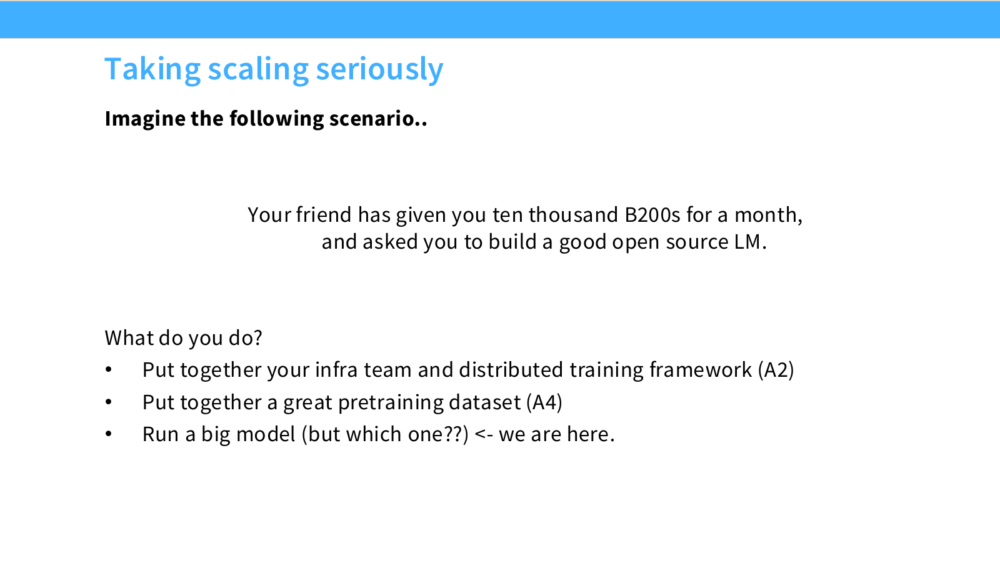

가상의 상황은 이렇습니다. 누군가가 한 달 동안 1만 개의 B200 GPU를 제공하고, 좋은 open-source language model을 만들라고 요청합니다. 이때 해야 할 일은 크게 세 가지입니다.

- 분산 학습 인프라와 training framework를 준비한다.
- 좋은 pretraining dataset을 구성한다.
- 실제로 큰 모델을 학습한다.

문제는 마지막 항목입니다. **어떤 크기의 모델을, 얼마나 많은 데이터로, 어떤 hyperparameter로 학습해야 하는가?** 이 질문에 답하기 위해 scaling law가 필요합니다.

---

## Page 3. Scaling은 쉽지 않다

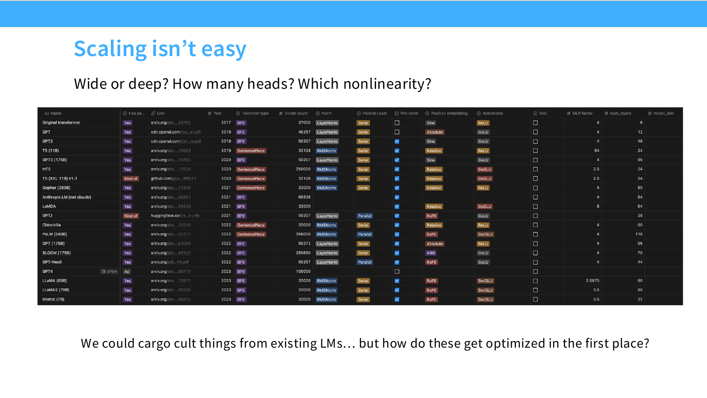

모델을 크게 만드는 과정에는 수많은 선택지가 있습니다. 예를 들어 모델을 넓게 만들지 깊게 만들지, attention head 수를 어떻게 정할지, activation function은 무엇을 쓸지, optimizer와 learning rate는 어떻게 설정할지 결정해야 합니다.

기존 LLM의 설정을 그대로 따라 하는 것은 가능하지만, 그것은 일종의 **cargo culting**에 가깝습니다. 중요한 질문은 “기존 모델들은 이런 설정을 어떻게 최적화했는가?”입니다. Scaling law는 이 선택을 작은 scale 실험으로 체계화하려는 접근입니다.

* cargo culting: 어떤 방법이나 관행을 왜 그런지 이해하지 못한 채, 겉모습만 따라 하는 것을 뜻합니다. 특히 개발/ML 쪽에서는 “남들이 하니까 나도 똑같이 함”, “유명한 프로젝트에서 쓰니까 이유는 모르지만 그대로 복붙함” 같은 부정적 의미로 많이 씁니다.

---

## Page 4. 오늘의 접근: LM 행동에 대한 단순하고 예측 가능한 법칙

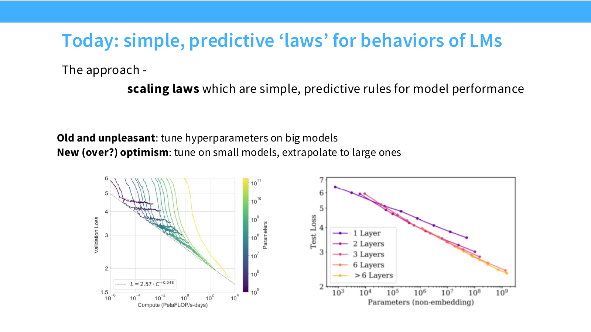

이번 강의는 LLM 성능에 대한 단순하고 predictive한 규칙, 즉 **scaling law**를 다룹니다.

예전 방식은 큰 모델을 직접 학습하면서 hyperparameter를 튜닝하는 것이었습니다. 하지만 이는 매우 비쌉니다. 새로운 접근은 작은 모델에서 여러 실험을 하고, 그 결과를 큰 모델로 extrapolation하는 것입니다.

핵심은 다음입니다.

> 작은 scale에서 측정한 성능 패턴이 충분히 안정적이면, 큰 모델의 성능과 최적 설정을 사전에 예측할 수 있다.

---

## Page 5. Part 1 - Scaling laws의 역사와 배경

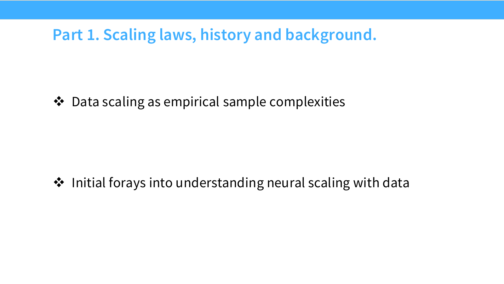

첫 번째 파트는 scaling law의 역사적 배경을 다룹니다. 특히 데이터 크기가 늘어날 때 성능이 어떻게 변하는지, 그리고 neural model에서 데이터 scaling이 어떻게 관찰되었는지 살펴봅니다.

여기서 중요한 관점은 data scaling을 **empirical sample complexity**로 보는 것입니다. 즉, 특정 수준의 성능을 얻기 위해 필요한 데이터 양을 경험적으로 측정하는 방식입니다.

---

## Page 6. Sample complexity와 rate

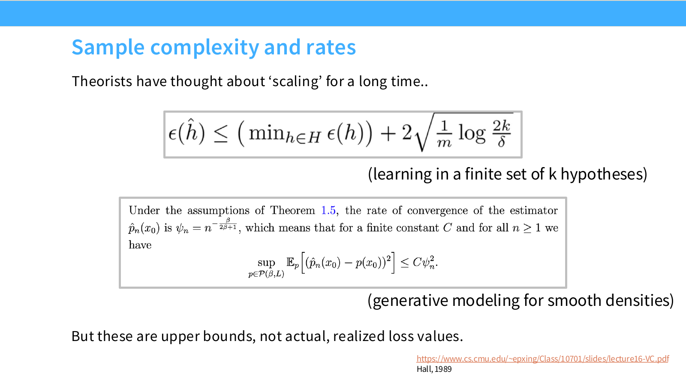

이 페이지는 scaling law가 완전히 새로운 문제의식에서 출발한 것이 아니라, 통계학/학습이론에서 오래전부터 다뤄온 **sample complexity**와 **convergence rate** 문제와 연결된다는 점을 보여줍니다. 다만 강의의 핵심은 이론적 bound와 실제 scaling law가 같다는 것이 아니라, 둘 다 “데이터나 scale이 늘어날 때 error가 어떤 rate로 줄어드는가”를 다룬다는 점입니다.

첫 번째 수식은 finite hypothesis class에서의 generalization bound입니다.

```math
\epsilon(\hat{h})
\le
\min_{h \in \mathcal{H}} \epsilon(h)
+
2\sqrt{\frac{1}{m}\log\frac{2k}{\delta}}
```

각 항의 의미는 다음과 같습니다.

- $\hat{h}$: 학습 알고리즘이 training data를 보고 선택한 hypothesis입니다.
- $\mathcal{H}$: 가능한 hypothesis들의 집합입니다.
- $k$: hypothesis의 개수입니다. 보통 $k = \lvert\mathcal{H}\rvert$로 볼 수 있습니다.
- $m$: training sample 수입니다.
- $\delta$: bound가 실패할 확률과 관련된 값입니다. 보통 확률 $1-\delta$ 이상으로 이 부등식이 성립한다고 해석합니다.
- $\epsilon(h)$: hypothesis $h$의 true error 또는 population error입니다.
- $\epsilon(\hat{h})$: 학습된 hypothesis $\hat{h}$의 true error입니다.

오른쪽 첫 번째 항은 hypothesis class 안에서 가능한 최선의 error입니다.

```math
\min_{h \in \mathcal{H}} \epsilon(h)
```

즉, 모델 class $\mathcal{H}$가 아무리 좋아도 이 class 안에서 도달할 수 있는 best hypothesis의 error보다 더 낮아질 수는 없습니다. 이 항은 **approximation error** 또는 hypothesis class 자체의 한계로 볼 수 있습니다.

오른쪽 두 번째 항은 sample 수와 hypothesis class 크기에 의해 결정되는 일반화 penalty입니다.

```math
2\sqrt{\frac{1}{m}\log\frac{2k}{\delta}}
```

여기서 중요한 scaling은 $m^{-1/2}$입니다. sample 수 $m$이 커질수록 이 항은 대략 $1/\sqrt{m}$ 비율로 줄어듭니다. 반대로 hypothesis 개수 $k$가 커지면 $\log k$가 커져 penalty가 증가합니다. 즉 더 큰 hypothesis space를 탐색할수록 더 많은 sample이 필요합니다. $\delta$를 더 작게 잡으면, 즉 더 높은 confidence를 요구하면 penalty도 커집니다.

두 번째 수식은 smooth density estimation에서의 convergence rate입니다.

```math
\psi_n = n^{-\frac{\beta}{2\beta + 1}}
```

그리고 estimator의 pointwise mean squared error에 대해 다음과 같은 bound를 제시합니다.

```math
\sup_{p \in \mathcal{P}(\beta, L)}
\mathbb{E}_p\left[
\left(\hat{p}_n(x_0) - p(x_0)\right)^2
\right]
\le
C\psi_n^2
```

각 기호의 의미는 다음과 같습니다.

- $n$: 관측 sample 수입니다.
- $p$: 실제 data-generating density입니다.
- $\hat{p}_n$: $n$개 sample로부터 얻은 density estimator입니다.
- $x_0$: density를 추정하려는 특정 지점입니다.
- $\mathcal{P}(\beta, L)$: smoothness가 $\beta$이고 크기가 $L$로 제한된 density class입니다.
- $\beta$: density가 얼마나 매끄러운지를 나타내는 smoothness parameter입니다. 일반적으로 $\beta$가 클수록 더 매끄러운 함수 class이고, 더 빠른 추정 rate를 기대할 수 있습니다.
- $L$: smoothness class의 크기나 regularity를 제한하는 상수입니다.
- $\mathbb{E}_p$: 실제 density $p$에서 sample이 생성될 때의 기대값입니다.
- $\sup_{p \in \mathcal{P}(\beta,L)}$: 특정 하나의 density가 아니라 해당 함수 class 안의 모든 density 중 최악의 경우를 본다는 뜻입니다.
- $C$: sample 수 $n$과 무관한 상수입니다.
- $\psi_n$: sample 수에 따른 convergence rate입니다.

이 식에서 오차는 $C\psi_n^2$로 bound됩니다. 따라서 제곱오차 기준 rate는 다음처럼 볼 수 있습니다.

```math
\psi_n^2
=
\left(n^{-\frac{\beta}{2\beta+1}}\right)^2
=
n^{-\frac{2\beta}{2\beta+1}}
```

즉 sample 수 $n$이 증가할수록 error bound가 power-law 형태로 감소합니다. $\beta$가 커질수록 지수 $\frac{2\beta}{2\beta+1}$는 1에 가까워지므로, 더 smooth한 density는 더 빠르게 추정될 수 있습니다. 반대로 함수가 덜 smooth하면 같은 sample 수를 써도 convergence가 느려집니다.

이 페이지의 마지막 문장이 중요합니다.

> But these are upper bounds, not actual, realized loss values.

즉 위 수식들은 “최악의 경우에도 이 정도 이하로 error가 bound된다”는 이론적 보장입니다. 하지만 실제 neural network나 LLM을 학습했을 때 관찰되는 loss curve를 그대로 예측하는 식은 아닙니다. 이후 강의에서 다루는 scaling law는 이러한 이론적 sample complexity와 달리, 실제 실험에서 관찰된 loss를 power-law 형태로 fitting하고, 이를 통해 더 큰 scale의 성능을 예측하려는 **empirical law**에 가깝습니다.

정리하면, 이 페이지의 메시지는 다음입니다.

- 학습이론에서도 error가 sample 수에 따라 줄어드는 rate를 오래전부터 연구해왔다.
- finite hypothesis class bound에서는 일반화 penalty가 대략 $m^{-1/2}$로 감소한다.
- smooth density estimation에서도 error bound가 $n$에 대한 power-law rate로 감소한다.
- 그러나 이런 수식은 실제 LLM loss가 아니라 upper bound이므로, empirical scaling law와는 구분해야 한다.

---

## Page 7. 초기 data scaling law 논문 - 1993

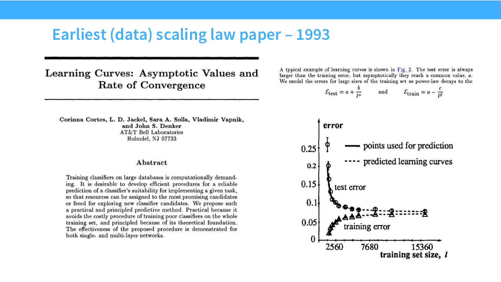

이 페이지는 1993년 논문 <strong>“Learning Curves: Asymptotic Values and Rate of Convergence”</strong>를 통해, scaling law의 아이디어가 LLM 이전부터 이미 **learning curve** 연구로 존재했음을 보여줍니다. 이 논문은 전체 training set을 모두 사용해보기 전에, 일부 데이터에서 관찰한 학습 곡선만으로 classifier의 최종 성능을 예측하려는 목적을 가지고 있었습니다.

슬라이드 오른쪽에는 test error와 training error를 다음과 같은 power-law 형태로 모델링한 식이 나옵니다.

```math
\varepsilon_{\mathrm{test}}(l) = a + \frac{b}{l^{\alpha}}
```

```math
\varepsilon_{\mathrm{train}}(l) = a - \frac{c}{l^{\beta}}
```

여기서 각 기호의 의미는 다음과 같습니다.

- $l$: training set size, 즉 학습 데이터 개수
- $\varepsilon_{\mathrm{test}}(l)$: 데이터 크기가 $l$일 때의 test error
- $\varepsilon_{\mathrm{train}}(l)$: 데이터 크기가 $l$일 때의 training error
- $a$: training set size가 매우 커졌을 때 training error와 test error가 함께 수렴하는 asymptotic error
- $b, c$: error curve의 scale을 정하는 양의 상수
- $\alpha, \beta$: 데이터가 증가할 때 error가 수렴하는 속도를 정하는 exponent

이 식에서 test error는 $a$보다 큰 값에서 시작해 데이터가 많아질수록 감소합니다.

```math
\varepsilon_{\mathrm{test}}(l) = a + \frac{b}{l^{\alpha}}
```

$l$이 커질수록 $l^{-\alpha}$가 작아지므로, $\varepsilon_{\mathrm{test}}(l)$은 점점 $a$에 가까워집니다. 반대로 training error는 $a$보다 작은 값에서 시작해 데이터가 많아질수록 증가하면서 $a$에 가까워집니다.

```math
\varepsilon_{\mathrm{train}}(l) = a - \frac{c}{l^{\beta}}
```

처음에는 training set이 작기 때문에 모델이 training sample을 상대적으로 쉽게 맞출 수 있어 training error가 낮게 나올 수 있습니다. 하지만 데이터가 늘어나면 training distribution을 더 넓게 커버해야 하므로 training error가 증가하고, 결국 test error와 같은 asymptotic value $a$로 수렴합니다.

이 페이지에서 중요한 메시지는 다음입니다.

- 성능은 데이터가 많아질수록 좋아지지만, 개선 폭은 점점 작아진다.
- test error와 training error는 서로 다른 방향에서 같은 asymptotic error $a$로 접근한다.
- 이때 접근 방식은 $l^{-\alpha}$ 또는 $l^{-\beta}$ 같은 power-law decay로 근사할 수 있다.
- 따라서 일부 작은 데이터 구간에서 관찰한 curve를 이용해 더 큰 데이터에서의 성능을 예측하려는 시도가 가능하다.

LLM scaling law와 직접 연결되는 지점은 바로 <strong>“error가 데이터 크기에 대해 power-law 형태로 감소한다”</strong>는 생각입니다. 오늘날 LLM에서는 loss를 model size, data size, compute에 대해 fitting하지만, 그 이전부터 학습 곡선을 통해 성능 수렴을 예측하려는 연구 흐름이 있었습니다.

---

## Page 8. 초기 data scaling history - Banko and Brill 2001

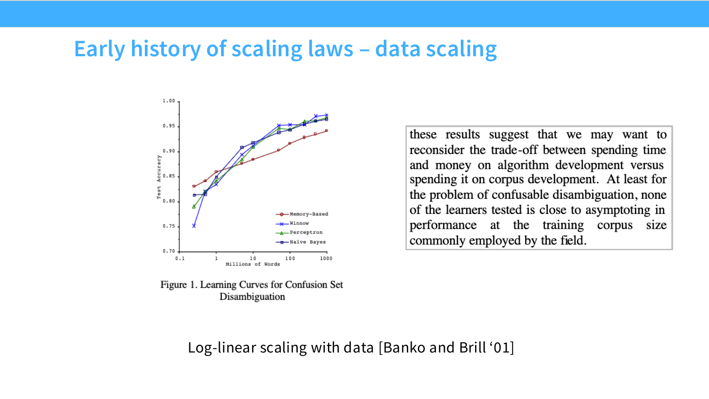

이 페이지는 Banko and Brill(2001)의 연구를 통해, **데이터 크기 자체가 downstream performance를 크게 좌우할 수 있다**는 초기 관찰을 보여줍니다. 실험 과제는 confusion set disambiguation으로, 문맥상 헷갈리는 단어 후보 중 올바른 단어를 고르는 문제입니다.

왼쪽 그래프는 x축이 **Millions of Words**, y축이 **Test Accuracy**입니다. x축은 로그 스케일에 가깝게 그려져 있으며, 데이터 크기가 커질수록 여러 알고리즘의 test accuracy가 함께 증가합니다. 비교된 알고리즘은 다음과 같습니다.

- Memory-Based
- Winnow
- Perceptron
- Naive Bayes

이 그래프의 핵심은 특정 알고리즘 하나만 좋아지는 것이 아니라, **서로 다른 알고리즘들이 데이터 증가에 따라 모두 성능이 개선된다**는 점입니다. 작은 데이터에서는 알고리즘 간 차이가 꽤 보이지만, 데이터가 커질수록 단순한 알고리즘도 상당한 성능 향상을 얻습니다.

오른쪽 인용문은 이 연구의 메시지를 잘 보여줍니다. 요지는 다음과 같습니다.

> 알고리즘 개발에 시간과 비용을 쓸 것인지, corpus development에 투자할 것인지의 trade-off를 다시 생각해볼 필요가 있다. 적어도 confusion set disambiguation 문제에서는, 당시 일반적으로 사용하던 corpus size에서 어느 learner도 성능이 포화에 가깝지 않았다.

즉, 당시에도 이미 다음과 같은 메시지가 있었습니다.

- 더 복잡한 모델을 설계하는 것보다 데이터를 더 많이 모으는 것이 성능 향상에 더 중요할 수 있다.
- 현재 데이터 크기에서는 아직 성능이 saturation에 도달하지 않았을 수 있다.
- 따라서 작은 데이터에서 알고리즘을 비교한 결과만으로 최종 성능을 판단하면 안 된다.

슬라이드 하단의 <strong>“Log-linear scaling with data”</strong>는 데이터 크기의 로그에 대해 성능이 거의 선형적으로 증가하는 패턴을 의미합니다. 즉, 데이터가 10배씩 늘어날 때마다 accuracy가 일정한 폭으로 올라가는 식의 관계입니다. 물론 무한히 선형적으로 증가하는 것은 아니고, 결국 상한에 가까워지지만, 이 구간에서는 데이터 증가가 매우 강한 성능 개선 요인이었습니다.

LLM 관점에서 보면 이 페이지는 다음 문장으로 요약할 수 있습니다.

> 모델 구조나 알고리즘 차이도 중요하지만, 충분히 큰 scale에서는 data scale 자체가 성능을 지배하는 핵심 변수로 작동할 수 있다.

---

## Page 9. Functional form을 테스트한 초기 연구

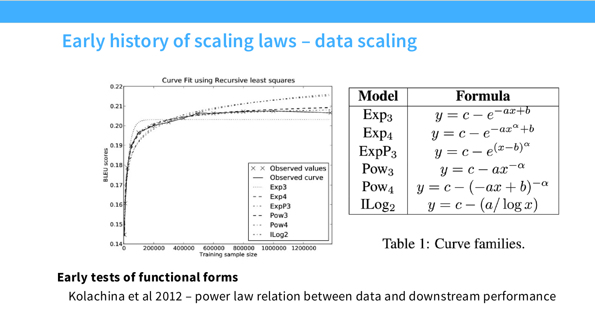

이 페이지는 Kolachina et al.(2012)의 연구를 통해, 단순히 “데이터가 많으면 좋아진다”를 넘어서 **데이터 크기와 성능 사이의 관계를 어떤 함수 형태로 모델링할 것인가**를 다룹니다.

왼쪽 그래프는 training sample size가 증가할 때 BLEU score가 어떻게 변하는지를 보여주고, 여러 functional form을 recursive least squares로 fitting한 결과를 함께 나타냅니다. 오른쪽 표는 실험에서 비교한 curve family입니다.

오른쪽 표에는 총 여섯 가지 curve family가 나옵니다.

```math
\mathrm{Exp}_3: \quad y = c - e^{-ax+b}
```

```math
\mathrm{Exp}_4: \quad y = c - e^{-a x^{\alpha}+b}
```

```math
\mathrm{ExpP}_3: \quad y = c - e^{(x-b)^{\alpha}}
```

```math
\mathrm{Pow}_3: \quad y = c - a x^{-\alpha}
```

```math
\mathrm{Pow}_4: \quad y = c - (-ax+b)^{-\alpha}
```

```math
\mathrm{ILog}_2: \quad y = c - \frac{a}{\log x}
```

여기서 각 기호는 대략 다음처럼 해석할 수 있습니다.

- $x$: training sample size
- $y$: downstream performance, 여기서는 BLEU score
- $c$: 데이터가 충분히 커졌을 때 접근하는 asymptotic performance
- $a, b$: curve의 scale과 shift를 조정하는 fitting parameter
- $\alpha$: 데이터 증가에 따른 성능 개선 속도를 조정하는 exponent

특히 power-law 형태는 다음처럼 볼 수 있습니다.

```math
y = c - a x^{-\alpha}
```

이 식은 성능 $y$가 데이터가 많아질수록 상한 $c$에 가까워진다는 뜻입니다. 데이터가 증가하면 $x^{-\alpha}$가 작아지기 때문에, $c - a x^{-\alpha}$는 점점 $c$에 접근합니다. 다시 말해, **asymptotic performance와 현재 performance 사이의 gap이 power-law로 줄어든다**고 볼 수 있습니다.

이 페이지에서 중요한 점은 scaling law가 특정 수식 하나를 처음부터 가정하는 문제가 아니라는 것입니다. 실제로는 다음 질문을 실험적으로 확인해야 합니다.

- exponential form이 더 잘 맞는가?
- power-law form이 더 잘 맞는가?
- logarithmic form이 더 잘 맞는가?
- 어느 정도의 데이터 구간에서 특정 form이 안정적으로 맞는가?

Kolachina et al.의 연구는 이런 함수 형태 비교를 통해, downstream performance와 data size 사이의 관계를 예측 가능한 curve fitting 문제로 다룰 수 있음을 보여줍니다. 이후 LLM scaling law에서도 같은 문제가 반복됩니다. 즉, loss를 어떤 형태로 fitting해야 큰 scale의 성능을 안정적으로 extrapolate할 수 있는지가 핵심이 됩니다.

---

## Page 10. Hestness et al. 2017

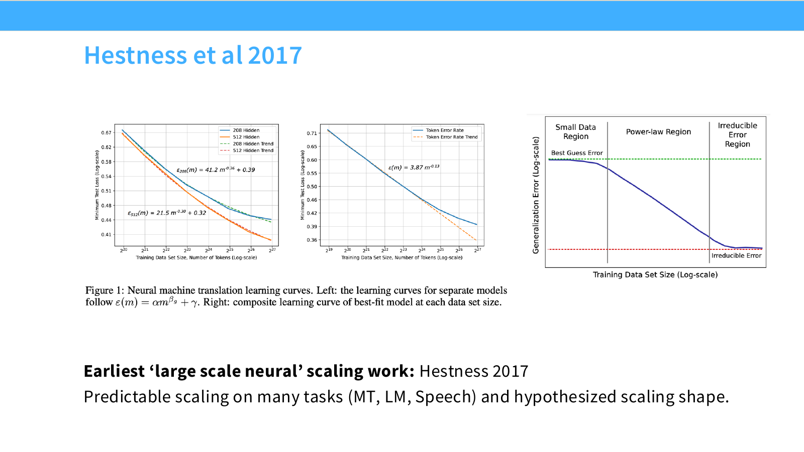

Hestness et al.(2017)은 강의에서 **초기 large-scale neural scaling work**로 소개됩니다. 이 연구는 machine translation, language modeling, speech recognition 등 여러 neural task에서 데이터 크기와 성능 사이에 예측 가능한 scaling pattern이 나타난다는 점을 체계적으로 보여주었습니다.

슬라이드 왼쪽의 neural machine translation learning curve에서는 데이터 크기 $m$에 따른 error를 다음과 같은 형태로 fitting합니다.

```math
\varepsilon(m) = \alpha m^{\beta} + \gamma
```

여기서 각 기호의 의미는 다음입니다.

- $m$: training data size, 보통 token 수 또는 sample 수
- $\varepsilon(m)$: 데이터 크기 $m$에서의 error 또는 loss
- $\alpha$: power-law term의 scale
- $\beta$: scaling exponent, 일반적으로 error가 감소해야 하므로 음수 값
- $\gamma$: irreducible error 또는 asymptotic error에 해당하는 항

$\beta < 0$이면 $m$이 커질수록 $m^{\beta}$가 작아집니다. 따라서 $\alpha m^{\beta}$ 항이 줄어들고, error는 점점 $\gamma$에 가까워집니다.

이 식은 앞 페이지의 power-law 형태와 거의 같은 메시지를 가집니다.

```math
\mathrm{Error}(m) - \gamma \propto m^{\beta}
```

양변에 log를 취하면 다음과 같이 볼 수 있습니다.

```math
\log(\mathrm{Error}(m) - \gamma) = \log \alpha + \beta \log m
```

즉, log-log plot에서 error gap이 거의 직선으로 나타납니다. 이것이 scaling law에서 log-log 그래프가 자주 사용되는 이유입니다. 직선의 기울기 $\beta$가 바로 scaling 속도를 의미합니다.

슬라이드 오른쪽 그림은 learning curve를 세 구간으로 나누어 설명합니다.

1. **Small Data Region**  
   데이터가 너무 적어서 power-law가 안정적으로 나타나지 않는 구간입니다. 모델이 충분히 일반화할 수 없고, curve fitting도 불안정합니다.

2. **Power-law Region**  
   데이터가 증가함에 따라 error가 예측 가능한 power-law 형태로 감소하는 구간입니다. scaling law가 가장 잘 작동하는 핵심 구간입니다.

3. **Irreducible Error Region**  
   데이터가 더 늘어나도 error가 거의 줄지 않는 구간입니다. 데이터 noise, task 자체의 불확실성, 모델 한계 등으로 인해 더 이상 줄일 수 없는 error floor에 가까워집니다.

이 페이지의 핵심은 Hestness et al.이 단순히 한 task에서만 scaling을 본 것이 아니라, 여러 neural task에서 비슷한 형태의 learning curve를 관찰했다는 점입니다. 따라서 scaling law는 특정 데이터셋의 우연한 현상이 아니라, large-scale neural training에서 반복적으로 나타나는 경험적 법칙일 수 있다는 가능성을 보여줍니다.

---

## Page 11. Hestness II - 시대를 앞선 관찰들

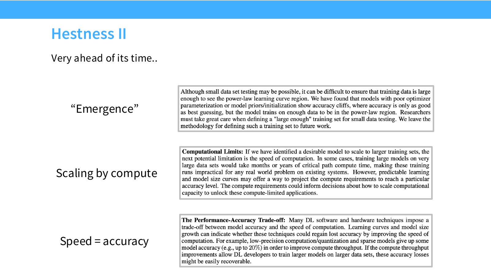

이 페이지는 Hestness et al.의 연구가 왜 “very ahead of its time”이었는지를 정리합니다. 강의에서는 세 가지 키워드를 제시합니다.

- Emergence
- Scaling by compute
- Speed = accuracy

### 1. Emergence

첫 번째 박스는 작은 training set에서는 power-law learning curve region에 들어갔는지 확인하기 어렵다는 점을 말합니다. 특히 model parameterization이나 initialization에 따라 **accuracy cliff**가 나타날 수 있고, 어떤 모델은 충분한 데이터가 주어지기 전까지는 거의 best guess 수준의 accuracy만 보일 수 있습니다.

이 관찰은 오늘날 말하는 **emergence**와 연결됩니다. 작은 scale에서는 모델이 특정 능력을 전혀 보이지 않다가, 데이터/모델/compute가 충분히 커진 뒤에야 성능이 급격히 나타나는 것처럼 보일 수 있습니다. Hestness의 관찰은 이런 현상이 단순히 “갑자기 생기는 마법”이라기보다, 모델이 power-law region에 진입하기 전후의 차이로 이해될 수도 있음을 시사합니다.

### 2. Scaling by compute

두 번째 박스는 compute를 scaling의 핵심 제약으로 봅니다. 어떤 모델을 더 큰 training set으로 scale하고 싶다면, 다음 병목은 필요한 computation입니다. 경우에 따라 real-world problem에 대해 충분히 큰 데이터셋으로 학습하는 데 몇 달 또는 몇 년의 critical-path compute time이 필요할 수 있습니다.

중요한 점은 learning curve와 model size curve를 이용하면, 특정 accuracy에 도달하기 위해 필요한 compute requirement를 예측할 수 있다는 것입니다. 이는 오늘날의 compute-optimal training, Chinchilla-style scaling, IsoFLOPs analysis와 직접적으로 연결되는 생각입니다.

즉, Hestness의 관찰은 다음 질문을 미리 던진 셈입니다.

> 원하는 성능에 도달하려면 모델 크기, 데이터 크기, compute를 어떻게 늘려야 하는가?

### 3. Speed = accuracy

세 번째 박스는 software/hardware technique이 model accuracy와 computation speed 사이의 trade-off를 만들 수 있다는 점을 말합니다. 예를 들어 low-precision computation이나 sparsity 같은 기법은 단일 모델의 정확도를 일부 떨어뜨릴 수 있지만, 계산 속도를 크게 높일 수 있습니다.

여기서 중요한 통찰은, 계산 속도가 빨라지면 더 큰 모델이나 더 많은 데이터로 학습할 수 있고, 그 결과 처음에 잃었던 정확도를 회복하거나 오히려 더 높은 정확도를 얻을 수 있다는 것입니다.

즉 이 페이지의 <strong>“Speed = accuracy”</strong>는 단순히 빠른 코드가 좋다는 뜻이 아닙니다. 더 정확히는 다음 뜻입니다.

> 같은 시간과 비용 안에서 더 많은 training을 할 수 있다면, 시스템 최적화와 하드웨어 효율성은 최종 모델 성능으로 전환될 수 있다.

LLM 학습에서 mixed precision, FlashAttention, efficient kernels, parallelism, checkpointing, sparsity 같은 기술이 중요한 이유도 여기에 있습니다. 이들은 단순한 구현 최적화가 아니라, 주어진 compute budget 안에서 도달 가능한 scale 자체를 바꾸는 요소입니다.

정리하면, 이 페이지는 Hestness et al.이 단순한 data scaling을 넘어, 이후 LLM 연구의 핵심 주제인 **emergent behavior, compute scaling, systems-efficiency와 final accuracy의 관계**를 이미 예고하고 있었음을 보여줍니다.

---

## Page 12. Part 2 - Neural LLM scaling behaviors

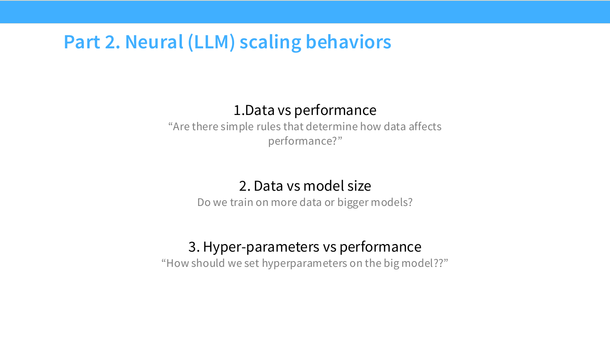

이 페이지는 강의의 두 번째 파트로 넘어가는 구간입니다. Part 1에서는 주로 **데이터 크기와 성능 사이의 learning curve**를 역사적으로 살펴봤다면, Part 2에서는 그 관점을 실제 LLM 설계 문제로 확장합니다.

슬라이드 제목은 <strong>“Neural LLM scaling behaviors”</strong>입니다. 여기서 scaling behavior란 단순히 “데이터를 늘리면 loss가 줄어든다”는 현상만 의미하지 않습니다. LLM에서는 성능이 여러 축의 scale에 의해 함께 결정됩니다.

이 파트에서 다루는 핵심 축은 다음 세 가지입니다.

1. **Data size vs performance**  
   데이터 크기 $D$가 커질 때 test loss나 error가 어떻게 감소하는가를 봅니다. 이는 앞에서 본 data scaling law의 LLM 버전입니다.

2. **Data size vs model size tradeoff**  
   같은 compute budget이 있을 때 더 큰 모델을 학습할지, 더 많은 token으로 학습할지 결정해야 합니다. 이 질문은 Kaplan scaling law와 Chinchilla scaling law의 차이로 이어집니다.

3. **Hyperparameters vs performance**  
   architecture, optimizer, depth, width, batch size, learning rate 같은 선택이 모델 성능에 어떤 식으로 영향을 주는지 봅니다. 중요한 점은 큰 모델에서 직접 실험하기 전에 작은 모델 실험으로 큰 모델의 최적 설정을 예측할 수 있다는 것입니다.

즉 이 페이지는 이후 내용을 다음 질문으로 압축합니다.

> LLM을 크게 학습할 때, 데이터·모델·compute·hyperparameter를 어떻게 배분해야 최적 성능을 얻을 수 있는가?

---

## Page 13. 여러 scale 변수에서 나타나는 power-law 관계

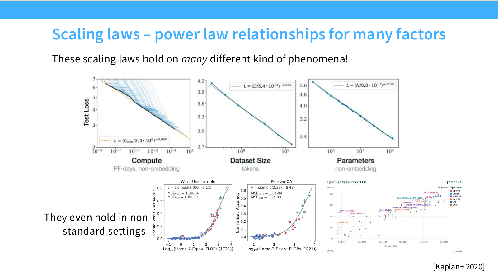

이 페이지는 Kaplan et al.(2020)의 scaling law 결과를 보여줍니다. 핵심은 language model의 loss가 여러 scale 변수에 대해 꽤 일관적인 **power-law** 형태로 감소한다는 것입니다.

슬라이드에는 여러 그래프가 있으며, 모두 공통적으로 x축에 scale 변수를 두고 y축에 loss를 둡니다. 대표적인 scale 변수는 다음과 같습니다.

- **Compute**: 학습에 사용한 총 FLOPs
- **Dataset size**: 학습 token 수 또는 데이터 크기
- **Model size**: parameter count

이 결과는 다음 형태의 관계를 시사합니다.

```math
L(x) \approx A x^{-\alpha} + L_\infty
```

여기서 $x$는 compute, data size, parameter count 중 하나가 될 수 있습니다. $A$는 scale 계수, $\alpha$는 scaling exponent, $L_\infty$는 더 이상 줄이기 어려운 irreducible loss에 해당합니다.

log-log plot에서 power-law는 직선처럼 보입니다.

```math
\log(L(x)-L_\infty) \approx -\alpha \log x + \log A
```

따라서 그래프가 log-log 축에서 거의 직선이라는 것은 “scale을 늘렸을 때 성능 개선이 예측 가능한 규칙을 따른다”는 뜻입니다.

이 페이지에서 중요한 포인트는 두 가지입니다.

첫째, scaling law는 데이터 하나에만 적용되는 것이 아닙니다. **compute, dataset size, parameter count 모두 성능과 예측 가능한 관계를 가질 수 있습니다.**

둘째, “큰 모델을 몇 번 학습해 보고 감으로 결정하는 것”이 아니라, 작은 scale에서 곡선을 fitting한 뒤 더 큰 scale의 loss를 예측할 수 있다는 가능성을 보여줍니다.

다만 여기서 조심해야 할 점도 있습니다. 이 페이지의 scaling law는 특정 실험 조건, 데이터셋, optimizer, architecture, 학습 budget 안에서 얻은 경험식입니다. 즉 절대적인 자연법칙이라기보다는, 대규모 학습을 설계할 때 유용한 **empirical predictive model**로 이해하는 것이 맞습니다.

---

## Page 14. Data vs Performance - Data scaling law

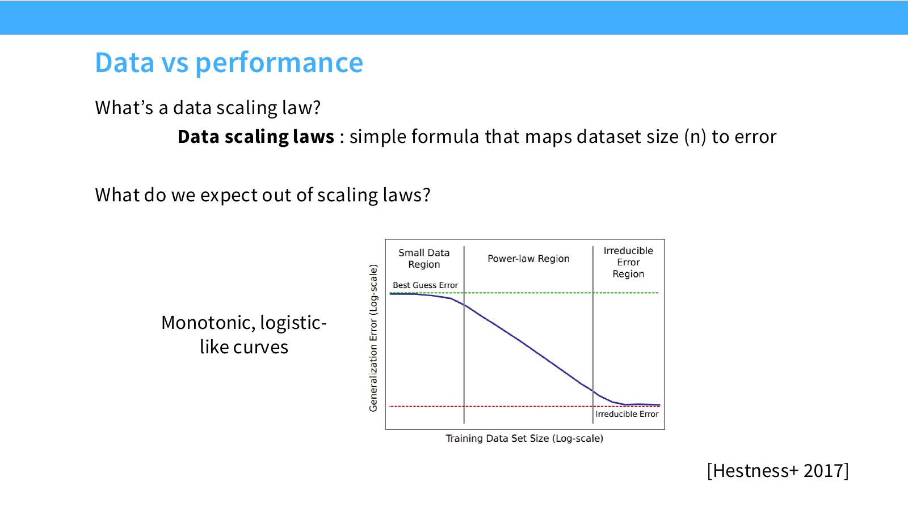

이 페이지는 가장 기본적인 data scaling law를 정의합니다. 슬라이드의 질문은 다음입니다.

> Data size $n$이 주어졌을 때, error는 어떻게 변하는가?

즉 data scaling law는 다음과 같은 mapping을 모델링합니다.

```math
\text{data size } n \quad \longrightarrow \quad \text{error or loss}
```

일반적으로 기대하는 learning curve는 다음과 같은 모양입니다.

1. **Small data region**  
   데이터가 너무 적은 구간입니다. 이때는 모델이 충분한 패턴을 학습하지 못하고, curve도 불안정하게 보일 수 있습니다. 작은 데이터에서는 모델 초기화, optimization noise, dataset 구성에 따라 성능 변동이 큽니다.

2. **Power-law region**  
   데이터가 어느 정도 충분해지면 error가 비교적 안정적인 power-law 형태로 감소합니다. 이 구간이 scaling law를 fitting하기 가장 좋은 영역입니다.

3. **Irreducible error region**  
   데이터가 매우 많아져도 더 이상 error가 크게 줄지 않는 구간입니다. 데이터 noise, task 자체의 모호성, 모델 class의 한계 등으로 인해 남는 error floor에 가까워집니다.

이를 식으로 쓰면 보통 다음과 같습니다.

```math
\epsilon(n) = A n^{-\alpha} + \epsilon_\infty
```

여기서 $\epsilon(n)$은 data size $n$에서의 error, $A$는 scale coefficient, $\alpha$는 scaling exponent, $\epsilon_\infty$는 asymptotic error입니다.

중요한 해석은 다음입니다. 데이터가 커질수록 error가 줄어들긴 하지만, 증가량 대비 성능 개선 폭은 점점 작아집니다. 즉 데이터 10배 증가가 항상 같은 절대 성능 향상을 주는 것이 아니라, 보통은 **diminishing return**이 있습니다.

---

## Page 15. Language model에서의 data scaling law

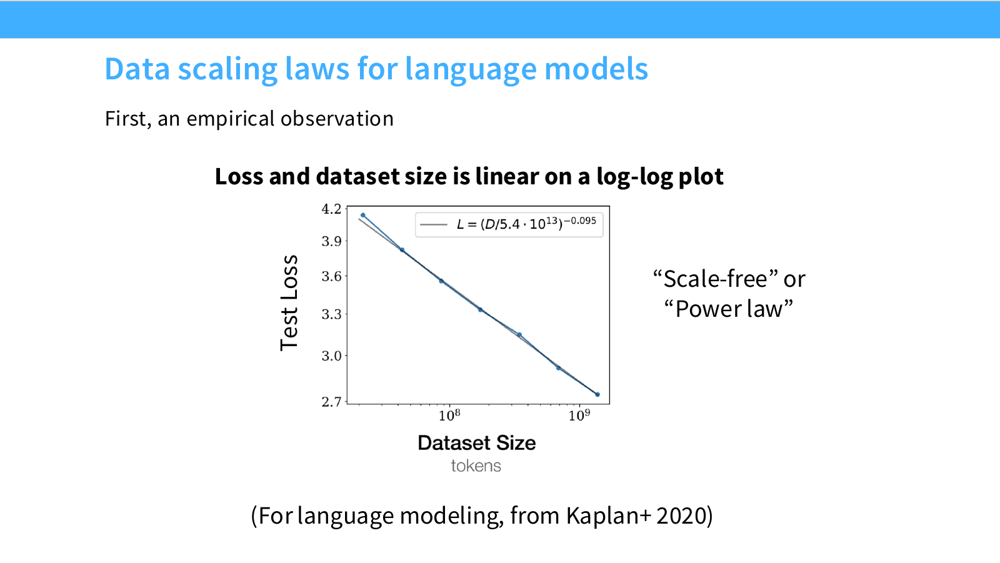

이 페이지는 Kaplan et al.(2020)의 language modeling 결과를 통해, 실제 LLM에서도 data scaling law가 관찰된다는 점을 보여줍니다.

슬라이드의 그래프는 대략 다음 관계를 보여줍니다.

- x축: dataset size 또는 training tokens
- y축: test loss
- 축은 log scale로 표현됨
- 점들이 거의 직선 위에 놓임

이것은 test loss가 dataset size $D$에 대해 power-law 형태로 감소한다는 뜻입니다.

```math
L(D) \propto D^{-\alpha}
```

또는 asymptotic loss를 포함하면 다음과 같이 볼 수 있습니다.

```math
L(D) = A D^{-\alpha} + L_\infty
```

Kaplan 결과에서 중요한 것은 exponent $\alpha$가 그리 크지 않다는 점입니다. 즉 dataset size를 많이 늘려도 loss가 급격히 떨어지지는 않습니다. 예를 들어 $\alpha$가 작으면 데이터 크기를 10배 늘려도 loss 감소는 제한적입니다.

이 페이지 우측의 핵심 표현은 “**scale-free, or power law**”입니다. 여기서 scale-free라는 말은 특정 데이터 크기 근처에서만 작동하는 규칙이 아니라, 넓은 scale 범위에서 유사한 형태의 관계가 유지된다는 뜻입니다.

실무적으로는 다음 의미가 있습니다.

> 데이터가 늘어날 때 성능이 얼마나 좋아질지 대략 예측할 수 있다면, 더 많은 데이터를 수집하는 것이 worth it인지 사전에 계산할 수 있다.

다만 이 식은 데이터 품질, 데이터 중복, 데이터 분포가 같다는 가정에 가까운 실험적 관계입니다. 실제 pretraining에서는 단순 token 수뿐 아니라 데이터 구성과 품질이 함께 중요합니다.

---

## Page 16. Data scaling law의 개념적 기반

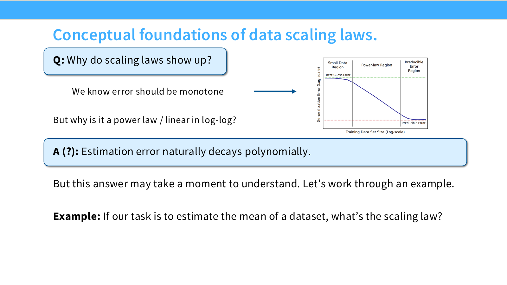

이 페이지의 질문은 다음입니다.

> 왜 scaling law가 나타나는가?

데이터가 많아지면 성능이 좋아진다는 것은 직관적으로 이해할 수 있습니다. 하지만 왜 그 관계가 하필 log-log plot에서 직선, 즉 power-law 형태로 나타나는지는 별도의 설명이 필요합니다.

강의에서는 한 가지 직관으로 **estimation error의 polynomial convergence rate**를 제시합니다. 통계적 추정 문제에서는 sample 수가 늘어날수록 추정 오차가 다음처럼 감소하는 경우가 많습니다.

```math
\mathrm{Error}(n) = O(n^{-\alpha})
```

이 식이 바로 power-law입니다. 즉 scaling law는 완전히 임의로 만든 경험식이 아니라, 통계적 추정 문제에서 자주 나타나는 polynomial rate와 연결해서 생각할 수 있습니다.

이 페이지는 다음 페이지의 toy example으로 이어집니다. 가장 단순한 예시인 평균 추정을 보면, sample 수 $n$이 증가할 때 평균 추정 오차가 $1/n$으로 감소합니다. 이를 통해 “error가 sample 수에 대해 power-law로 줄어드는 현상”을 직관적으로 이해할 수 있습니다.

하지만 여기서 주의할 점도 있습니다. 평균 추정 같은 단순한 parametric problem에서는 exponent가 명확하게 $1$에 가까운 형태로 나오지만, LLM의 neural scaling law에서는 exponent가 훨씬 작고 task마다 달라집니다. 따라서 이 페이지의 설명은 “왜 power-law가 자연스러울 수 있는가”에 대한 직관이지, LLM scaling exponent를 완전히 설명하는 이론은 아닙니다.

---

## Page 17. Toy example - 평균 추정에서의 scaling law

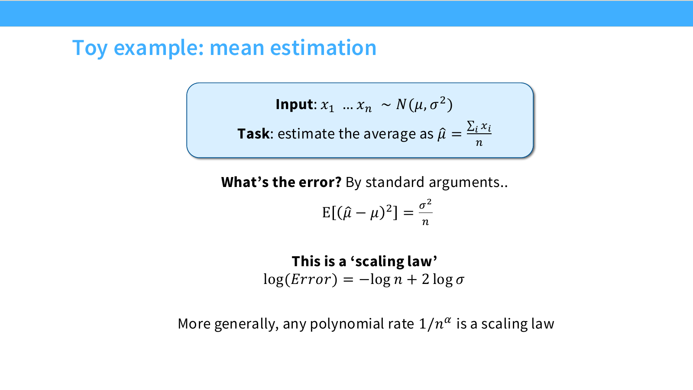

이 페이지는 power-law가 왜 자연스럽게 등장하는지를 보여주는 가장 단순한 예시입니다. 데이터가 정규분포에서 생성된다고 가정합니다.

```math
x_1, \ldots, x_n \sim \mathcal{N}(\mu, \sigma^2)
```

여기서 $\mu$는 우리가 추정하려는 true mean이고, $\sigma^2$는 분산입니다. 평균 추정량은 다음과 같습니다.

```math
\hat{\mu} = \frac{1}{n}\sum_{i=1}^{n}x_i
```

이 추정량의 평균 제곱 오차는 다음과 같습니다.

```math
\mathbb{E}\left[(\hat{\mu}-\mu)^2\right] = \frac{\sigma^2}{n}
```

이 식은 sample 수 $n$이 커질수록 error가 정확히 $1/n$ 비율로 감소한다는 뜻입니다. 즉 다음과 같은 power-law입니다.

```math
\mathrm{Error}(n) \propto n^{-1}
```

로그를 취하면 다음과 같습니다.

```math
\log(\mathrm{Error}) = -\log n + 2\log \sigma
```

따라서 log-log plot에서 이 관계는 기울기 $-1$인 직선이 됩니다.

이 페이지의 핵심 메시지는 다음입니다.

- sample 수가 증가하면 추정 오차가 polynomial rate로 감소할 수 있다.
- polynomial rate는 log-log plot에서 직선으로 나타난다.
- 따라서 scaling law에서 log-log 직선이 등장하는 것은 통계적 추정 관점에서 자연스럽다.

다만 LLM에서는 평균 하나를 추정하는 것이 아니라 고차원의 복잡한 분포를 모델링합니다. 그래서 실제 neural scaling law의 exponent는 $-1$보다 훨씬 완만하고, task와 데이터 분포에 따라 달라질 수 있습니다.

---

## Page 18. Scaling exponent의 미스터리

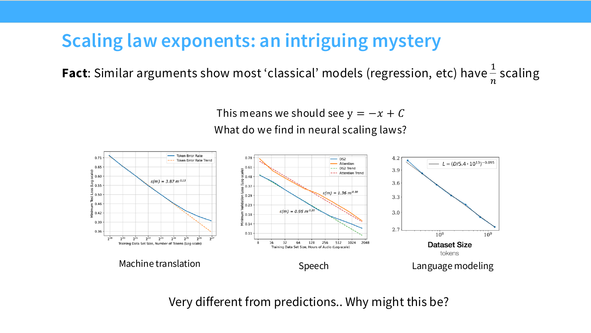

이 페이지는 앞의 평균 추정 예시와 실제 neural scaling law 사이의 차이를 강조합니다. 평균 추정에서는 error가 $1/n$으로 줄어들기 때문에 log-log plot의 slope는 $-1$입니다.

```math
\mathrm{Error}(n) \propto n^{-1}
```

```math
\log \mathrm{Error}(n) = -\log n + C
```

하지만 슬라이드에 제시된 machine translation, speech recognition, language modeling 결과를 보면 실제 neural network의 scaling exponent는 task마다 다르고, 대부분 단순한 $-1$ slope와는 다릅니다.

이 페이지의 질문은 다음으로 정리됩니다.

> 왜 neural scaling law의 exponent는 고전적 평균 추정처럼 단순하지 않은가?

가능한 이유는 다음과 같습니다.

1. **문제 자체가 고차원적이다.**  
   LLM은 단일 평균이 아니라 token sequence의 복잡한 확률분포를 추정합니다. 입력 공간과 출력 공간의 effective dimension이 매우 큽니다.

2. **모델이 nonparametric하게 동작한다.**  
   큰 neural network는 고정된 소수의 parameter만 추정하는 parametric model이 아니라, 데이터가 많아질수록 더 복잡한 함수를 학습하는 flexible estimator에 가깝습니다.

3. **데이터 분포가 균질하지 않다.**  
   자연어 데이터는 주제, 문체, 난이도, 언어, 도메인이 섞여 있습니다. 데이터가 늘어날 때 단순히 같은 분포의 sample이 늘어나는 것이 아닐 수 있습니다.

4. **optimization과 architecture의 영향이 함께 들어간다.**  
   실제 loss curve는 통계적 추정 오차뿐 아니라 optimizer, learning rate, batch size, architecture, regularization의 영향을 받습니다.

따라서 이 페이지는 “power-law는 관찰되지만, 그 exponent가 왜 특정 값이 되는지는 아직 어렵다”는 점을 보여줍니다.

---

## Page 19. Nonparametric learning 관점의 scaling law

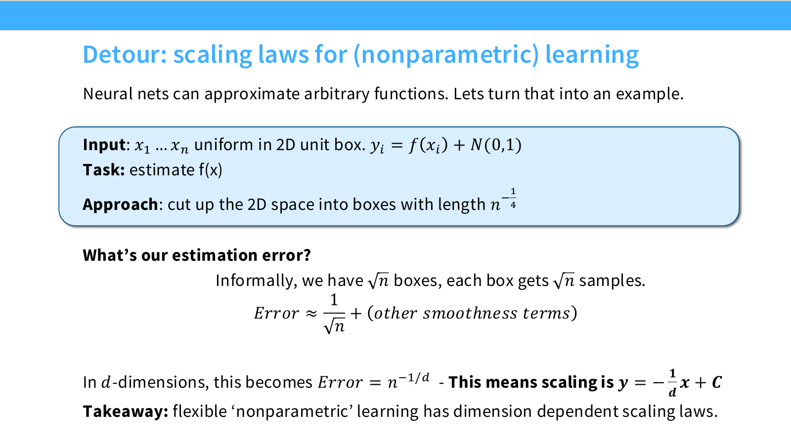

이 페이지는 잠깐 우회해서 scaling law를 **nonparametric learning** 관점에서 설명합니다. 여기서 핵심 메시지는 다음입니다.

> Neural network는 충분히 크면 임의의 함수를 근사할 수 있다. 그런데 이렇게 유연한 함수 추정 문제에서는 성능 향상 속도가 데이터가 놓인 공간의 차원에 강하게 의존한다.

즉, 이 페이지는 “왜 scaling law의 exponent가 작게 나오는가?”, “왜 고차원 문제에서는 데이터를 많이 늘려도 성능이 천천히 좋아지는가?”를 설명하기 위한 toy example입니다.

---

### 1. 문제 설정: 2D unit box에서 함수 추정하기

슬라이드는 입력 $x_1, \ldots, x_n$이 2D unit box, 즉 대략 $[0,1]^2$ 공간에 균일하게 분포한다고 가정합니다.

```math
x_i \sim \mathrm{Uniform}([0,1]^2)
```

각 sample의 출력은 어떤 unknown function $f$에 noise가 더해진 형태입니다.

```math
y_i = f(x_i) + \mathcal{N}(0,1)
```

여기서 각 항의 의미는 다음과 같습니다.

- $x_i$: 2차원 입력 sample
- $y_i$: 관측된 label 또는 target value
- $f(x_i)$: 우리가 추정하고 싶은 진짜 함수값
- $\mathcal{N}(0,1)$: 평균 0, 분산 1인 Gaussian noise

Task는 관측 데이터 $(x_i, y_i)$를 이용해 함수 $f(x)$를 추정하는 것입니다.

이 문제를 LLM에 직접 대응시키면 안 되지만, 직관적으로는 다음과 비슷합니다.

- 입력 공간이 복잡하다.
- 관측값에는 noise가 있다.
- 충분한 데이터를 모으면 더 좋은 함수를 추정할 수 있다.
- 그러나 공간의 차원이 커질수록 sample이 공간을 촘촘히 덮기 어려워진다.

---

### 2. 접근법: 2D 공간을 작은 box로 나누기

슬라이드는 2D 공간을 작은 정사각형 box들로 나눕니다. 각 box 안에서는 $f(x)$가 거의 일정하다고 보고, 그 box 안에 들어온 $y_i$들의 평균으로 $f(x)$를 추정합니다.

즉, 어떤 box $B$에 들어온 sample 집합을 $\{i : x_i \in B\}$라고 하면, box 안의 함수값은 대략 다음처럼 추정합니다.

```math
\hat{f}_B = \frac{1}{m_B} \sum_{i:x_i \in B} y_i
```

여기서 $m_B$는 box $B$ 안에 들어온 sample 수입니다.

이 방식은 매우 단순하지만, nonparametric regression의 기본 직관을 잘 보여줍니다.

- box를 작게 만들면 $f(x)$를 더 세밀하게 근사할 수 있다.
- 하지만 box가 너무 작으면 각 box 안에 sample이 적어져 평균 추정이 noisy해진다.
- box를 크게 만들면 sample은 많아져 noise는 줄지만, box 안에서 $f(x)$가 변하는 것을 무시하게 된다.

따라서 핵심 trade-off는 다음입니다.

```math
\text{estimation variance} \quad \text{vs.} \quad \text{smoothness/approximation bias}
```

---

### 3. 왜 box 한 변 길이를 $n^{-1/4}$로 잡는가?

슬라이드에서는 box의 한 변 길이를 다음처럼 둡니다.

```math
h = n^{-1/4}
```

여기서 $h$는 box의 width, 즉 한 변의 길이입니다. 전체 공간의 한 축 길이가 1이므로, 한 축에 들어가는 box 개수는 다음과 같습니다.

```math
\frac{1}{h} = \frac{1}{n^{-1/4}} = n^{1/4}
```

2D에서는 가로 방향에 $n^{1/4}$개, 세로 방향에 $n^{1/4}$개 box가 들어갑니다. 따라서 전체 box 수는 다음과 같습니다.

```math
\left(\frac{1}{n^{-1/4}}\right)^2
= (n^{1/4})^2
= n^{1/2}
= \sqrt{n}
```

즉, 공간을 총 $\sqrt{n}$개의 box로 나눈 것입니다.

---

### 4. 각 box에는 sample이 몇 개 들어가는가?

전체 sample 수가 $n$개이고, 전체 box 수가 $\sqrt{n}$개라면, 각 box에는 평균적으로 다음 개수의 sample이 들어갑니다.

```math
\frac{n}{\sqrt{n}} = \sqrt{n}
```

물론 실제로는 어떤 box에는 sample이 더 많고, 어떤 box에는 더 적을 수 있습니다. 하지만 $x_i$가 uniform하게 분포한다고 가정하면 평균적으로는 각 box에 $\sqrt{n}$개 정도의 sample이 들어간다고 볼 수 있습니다.

---

### 5. 왜 error가 $1/\sqrt{n}$ 수준이 되는가?

각 box 안에서 $y_i$의 평균을 내면 noise가 averaging됩니다. Noise가 독립이고 분산이 1이라고 하면, sample 평균의 variance는 sample 수의 역수에 비례합니다.

box 안의 sample 수가 $m_B$라면,

```math
\mathrm{Var}(\hat{f}_B)
\approx
\frac{1}{m_B}
```

이고, 여기서 $m_B \approx \sqrt{n}$이므로,

```math
\mathrm{Var}(\hat{f}_B)
\approx
\frac{1}{\sqrt{n}}
```

그래서 슬라이드에서는 estimation error를 다음처럼 씁니다.

```math
\mathrm{Error}
\approx
\frac{1}{\sqrt{n}} + \text{other smoothness terms}
```

여기서 $1/\sqrt{n}$은 **각 box 안에서 평균을 추정할 때 생기는 noise variance 또는 MSE scale의 항**으로 이해하면 됩니다.

주의할 점은, error를 standard error 또는 RMSE로 보면 제곱근을 한 번 더 취해야 하므로 $n^{-1/4}$가 됩니다. 하지만 이 슬라이드의 흐름에서는 squared error/MSE에 가까운 scale로 $1/\sqrt{n}$ 항을 설명하고 있다고 보는 것이 자연스럽습니다.

---

### 6. other smoothness terms는 무엇인가?

슬라이드의

```math
\text{other smoothness terms}
```

는 box 안에서 $f(x)$를 상수처럼 취급하면서 생기는 approximation error 또는 bias를 의미합니다.

box 안에서도 실제 함수 $f(x)$는 완전히 일정하지 않을 수 있습니다. box의 한 변 길이가 $h$라면, 함수가 충분히 smooth하다는 가정하에 box 내부에서 함수값이 변하는 정도는 $h$에 의해 제한됩니다.

예를 들어 $f$가 Lipschitz smooth하다고 보면, 같은 box 안의 두 점 $x, x'$에 대해 대략 다음과 같은 관계를 생각할 수 있습니다.

```math
|f(x) - f(x')| \lesssim L \|x - x'\|
```

이때 box의 크기가 작을수록 같은 box 안에서 $f$가 덜 변하므로 approximation bias가 작아집니다. 반대로 box가 크면 sample은 많이 들어오지만, box 안에서 서로 다른 위치의 함수값을 같은 값으로 평균내게 되어 bias가 커질 수 있습니다.

따라서 이 toy example에는 두 종류의 error가 함께 존재합니다.

1. **Variance term**  
   각 box 안 sample 수가 제한되어 있기 때문에 평균 추정이 noisy한 문제

   ```math
   \approx \frac{1}{\sqrt{n}}
   ```

2. **Smoothness/Bias term**  
   box 안에서 $f(x)$가 실제로는 변하는데, 이를 하나의 평균값으로 근사하면서 생기는 문제

   ```math
   \approx \text{function smoothness and box width에 의해 결정}
   ```

슬라이드에서 box 길이 $n^{-1/4}$를 선택한 것은 2D 예시에서 이러한 variance와 smoothness/bias 항이 비슷한 scale이 되도록 맞추는 직관으로 볼 수 있습니다.

---

### 7. d차원으로 일반화하면 왜 $n^{-1/d}$가 되는가?

슬라이드는 이 직관을 $d$차원으로 확장하여 다음과 같이 씁니다.

```math
\mathrm{Error}(n) = n^{-1/d}
```

이 식은 핵심적으로 **차원의 저주**(curse of dimensionality)를 보여줍니다. 데이터가 $n$개 있어도, 입력 공간의 차원 $d$가 커지면 sample들이 공간을 조밀하게 채우기 어려워집니다.

$d$차원에서 어떤 공간을 일정한 해상도로 덮으려면, 한 축당 필요한 구간 수가 조금만 늘어나도 전체 box 수는 지수적으로 늘어납니다.

예를 들어 한 축을 $k$개 구간으로 나누면,

```math
\text{number of boxes} = k^d
```

입니다. 따라서 $d$가 클수록 같은 수의 sample로는 공간을 촘촘히 덮기 어렵고, error 감소 속도가 느려집니다.

슬라이드의 식

```math
\mathrm{Error}(n) = n^{-1/d}
```

은 이 현상을 단순화한 scaling law입니다. $d$가 커질수록 exponent $1/d$가 작아지기 때문에, 데이터 $n$을 늘려도 error가 천천히 줄어듭니다.

예를 들어:

```math
d=2 \Rightarrow \mathrm{Error}(n) = n^{-1/2}
```

```math
d=10 \Rightarrow \mathrm{Error}(n) = n^{-1/10}
```

```math
d=100 \Rightarrow \mathrm{Error}(n) = n^{-1/100}
```

즉 차원이 높아질수록 같은 데이터 증가가 훨씬 작은 성능 향상으로 이어집니다.

---

### 8. log-log plot에서 왜 직선이 되는가?

슬라이드는 scaling을 다음 직선으로 표현합니다.

```math
y = -\frac{1}{d}x + C
```

이는 power-law 식에 log를 취한 결과입니다.

먼저 error 식을 다음처럼 둡니다.

```math
\mathrm{Error}(n) = C' n^{-1/d}
```

양변에 log를 취하면,

```math
\log \mathrm{Error}(n)
= \log C' - \frac{1}{d}\log n
```

여기서

```math
y = \log \mathrm{Error}(n), \quad x = \log n, \quad C = \log C'
```

라고 두면,

```math
y = -\frac{1}{d}x + C
```

가 됩니다.

따라서 log-log plot에서 power-law는 직선으로 나타나고, 그 기울기는 다음과 같습니다.

```math
\text{slope} = -\frac{1}{d}
```

즉 기울기의 절댓값이 작을수록 error가 더 느리게 줄어듭니다. $d$가 클수록 $-1/d$는 0에 가까워지므로 scaling curve가 더 완만해집니다.

---

### 9. 이 페이지의 핵심 takeaway

이 페이지의 takeaway는 슬라이드 마지막 문장처럼 다음입니다.

> Flexible nonparametric learning has dimension-dependent scaling laws.

즉, neural network처럼 매우 flexible한 모델은 임의의 함수를 근사할 수 있지만, 그만큼 학습 문제는 데이터가 놓인 공간의 차원 또는 effective dimension에 민감해질 수 있습니다.

이 관점에서 LLM scaling law를 보면 다음과 같은 직관을 얻을 수 있습니다.

- 데이터가 많아질수록 loss는 줄어든다.
- 하지만 감소 속도는 문제의 effective dimension 또는 complexity에 의해 제한될 수 있다.
- 차원이 높거나 구조가 복잡한 문제일수록 scaling exponent는 작아진다.
- 그래서 LLM에서 관찰되는 power-law exponent가 작다는 것은 자연어 modeling이 매우 고차원적이고 복잡한 함수 추정 문제라는 신호로 볼 수 있다.

다만 이 페이지는 엄밀한 LLM 이론이라기보다 직관적 설명입니다. 실제 LLM의 scaling exponent는 intrinsic dimension뿐 아니라 architecture, optimizer, data mixture, tokenization, context length, loss function, training dynamics의 영향을 함께 받습니다.

그래도 이 toy example은 중요한 감각을 줍니다.

> Scaling exponent가 작다는 것은 단순히 “학습이 잘 안 된다”는 뜻이 아니라, 모델이 풀고 있는 함수 추정 문제가 고차원적이고 복잡할 수 있음을 의미한다.

---

## Page 20. Intrinsic dimensionality와 scaling exponent

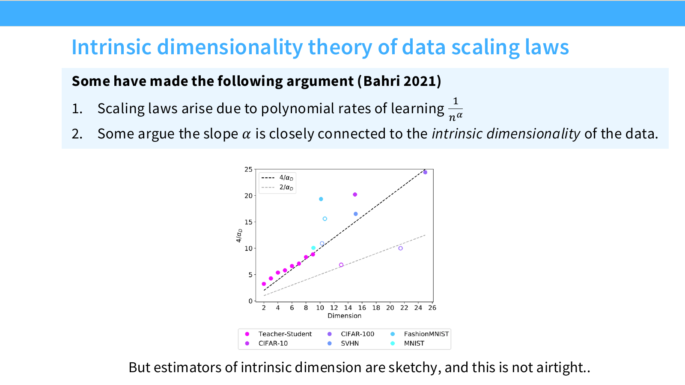

이 페이지는 Bahri et al. 계열의 관점을 소개합니다. 핵심 아이디어는 neural scaling law의 exponent가 데이터 manifold의 **intrinsic dimensionality**와 관련될 수 있다는 것입니다.

앞 페이지의 단순한 nonparametric 예시에서는 $d$차원 문제에서 error가 다음처럼 감소했습니다.

```math
\mathrm{Error}(n) = n^{-1/d}
```

이 식에서 slope는 다음과 같습니다.

```math
\alpha = \frac{1}{d}
```

따라서 intrinsic dimension $d$가 크면 scaling exponent $\alpha$는 작아지고, 데이터 증가에 따른 error 감소가 느려집니다.

슬라이드는 neural scaling law를 다음과 같은 관점에서 해석할 수 있음을 보여줍니다.

- 데이터가 저차원 manifold 위에 놓여 있다면, 겉보기 input dimension보다 실제 학습 난이도는 intrinsic dimension에 더 가까울 수 있다.
- scaling exponent는 이 intrinsic dimension과 관련될 수 있다.
- 다양한 task에서 exponent가 다른 것은 task마다 intrinsic dimension 또는 effective complexity가 다르기 때문일 수 있다.

하지만 이 설명에는 한계도 있습니다. 실제 LLM에서 intrinsic dimensionality를 안정적으로 측정하기 어렵고, scaling exponent는 데이터 manifold뿐 아니라 모델 architecture, optimizer, tokenization, loss function, data mixture의 영향을 받습니다.

따라서 이 페이지의 결론은 다음처럼 이해하는 것이 좋습니다.

> Scaling exponent는 문제의 effective dimension이나 복잡도와 관련될 수 있지만, 이것만으로 LLM scaling law 전체를 완전히 설명하기는 어렵다.

---

## Page 21. 다른 형태의 data scaling law

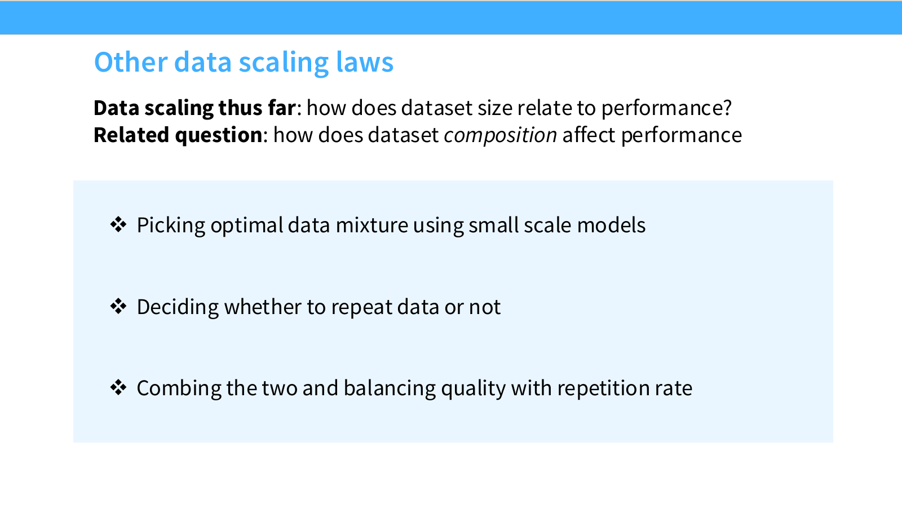

이 페이지부터는 단순히 “데이터 개수를 늘리면 어떻게 되는가”를 넘어서, **어떤 데이터를 쓸 것인가**의 문제로 넘어갑니다.

슬라이드의 질문은 세 가지입니다.

1. **데이터 구성은 성능에 어떤 영향을 주는가?**  
   Pretraining corpus는 웹, 책, 코드, 논문, 대화, 여러 언어 등 다양한 source가 섞입니다. 같은 token 수라도 어떤 source를 얼마나 섞느냐에 따라 성능이 달라질 수 있습니다.

2. **작은 모델에서 optimal data mixture를 선택할 수 있는가?**  
   큰 모델로 모든 mixture를 실험하는 것은 비쌉니다. 따라서 작은 모델에서 data mixture별 성능을 보고, 큰 모델에 적용 가능한지 알고 싶습니다.

3. **같은 데이터를 반복해서 학습하는 것은 얼마나 가치 있는가?**  
   데이터가 부족하거나 고품질 데이터가 제한적일 때 같은 데이터를 여러 epoch 반복할 수 있습니다. 하지만 반복 데이터는 새로운 데이터와 같은 가치를 갖지 않습니다.

이 페이지의 핵심은 data scaling law가 단순히 data size만의 함수가 아니라는 점입니다. 실제 LLM에서는 다음 변수들이 함께 들어갑니다.

- 데이터 양
- 데이터 품질
- 데이터 다양성
- 데이터 중복도
- 반복 횟수
- 도메인 구성
- compute budget

따라서 실무적인 data scaling law는 “token 수가 많으면 좋다”에서 끝나지 않습니다. 어떤 데이터를 선택하고, 얼마나 반복하고, 어느 scale에서 어떤 mixture를 사용할지까지 포함해야 합니다.

---

## Page 22. Distribution shift scaling law

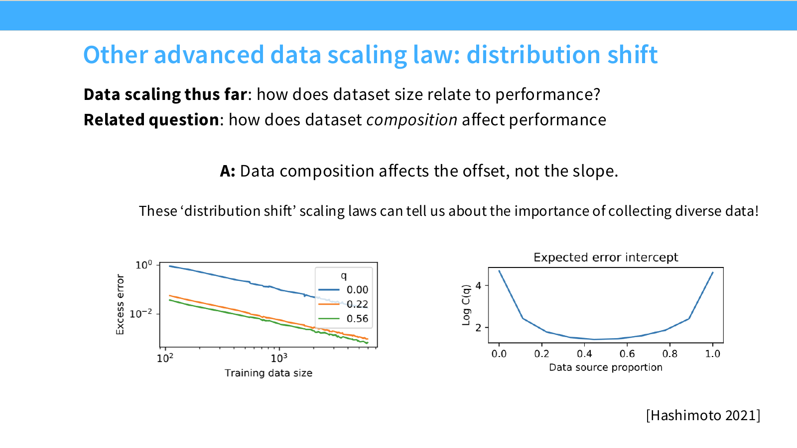

이 페이지는 Hashimoto 계열의 distribution shift scaling law를 소개합니다. 핵심 문장은 다음입니다.

> Data composition affects the offset, not the slope.

즉 데이터 source의 비율이나 분포가 바뀌면 scaling curve의 기울기 자체보다는 **offset**, 즉 curve가 위아래로 이동하는 정도가 달라질 수 있다는 뜻입니다.

간단히 식으로 쓰면 다음과 같이 볼 수 있습니다.

```math
\mathrm{Error}_q(n) \approx A n^{-\alpha} + C(q)
```

여기서 $q$는 data source proportion 또는 data mixture를 의미합니다. $A n^{-\alpha}$는 데이터가 늘어날 때의 공통적인 감소 추세이고, $C(q)$는 데이터 구성에 따라 달라지는 offset입니다.

슬라이드의 그래프는 서로 다른 data mixture에서 scaling curve가 거의 비슷한 slope를 가지지만, 전체적으로 위아래 위치가 달라질 수 있음을 보여줍니다. 이는 다음 의미를 가집니다.

- 데이터 양을 늘리는 것은 curve를 따라 오른쪽으로 이동하는 효과가 있습니다.
- 데이터 구성을 개선하는 것은 curve 자체를 아래로 이동시키는 효과가 있습니다.
- 따라서 좋은 data mixture는 같은 token 수에서도 더 낮은 loss를 만들 수 있습니다.

슬라이드 하단의 메시지는 **collecting diverse data**의 중요성입니다. 단순히 같은 종류의 데이터를 더 많이 모으는 것보다, 분포가 다양한 데이터를 잘 구성하면 더 낮은 offset을 얻을 수 있습니다.

실무적으로는 LLM pretraining corpus를 만들 때 다음 질문으로 이어집니다.

> 작은 scale에서 data mixture별 offset 차이를 측정하면, 큰 scale에서도 더 좋은 mixture를 예측할 수 있는가?

이 질문이 다음 페이지의 data mixture selection 문제로 이어집니다.

---

## Page 23. Data mixture selection은 생각보다 어렵다

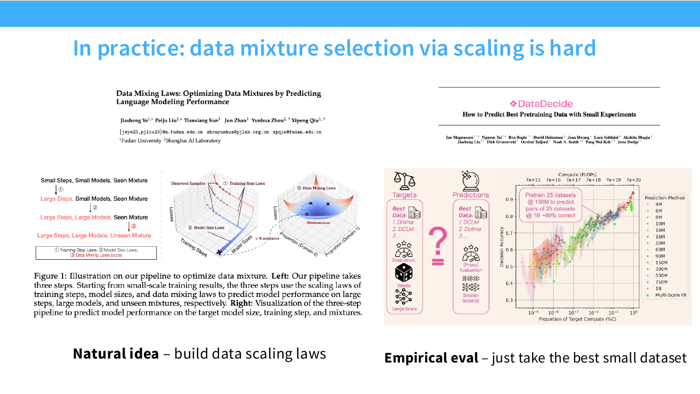

이 페이지는 data mixture를 scaling law로 선택하려는 시도가 실제로는 쉽지 않다는 점을 보여줍니다.

왼쪽의 자연스러운 아이디어는 다음입니다.

1. 여러 data source 또는 mixture를 준비한다.
2. 작은 모델에서 각 mixture의 scaling curve를 fitting한다.
3. 큰 모델에서 가장 좋을 mixture를 예측한다.
4. 그 mixture로 full-scale pretraining을 수행한다.

이 접근은 매우 합리적으로 보입니다. 하지만 실제로는 여러 confound가 있습니다.

- 작은 모델에서 좋은 mixture가 큰 모델에서도 좋다는 보장이 약합니다.
- 어떤 data source는 작은 scale에서는 빠르게 성능을 올리지만 큰 scale에서는 saturation될 수 있습니다.
- 고품질 데이터는 적은 양에서는 좋지만 반복할수록 효용이 줄어듭니다.
- 큰 compute에서는 낮은 품질이더라도 다양한 데이터를 더 많이 포함하는 것이 유리할 수 있습니다.
- 평가 benchmark가 어떤 도메인을 중시하느냐에 따라 optimal mixture가 달라질 수 있습니다.

오른쪽의 empirical evaluation 관점은 “작은 scale에서 그냥 가장 좋은 dataset을 고르자”에 가깝습니다. 하지만 이 방법도 scale이 바뀌면 실패할 수 있습니다. 작은 모델에서 가장 낮은 loss를 준 데이터가 큰 모델에서도 최적인지는 알 수 없기 때문입니다.

이 페이지의 핵심은 data mixture selection도 scaling law로 다루고 싶지만, 단순한 data size scaling보다 훨씬 복잡하다는 점입니다. 데이터 품질, 다양성, 반복, compute budget이 모두 얽혀 있기 때문입니다.

---

## Page 24. Data repetition에서의 scaling law

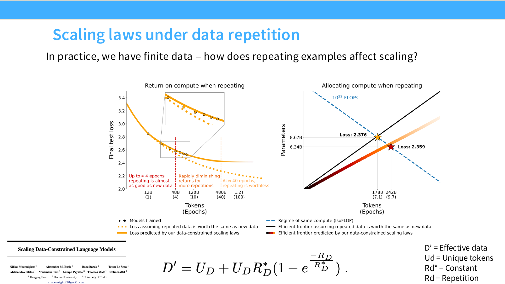

이 페이지는 **같은 데이터를 여러 번 반복해서 학습하는 경우**를 다룹니다. 실제 pretraining에서는 고품질 unique data가 제한적이기 때문에 반복 학습이 자주 발생합니다. 질문은 다음입니다.

> 반복 데이터는 새로운 데이터와 같은 가치를 가지는가?

슬라이드 왼쪽 그래프는 return on compute와 epoch 수의 관계를 보여줍니다. 핵심 관찰은 다음과 같습니다.

- 반복이 적은 구간에서는 같은 데이터를 다시 보는 것도 어느 정도 도움이 됩니다.
- 대략 몇 epoch까지는 반복 데이터가 새로운 데이터와 비슷한 효용을 줄 수 있습니다.
- 하지만 반복 횟수가 커질수록 효용이 빠르게 감소합니다.
- 매우 많은 epoch에서는 추가 반복이 거의 도움이 되지 않거나, 오히려 overfitting으로 이어질 수 있습니다.

그래프의 legend는 두 가지 관점을 비교합니다.

- **Data constrained fit**: 데이터가 제한되어 반복 학습이 발생하는 현실적인 경우
- **If repeated data were equivalent to new data**: 반복 데이터가 새 데이터와 완전히 같은 가치라고 가정한 이상적인 경우

두 곡선의 차이는 반복 데이터가 새로운 데이터만큼 가치 있지 않다는 점을 보여줍니다.

슬라이드 오른쪽은 “compute allocation” 관점입니다. 같은 FLOPs를 쓰더라도 unique token 수와 epoch 수의 조합이 달라질 수 있습니다. 예를 들어 더 적은 unique data를 많이 반복할 수도 있고, 더 많은 unique data를 적게 반복할 수도 있습니다. 그래프는 반복 데이터의 diminishing return을 고려하면 optimal allocation이 달라진다는 점을 보여줍니다.

강의에서 소개하는 effective data 공식은 다음과 같습니다.

```math
D' = U_D + U_D R_D^*\left(1 - e^{-R_D/R_D^*}\right)
```

각 기호의 의미는 다음입니다.

- $D'$: effective data. 반복을 고려했을 때 실제로 새 데이터처럼 기여하는 등가 데이터량
- $U_D$: unique tokens. 중복 없이 실제로 존재하는 고유 데이터량
- $R_D$: repetition 정도 또는 반복 횟수
- $R_D^*$: 반복 효용이 얼마나 빨리 포화되는지를 조절하는 상수

이 식의 직관은 다음과 같습니다.

반복이 작을 때는 $1-e^{-R_D/R_D^*}$가 거의 선형적으로 증가하므로 반복도 어느 정도 도움이 됩니다. 하지만 $R_D$가 커질수록 exponential term이 0에 가까워지고, $D'$는 특정 값으로 포화됩니다. 즉 반복을 무한히 늘려도 effective data는 무한히 증가하지 않습니다.

이 페이지의 결론은 다음입니다.

> 반복 학습은 어느 정도 유용하지만, 새로운 데이터와 같은 가치를 갖지 않는다. 따라서 scaling law에는 unique data와 repetition의 차이를 반영해야 한다.

---

## Page 25. Compute-unbounded setting에서 scaling law의 한계

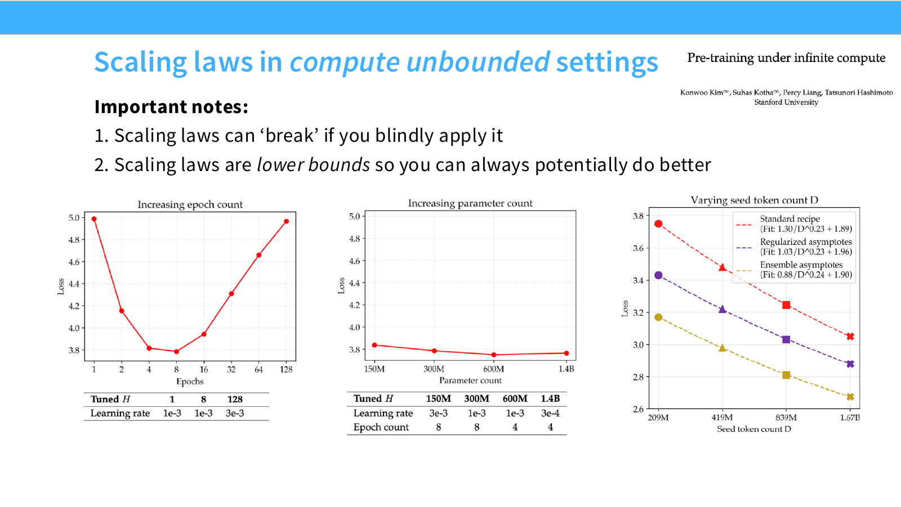

이 페이지는 **Pre-training under infinite compute** 관점에서 scaling law의 한계를 설명합니다. 슬라이드의 중요한 note는 두 가지입니다.

1. **Scaling laws can break if you blindly apply it.**  
   기존 scaling law를 맹목적으로 적용하면 깨질 수 있습니다. 특히 compute가 매우 많거나, 동일 데이터를 매우 많이 반복하거나, regularization/ensembling 같은 방법을 바꾸는 경우에는 기존 경험식이 그대로 맞지 않을 수 있습니다.

2. **Scaling laws are lower bounds so you can always potentially do better.**  
   현재 관찰된 scaling law는 “이 정도 성능은 기대할 수 있다”는 baseline 또는 lower-bound처럼 작동할 수 있습니다. 하지만 더 좋은 학습 recipe, regularization, data curation, architecture가 나오면 같은 scale에서도 더 낮은 loss를 얻을 수 있습니다.

슬라이드에는 세 개의 그래프가 있습니다.

왼쪽 그래프는 **Increasing epoch count**입니다. x축은 epochs, y축은 loss입니다. epoch 수가 1에서 8까지 증가할 때 loss가 낮아지지만, 16, 32, 64, 128 epoch로 계속 늘리면 loss가 다시 올라가는 U-shape가 나타납니다. 이는 데이터를 너무 많이 반복하면 성능이 악화될 수 있음을 보여줍니다.

가운데 그래프는 **Increasing parameter count**입니다. parameter count를 150M, 300M, 600M, 1.4B로 늘릴 때 loss가 약간 낮아지지만 변화가 크지 않습니다. 이는 해당 setting에서는 단순히 parameter를 키우는 것보다 반복/데이터/regularization 조건이 더 중요할 수 있음을 시사합니다.

오른쪽 그래프는 <strong>Varying seed token count $D$</strong>입니다. seed token count가 커질수록 loss가 낮아지며, 세 가지 recipe가 비교됩니다.

- Standard recipe
- Regularized asymptotes
- Ensemble dynamic asymptotes

legend에는 각각의 fitting 식이 표시되어 있습니다.

```math
\text{Standard recipe: } \frac{1.30}{D^{0.23}} + 1.89
```

```math
\text{Regularized asymptotes: } \frac{1.03}{D^{0.23}} + 1.96
```

```math
\text{Ensemble dynamic asymptotes: } \frac{0.88}{D^{0.24}} + 1.90
```

세 curve 모두 power-law 형태를 보이지만, recipe에 따라 계수와 asymptote가 달라집니다. 이는 scaling law가 고정된 자연법칙이라기보다, 학습 방법과 regularization 방식에 따라 달라질 수 있는 empirical law라는 점을 보여줍니다.

이 페이지의 핵심은 다음입니다.

> Scale을 늘리는 것만으로 충분하지 않다. 반복, regularization, seed data, recipe가 바뀌면 scaling behavior 자체가 바뀔 수 있다.

---

## Page 26. Data selection scaling과 finiteness 보정

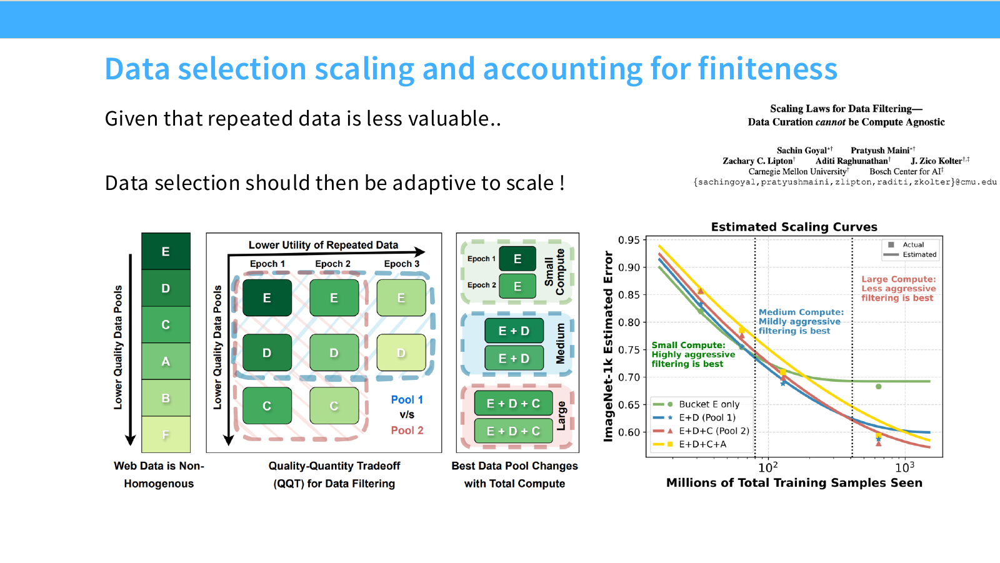

이 페이지는 **Scaling Laws for Data Filtering — Data Curation cannot be Compute Agnostic**라는 관점을 소개합니다. 제목 그대로 data curation은 compute budget과 독립적으로 정할 수 없다는 메시지입니다.

슬라이드 상단에는 다음 문장이 있습니다.

> Given that repeated data is less valuable... Data selection should then be adaptive to scale!

즉 반복 데이터의 가치가 낮아진다면, 데이터 선택 전략도 compute scale에 따라 달라져야 합니다.

왼쪽 그림은 web data가 균질하지 않다는 점을 보여줍니다. 데이터 pool은 E, D, C, A, B, F처럼 여러 quality bucket으로 나뉘며, 위쪽 bucket일수록 더 높은 품질을 나타냅니다. 실제 웹 데이터는 고품질 데이터와 저품질 데이터가 섞인 non-homogeneous corpus입니다.

가운데 그림은 **Quality-Quantity Tradeoff**(QQT)를 설명합니다. 고품질 bucket만 선택하면 데이터 품질은 높지만 양이 적어 반복이 많아질 수 있습니다. 반대로 낮은 품질의 데이터를 포함하면 양은 늘어나지만 평균 품질은 떨어집니다. 따라서 optimal data pool은 compute budget에 따라 달라집니다.

슬라이드의 예시는 다음과 같습니다.

- **Small compute**: E만 사용하는 것이 좋을 수 있습니다. 데이터가 적게 필요하므로 최고품질 데이터만 쓰는 aggressive filtering이 유리합니다.
- **Medium compute**: E + D를 사용하는 것이 좋을 수 있습니다. 고품질 데이터만 반복하기보다는 약간 더 넓은 pool이 필요합니다.
- **Large compute**: E + D + C까지 포함하는 것이 좋을 수 있습니다. 큰 compute에서는 데이터 양이 중요해지고, 너무 aggressive한 filtering은 반복을 늘려 손해가 될 수 있습니다.

오른쪽 그래프는 ImageNet-1k estimated error와 total training samples seen의 관계를 보여줍니다. 그래프에는 작은 compute, medium compute, large compute 구간이 표시되어 있고, 각 구간에서 best filtering aggressiveness가 달라집니다.

- 작은 compute: highly aggressive filtering이 best
- 중간 compute: mildly aggressive filtering이 best
- 큰 compute: less aggressive filtering이 best

이 페이지의 실무적 의미는 매우 큽니다.

> 데이터 필터링 threshold는 고정값이 아니라, 총 학습 compute와 반복 횟수까지 고려해 정해야 한다.

LLM pretraining에서도 마찬가지입니다. 작은 모델 SFT나 작은 pretraining 실험에서 좋은 고품질 subset이, 대규모 pretraining에서도 항상 최적인 것은 아닙니다. 큰 compute에서는 데이터 diversity와 volume이 더 중요해질 수 있습니다.

---

## Page 27. Recap - Data scaling laws

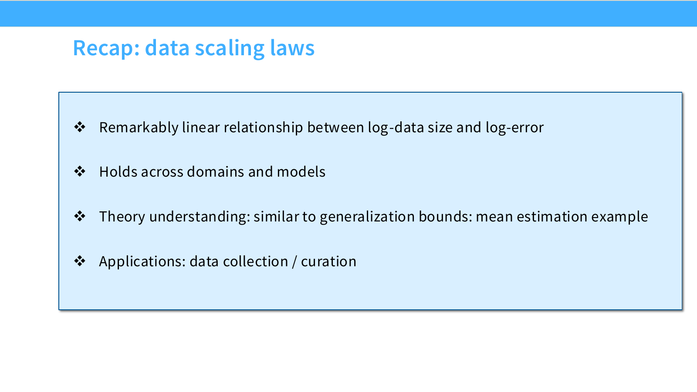

이 페이지는 data scaling law 파트의 요약입니다. 핵심 문장은 다음입니다.

> Log-data size and log-error very surprisingly linear.

즉 데이터 크기의 로그와 error의 로그 사이에 선형 관계가 자주 관찰됩니다. 이것이 data scaling law의 가장 기본적인 형태입니다.

두 번째 요약은 다음입니다.

> Some theory coming from a Gaussian process / statistical learning theory perspective.

앞에서 본 것처럼 mean estimation, generalization bound, nonparametric learning, intrinsic dimension 관점은 power-law가 왜 나타날 수 있는지에 대한 이론적 직관을 제공합니다. 다만 이들은 LLM scaling law를 완전히 설명하는 이론이라기보다는, power-law 형태가 자연스럽게 등장할 수 있음을 보여주는 배경입니다.

세 번째 요약은 다음입니다.

> Significant practical implications for data gathering / curation.

Data scaling law는 실제로 데이터 수집과 정제 전략에 영향을 줍니다. 예를 들어 다음 결정을 정량적으로 다룰 수 있습니다.

- 데이터 수집을 더 할 가치가 있는가?
- 고품질 데이터만 반복할 것인가, 낮은 품질의 데이터도 포함할 것인가?
- data mixture를 어떻게 구성할 것인가?
- 데이터 filtering threshold를 compute scale에 따라 어떻게 바꿀 것인가?
- 반복 데이터의 effective value를 어떻게 계산할 것인가?

마지막으로 슬라이드는 다음 질문으로 넘어갑니다.

> What about models?

즉 지금까지는 데이터 scale을 중심으로 봤지만, 다음 파트에서는 모델 크기, architecture, optimizer, depth/width, batch size 같은 model-side scaling law를 다룹니다.

---

## Page 28. Model engineering을 위한 scaling law

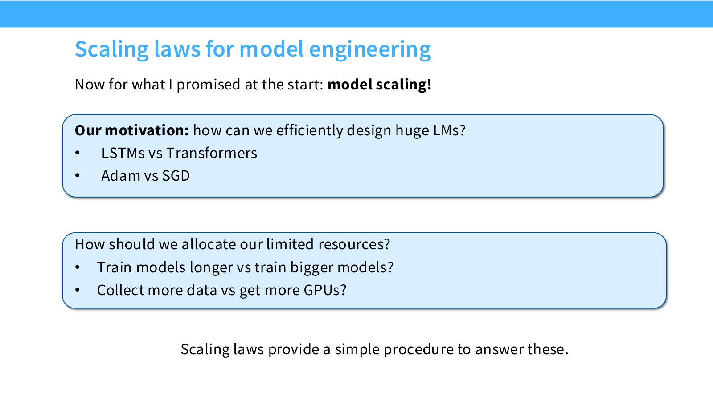

이 페이지는 model scaling law의 실용적 목적을 설명합니다. LLM을 만들 때 우리가 실제로 해야 하는 결정은 매우 많습니다. 슬라이드는 몇 가지 예시를 제시합니다.

- **LSTM or Transformer?**  
  어떤 architecture를 선택할 것인가?

- **How long to train?**  
  같은 모델을 얼마나 오래 학습할 것인가?

- **Adam or SGD?**  
  어떤 optimizer를 사용할 것인가?

- **More data or more GPUs?**  
  데이터 수집에 투자할 것인가, 학습 compute에 투자할 것인가?

- **Big model or small model?**  
  큰 모델을 짧게 학습할 것인가, 작은 모델을 오래 학습할 것인가?

이 질문들은 모두 비용이 큽니다. 가장 직접적인 방법은 모든 선택지를 큰 scale에서 실험해 보는 것입니다. 하지만 LLM에서는 불가능합니다. GPT급 모델을 architecture별, optimizer별, batch size별로 모두 학습할 수는 없습니다.

따라서 scaling law 기반 design procedure가 필요합니다.

1. 작은 모델에서 여러 후보를 실험한다.
2. 각 후보의 scaling curve를 fitting한다.
3. 큰 scale에서 어떤 후보가 좋을지 예측한다.
4. 예측 결과를 바탕으로 full-scale training configuration을 정한다.

이 페이지의 메시지는 다음입니다.

> Scaling law는 단순한 분석 도구가 아니라, 대규모 모델 engineering에서 실험 비용을 줄이는 의사결정 도구다.

---

## Page 29. Hyperparameter questions

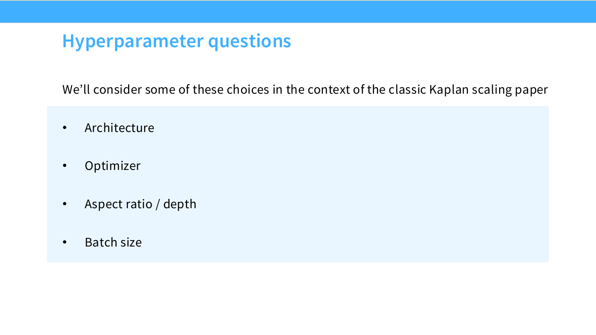

이 페이지는 Kaplan scaling paper에서 다룬 hyperparameter 관련 질문들을 나열합니다. 슬라이드의 항목은 다음과 같습니다.

1. **Architecture**  
   Transformer가 LSTM보다 나은가? 다른 architecture와 비교하면 어떤가?

2. **Optimizer**  
   Adam과 SGD 중 어떤 optimizer가 더 좋은 scaling behavior를 보이는가?

3. **Aspect ratio / Depth**  
   같은 parameter count라면 모델을 깊게 만들 것인가, 넓게 만들 것인가? Transformer layer 수, hidden dimension, attention head dimension 등의 shape가 성능에 어떤 영향을 주는가?

4. **Batch size**  
   batch size를 얼마나 크게 잡아야 하는가? 어느 지점부터 large batch의 효율이 떨어지는가?

이 페이지에서 중요한 것은 이 hyperparameter들이 모두 scale-dependent할 수 있다는 점입니다. 작은 모델에서 좋은 optimizer나 learning rate가 큰 모델에서 그대로 좋지 않을 수 있고, 작은 parameter count에서 좋은 depth/width ratio가 큰 모델에서 바뀔 수 있습니다.

하지만 scaling law는 이 문제를 체계적으로 다루게 해줍니다. 작은 scale에서 후보별 curve를 fitting하면, 큰 scale에서 직접 실험하지 않고도 더 좋은 선택지를 예측할 수 있습니다.

---

## Page 30. Architecture - Transformer는 LSTM보다 좋은가?

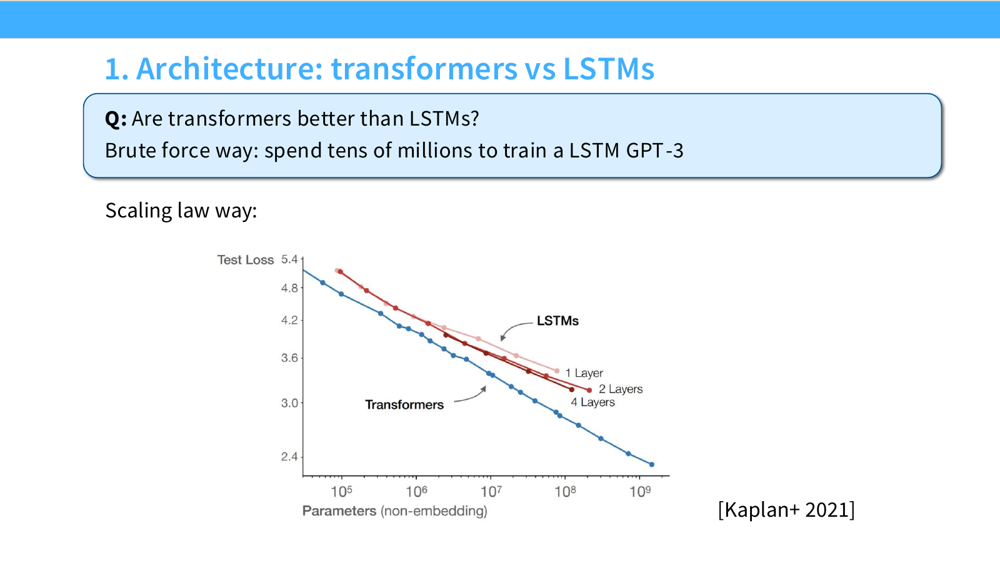

이 페이지의 질문은 단순합니다.

> Is Transformer better than LSTM?

가장 단순하지만 비싼 방법은 LSTM으로 GPT-3급 모델을 직접 학습해 보는 것입니다. 슬라이드에서는 이를 다음처럼 표현합니다.

> Stupid answer: train GPT-3 using LSTMs.

하지만 이 방법은 너무 비싸고 비효율적입니다. Scaling law 방식은 작은 scale에서 Transformer와 LSTM을 비교한 뒤, 큰 scale에서의 성능을 extrapolate합니다.

오른쪽 그래프는 total loss를 non-embedding parameter 수에 대해 보여줍니다. 여러 architecture 곡선이 비교되며, Transformer와 LSTM 계열 모델의 scaling behavior 차이를 확인할 수 있습니다.

해석은 다음과 같습니다.

- 같은 parameter count에서 Transformer가 더 낮은 loss를 보이는 경향이 있습니다.
- Transformer의 scaling curve가 더 유리하면, 모델을 크게 키울수록 차이가 유지되거나 더 커질 수 있습니다.
- 따라서 큰 scale에서 직접 LSTM을 학습하지 않아도, 작은 scale scaling curve만으로 Transformer 선택이 합리적임을 뒷받침할 수 있습니다.

이 페이지의 핵심은 architecture selection도 scaling law로 다룰 수 있다는 점입니다. 즉 architecture 선택은 단순히 현재 작은 모델 성능만 비교하는 것이 아니라, **scale이 커졌을 때 loss curve가 어떻게 extrapolate되는가**를 봐야 합니다.

---

## Page 31. Cross-architecture scaling

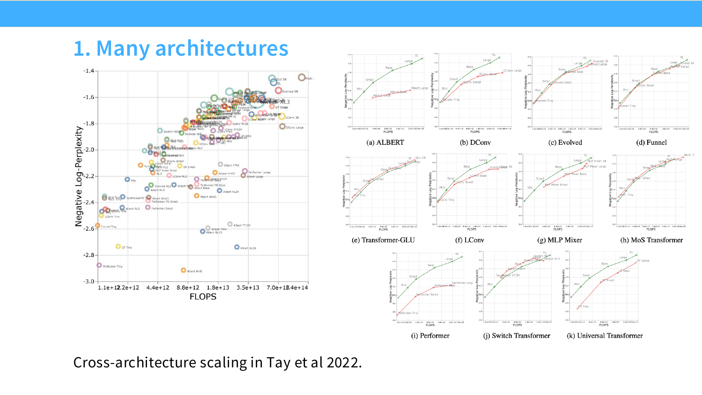

이 페이지는 Tay et al.(2022)의 cross-architecture scaling 결과를 보여줍니다. 여러 neural architecture를 같은 기준에서 비교하고, FLOPs나 parameter scale이 증가할 때 perplexity가 어떻게 변하는지 분석합니다.

슬라이드에는 여러 모델 계열이 등장합니다. 예를 들어 다음과 같은 architecture들이 비교 대상이 됩니다.

- Transformer 계열
- ALBERT
- FNet
- Performer
- Transformer-GLU 등

그래프의 핵심은 architecture마다 scaling curve가 다르다는 점입니다. 어떤 architecture는 작은 scale에서는 좋아 보이지만 큰 scale에서 덜 좋아질 수 있고, 반대로 작은 scale 차이는 작지만 큰 scale에서 더 유리한 architecture가 있을 수 있습니다.

이 페이지의 실무적 의미는 다음입니다.

1. Architecture 비교는 단일 scale에서의 성능만 보면 부족합니다.  
   작은 모델에서의 순위가 큰 모델에서의 순위와 항상 같지 않을 수 있습니다.

2. FLOPs-per-performance 관점이 중요합니다.  
   어떤 architecture가 같은 compute에서 더 낮은 perplexity를 얻는지가 핵심입니다.

3. Scaling curve가 architecture choice의 근거가 될 수 있습니다.  
   작은 scale에서 여러 architecture를 학습하고 curve를 fitting하면, 큰 scale에서 어떤 구조가 유리할지 예측할 수 있습니다.

다만 cross-architecture scaling은 비교 조건에 민감합니다. tokenizer, optimizer, training recipe, data mixture, evaluation metric이 달라지면 결과도 바뀔 수 있습니다.

---

## Page 32. Optimizer choice - Adam vs SGD

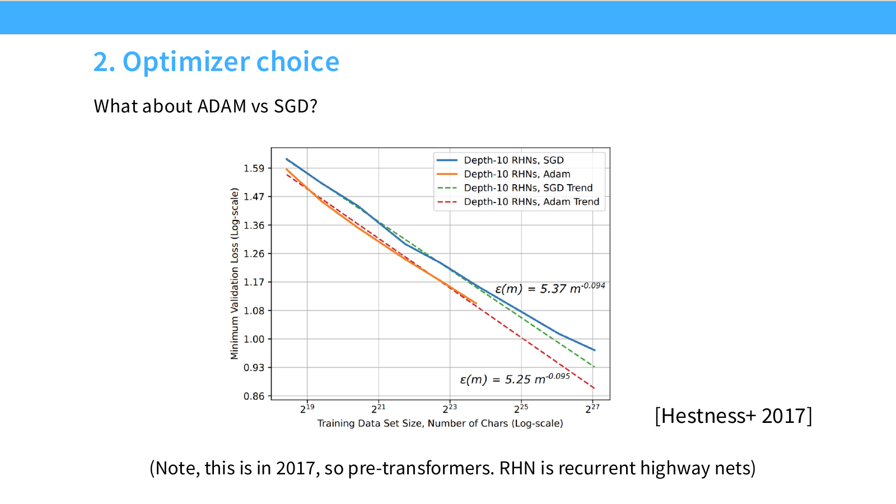

이 페이지는 optimizer 선택도 scaling law 관점에서 볼 수 있음을 보여줍니다. 슬라이드의 질문은 다음입니다.

> Adam을 쓸 것인가, SGD를 쓸 것인가?

오른쪽 그래프는 Hestness et al.(2017)의 결과로, Adam과 SGD의 validation loss learning curve를 비교합니다. 이 연구는 pre-Transformer 시대의 recurrent highway network 기반 결과이므로 오늘날 Transformer LLM에 그대로 적용하기는 어렵지만, scaling law 관점에서 중요한 메시지를 제공합니다.

핵심은 다음입니다.

- Optimizer는 단순히 수렴 속도만 바꾸는 것이 아니라, 같은 data scale에서 도달하는 loss curve 자체를 바꿀 수 있습니다.
- 작은 scale에서 optimizer별 learning curve를 비교하면, 큰 scale에서 어떤 optimizer가 더 유리할지 예측할 수 있습니다.
- 최종 loss뿐 아니라 scaling exponent와 offset도 optimizer에 따라 달라질 수 있습니다.

LLM 실무 관점에서는 AdamW 계열이 표준적으로 쓰이지만, 이 페이지의 더 큰 메시지는 optimizer choice도 empirical scaling으로 검증할 수 있다는 점입니다. 즉 “큰 모델에서 직접 다 해보기”가 아니라 “작은 모델 실험으로 optimizer 후보를 선별하기”가 가능합니다.

---

## Page 33. Depth/Width - layer 수는 어떻게 정할까?

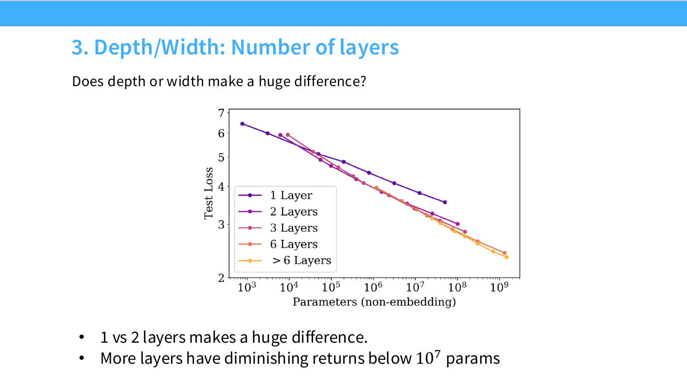

이 페이지는 모델의 depth와 width, 특히 layer 수가 성능에 어떤 영향을 주는지 보여줍니다. 슬라이드의 질문은 다음입니다.

> 더 깊은 모델이 항상 좋은가? 같은 parameter 수라면 depth와 width를 어떻게 나눠야 하는가?

그래프는 total loss를 non-embedding parameter 수에 대해 보여주며, 1 layer, 2 layers, 4 layers, 6 layers, 8 layers, 12 layers, 24 layers 등 서로 다른 depth의 모델이 비교됩니다.

슬라이드 하단의 관찰은 세 가지입니다.

1. **1 layer와 2 layers의 차이가 매우 크다.**  
   아주 얕은 모델은 표현력이 부족하므로 loss가 높습니다. 최소한의 depth를 확보하는 것이 중요합니다.

2. **충분히 작은 모델에서는 layer 수를 늘리는 효과가 그리 크지 않다.**  
   parameter count가 작을 때 layer를 많이 늘리면 width가 줄거나 각 layer의 capacity가 제한될 수 있습니다. 이 경우 depth 증가가 항상 이득이 되지 않습니다.

3. **Best choice of depth looks likely to grow slowly with scale.**  
   모델 scale이 커질수록 최적 depth도 점진적으로 커질 가능성이 있습니다. 즉 작은 모델에서 최적 layer 수와 큰 모델에서 최적 layer 수는 다를 수 있습니다.

이 페이지의 핵심은 depth/width ratio도 scaling law로 다룰 수 있다는 점입니다. 같은 parameter count라도 모델 shape가 다르면 성능이 달라지며, 이 차이는 scale에 따라 변화할 수 있습니다.

---

## Page 34. Transformer hyperparameter와 aspect ratio

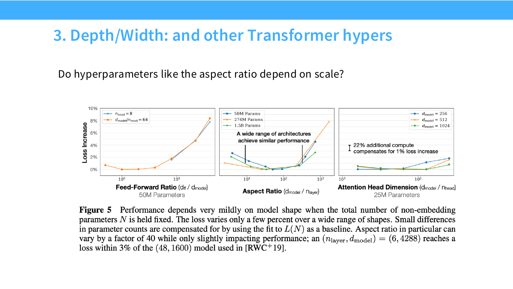

이 페이지는 Transformer 내부 hyperparameter가 scale에 따라 얼마나 민감한지 보여줍니다. 질문은 다음입니다.

> Do hyperparameters like the aspect ratio depend on scale?

슬라이드에는 세 개의 그래프가 있습니다.

첫 번째 그래프는 **Feed-Forward Ratio**입니다. x축은 $d_{ff}/d_{model}$, y축은 loss increase입니다. Feed-forward hidden dimension이 모델 dimension에 비해 너무 작거나 너무 크면 loss가 증가할 수 있습니다. 하지만 일정 범위 안에서는 loss 변화가 크지 않습니다.

두 번째 그래프는 **Aspect Ratio**입니다. x축은 $d_{model}/n_{layer}$입니다. 즉 모델을 넓게 만들 것인지, 깊게 만들 것인지의 비율입니다. 그래프 안에는 다음 문장이 있습니다.

> A wide range of architectures achieve similar performance.

즉 전체 non-embedding parameter 수가 고정되어 있다면, 꽤 넓은 범위의 depth/width 조합이 비슷한 성능을 낼 수 있습니다. 슬라이드 하단 caption은 aspect ratio가 40배 정도 달라도 성능 영향이 제한적일 수 있다고 설명합니다.

세 번째 그래프는 **Attention Head Dimension**입니다. x축은 $d_{model}/n_{head}$입니다. 그래프에는 다음 문장이 표시되어 있습니다.

> 22% additional compute compensates for 1% loss increase.

이는 작은 loss 차이를 compute 증가로 보상할 수 있다는 뜻입니다. 즉 hyperparameter shape의 작은 비효율은 scale-up으로 어느 정도 상쇄될 수 있지만, 그만큼 compute cost가 듭니다.

이 페이지의 핵심은 다음입니다.

- Transformer shape hyperparameter는 중요하지만, 모든 값이 극도로 민감한 것은 아닙니다.
- 넓은 범위의 architecture가 유사한 성능을 낼 수 있습니다.
- 다만 너무 비효율적인 shape는 loss 증가를 만들고, 이를 보상하려면 추가 compute가 필요합니다.
- 따라서 작은 scale 실험으로 안전한 hyperparameter 범위를 찾는 것이 실용적입니다.

---

## Page 35. 모든 parameter가 같은 가치를 갖는 것은 아니다

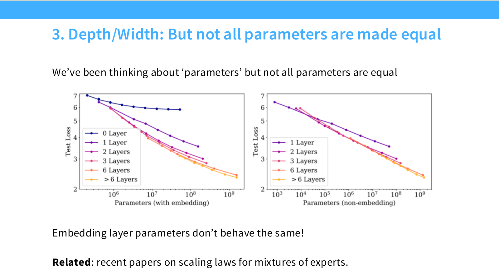

이 페이지는 parameter count를 하나의 숫자로만 보는 접근의 한계를 설명합니다. 슬라이드의 핵심 문장은 다음입니다.

> We’ve been thinking about ‘parameters’ but not all parameters are equal.

왼쪽 그래프는 parameter count에 embedding parameter를 포함한 경우입니다. 0 layer 모델도 parameter count가 존재하는데, 이는 주로 embedding layer 때문입니다. 하지만 0 layer 모델은 transformer block이 없으므로 실제 sequence modeling 능력이 매우 제한적입니다.

오른쪽 그래프는 non-embedding parameter 기준으로 다시 그린 결과입니다. 이때 layer 수에 따른 scaling curve가 더 깔끔하게 비교됩니다.

슬라이드 하단의 문장은 중요합니다.

> Embedding layer parameters don’t behave the same!

Embedding parameter는 vocabulary embedding과 output projection처럼 token representation에 관련된 parameter입니다. Transformer block 내부의 attention/MLP parameter와는 성능에 기여하는 방식이 다를 수 있습니다. 따라서 parameter scaling law를 만들 때 total parameter count만 쓰면 왜곡이 생길 수 있습니다.

이 문제는 최근 MoE scaling law와도 연결됩니다. MoE에서는 total parameters와 active parameters가 다릅니다. 예를 들어 총 parameter는 매우 크지만, 한 token이 실제로 사용하는 expert parameter는 일부뿐입니다. 따라서 “parameter 수가 크다”는 말만으로 compute나 성능을 설명하기 어렵습니다.

이 페이지의 결론은 다음입니다.

> Parameter count를 쓸 때는 어떤 parameter를 세는지 명확해야 한다. Embedding, non-embedding, active parameter, total parameter는 서로 다른 의미를 가진다.

---

## Page 36. Side note - MoE에서 parameter scaling은 달라진다

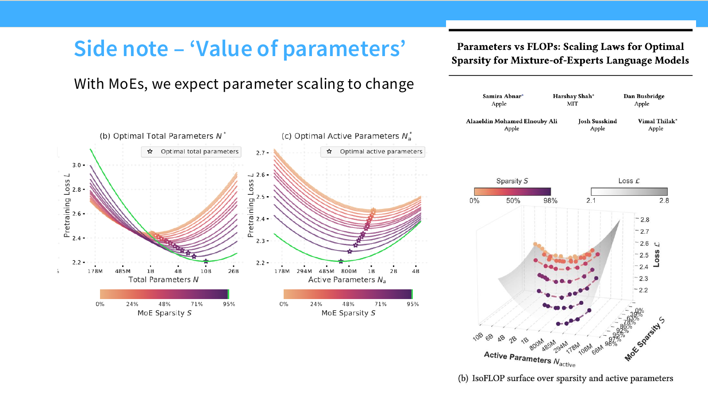

이 페이지는 Mixture-of-Experts(MoE) 모델에서는 parameter scaling을 dense model과 다르게 봐야 한다는 점을 설명합니다. 슬라이드의 문장은 다음입니다.

> With MoEs, we expect parameter scaling to change.

MoE에서는 전체 parameter 중 일부 expert만 token별로 활성화됩니다. 따라서 두 가지 parameter 개념을 구분해야 합니다.

- **Total parameters $N$**: 모델 안에 존재하는 전체 parameter 수
- **Active parameters $N_a$**: 한 token을 처리할 때 실제로 사용되는 parameter 수

왼쪽의 두 그래프는 optimal total parameters와 optimal active parameters를 나누어 보여줍니다. x축에는 total parameters 또는 active parameters가 있고, y축에는 pretraining loss가 있습니다. 색은 MoE sparsity $S$를 나타냅니다.

- **Optimal total parameters $N^*$**: 전체 expert 수를 늘리면 total parameter는 커질 수 있지만, 이것이 항상 동일한 compute 증가를 의미하지는 않습니다.
- **Optimal active parameters $N_a^*$**: 실제 compute에 더 직접적으로 연결되는 값입니다. token당 활성화되는 expert 수와 관련됩니다.

오른쪽 3D 그래프는 active parameters, MoE sparsity, loss의 관계를 보여줍니다. 같은 active parameter 수에서도 sparsity 설정에 따라 loss가 달라지고, 같은 FLOPs에서도 total parameter와 active parameter의 조합이 달라질 수 있습니다.

이 페이지의 핵심은 다음입니다.

> Dense model의 scaling law를 MoE에 그대로 적용하면 안 된다. MoE에서는 total parameter, active parameter, sparsity, routing이 함께 scaling behavior를 결정한다.

실무적으로 MoE 모델을 평가할 때는 “35B 모델” 같은 total parameter 숫자만 보면 안 됩니다. 실제 inference cost와 학습 compute를 이해하려면 active parameter 수, top-k routing, expert sparsity까지 함께 봐야 합니다.

---

## Page 37. Batch size - Critical batch size

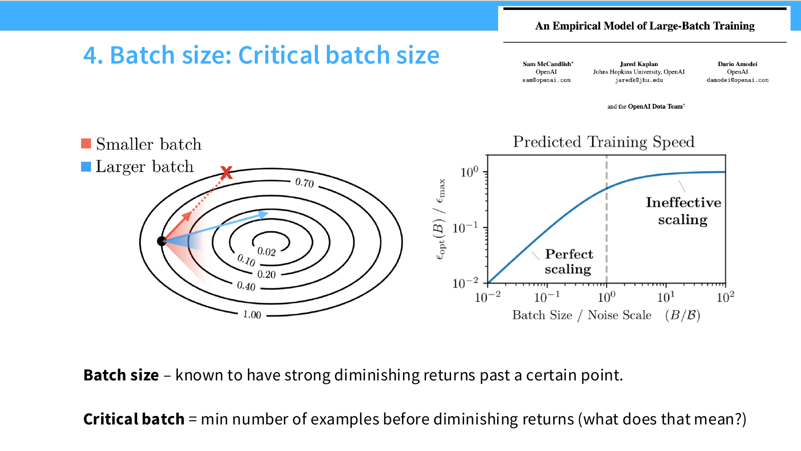

이 페이지는 batch size scaling을 다룹니다. 슬라이드의 핵심 문장은 다음입니다.

> Batch size is known to have strong diminishing returns past a certain point.

Batch size를 늘리면 일반적으로 한 step에서 더 많은 example을 사용하므로 gradient estimate가 안정해집니다. 또한 병렬 GPU를 효율적으로 쓰기 위해 large batch가 필요할 수 있습니다. 하지만 batch size를 계속 키운다고 학습이 계속 빨라지는 것은 아닙니다.

왼쪽 그림은 loss landscape에서 작은 batch와 큰 batch의 차이를 직관적으로 보여줍니다.

- 작은 batch는 gradient noise가 커서 업데이트 방향이 흔들리지만, 더 많은 step을 밟을 수 있습니다.
- 큰 batch는 gradient estimate가 안정적이지만, 어느 정도 이상 커지면 추가 example을 넣어도 방향 개선이 크지 않습니다.

오른쪽 그래프는 McCandlish et al.의 large-batch training empirical model입니다. x축은 batch size를 noise scale로 나눈 값 $B/\mathcal{B}$이고, y축은 predicted training speed입니다.

그래프는 두 구간을 보여줍니다.

1. **Perfect scaling**  
   batch size가 noise scale보다 작은 구간에서는 batch size를 키우면 training speed가 거의 비례해서 좋아집니다.

2. **Ineffective scaling**  
   batch size가 noise scale을 넘어가면 training speed 개선이 포화됩니다. 이때 더 큰 batch는 compute를 더 쓰지만 성능 개선 효율은 낮습니다.

슬라이드 하단은 critical batch를 다음처럼 설명합니다.

> Critical batch = min number of examples before diminishing returns.

즉 critical batch size는 large-batch training의 효율이 꺾이기 시작하는 지점입니다. 이보다 작은 batch에서는 batch size 증가가 효율적이고, 이보다 큰 batch에서는 diminishing return이 강해집니다.

---
## Page 38. Critical batch size의 정의

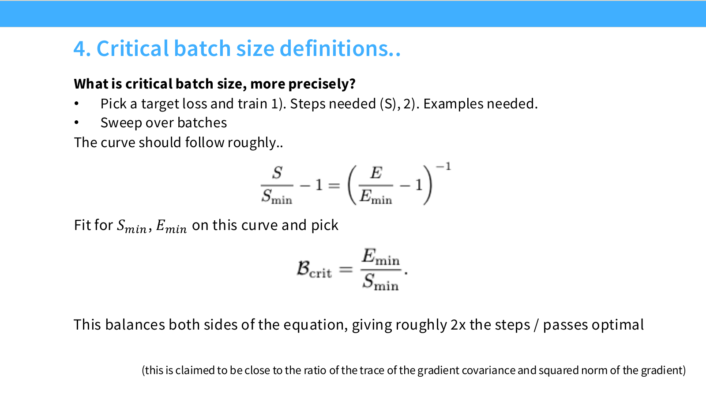

이 페이지는 critical batch size를 더 수학적으로 정의합니다. 슬라이드의 질문은 다음입니다.

> What is the “critical batch size”?

절차는 다음과 같습니다.

1. target loss를 하나 정합니다.
2. 여러 batch size로 학습합니다.
3. 각 batch size에서 target loss에 도달하는 데 필요한 step 수 $S$를 측정합니다.
4. target loss에 도달하는 데 필요한 총 example 수 $E$를 측정합니다.

여기서 $S$와 $E$는 trade-off 관계입니다.

- 작은 batch: step 수는 많지만, step당 example 수가 적어 총 example 수는 효율적일 수 있습니다.
- 큰 batch: step 수는 줄지만, step당 너무 많은 example을 쓰면 총 example 수가 증가할 수 있습니다.

슬라이드의 fitting 식은 다음입니다.

```math
\frac{S}{S_{\min}} - 1
=
\left(\frac{E}{E_{\min}} - 1\right)^{-1}
```

여기서:

- $S$: target loss에 도달하는 데 필요한 training steps
- $E$: target loss에 도달하는 데 필요한 training examples
- $S_{\min}$: batch size가 매우 클 때 도달 가능한 최소 step 수
- $E_{\min}$: batch size가 매우 작을 때 도달 가능한 최소 example 수

critical batch size는 다음처럼 정의됩니다.

```math
B_{\mathrm{crit}} = \frac{E_{\min}}{S_{\min}}
```

이 값은 “step 수를 줄이는 이득”과 “더 많은 example을 쓰는 비용”이 균형을 이루는 batch size로 볼 수 있습니다.

---

## Page 39. Loss target이 낮아질수록 critical batch size는 커진다

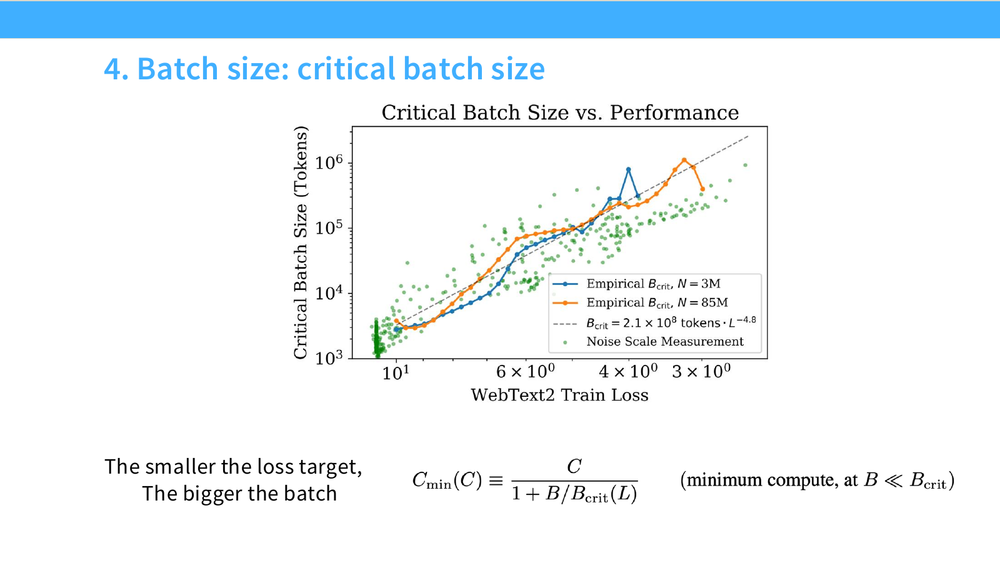

이 페이지는 critical batch size가 고정된 상수가 아니라, 학습 진행과 target loss에 따라 달라진다는 점을 보여줍니다.

슬라이드의 그래프는 여러 target loss에 대해 batch size와 training efficiency의 관계를 보여줍니다. 핵심 관찰은 다음입니다.

> When target loss decreases, critical batch size increases.

즉 더 낮은 loss를 목표로 할수록 critical batch size가 커지는 경향이 있습니다.

직관은 다음과 같습니다.

- 학습 초반에는 gradient signal이 크고 loss landscape에서 내려갈 방향이 비교적 명확합니다. 이때는 작은 batch도 충분히 효과적입니다.
- 학습 후반에는 gradient signal이 약해지고 stochastic noise의 상대적 영향이 커질 수 있습니다. 이때는 더 큰 batch가 도움이 될 수 있습니다.
- 따라서 target loss가 낮아질수록 더 큰 batch size를 사용해도 diminishing return이 늦게 나타납니다.

슬라이드 하단에는 critical batch size와 loss 사이의 관계가 power-law처럼 증가하는 그래프가 있습니다. 이는 batch size도 scaling law적으로 선택할 수 있음을 의미합니다.

실무적으로는 다음 전략과 연결됩니다.

- 학습 초반에는 작은 batch로 시작한다.
- 학습이 진행되면서 batch size를 늘린다.
- 또는 전체 training compute와 target loss를 고려해 적절한 global batch size를 선택한다.

LLM pretraining에서는 GPU utilization 때문에 큰 batch가 필요하지만, 너무 큰 batch는 sample efficiency를 떨어뜨릴 수 있습니다. Critical batch size는 이 trade-off를 정량화하는 도구입니다.

---

## Page 40. Learning rate - muP와 scale-aware LR 선택

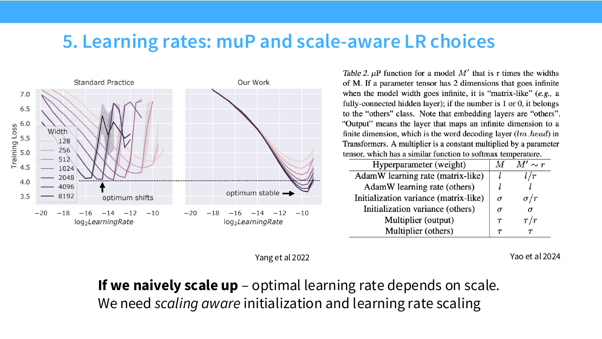

이 페이지는 모델 scale이 커질 때 learning rate를 어떻게 선택해야 하는지 다룹니다. 슬라이드 제목은 다음입니다.

> Learning rates: muP and scale-aware LR choices

왼쪽 그래프는 standard practice와 muP 기반 접근을 비교합니다.

- **Standard Practice**에서는 모델 width가 바뀌면 optimal learning rate 위치가 이동합니다. 즉 작은 모델에서 찾은 learning rate가 큰 모델에서는 최적이 아닐 수 있습니다.
- **Our Work** 쪽 그래프에서는 optimal learning rate가 scale이 바뀌어도 더 안정적으로 유지됩니다. 이것이 muP(maximal update parametrization)의 목표와 연결됩니다.

muP란??

> μP는 모델 width를 키워도 학습 dynamics가 비슷하게 유지되도록 initialization과 learning rate scaling을 정하는 parameterization 방법입니다. 작은 모델에서 찾은 hyperparameter를 큰 모델에 옮기는 μTransfer를 가능하게 하는 것이 핵심 목적입니다.

muP의 핵심 아이디어는 모델 width가 커질 때 activation, gradient, parameter update의 scale이 안정적으로 유지되도록 parameterization과 initialization, learning rate scaling을 조정하는 것입니다. 이를 통해 작은 width 모델에서 찾은 hyperparameter를 큰 width 모델로 transfer하기 쉬워집니다.

오른쪽 표는 Yao et al.(2024)의 $\mu$ P function 예시입니다. 모델 $M'$이 기준 모델 $M$보다 width가 $r$배 커질 때, parameter tensor가 matrix-like인지 others인지에 따라 scaling이 달라집니다.

표의 중요한 항목은 다음입니다.

- **AdamW learning rate (matrix-like)**: $l \rightarrow l/r$  
  width가 커질 때 matrix-like parameter의 learning rate를 줄입니다.

- **AdamW learning rate (others)**: $l \rightarrow l$  
  embedding 등 others class는 같은 learning rate를 유지합니다.

- **Initialization variance (matrix-like)**: $\sigma \rightarrow \sigma/r$  
  width 증가에 따라 initialization scale도 조정합니다.

- **Multiplier (output)**: $\tau \rightarrow \tau/r$  
  output layer처럼 infinite dimension에서 finite dimension으로 mapping하는 layer는 별도 scaling을 적용합니다.

슬라이드 하단의 결론은 다음입니다.

> If we naively scale up, optimal learning rate depends on scale. We need scaling-aware initialization and learning rate scaling.

즉 learning rate는 단순히 작은 모델에서 찾은 값을 그대로 복사하면 안 됩니다. Scale-aware parameterization을 사용해야 작은 모델 실험이 큰 모델 tuning에 의미 있게 연결됩니다.

---

## Page 41. Downstream scaling은 pretraining scaling보다 덜 예측 가능하다

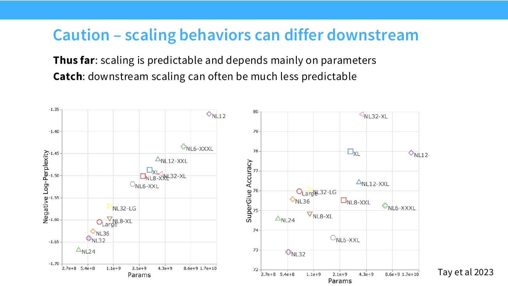

이 페이지는 scaling law를 사용할 때의 중요한 주의점을 말합니다. 슬라이드의 문장은 다음입니다.

> Thus far: scaling is predictable and depends mainly on parameters.  
> Catch: downstream scaling can often be much less predictable.

왼쪽 그래프는 parameter 수와 negative log-perplexity의 관계를 보여줍니다. 여기서는 모델이 커질수록 pretraining/perplexity 관련 metric이 비교적 예측 가능하게 좋아지는 경향을 보입니다.

오른쪽 그래프는 parameter 수와 SuperGLUE accuracy의 관계를 보여줍니다. 여기서는 훨씬 더 불규칙합니다. parameter 수가 커진다고 downstream accuracy가 항상 매끄럽게 증가하지 않습니다. 예를 들어 어떤 모델은 perplexity는 좋지만 downstream task에서는 기대만큼 높지 않을 수 있고, 반대로 특정 architecture나 training recipe가 downstream에서 더 좋은 결과를 만들 수 있습니다.

이 차이는 매우 중요합니다.

- **Pretraining loss**는 다음 token prediction objective와 직접 연결되어 있어 scaling law가 비교적 안정적으로 관찰됩니다.
- **Downstream performance**는 task format, prompting, instruction tuning, evaluation metric, data contamination, reasoning ability, calibration 등 다양한 요인의 영향을 받습니다.

따라서 scaling law를 사용할 때는 무엇을 예측하는지 명확히 해야 합니다.

> Pretraining loss scaling이 좋다고 해서 모든 downstream capability가 같은 방식으로 scaling한다고 가정하면 안 된다.

실무적으로는 pretraining loss를 최적화하는 scaling law와, 실제 제품/업무 task 성능을 예측하는 evaluation framework를 분리해서 봐야 합니다.

---

## Page 42. Surprising takeaways - hyperparameter 효과를 미리 예측할 수 있다

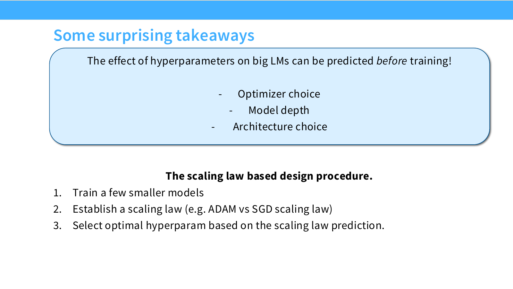

이 페이지는 model/hyperparameter scaling 파트의 중요한 결론을 요약합니다.

가장 중요한 문장은 다음입니다.

> The effect of hyperparameters on big LMs can be predicted before training!

예측할 수 있는 hyperparameter 예시는 다음과 같습니다.

- Optimizer choice
- Model depth
- Architecture choice

즉 큰 모델을 실제로 학습하기 전에, 작은 모델 실험과 scaling law fitting으로 큰 모델에서 어떤 선택이 유리할지 예측할 수 있습니다.

슬라이드 하단은 scaling law based design procedure를 세 단계로 정리합니다.

1. **Train a few smaller models**  
   여러 작은 모델을 학습합니다. 이때 후보 architecture, optimizer, depth, batch size 등을 바꿔가며 실험합니다.

2. **Establish a scaling law**  
   예를 들어 Adam vs SGD scaling law, Transformer vs LSTM scaling law처럼 후보별 성능 곡선을 fitting합니다.

3. **Select optimal hyperparameter based on prediction**  
   fitting된 scaling law를 큰 scale로 extrapolation하여 최적 hyperparameter를 선택합니다.

이 페이지의 핵심은 scaling law가 비용 절감 도구라는 점입니다. 큰 모델에서는 한 번의 학습 비용이 매우 크기 때문에, 가능한 많은 결정을 작은 모델 실험으로 미리 내려야 합니다.

다만 이 절차가 잘 작동하려면 작은 모델 실험이 큰 모델과 충분히 같은 regime에 있어야 합니다. 데이터, optimizer, learning rate schedule, architecture scaling 방식이 달라지면 extrapolation이 실패할 수 있습니다.

---

## Page 43. Data와 model size의 trade-off

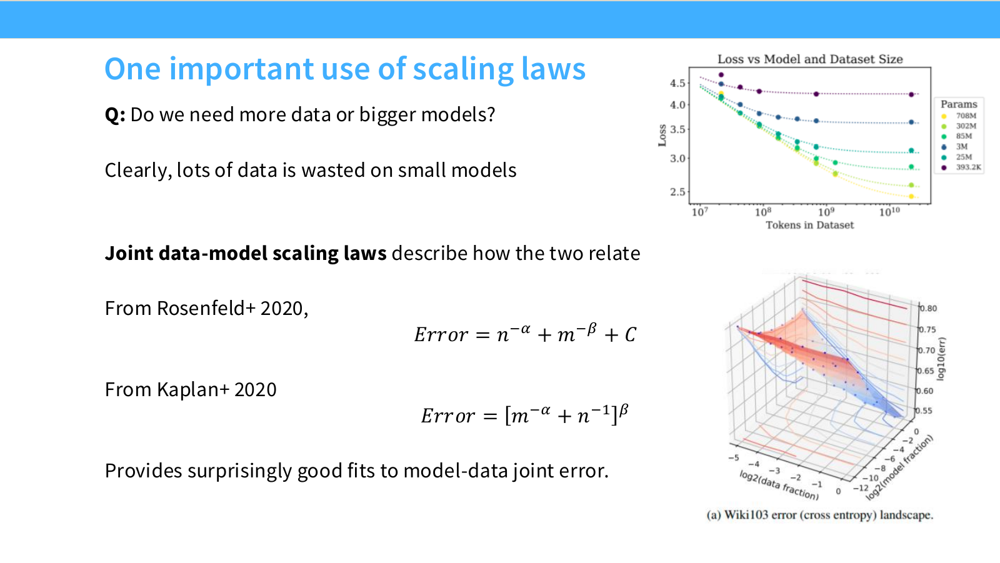

이 페이지는 scaling law의 가장 중요한 실무 질문 중 하나를 다룹니다.

> Do we need more data, or a bigger model?

LLM 학습에서 compute budget이 고정되어 있다면, 모델 크기와 학습 token 수는 trade-off 관계에 있습니다. 큰 모델을 선택하면 같은 compute로 학습할 수 있는 token 수가 줄고, 작은 모델을 선택하면 더 많은 token으로 오래 학습할 수 있습니다.

슬라이드는 두 가지 joint scaling law 형태를 소개합니다.

첫 번째는 Rosenfeld-style 식입니다.

```math
\mathrm{Error}(n,m) = n^{-\alpha} + m^{-\beta} + C
```

여기서:

- $n$: data size
- $m$: model size
- $n^{-\alpha}$: 데이터가 부족해서 생기는 error
- $m^{-\beta}$: 모델 capacity가 부족해서 생기는 error
- $C$: irreducible error 또는 offset

이 식의 직관은 명확합니다. 데이터가 많아지면 첫 번째 항이 줄고, 모델이 커지면 두 번째 항이 줄어듭니다. 하지만 둘 중 하나만 키운다고 최적이 되지는 않습니다.

두 번째는 Kaplan-style 식입니다.

```math
\mathrm{Error}(m,n) = \left[m^{-\alpha} + n^{-1}\right]^\beta
```

형태는 다르지만 핵심은 같습니다. error는 model size와 data size의 joint function이며, 둘 사이에 compute-constrained trade-off가 존재합니다.

슬라이드의 실무적 메시지는 다음입니다.

- 작은 모델에 너무 많은 데이터를 넣으면 model capacity가 병목이 될 수 있습니다.
- 큰 모델에 너무 적은 데이터를 넣으면 data가 병목이 되어 undertraining됩니다.
- 따라서 compute budget 안에서 model size와 data size를 함께 최적화해야 합니다.

이 질문은 이후 Kaplan vs Chinchilla 논쟁의 핵심이 됩니다.

---

## Page 44. Model-data joint scaling은 꽤 정확할 수 있다

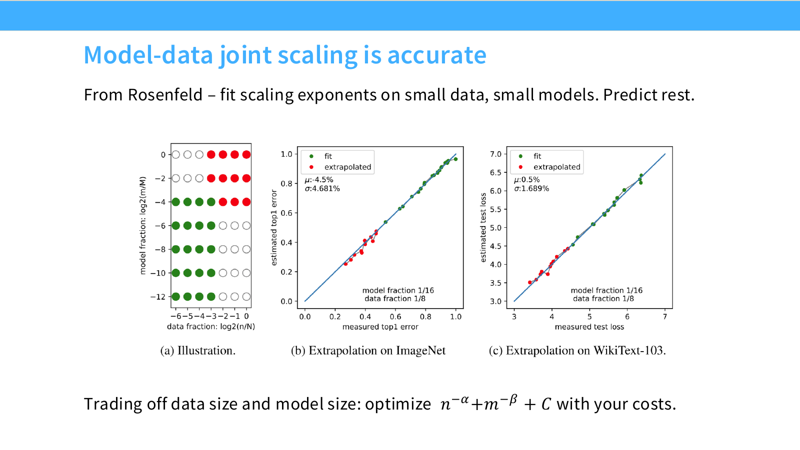

이 페이지는 Rosenfeld의 joint scaling law가 실제 extrapolation에 꽤 잘 맞을 수 있음을 보여줍니다. 슬라이드의 문장은 다음입니다.

> Fit scaling exponents on small data, small models. Predict rest.

왼쪽 그림은 어떤 model fraction과 data fraction 조합을 fitting에 쓰고, 어떤 조합을 extrapolation에 쓰는지를 보여줍니다. 초록색 점은 fit에 사용한 small-scale data이고, 빨간색 점은 extrapolation 대상입니다.

가운데 그래프는 ImageNet에서 measured top-1 error와 estimated top-1 error를 비교합니다. 점들이 대각선에 가까울수록 예측이 정확하다는 뜻입니다. 초록색은 fit에 사용한 영역, 빨간색은 extrapolated 영역입니다. 빨간색 점들도 대체로 대각선 근처에 있으므로, 작은 scale에서 fitting한 law가 더 큰 scale을 어느 정도 예측합니다.

오른쪽 그래프는 WikiText-103에서 measured test loss와 estimated test loss를 비교합니다. 여기서도 예측값과 실제값이 비교적 잘 맞습니다.

슬라이드 하단의 문장은 다음입니다.

> Trading off data size and model size: optimize $n^{-\alpha}+m^{-\beta}+C$ with your costs.

즉 joint scaling law를 사용하면 다음과 같은 최적화 문제를 풀 수 있습니다.

```math
\min_{n,m}\; n^{-\alpha}+m^{-\beta}+C
```

단, 실제로는 비용 제약이 있습니다.

```math
\mathrm{Cost}(n,m) \leq \mathcal{C}_{\mathrm{budget}}
```

비용은 training FLOPs뿐 아니라 데이터 수집/정제 비용, hyperparameter tuning 비용, inference 비용까지 포함할 수 있습니다. 이 페이지는 model-data trade-off를 감이 아니라 정량적인 optimization 문제로 볼 수 있게 해줍니다.

---

## Page 45. Optimal compute와 data trade-off - Chinchilla로 가는 길

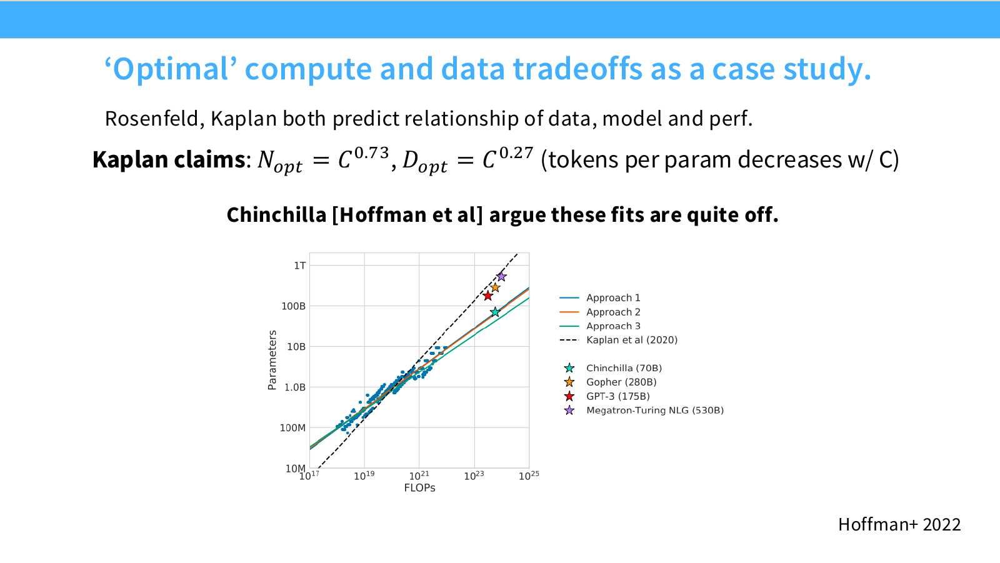

이 페이지는 Kaplan scaling law와 Chinchilla scaling law의 차이로 넘어가는 연결부입니다. 슬라이드 제목은 다음입니다.

> Optimal compute and data trade-off — Chinchilla.

Kaplan et al.은 compute budget $C$가 증가할 때 compute-optimal model size와 data size가 다음처럼 증가한다고 주장했습니다.

```math
N_{\mathrm{opt}} \propto C^{0.73}
```

```math
D_{\mathrm{opt}} \propto C^{0.27}
```

여기서:

- $N_{\mathrm{opt}}$: optimal number of parameters
- $D_{\mathrm{opt}}$: optimal number of training tokens
- $C$: training compute budget

이 식의 중요한 의미는 compute가 증가할수록 parameter count를 훨씬 빠르게 늘리고, data size는 상대적으로 천천히 늘린다는 것입니다. tokens per parameter는 다음처럼 됩니다.

```math
\frac{D_{\mathrm{opt}}}{N_{\mathrm{opt}}}
\propto C^{0.27-0.73}
= C^{-0.46}
```

즉 Kaplan 결론에서는 compute가 커질수록 parameter당 token 수가 감소합니다. 더 큰 모델을 더 적은 token per parameter로 학습하는 방향입니다.

하지만 Chinchilla는 이 결론이 잘못되었거나 적어도 compute-optimal하지 않다고 주장했습니다. Chinchilla의 핵심 메시지는 다음입니다.

> 기존 대형 모델들은 너무 큰 모델을 너무 적은 token으로 학습했다. 같은 compute라면 모델을 작게 하고 더 많은 token으로 학습하는 편이 더 좋다.

이 페이지는 이후 세 가지 Chinchilla fitting method로 이어집니다.

---

## Page 46. Chinchilla의 세 가지 scaling law fitting 방법

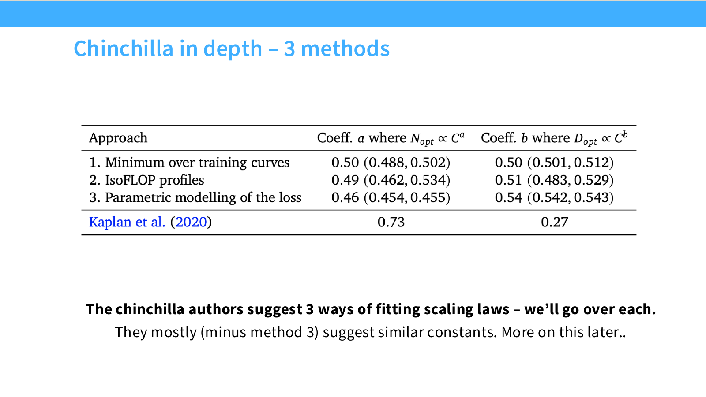

이 페이지는 Chinchilla 논문이 compute-optimal scaling law를 도출하기 위해 사용한 세 가지 방법을 정리합니다.

표에는 다음 세 방법이 나옵니다.

1. **Approach 1: Fix Model Sizes and Vary Number of Training Tokens**  
   모델 크기를 고정하고 training token 수를 바꿔 여러 training curve를 얻습니다. 그다음 각 compute budget에서 가장 낮은 loss를 주는 지점을 찾습니다.

2. **Approach 2: IsoFLOP Profiles**  
   FLOP budget을 고정하고, 그 안에서 model size를 바꿔가며 loss를 측정합니다. 각 compute budget마다 loss가 최소가 되는 model size를 찾습니다.

3. **Approach 3: Fit a Parametric Loss Function**  
   model size $N$과 data size $D$를 모두 입력으로 하는 parametric loss function을 fitting합니다. 보통 다음과 같은 joint loss를 사용합니다.

```math
L(N,D) = E + \frac{A}{N^\alpha} + \frac{B}{D^\beta}
```

여기서:

- $N$: parameter count
- $D$: training token count
- $E$: irreducible loss
- $A/N^\alpha$: 모델 크기 부족으로 인한 loss
- $B/D^\beta$: 데이터 부족으로 인한 loss

표는 Kaplan과 Chinchilla의 결과를 비교합니다. Kaplan은 대략 $N_{opt}\propto C^{0.73}$, $D_{opt}\propto C^{0.27}$에 가까웠지만, Chinchilla의 Approach 1과 2는 대체로 둘을 비슷하게 늘리는 결론에 가깝습니다.

즉 Chinchilla 관점에서는 compute가 증가할 때 다음과 같은 관계가 더 적절합니다.

```math
N_{\mathrm{opt}} \propto C^{0.5}, \quad D_{\mathrm{opt}} \propto C^{0.5}
```

정확한 exponent는 method마다 조금 다르지만, 핵심은 모델 크기와 데이터 크기를 훨씬 더 균형 있게 늘려야 한다는 점입니다.

---

## Page 47. Method 1 - Minimum over runs

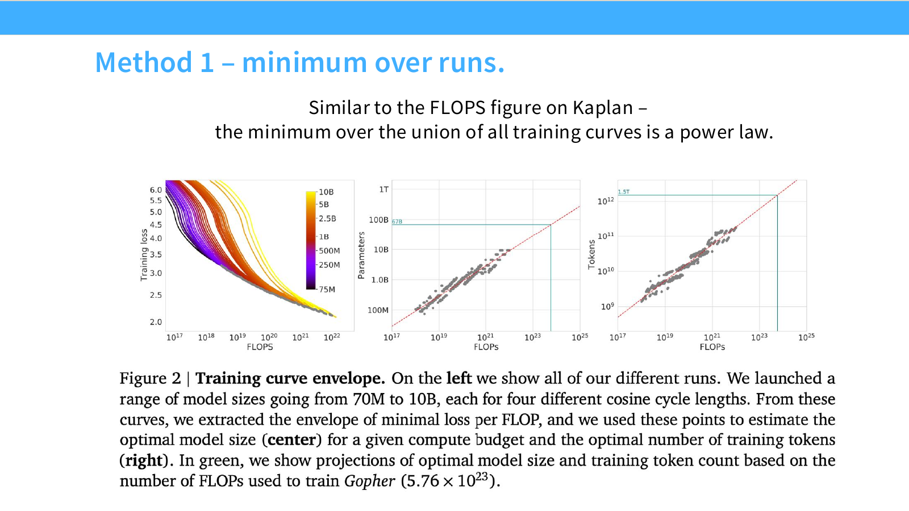

이 페이지는 Chinchilla의 첫 번째 방법인 **minimum over runs**를 설명합니다. 슬라이드의 문장은 다음입니다.

> Similar to the FLOPS figure on Kaplan — the minimum over the union of all training curves is a power law.

왼쪽 그래프는 여러 model size에 대해 training loss와 FLOPs의 관계를 보여줍니다. 모델 크기는 70M부터 10B까지 다양하고, 각 모델은 여러 cosine cycle length로 학습됩니다. 각 curve는 특정 model size와 training schedule에서 FLOPs가 증가할 때 loss가 어떻게 변하는지 나타냅니다.

이 방법의 핵심은 모든 training curve를 모은 뒤, 각 FLOP budget에서 가장 낮은 loss를 달성한 점만 선택하는 것입니다. 이렇게 선택된 점들이 **training curve envelope**입니다.

가운데 그래프는 envelope에서 선택된 점들을 바탕으로 compute budget별 optimal parameter count를 추정합니다. 예를 들어 Gopher 학습에 사용된 FLOPs 근처에서 optimal parameter count가 어느 정도인지 projection합니다.

오른쪽 그래프는 같은 방식으로 compute budget별 optimal token count를 추정합니다. 즉 각 FLOP budget에서 loss를 최소화하는 training token 수를 찾습니다.

이 방식의 장점은 직관적입니다.

- 실제 여러 training run에서 가장 잘 나온 점을 직접 사용합니다.
- 복잡한 parametric loss function에 덜 의존합니다.
- compute budget별 optimal model size와 token count를 시각적으로 확인할 수 있습니다.

하지만 단점도 있습니다. 충분히 다양한 model size와 training length를 실험해야 envelope가 안정적으로 추정됩니다. 실험 grid가 부족하면 진짜 optimum을 놓칠 수 있습니다.

---

## Page 48. Method 2 - IsoFLOPs

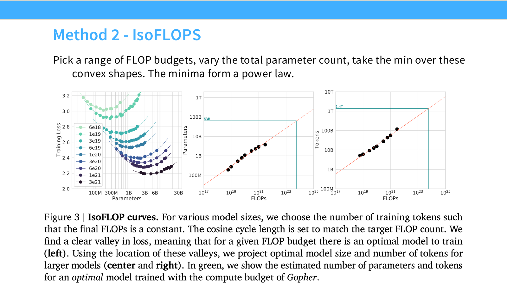

이 페이지는 Chinchilla의 두 번째 방법인 **IsoFLOPs**를 설명합니다. IsoFLOPs는 이름 그대로 동일한 FLOP budget 안에서 model size를 바꿔가며 loss를 비교하는 방식입니다.

슬라이드의 왼쪽 그래프는 fixed compute budget별로 loss와 model size의 관계를 보여줍니다. 각 색깔의 curve는 서로 다른 FLOP budget입니다. curve는 보통 U-shape 또는 convex한 형태를 보입니다.

이 U-shape의 의미는 다음입니다.

- 모델이 너무 작으면 capacity가 부족해서 loss가 높습니다.
- 모델이 너무 크면 주어진 compute에서 충분히 많은 token을 학습하지 못해 undertraining되고 loss가 높습니다.
- 중간에 해당 compute budget에서 loss가 가장 낮은 optimal model size가 존재합니다.

각 curve의 최저점을 모으면, compute budget에 따른 optimal parameter count를 얻을 수 있습니다. 오른쪽 그래프는 이러한 optimal point들이 power-law 관계를 따른다는 것을 보여줍니다.

IsoFLOPs 방법은 resource allocation 관점에서 매우 직관적입니다.

```math
N^*(C) = \arg\min_N L(N, D(C,N))
```

여기서 $C$는 고정된 FLOPs이고, $D(C,N)$은 그 compute 안에서 model size $N$을 학습할 수 있는 token 수입니다.

이 방법의 실무적 장점은 다음입니다.

- 주어진 compute budget에서 optimal model size를 직접 찾을 수 있습니다.
- model size가 너무 큰지, 너무 작은지를 시각적으로 확인할 수 있습니다.
- Chinchilla-style compute-optimal scaling을 설명하기 쉽습니다.

---

## Page 49. Method 3 - Joint fits

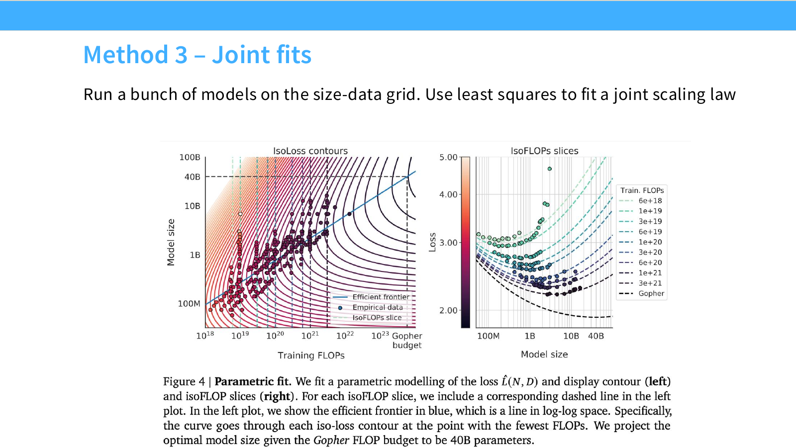

이 페이지는 Chinchilla의 세 번째 방법인 **joint fits**를 설명합니다. Method 1과 2가 envelope나 IsoFLOP curve의 최저점을 사용하는 방식이라면, Method 3은 전체 loss surface를 하나의 parametric function으로 fitting합니다.

슬라이드에는 여러 model size와 token count 조합에서 얻은 loss 값들이 있고, 이를 하나의 surface로 맞춥니다. 대표적인 형태는 다음과 같습니다.

```math
L(N,D) = E + \frac{A}{N^\alpha} + \frac{B}{D^\beta}
```

이 식은 model-limited loss와 data-limited loss를 더한 형태입니다.

- $E$: irreducible loss
- $A/N^\alpha$: 모델이 작아서 생기는 loss
- $B/D^\beta$: 데이터가 부족해서 생기는 loss

이 방식의 장점은 전체 데이터 grid를 한 번에 활용한다는 점입니다. 잘 fitting되면 임의의 $(N,D)$ 조합에 대한 loss를 예측할 수 있고, compute constraint 아래에서 analytically 또는 numerically optimal point를 찾을 수 있습니다.

하지만 단점도 큽니다.

- parametric form이 잘못되면 extrapolation이 크게 틀릴 수 있습니다.
- fitting data의 범위와 품질에 민감합니다.
- 작은 systematic error가 compute-optimal exponent에 큰 영향을 줄 수 있습니다.
- total parameter를 쓸지 non-embedding parameter를 쓸지 같은 선택에도 결과가 달라질 수 있습니다.

이후 페이지에서 설명하듯, Chinchilla의 Method 3에는 나중에 오류 가능성이 제기되었습니다. 따라서 joint fit은 강력하지만 조심해서 사용해야 하는 방법입니다.

---

## Page 50. Kaplan과 Chinchilla는 왜 이렇게 달랐는가?

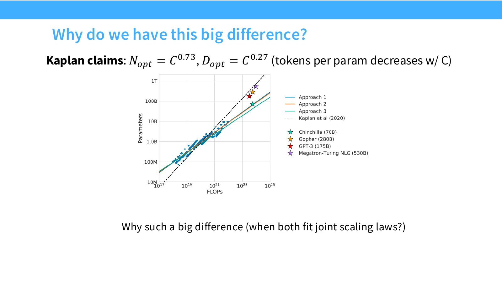

이 페이지는 Kaplan과 Chinchilla 사이의 큰 차이를 직접 묻습니다.

Kaplan의 주장은 다음과 같습니다.

```math
N_{\mathrm{opt}} = C^{0.73}, \quad D_{\mathrm{opt}} = C^{0.27}
```

즉 compute $C$가 증가하면 optimal parameter count $N_{opt}$가 훨씬 빠르게 증가하고, optimal data size $D_{opt}$는 상대적으로 천천히 증가합니다. 따라서 tokens per parameter는 compute가 커질수록 감소합니다.

하지만 Chinchilla의 세 접근은 이와 다르게, model size와 training tokens를 훨씬 더 균형 있게 늘리는 결론을 냅니다.

슬라이드의 그래프는 parameter count와 FLOPs의 관계를 보여줍니다. Kaplan et al.(2020)의 선과 Chinchilla의 Approach 1, 2, 3 선이 다르게 나타납니다. 또한 Chinchilla 70B, Gopher 280B, GPT-3 175B, Megatron-Turing NLG 530B 같은 실제 모델 위치도 표시되어 있습니다.

이 페이지의 핵심 질문은 다음입니다.

> Why such a big difference, when both fit joint scaling laws?

즉 Kaplan과 Chinchilla 모두 scaling law를 fitting했는데, 왜 compute-optimal model size 결론이 크게 달라졌느냐는 것입니다.

이 질문은 다음 페이지들의 explanation으로 이어집니다. 차이는 단순히 “한쪽이 맞고 한쪽이 틀렸다”가 아니라, parameter counting, last layer FLOPs, warmup, optimizer tuning, non-embedding parameter 선택, 작은 nonlinearities, fitting procedure 등 여러 세부 요인에서 생길 수 있습니다.

---

## Page 51. Explanation 1 - Kaplan 재현과 실험 프로토콜 차이

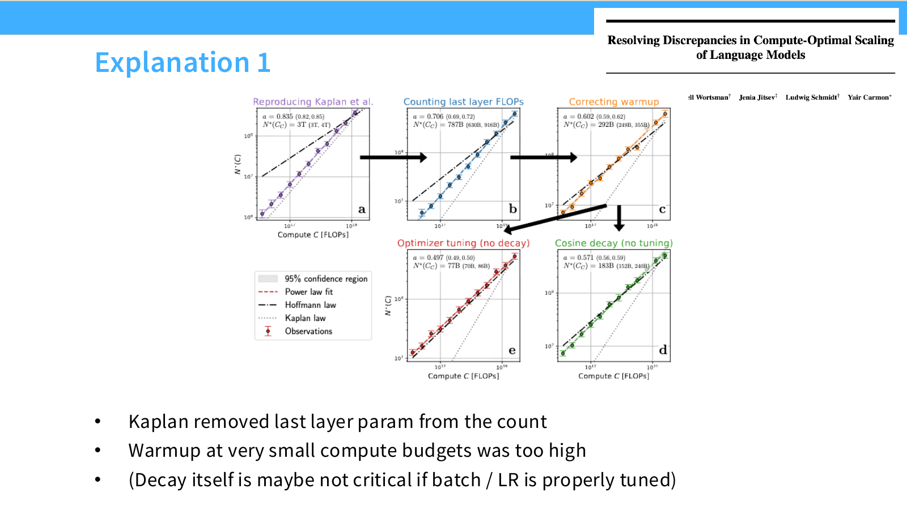

이 페이지는 Kaplan과 Chinchilla 차이를 설명하는 첫 번째 시도를 보여줍니다. 오른쪽 상단의 논문은 **Resolving Discrepancies in Compute-Optimal Scaling of Language Models**입니다.

슬라이드에는 Kaplan 결과를 단계적으로 수정하는 여러 그래프가 있습니다.

1. **Reproducing Kaplan et al.**  
   먼저 Kaplan의 scaling law를 재현합니다. 이때 power-law exponent가 Kaplan과 유사하게 나옵니다.

2. **Counting last layer FLOPs**  
   Kaplan은 last layer parameter 또는 last layer FLOPs를 count에서 제외한 설정이 있었습니다. 이를 포함하면 optimal scaling exponent가 바뀝니다.

3. **Correcting warmup**  
   매우 작은 compute budget에서는 warmup 비율이 과도하게 클 수 있습니다. 작은 run에서 warmup이 전체 학습의 큰 비중을 차지하면 scaling curve가 왜곡됩니다.

4. **Optimizer tuning / cosine decay**  
   optimizer hyperparameter, batch size, learning rate가 제대로 튜닝되면 learning rate decay 자체의 영향은 상대적으로 덜 critical할 수 있습니다.

슬라이드 하단의 bullet은 핵심을 요약합니다.

- Kaplan removed last layer param from the count.
- Warmup at very small compute budgets was too high.
- Decay itself is maybe not critical if batch / LR is properly tuned.

이 페이지의 메시지는 scaling law fitting이 매우 민감하다는 것입니다. 특히 작은 compute 영역에서의 설정 오류는 power-law exponent를 크게 왜곡할 수 있습니다. 왜냐하면 작은 scale에서 fitting된 exponent를 큰 scale로 extrapolate하기 때문입니다.

즉 scaling law는 단순히 loss 점들을 직선으로 fitting하는 문제가 아니라, 실험 프로토콜 전체가 정확해야 의미 있는 예측을 할 수 있습니다.

---

## Page 52. Explanation 2 - non-embedding parameter와 small nonlinearities

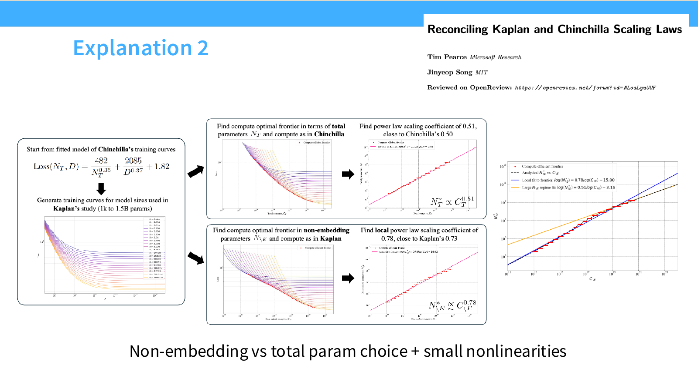

이 페이지는 Kaplan과 Chinchilla 차이에 대한 두 번째 설명입니다. 오른쪽 상단의 자료는 **Reconciling Kaplan and Chinchilla Scaling Laws**입니다.

슬라이드의 핵심 문장은 하단에 있습니다.

> Non-embedding vs total param choice + small nonlinearities

즉 두 가지 요인이 중요합니다.

1. **Non-embedding parameter vs total parameter**  
   Chinchilla-style 분석에서는 total parameter를 기준으로 compute-optimal frontier를 볼 때와, non-embedding parameter를 기준으로 볼 때 scaling exponent가 달라질 수 있습니다. Embedding parameter는 model capacity와 compute에 기여하는 방식이 transformer block parameter와 다르기 때문입니다.

2. **Small nonlinearities**  
   이상적인 scaling law는 깔끔한 power-law 직선처럼 보이지만, 실제 loss surface에는 작은 비선형성이 있습니다. 작은 비선형성이라도 넓은 compute range로 extrapolate하면 큰 차이를 만들 수 있습니다.

슬라이드 왼쪽에는 Chinchilla training curves에서 시작해 두 가지 경로로 compute-optimal frontier를 찾는 과정이 그려져 있습니다.

- total parameter $N_T$ 기준으로 보면 power-law scaling coefficient가 약 0.51로 Chinchilla의 0.50에 가깝게 나옵니다.
- non-embedding parameter $N_E$ 기준으로 보면 local power-law coefficient가 약 0.78로 Kaplan의 0.73에 가까워질 수 있습니다.

즉 “Kaplan vs Chinchilla”의 차이는 일부는 parameter counting 방식과 curve의 local regime 차이에서 설명될 수 있습니다.

이 페이지의 핵심은 다음입니다.

> Compute-optimal exponent는 고정된 진리가 아니라, 어떤 parameter를 세는지, 어떤 compute range에서 fitting하는지, loss surface의 작은 비선형성을 어떻게 처리하는지에 따라 달라질 수 있다.

---

## Page 53. Addendum - Chinchilla Method 3의 오류 가능성

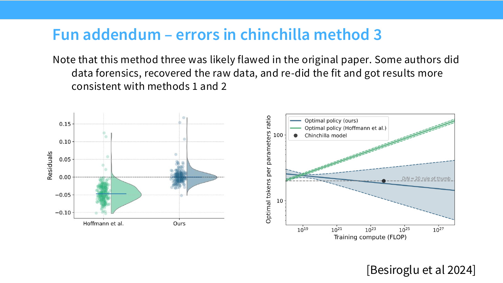

이 페이지는 Chinchilla의 Method 3, 즉 parametric joint fit에 오류 가능성이 있었다는 후속 분석을 소개합니다. 슬라이드의 문장은 다음입니다.

> Note that this method three was likely flawed in the original paper. Some authors did data forensics, recovered the raw data, and re-did the fit and got results more consistent with methods 1 and 2.

왼쪽 그래프는 residual distribution을 비교합니다. Hoffmann et al. 원래 fitting과 재분석한 fitting의 residual이 다르게 나타납니다. Residual은 실제 loss와 fitted loss의 차이를 의미합니다. residual이 특정 방향으로 치우쳐 있으면 fitting model이 systematic bias를 가진다는 뜻입니다.

오른쪽 그래프는 training compute에 따른 optimal tokens per parameter ratio를 보여줍니다. 비교 대상은 다음입니다.

- Optimal policy (ours)
- Optimal policy (Hoffmann et al.)
- Chinchilla model
- $D/N=20$ rule of thumb

재분석 결과는 원래 Chinchilla Method 3보다 Method 1과 Method 2에 더 일관적인 결과를 준다고 설명합니다.

이 페이지의 핵심은 scaling law fitting의 민감성입니다.

- raw data 복원/전처리 방식이 결과에 영향을 줍니다.
- fitting objective와 residual 처리 방식이 결과에 영향을 줍니다.
- Method 3처럼 parametric form에 의존하는 방식은 작은 오류가 큰 scaling 결론으로 증폭될 수 있습니다.

따라서 compute-optimal scaling law를 적용할 때는 단일 논문의 exponent를 그대로 외우기보다, 어떤 데이터와 어떤 fitting procedure에서 나온 값인지 확인해야 합니다.

---

## Page 54. Train-optimal은 실제 deployment-optimal이 아닐 수 있다

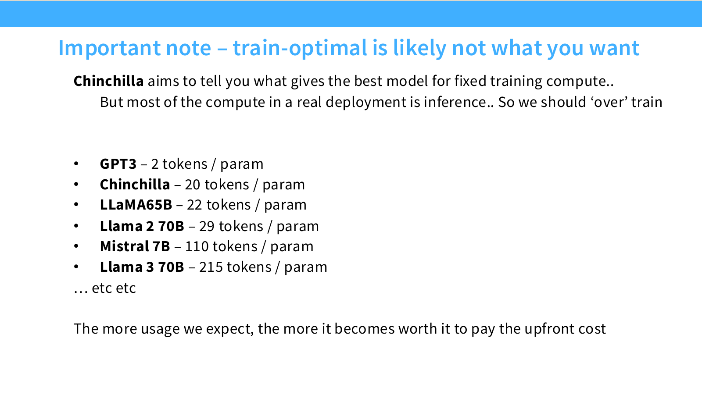

이 페이지는 Chinchilla-style compute-optimal scaling의 중요한 한계를 설명합니다. 슬라이드의 제목은 다음입니다.

> Important note — train-optimal is likely not what you want.

Chinchilla는 고정된 **training compute**에서 가장 낮은 loss를 주는 모델을 찾는 것을 목표로 합니다. 즉 training FLOPs budget이 정해져 있을 때 model size와 token 수를 어떻게 배분해야 하는지 말해줍니다.

하지만 실제 deployment에서는 전체 compute 비용이 training compute만으로 결정되지 않습니다. 많은 경우 inference compute가 훨씬 큽니다. 사용자가 많거나 모델을 오래 serving하면, inference 비용이 training 비용을 압도할 수 있습니다.

따라서 실제 제품 관점에서는 다음 전략이 더 나을 수 있습니다.

> training compute 기준으로는 overtraining처럼 보이더라도, 작은 모델을 더 많은 token으로 학습해서 inference 효율을 높이는 것이 전체 비용에서 유리할 수 있다.

슬라이드는 tokens per parameter의 역사적 변화를 보여줍니다.

- GPT-3: 2 tokens / param
- Chinchilla: 20 tokens / param
- LLaMA 65B: 22 tokens / param
- Llama 2 70B: 29 tokens / param
- Mistral 7B: 110 tokens / param
- Llama 3 70B: 215 tokens / param

이 흐름은 최근 모델들이 Chinchilla rule보다 더 많은 token per parameter로 학습되는 경향이 있음을 보여줍니다. 즉 배포 환경에서는 더 작고 더 많이 학습된 모델이 유리할 수 있습니다.

슬라이드의 마지막 문장은 다음입니다.

> The more usage we expect, the more it becomes worth it to pay the upfront cost.

사용량이 많을수록 초기 training 비용을 더 쓰더라도 inference 효율이 좋은 모델을 만드는 것이 worth it입니다.

---

## Page 55. IsoFLOPs everywhere

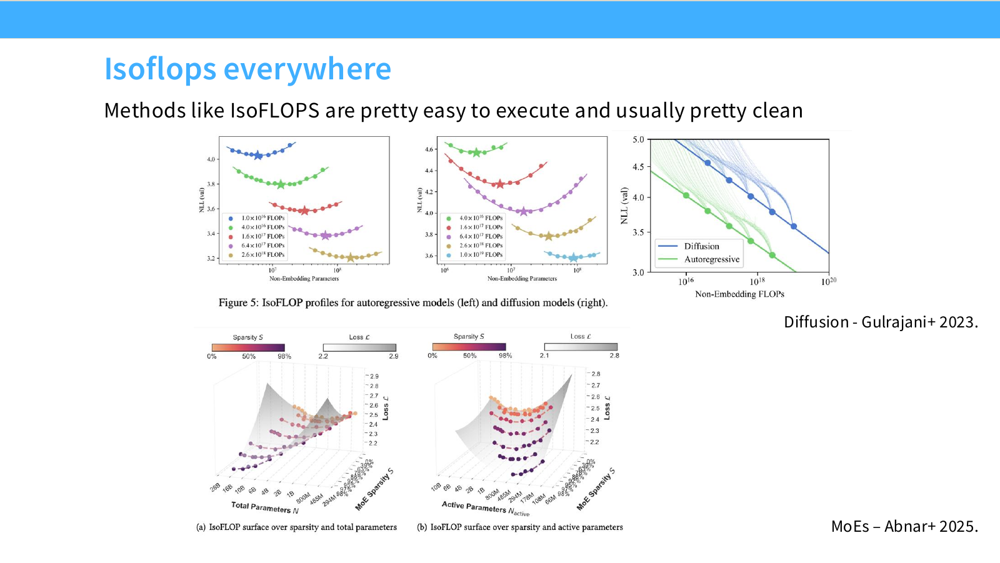

이 페이지는 IsoFLOPs 방법이 LLM에만 국한되지 않는다는 점을 보여줍니다. 슬라이드의 문장은 다음입니다.

> Methods like IsoFLOPS are pretty easy to execute and usually pretty clean.

위쪽 그래프들은 diffusion model과 autoregressive model에서 IsoFLOP profiles를 보여줍니다. 각 compute budget에서 non-embedding parameter 수를 바꿔가며 NLL을 측정하면, Chinchilla의 IsoFLOPs와 비슷하게 U-shape curve가 나타납니다. 각 curve의 최저점이 해당 compute budget에서의 optimal model size입니다.

오른쪽 위 그래프는 diffusion과 autoregressive model의 scaling behavior를 비교합니다. 이는 IsoFLOPs가 language modeling뿐 아니라 generative modeling 전반에서 compute allocation을 분석하는 데 사용할 수 있음을 보여줍니다.

아래쪽 그래프들은 MoE scaling에서 IsoFLOP surface를 보여줍니다. 여기서는 sparsity와 total/active parameter가 함께 등장합니다.

- 왼쪽 아래: sparsity와 total parameters에 따른 IsoFLOP surface
- 오른쪽 아래: sparsity와 active parameters에 따른 IsoFLOP surface

MoE에서는 dense model보다 변수가 더 많습니다. total parameter, active parameter, sparsity가 모두 loss와 compute를 결정하기 때문입니다. 하지만 IsoFLOPs 관점은 여전히 유용합니다. 특정 compute budget에서 어떤 sparsity와 active parameter 조합이 최적인지 찾을 수 있기 때문입니다.

이 페이지의 핵심은 다음입니다.

> IsoFLOPs는 특정 compute budget 안에서 최적 architecture/model size를 찾는 일반적인 실험 방법이다. LLM, diffusion, MoE 등 다양한 모델 계열에 적용할 수 있다.

---

## Page 56. Models and compute의 scaling law

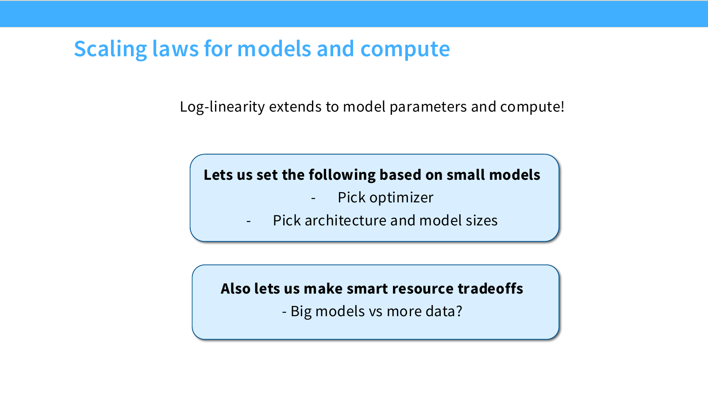

이 페이지는 model scaling 파트의 요약입니다. 핵심 문장은 다음입니다.

> Log-linearity extends to model parameters and compute!

즉 log-data size와 log-error 사이의 선형 관계뿐 아니라, model parameter, compute와 loss 사이에도 log-linear 관계가 나타날 수 있습니다. 이 덕분에 작은 모델 실험으로 큰 모델 설계를 예측할 수 있습니다.

슬라이드는 scaling law가 작은 모델 기반 의사결정을 가능하게 한다고 정리합니다.

첫 번째 박스는 다음을 말합니다.

> Lets us set the following based on small models

- Pick optimizer
- Pick architecture and model sizes

즉 작은 모델에서 optimizer와 architecture를 비교하고, scaling curve를 통해 큰 모델에서의 선택을 예측할 수 있습니다.

두 번째 박스는 resource trade-off를 말합니다.

> Also lets us make smart resource tradeoffs

- Big models vs more data?

즉 같은 예산이 있을 때 모델을 키울지, 데이터를 늘릴지, 학습을 더 오래 할지 결정할 수 있습니다.

이 페이지의 핵심은 scaling law를 하나의 “예측 프레임워크”로 보는 것입니다. 단순히 사후 분석으로 “큰 모델이 좋았다”고 말하는 것이 아니라, 학습 전에 다음 결정을 지원합니다.

- 어떤 optimizer를 쓸 것인가?
- 어떤 architecture를 쓸 것인가?
- 모델 크기는 얼마가 적절한가?
- token 수는 얼마가 적절한가?
- batch size와 learning rate는 어떻게 scale해야 하는가?
- train compute와 inference compute를 어떻게 trade-off할 것인가?

---

## Page 57. Recap - Scaling laws are surprising and useful

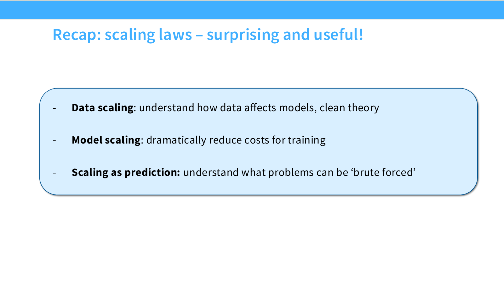

마지막 페이지는 강의 전체를 요약합니다. 슬라이드의 첫 번째 문장은 다음입니다.

> Scaling laws are surprising and useful!

강의에서 정리한 세 가지 축은 다음입니다.

### 1. Data scaling laws

데이터가 모델 성능에 어떤 영향을 주는지 이해할 수 있습니다. 특히 log-data size와 log-error 사이에 선형 관계가 나타나는 경우가 많고, 이를 통해 더 많은 데이터를 수집하는 것이 얼마나 도움이 될지 예측할 수 있습니다.

슬라이드는 data scaling에 대해 다음도 강조합니다.

- 비교적 깔끔한 이론적 직관이 있다.
- mean estimation, statistical learning theory, Gaussian process, nonparametric learning 관점과 연결할 수 있다.
- practical implication은 data gathering과 data curation입니다.

즉 데이터 수집, 데이터 필터링, data mixture, repetition policy를 scaling law로 더 체계적으로 설계할 수 있습니다.

### 2. Model scaling laws

Model scaling law는 large-scale model training의 비용을 줄여줍니다. 작은 모델을 먼저 학습하고, 그 결과를 바탕으로 큰 모델의 성능이나 hyperparameter 효과를 예측할 수 있기 때문입니다.

슬라이드는 다음 항목들을 예측할 수 있다고 정리합니다.

- optimizer
- architecture
- model size

즉 scaling law는 model engineering의 핵심 도구입니다.

### 3. Scaling as prediction

마지막 문장은 매우 중요합니다.

> Key to understanding what problems can be brute-forced.

Scaling law는 어떤 문제가 scale을 키우면 계속 좋아질 문제인지 판단하는 데 도움을 줍니다. 만약 loss가 scale에 따라 안정적으로 감소한다면, 더 많은 compute와 data를 넣는 것이 합리적일 수 있습니다. 반대로 scaling이 깨지거나 downstream metric이 예측되지 않는다면, 단순 brute-force scaling보다 data, architecture, objective, evaluation 자체를 바꿔야 할 수 있습니다.

강의 전체를 한 문장으로 정리하면 다음입니다.

> Scaling law는 LLM을 크게 만들 때의 감각적 선택을 정량적 예측 문제로 바꿔주는 실용적 도구다.

하지만 동시에 다음 한계도 기억해야 합니다.

- scaling law는 실험 조건에 민감합니다.
- data distribution, repetition, filtering, parameter counting, warmup, optimizer tuning이 결과를 바꿀 수 있습니다.
- pretraining loss scaling과 downstream capability scaling은 다를 수 있습니다.
- train-optimal이 deployment-optimal은 아닐 수 있습니다.

따라서 scaling law는 정답 공식이라기보다는, 큰 모델 학습 전에 의사결정을 정량화하고 실패 위험을 줄이는 **practical modeling framework**로 이해하는 것이 가장 좋습니다.

---

# 마무리 정리

Lecture 9의 핵심은 scaling law를 “모델이 커지면 좋아진다”는 단순한 경험칙이 아니라, **대규모 학습 의사결정을 위한 예측 프레임워크**로 보는 것입니다.

실무적으로 scaling law는 다음 의사결정에 쓰일 수 있습니다.

- 모델 크기 결정
- 학습 token 수 결정
- 데이터 반복 여부 결정
- 데이터 mixture 선택
- 데이터 filtering 강도 결정
- optimizer 선택
- architecture 비교
- depth/width/aspect ratio 선택
- batch size 설정
- learning rate transfer
- train compute와 inference compute의 trade-off 판단

하지만 scaling law를 맹목적으로 적용하면 위험합니다. Distribution shift, downstream task, data repetition, parameter counting, fitting protocol, warmup, optimizer tuning, inference cost 같은 요소가 결과를 크게 바꿀 수 있습니다.

결론적으로 scaling law는 정답을 자동으로 주는 공식이라기보다, 큰 모델 학습 전에 실험 비용을 줄이고 의사결정을 정량화하는 **practical modeling tool**로 이해하는 것이 가장 적절합니다.
